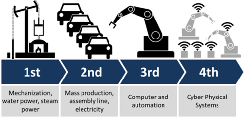

# Технології Індустрії 4.0

## Матеріали курсу

- [Лекції](Лекц)
- [Лабораторний практикум](Лабор)

## Корисні посилання

- [Довідник Node-RED](https://pupenasan.github.io/NodeREDGuidUKR/)

[Веб-сторінка курсу на GitHub](https://pupenasan.github.io/TI40/)

