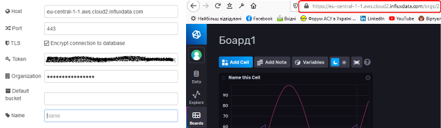
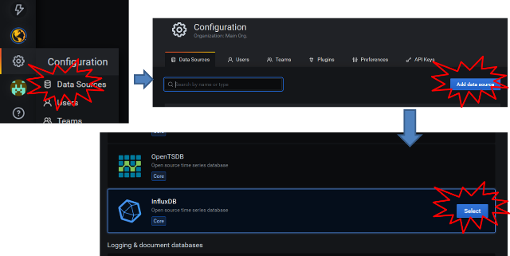
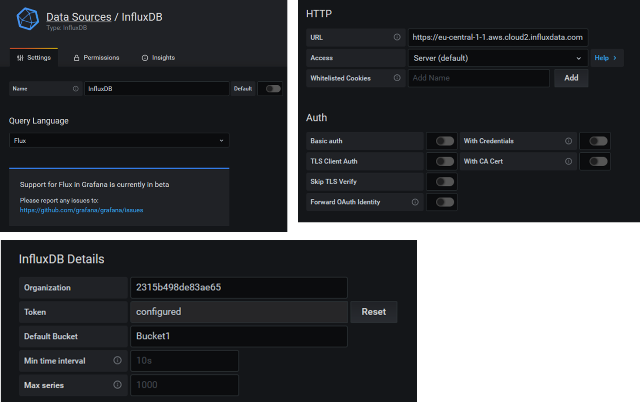
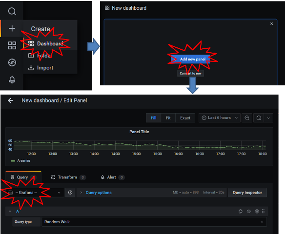

# Використання Influx DB та Grafana Cloud

https://www.influxdata.com/get-influxdb/

https://grafana.com/signup/cloud

## Робота з Influx DB

### 1. Реєстрація 

- Перейдіть на <https://cloud2.influxdata.com/signup> , зареєструйтеся
- На пошту прийде повдомлення, підтвердіть свою адресу

### 2. Створення Bucket та Token

- Створіть Bucket
- Створіть Token

### 3. Запис в Node-RED

- Запустіть Node-RED
- встановіть пакет `node-red-contrib-stackhero-influxdb-v2`

- Імпортуйте в Node-RED наступний код

```json
[{"id":"2f082b39.83dda4","type":"Stackhero-InfluxDB-v2-write","z":"99af7e21.9b46a","server":"2baab3f.ba72bcc","name":"","x":390,"y":240,"wires":[["fac2a649.693588"]]},{"id":"decec025.5f2aa","type":"inject","z":"99af7e21.9b46a","name":"","props":[{"p":"payload"},{"p":"topic","vt":"str"}],"repeat":"1","crontab":"","once":false,"onceDelay":0.1,"topic":"","payload":"","payloadType":"date","x":130,"y":220,"wires":[["5a42d16e.22105"]]},{"id":"fac2a649.693588","type":"debug","z":"99af7e21.9b46a","name":"","active":false,"tosidebar":true,"console":false,"tostatus":false,"complete":"true","targetType":"full","statusVal":"","statusType":"auto","x":610,"y":240,"wires":[]},{"id":"5a42d16e.22105","type":"function","z":"99af7e21.9b46a","name":"","func":"let ts = Date.now();\nlet ramp = (ts % 600000)/600000*Math.PI*2;\nlet sin = (Math.sin (ramp)+1) * 50 ;\n\nmsg.payload = {\n  // You bucket\n  // Optional (it can be defined in the node credentials settings)\n  bucket: \"Bucket1\",\n\n  // Precision of timestamp\n  // Optional\n  // Can be `ns` (nanoseconds),\n  //        `us` (microseconds),\n  //        `ms` (milliseconds),\n  //        `s` (seconds).\n  // The default is `ns`\n  // Note: if you set the `timestamp` field to `Date.now()`, you have to set the `precision` to `ms`\n  precision: 'ms',\n\n  // Data to send to InfluxDB\n  // Can be an array of objects or only one object\n  data: [\n    {\n      measurement: 'machinerySensor',\n\n      tags: {\n        deviceId: 'gyh43',\n        hardwareVersion: '1.0.2',\n        softwareVersion: '2.5.1',\n        location: 'factory-1'\n      },\n\n      fields: {\n        temperature: Math.random()*10,\n        humidity: Math.random()*5,\n        vibrations: ramp * 10,\n        batteryVoltage: sin\n      },\n\n      timestamp: ts\n    },\n\n    // More data can be send here, simply re add an object\n    // { ... },\n  ]\n};\n\nreturn msg;","outputs":1,"noerr":0,"initialize":"","finalize":"","x":180,"y":320,"wires":[["2f082b39.83dda4"]]},{"id":"2baab3f.ba72bcc","type":"Stackhero-InfluxDB-v2-Server","z":"","name":"","host":"eu-central-1-1.aws.cloud2.influxdata.com","port":"443","tls":true}]
```

- налаштуйте конфігураційний вузол Influx DB



## Робота з Grafana Cloud

### 1. Реєстрація 

- Перейдіть на <https://grafana.com/signup/cloud> , зареєструйтеся
- На пошту прийде повдомлення, підтвердіть свою адресу

### 2. Створення посилання ресурсів даних

- Створіть ресурси даних з посиланням на стоврений Buket






### 3. Створення Dashboard

- Створіть Dashboard і виберіть тип запиту "Grafana"



- скопіюйте текст наданий нижче в поле запиту


```
from(bucket: "Bucket1")
  |> range(start: -15m, stop:v.timeRangeStop)
  |> filter(fn: (r) =>
    r._measurement == "machinerySensor"
  )
```

- збережіть Dashboard 