**Технології індустрії 4.0. Лабораторний практикум. ** Автор і лектор: Олександр Пупена 

| [<- до лаборних робіт](README.md) | [на основну сторінку курсу](../README.md) |
| --------------------------------- | ----------------------------------------- |
|                                   |                                           |

# Лабораторна робота №3. Xмарні сервіси для Індустрії 4.0

# Частина 1. Основи роботи з хмарною платформою IBM Cloud

**Мета**: Освоїти базові функції хмарних платформ на прикладі IBM Cloud. 

Цілі: 

1. створити власний IBM Cloud Account з безкоштовною ліцензією ;
2. створити сервіси: застосунок Node-RED, СУБД Cloudant з використанням стартового набору  “Node-RED starter”; 
3. використати  хмарний застосунок Node-RED разом з СУБД Cloudant для:
- збору даних з Edge, використовуючи один із протоколів, наприклад WEB Socket 
- збереження даних в базі даних
- відображення даних у вигляді тренду  

**Увага, зовнішній вигляд інтерфейсу налаштування IBM Cloud постійно змінюється!** 

**Увага, набір наданих сервісів та політика ліцензування IBM Cloud може змінитися! У будь якому випадку, без використання угоди та реєстрації кредитної картки ніякі кошти за використання стягуватися не можуть.**  

Хмарна платформа IBM об'єднує платформу як послугу (PaaS) з інфраструктурою як послуга (IaaS) для забезпечення інтегрованої взаємодії. Платформа масштабує і підтримує як невеликі команди розробників, так і великі підприємства. 

Хмарна платформа надає доступ до керування хмарними ресурсами. Ресурс - це все, що можна створити, керувати і містити в групі ресурсів. Деякі приклади ресурсів – це програми, екземпляри сервісів, контейнерні кластери, томи зберігання та віртуальні сервери. Детально про платформу IBM Cloud можна прочитати за [цим посиланням](https://cloud.ibm.com/docs/overview/ibm-cloud-platform.html)     

### 1. Створення власного IBM Cloud Account з безкоштовною ліцензією  

Хмарні сервіси платформи IBM Cloud доступні за попередньої реєстрації. Мінімальним тарифним планом, що потребується в цій лабораторній роботі є **Lite**. Реєстрація в тарифному плані Lite потребує тільки адреси електронної пошти, ім’я та прізвища і не потребує кредитної картки. Зареєструвавшись, у Вас буде можливість використовувати певний набір сервісів безкоштовно у означеному обсязі. Обсяг та набір сервісів можуть змінюватися час від часу. Передбачається, що використовувані в лабораторній роботі сервіси використовуються безкоштовно. 

###### 1.1.  Реєстрація аккаунту

Відкрийте в браузері сторінку реєстрації  IBM Cloud [https://cloud.ibm.com/registration](https://cloud.ibm.com/registration) (рис.1)

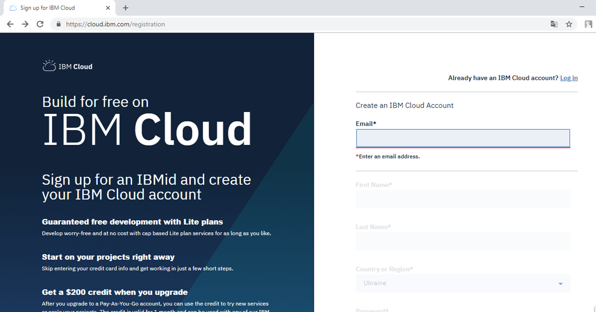                               

рис.1.

Введіть адресу пошти в поле Email і натисніть Enter. У випадку, якщо на вказану адресу немає зареєстрованого користувача, активуються інші поля для вводу (рис.2). Після вводу усіх полів натисніть «Create Account».

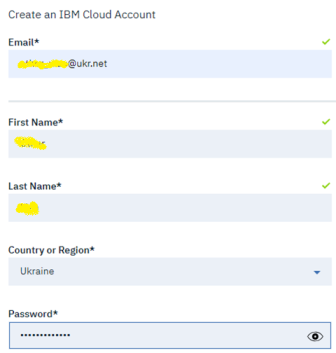  

рис.2.

Якщо усі поля були заповнені вірно, з’явиться вікно на кшталт показаного на рис.3.

 

рис.3. 

###### 1.2. Підтвердження аккаунту

 На вказану пошту повинно прийти повідомлення з пропозицією підтвердження (рис.4).

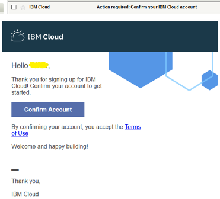 

рис.4.

Для підтвердження аккаунту натисніть «Confirm Account». Після вдалого підтвердження, повинно з’явитися вікно підтвердження (рис.5) з якого можна перейти на сторінку входу натиснувши “Log In”. На цьому реєстрація аккаунту в IBM Cloud вважається завершеною. 

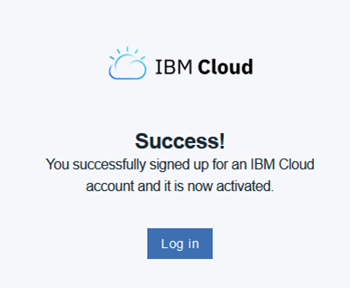  

рис.5.

###### 1.3. Вхід в аккаунт, ознайомлення з інтерфейсом консолі

Скориставшись [посиланням](https://cloud.ibm.com/login) зайдіть в свій аккаунт.

Зовнішній графічний інтерфейс сторінки для адміністрування ресурсами IBM® Cloud називається **консоллю** (IBM® Cloud console). За допомогою консолі можна створювати аккаунти (облікові записи), входити в систему, доступати до документації, доступатися до каталогу, переглядати інформацію про ціни, запитувати підтримку, або перевіряти стан компонентів IBM Cloud. 

Інтерфейс консолі постійно змінюється. На момент створення даної лабораторної роботи він мав вигляд, як на рис.6.

 

рис.6.

Огляньте головне меню, яке знаходиться вгорі сторінки. Коли ви входите в систему IBM Cloud, першою сторінкою, яку можна переглянути, є інформаційна панель, на якій відображаються віджети, що узагальнюють інформацію про стан вашого облікового запису. Далі можна керувати своїми ресурсами, перейшовши на піктограму Меню навігації -> Resource List. (рис.7)

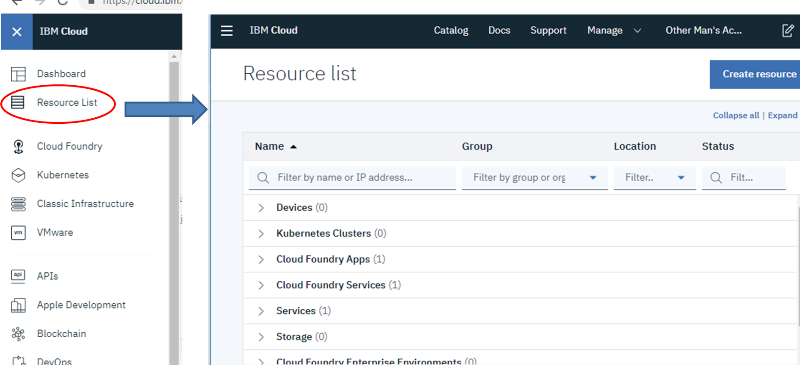 

рис.7.

- посилання Catalog (Каталог) використовується для створення нових ресурсів.
- посилання Docs - для доступу до корисної інформації про IBM Cloud.
- посилання Support  (Підтримка) - для доступу до Центру підтримки.
- у меню Manage (керування) можна отримати доступ до облікового запису, виставлення рахунків та використання коштів, а також параметрів керування ідентифікацією та доступом.
- калькулятора витрат використовується для виклику оцінювача витрат.


###### 1.4. Перегляд каталогу

Перейдіть до каталогу. За замовченням там відобразяться тільки ті ресурси, які можна використовувати (добавляти) для Вашого тарифного плану, тобто lite (рис.8). Використовуючи кнопку «filter» можна змінювати налаштування фільтру. 

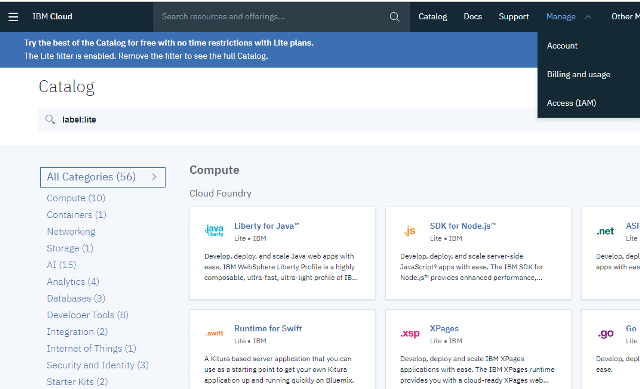 

рис.8.

###### 1.5. Налаштувань аккаунту

Перейдіть в меню Manage ->Account->Account Settings для перегляду налаштувань свого аккаунту (рис.9).  

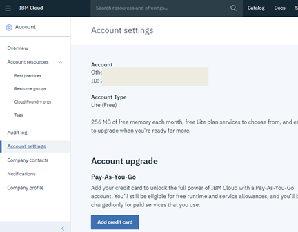 

рис.9.


### 2. Створення та адміністрування сервісів з комплекту Node-RED starter  

Стартовий комплект (starter kit) «Node-RED starter» дає можливість легко створити мінімальний сервісів для роботи з Node-RED в хмарі, а саме:

- **застосунок JavaScript**® (Node.js) з виділеною 256 Мб пам’яті , на якому буде встановлений Node-RED
- **Cloudant** - масштабована база даних документів JSON для веб-, мобільних, IoT та безсерверних програм   

###### 2.1. Створення стартового набору Node-RED starter 

Перейдіть в каталог IBM Cloud і виберіть пункт **Starter Kit**. Серед показаних пропозицій виберіть Node-RED Starter (рис.10).  

Перейдіть на вкладку Software(рис.8.1), у “Offering type” виділіть опцію «Starter kits» (рис.8.2) , у переліку доступних сервісів виберіть «Node-RED App» (рис.8.3)   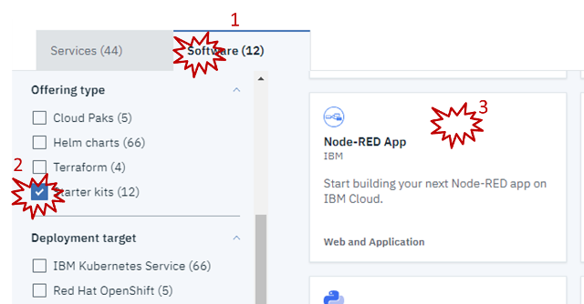

рис.10.

У наступному вікні натисніть Create app (рис.10а).

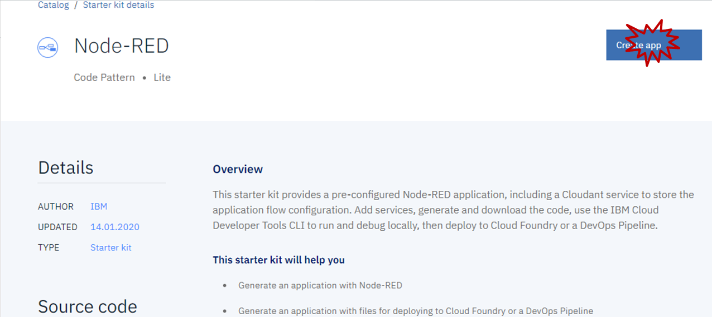 

рис.10а.

Заповніть сторінку аналогічно як на рис.11, вкажіть AppName (1) та Region=London(2).  Зверніть увагу на те, що AppName має бути унікальним, тому для даної лабораторної роботи це поле повинно включати ваше прізвище (наприклад Ivanenko) і ім’я (наприклад Ivan) англійською мовою без пробілів за наступним шаблоном: 

 ivanenkoivannodered

**Також зверніть увагу, що назва повинна включати тільки маленькі літери, інакше при наступному перезавантаженні можуть виникнути проблеми з запуском!** 

Після заповнення натисніть “Create” (рис.11.поз.3)

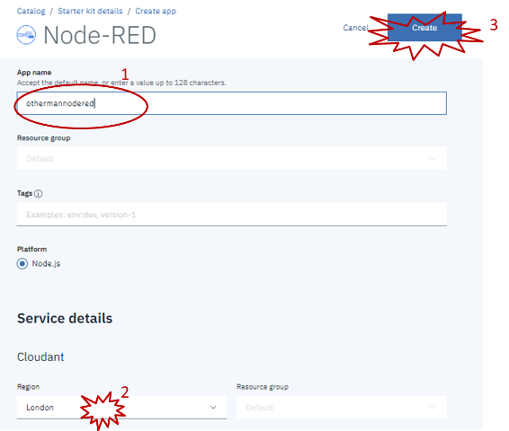  

рис.11.

Через кілька секунд з’явиться вікно для налаштування новоствореного App, до якого входить сервіс бази даних Cloudant. Він використовуватиметься для збереження налаштувань Node-RED, усіх вузлів та потоків. Для розгортання Node.js та Node-RED можна використати два механізма – через віддалений клієнт або через сервіси керування життєвим циклом DevOPS. Для другого шляху необхідно налаштувати «Configure Continuous Delivery”, натиснути кнопку «Deploy Your App» (рис.11а) 

 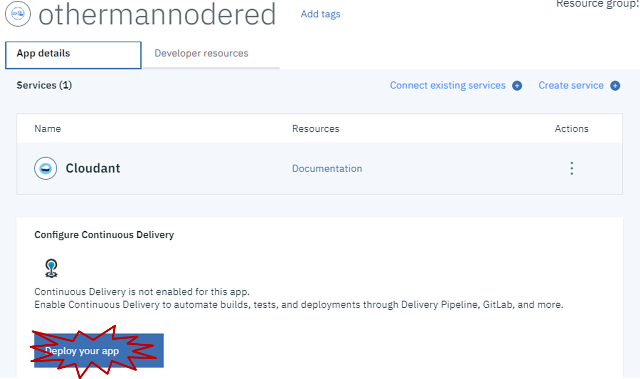

рис.11а.

Повинно відкритися вікно конфігурування IBM Cloud Foundry (рис.12). У ньому виберіть регіон = London, кількість пам’яті = 256, і згенеруйте «IBM Cloud API key» кнопкою «New». Після цього натисніть на кнопку «Create» в правому верхньому кутку сторінки.   

 

рис.12.

Перейдіть на [перелік Ваших ресурсів](https://cloud.ibm.com/resources) . Почекайте кілька хвилин (десь 3-5), періодично оновлюйте сторінку , поки створиться і запуститься Ваш Cloud Foundry apps (рис.13), тобто перейде в стан “Started”.  

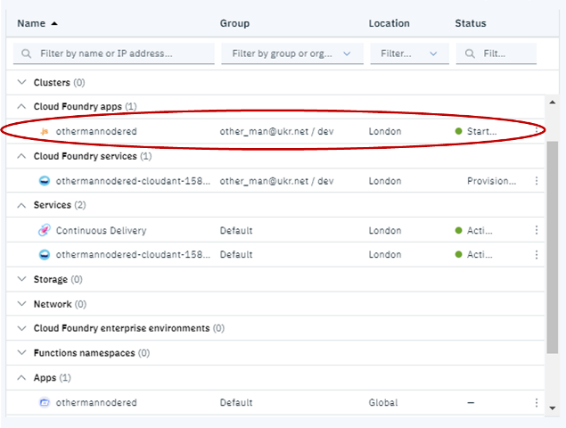 

рис.13

###### 2.2. Перегляд станів сервісів набору Node-RED starter 

При розгортанні Node-RED starter kit створилися кілька сервісів і ресурсів:

- хмарний застосунок Node.js з наперед встановленим Node-RED 
- не-SQL СУБД Cloudant, що використовує формат JSON

- Toolchain який забезпечує набором утиліт для проектування, створення коду та розгортання проекту

- Continuous Delivery – DevOps сервіси для автоматичного розгортання застосунків

Крім того, автоматично створюється зв'язок між цими сервісами, що дозволяє вже використовувати СУБД Cloudant в додатках Node-RED. У даному пункті необхідно подивитися стан цих сервісів. Нагадаємо, що перелік всіх доступних сервісів можна знайти через список ресурсів «Меню навігації» -> «Resource List» ([https://cloud.ibm.com/resources](https://cloud.ibm.com/resources)).

Відкрийте вікно списку ресурсів. У Вас повинно бути доступно 6 ресурсів.  Відкрийте кожний ресурс в окремій вкладці браузеру. Усі сервіси мають вкладку Manage, через який ними можна керувати, окрім ресурсу-псевдоніму Cloudant і App. Детальніше пояснення цих ресурсів буде згодом. Наразі розглянемо тільки ресурс  Cloudant  і Node-RED  

###### 2.3. Перегляд стану сервісу Cloudant  

Використовуючи ліву бічну панель передивіться усі закладки ресурсу Cloudant (рис.14). Зокрема подивіться які сервіси підключені до нього в закладці Connections. В звіті поясніть що це за підключення.  

 

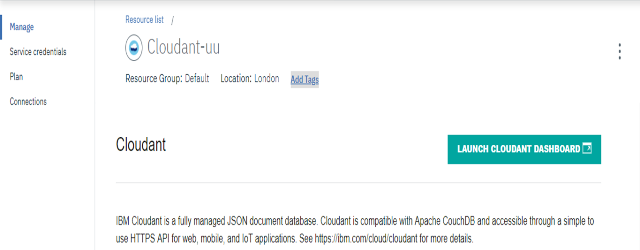  

рис.14.

###### 2.4. Перегляд стану та керування виконанням сервісу Node-RED  

Використовуючи ліву бічну панель передивіться усі закладки ресурсу Node-RED (рис.15). 

Зокрема на закладці «Overview» можна подивитися стан сервісу. Наприклад «Stopped» вказує на те, що сервіс зупинено. Слід звернути увагу, що при невикористанні сервісу протягом певного періоду він автоматично зупиняється, про що буде повідомлено листом на пошту, яка використовувалась при реєстрації. Запуск, зупинка та перезапуск сервісу відбувається через праве меню керування сервісом (див. рис.15). 

Якщо сервіс не виконується – запустіть його.

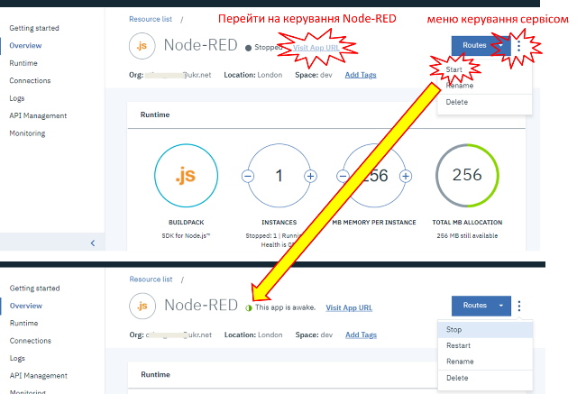 

рис.15.

Перейдіть на закладку бічної панелі Runtime. Передивіться зміст усіх можливостей: Memory and Instance, Environment variables та SSH. Зверніть увагу, що SSH дає можливість керувати контейнером Node.js (рис.16).  

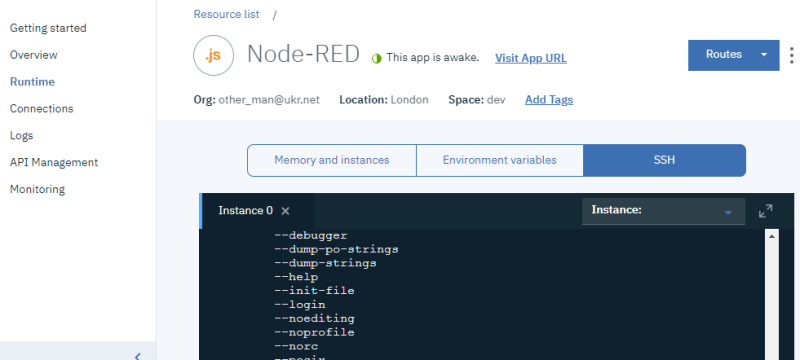 

рис.16. 

Передивіться вміст інших вікон налаштувань переходячи на усі інші закладки бічної панелі. 

###  3. Перший запуск і робота з хмарним сервісом Node-RED  

Робота з хмарним застосунком Node-RED аналогічна як і з локальним. Слід зазначити, що в ньому вже інтегровано багато функцій, які стосуються роботи з хмарними сервісами IBM Cloud, що робить його зручним і простим інструментом інтеграції застосунків IIoT та Industry 4.0. У даному підрозділі показано як перший раз запускати сервіс Node-RED, та як створити простий розподілений додаток Node-RED local <-> Node-RED Clud. 

У першій лабораторній роботі була наведена одна із структур рішень IIoT (рис.16.а). В даній частині лабораторної роботи пропонується використовувати зв'язок Node-RED з боку Edge (наприклад на базі Raspberry PI) та хмарного застосунку Node-RED з використанням протоколу WEB Socket.   

 

рис.16.а

###### 3.1. Перший запуск Node-RED  

На вкладці Overview керування ресурсами Node-RED, натисніть «Visit App Url» (див.рис.16). Почекайте хвилинку, поки завантажиться сторінка. Якщо вона не завантажується повторіть пункт знову.

При першому вході в систему, необхідно пройти процедуру налаштування. Це потрібно для створення користувача, що зможе розробляти додатки Node-RED. 

На сторінці привітання рис.17, натисніть “Next”.  Вкажіть ім’я та пароль користувача, які зможуть редагувати застосунки в Node-RED (рис.17) також обов’язково виставить опцію «Allow anyone to view the editor» і натисніть “Next”.     

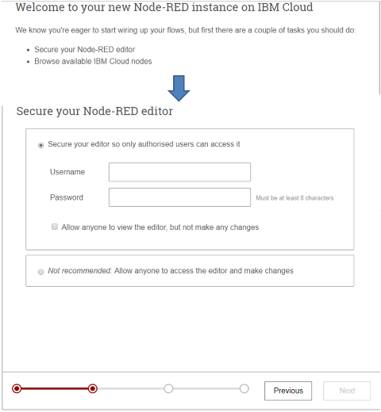 

рис.17.

Використовуючи кнопку “Next” перейдіть до останньої вкладки і натисніть “Finish”.  На стартовому вікні Node-RED (рис.18) натисніть кнопку “Go to your Node-RED flow editor”.

 

рис.18.

 

###### 3.2. Інсталяція Node-RED  

Через зображення користувача зайдіть під своїм користувачем і паролем, які Ви налаштували до цього (18а). 

 

рис.18.а

Використовуючи меню Manage Palette встановіть пакет node-red-dashboard. Тепер у Вас є можливість розробляти користувацький інтерфейс для загального доступу з Інтернету.

###### 3.3. Перевірка доступу до користувацького інтерфейсу Node-RED  

Створіть просту програму, яка виводить текст отриманий з вузла Inject (рис.19). Налаштуйте одну закладку та групу для Веб-інтерфейсу, зробіть розгортання проекту. Відкрийте інтерфейс користувача. 

Скопіюйте посилання на сторінку Вашого інтерфейсу, відкрийте його на іншому ПК, смартфоні або, якщо такої можливості немає – в іншому браузері. 

Якщо інтерфейс відображається, це значить що тепер є можливість розробляти графічний інтерфейс IoT для загального доступу.  

 

рис.19.

###### 3.4. Передача даних з локального Node-RED на віддалений з використанням WEB-socket  

Модифікуйте програму в хмарному Node-RED, як це показано на рис.20.

 

рис.20.

Запустіть Node-RED на локальному ПК. Створіть новий потік з назвою «Laba3_1», всі інші потоки деактивуйте. Створіть програму, яка показана на рис.21. При цьому першу частину шляху (яка замальована на рис.21) скопіюйте з Вашого хмарного UI. 

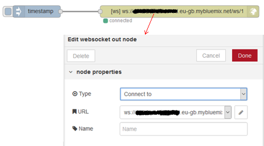 

рис.21.

  Зробіть розгортання на локальному і віддаленому Node-RED. Активуючи Inject на локальному ПК перевірте роботу зв’язку між локальним та хмарним застосунком Node-RED.

Модифікуйте програму в локальному Node-RED, як це показано на рис.21.а. Ця програма імітує змінні **ramp** та **sin** кожні 5 секунд. Перевірте її роботу.

 

рис.21.a. 

**Використовуючи усі розглянуті в минулій лабораторній роботі протоколи можна інтегрувати сервіси хмарного** **Node-RED як з** **Edge так і з іншими хмарними сервісами чи застосунками Інтернету. Таким чином, хмарний** **Node-RED можна використовувати в якості основного сервісу, що забезпечує з’єднання між** **Edge та іншими сервісами.** 

Тим не менше в наступній частині лабораторної роботи в якості базового сервісу IIoT буде використовуватися IBM Internet of Things Platform.

###  4. Перший запуск і робота з хмарним сервісом Cloudant  

[IBM Cloudant](https://console.bluemix.net/docs/services/Cloudant/api/database.html#databases) - це документно-орієнтована база даних як служба (DBaaS). Вона зберігає дані у вигляді документів формату JSON. 

###### 4.1. Запуск сторінки адміністрування Cloudant (Cloudant Dashboard)    

Використовуючи список ресурсів перейдіть на вікно керування сервісом Cloudant (**Cloudant Dashboard**). У вікні Manage, натисніть “Launch Cloudant Dashboard” для запуску сторінки адміністрування сервісу.  

 

рис.22.

###### 4.2. Вікна налаштування та адміністрування Cloudant    

Після запуску вікна адміністрування Cloudant, автоматично відкриється вкладка Databases (рис.23). На цій вкладці видно всі бази даних (документи)  Cloudant. Після першого запуску Cloudant в переліку буде тільки база даних nodered.  

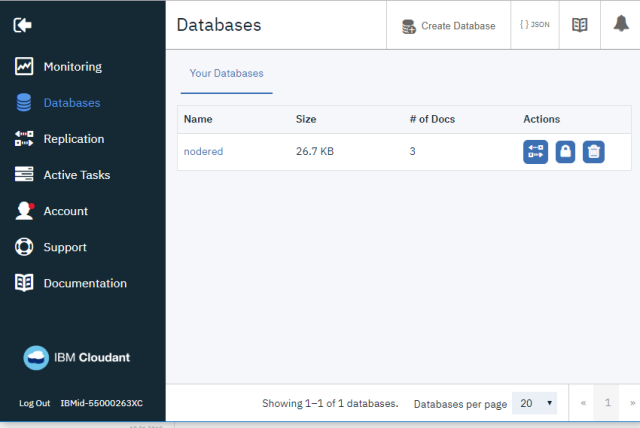 

рис.23.

   Передивіться усі сторінки зі вкладок лівої бічної панелі (рис.23). Зокрема подивіться на обмеження підписки на вкладці Account.

###### 4.3. Створення БД    

На вкладці Databases натисніть кнопку «Create Database». Назвіть цю БД «db1».  У виборі типу вкажіть "Non-partitioned". 

 

рис.24.

###### 4.4. Запис в БД з хмарного Node-RED    

У даному пункті для запису отриманих даних з пристрою Edge використовуватимуться вузли Cloudant.  

Ознайомтеся з роботою вузлів Cloudant [довідника](https://pupenasan.github.io/NodeREDGuidUKR/storage_cloudant/) Node-RED.

Змініть програму у хмарному Node-RED, як це показано на рис.25. 

 

рис.25.

Зробіть розгортання проекту і запустіть на виконання. Перевірте чи пишуться дані в БД. Запустіть Cloudant Dashboard. В переліку БД зайдіть в базу даних “db1”, натисніть її для перегляду. У списку документів повинні з’явитися записи, як на рис. 26. 

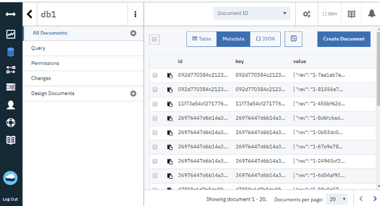 

рис.26.

###### 4.5. Перегляд БД з Cloudant Dashboard    

У списку документів виберіть табличне представлення (кнопка Table). Як видно дані відображаються у вигляді таблиці, я якій є поля _id, ramp та sin (рис.27).  

 

рис.27. 

Перегляньте перелік у вигляді списку документів JSON (рис.28). Намагайтеся розібратися в структурі документу.  Детальний опис структури документу наведений за [цим](https://console.bluemix.net/docs/services/Cloudant/api/document.html#documents) і за [цим](https://console.bluemix.net/docs/services/Cloudant/api/design_documents.html#design-documents) посиланням.  Нижче описані тільки деякі основні поля.

Усі документи повинні мати унікальні поля  `_id` та `_rev`. Поле `_id` може формуватися автоматично. Поле `_rev` є номером версії. Окрім цих 2-х полів, документ може вміщувати будь які інші поля, відповідно до правил JSON. Поля, що починаються з «_» зарезервовані як службові. 

 

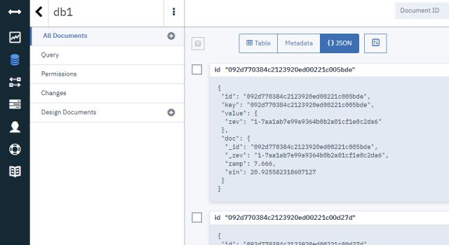 

рис.28.

###### 4.6. Читання записів даних БД Cloudant з Node-RED    

Вставте в хмарному Node-RED вузол Cloudant in і модифікуйте програму, як це показані на рис.29.  

Зробіть розгортання проекту і перевірте його роботу. У вікні відлагодження після запуску Inject повинен сформуватися масив документів за весь час роботи. 

 

 рис.29.

###### 4.7. Добавлення в документи відмітки часу    

Для того, щоб мати можливість заходити дані за часом, необхідно в записи вставляти також відмітки часу. Модифікуйте локальну програму в Node-RED так, як це показано на рис.30.

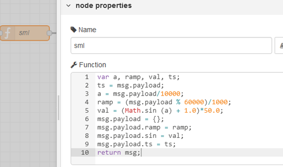  

рис.30

Зробіть розгортання та перевірте його роботу.

###### 4.8. Формування та перевірка користувацьких запитів find в Cloudant Dashboard    

Для доступу до документів (а також для створення, видалення, модифікації) БД Cloudant використовується HTTP API. Як і всі СУБД, Cloudant приймає запити від клієнтів і повертає відповідь на них. 

- Для доступу до необхідного документу необхідно вказати його  [_id](https://console.bluemix.net/docs/services/Cloudant/api/document.html#documents). Це можна зробити, використовуючи запит GET:


```
https://$ACCOUNT.cloudant.com/$DATABASE/$DOCUMENT_ID
```

- Якщо ідентифікатор невідомий можна прочитати усі документи з бази даних задавши параметр [_all_docs](https://console.bluemix.net/docs/services/Cloudant/api/database.html#get-documents) 


```
https://$ACCOUNT.cloudant.com/$DATABASE/_all_docs
```

Саме такий механізм використовується в вузлі Cloudant in в Node-RED  в п.6. 

- Крім цього, IBM Cloudant підтримує пошук документів по індексам з використанням методу POST та параметру [_find](https://console.bluemix.net/docs/services/Cloudant/api/cloudant_query.html#finding-documents-by-using-an-index) . 


```
https://$ACCOUNT.cloudant.com/$DATABASE/_find
```

- Ще одним механізмом доступу до документів є використання пошукового індексу ([search indexes](https://console.bluemix.net/docs/services/Cloudant/api/search.html#search)). 


```
https://$ACCOUNT.cloudant.com/$DATABASE/_design/$DDOC/_search/$INDEX_NAME
```

Для перевірки користувацьких запитів з використанням параметру [_find](https://console.bluemix.net/docs/services/Cloudant/api/cloudant_query.html#finding-documents-by-using-an-index) можна скористатися вбудованим редактором запитів Query. З сторінки Cloudant Dashboard зайдіть в db1. Відкрийте Query і введіть запит, як на рис.31. і натисніть “RUN QUERY”. В результаті повинен буде виданий результат запиту.  

 

рис.31 

###### 4.9. Створення пошукових індексів в Cloudant    

Вузол Node-RED “cloudant in” не вміє формувати запити з параметром «find» (але є бібліотеки з вузлами, які вміють), замість цього можна користуватися відбором за пошуковим індексом, який необхідно попередньо створити. У пошуковому індексі необхідно вказати перелік усіх полів, за яким відбувається пошук. У нашому випадку – це поле «ts», за яким необхідно робити вибірку документів з БД.

Детальний опис призначення і порядку створення пошукових індексів наведений на [сторінці допомоги](https://console.bluemix.net/docs/services/Cloudant/api/search.html#search).

На сторінці БД db1 створіть новий Search index, як це показано на рис.32. Натисніть “Search Document and Build Index”.

   

рис.32

###### 4.10. Формування користувацьких запитів  в Node-RED    

Модифікуйте програму в в хмарному Node-RED, як це показані на рис.33. Зверніть увагу на пробіли! 

Зробіть розгортання проекту і перевірте його роботу. У вікні відлагодження після запуску Inject повинен сформуватися масив документів за останні 5 хвилин роботи (60 записів). 

 

рис.33

###### 4.11. Перегляд відібраних даних в Node-RED за допомогою трендів    

Історичні дані, що записані в Cloudant можна відобразити з використанням Dashboard. Модифікуйте програму, як це показано на рис.34, нижче наведений лістинг функції “->Trend”, яку можне скопіювати для пришвидшення розробки. Зробіть розгортання проекту і перевірте його роботу. Відкрийте Веб-інтерфейс і перевірте, там повинні відображатися дані за останні 5 хвилин.

```javascript
var result = msg.payload;
var chart = [{
    "series":["ramp","sin"],
    "data":[],
    "labels":[""]
}];
chart[0].data[0]=[];
chart[0].data[1]=[];
for (var i = 0; i < result.length; i++) {
    chart[0].data[0][i] = {"x":result[i].ts,"y":result[i].ramp};
    chart[0].data[1][i] = {"x":result[i].ts,"y":result[i].sin};
}
msg.payload = chart;
return msg;

```

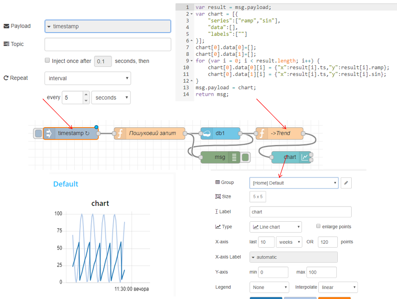  

рис.34

**Скопіюйте адресу вашої Веб сторінки і відправте її викладачу, це буде звітом до Вашої роботи.** 

Необов’язкове завдання для самостійного виконання.

###### 4.12. Перегляд даних за вказаний інтервал    

Спробуйте модифікувати програму в хмарному Node-RED так, щоб в користувацькому інтерфейсі вводився початковий час відображення тренду і була можливість змінювати глибину відображення. 


## Додаток 1. Node-RED IBM Cloud Starter Application  

[https://github.com/ibmets/node-red-bluemix-starter](https://github.com/ibmets/node-red-bluemix-starter)

[https://github.com/knolleary/node-red-bluemix-starter](https://github.com/knolleary/node-red-bluemix-starter ) 

### Node-RED IBM Cloud Starter Application

### Як працює розгортання за однією кнопкою?

Коли ви натискаєте кнопку, ви перейдете до IBM Cloud, де ви отримаєте назву для вашої програми, після чого платформа захопить код з цього сховища і отримає його розгортання.

Вона автоматично створить примірник служби Cloudant і прив'яже її до вашого додатка. Тут ваш екземпляр Node-RED буде зберігати свої дані.

Під час першого доступу до програми вам буде запропоновано встановити деякі параметри безпеки, щоб забезпечити безпеку вашого редактора потоків від несанкціонованого доступу.

Вона включає в себе набір потоків за замовчуванням, які автоматично розгортаються при першому запуску Node-Red

### Customising Node-RED

Цей репозиторій тут буде клонований, змінений і повторно використаний для того, щоб дозволити будь-якому користувачеві створити власне Node-RED-додаток, яке можна швидко розгорнути в IBM Cloud.

Потоки за замовчуванням зберігаються в каталозі `defaults` у файлі з назвою `flow.json`. Коли застосунок вперше запущений, цей потік копіюється до приєднаного екземпляру Cloudant. Коли зміна розгортається з редактора, буде оновлена версія в cloudant – але не цей файл.

Веб-вміст, який ви отримуєте під час переходу до URL-адреси програми, зберігається в каталозі `public`.

До файлу `package.json` можна додати додаткові вузли, а всі інші налаштування конфігурації Node-RED можна встановити в `bluemix-settings.js`.

Якщо ви клонуєте це сховище, переконайтеся, що ви оновили цей файл `README.md`, щоб вказати кнопку `Deploy to IBM Cloud` у вашому репозиторії.

Якщо ви хочете змінити назву створеного екземпляра Cloudant, пам'ять виділена застосунку  або інші параметри часу розгортання, подивіться в `manifest.yml`

# Питання до захисту 

1. Які типи хмарних     платформ Вам відомі? Який тип використовувався в даній лабораторній     роботі?
2. Які хмарні сервіси були     використані в цій лабораторній роботі?
3. Розкажіть про сервіс     Cloudant.
4. Для чого     використовувався Cloudant у даній лабораторній роботі?
5. Розкажіть про     використання користувацьких запитів до Cloudant.
6. Розкажіть про створення     пошукових індексів у Cloudant.
7. Розкажіть про     налаштування вузлів Node-RED для роботи з Cloudant.
8. Розкажіть про основи     IBM Cloud Identity and Access Management.
9. Розкажіть про     призначення та налаштування сервісу COS.
10. Розкажіть про     налаштування доступу до об’єктів Bucket.
11. Розкажіть про     налаштування вузлів Node-RED для роботи з COS.

 