**Технології індустрії 4.0. Лабораторний практикум. ** Автор і лектор: Олександр Пупена 

| [<- до лаборних робіт](README.md) | [на основну сторінку курсу](../README.md) |
| --------------------------------- | ----------------------------------------- |
|                                   |                                           |

# Лабораторна робота №3. Xмарні сервіси для Індустрії 4.0

# Ч.2. Хмарні сервіси для збереження об’єктів

**Мета**: Навчитись користуватися функціями хмарних сервісів збереження даних та отримати базові навики адміністрування доступу до хмарних ресурсів. 

Цілі: 

1. визначити функції та налаштування доступу до хмарних ресурсів; 
2. створити та використати власне хмарне сховище:

- створити IBM Cloud Object Storage
- забезпечити доступ до IBM Cloud Object Storage зі сторони Інтернету;
- зробити застосунок для отримання файлів з IBM Cloud Object Storage;

Зовнішній вигляд інтерфейсу налаштування IBM Cloud постійно змінюється! Увага, набір наданих сервісів та політика ліцензування IBM Cloud може змінитися. У будь якому випадку, без використання угоди та реєстрації кредитної картки ніякі кошти за використання стягуватися не можуть.  

## 1. Робота з IBM Cloud Identity and Access Management  

[IBM Cloud Identity and Access Management](https://cloud.ibm.com/docs/iam/index.html#iamoverview) (**IAM**) – дозволяє надійно аутентифікувати користувачів для доступу до ресурсів IBM Cloud. З точки зору доступу, ресурси можна групувати ([resource groups](https://cloud.ibm.com/docs/account/resourcegroups.html)), що дозволяє надавати користувачам швидкий і легкий доступ до більш ніж одного ресурсу одночасно. Політика доступу до хмари IAM використовується для назначення доступу до ресурсів облікового запису як користувачам (users) так і сервісам (через Service ID). Можна групувати користувачів і Service ID в групи доступу ([access group](https://cloud.ibm.com/docs/iam/groups.html)), щоб легко надати всім особам у групі однаковий рівень доступу.

Модель функціонування IAM показана на рис.1.  Для сервісів, які не підтримують створення політик Cloud IAM для керування доступом, можна скористатися [доступом до Cloud Foundry](https://cloud.ibm.com/docs/iam/cfaccess.html#cfaccess) або [доступом до класичної інфраструктури](https://cloud.ibm.com/docs/iam/infrastructureaccess.html#infrapermission).

                               

рис.1.

Уніфіковане керування користувачами дозволяє додавати або видаляти користувачів облікового запису як для сервісів платформи (керування, адміністрування), так і для класичних сервісів інфраструктури. 

Доступ для користувачів, service IDs і груп доступу означується **політикою** (**policy**). В межах політики, область доступу для користувача, service ID або група доступу може бути назначена набору ресурсів у групі ресурсів, єдиному ресурсу або сервісам керування обліковим записом. Після встановлення області дії, вибравши ролі доступу можна визначити, які дії дозволяється суб'єктом вказаної політики. Ролі надають можливість адаптувати рівень доступу, наданий суб'єкту політики (subject of the policy) для виконання дій на цілі політики.

Для користувача можуть бути створені декілька ключів API (API keys). Той же ключ можна використовувати для доступу до декількох сервісів. Ключі IBM Cloud API дозволяють користувачам, які використовують двофакторну аутентифікацію або федеративний ідентифікатор (federated ID), автоматизувати аутентифікацію консолі з командного рядка. Користувач може також мати один класичний інфраструктурний ключ API, який можна використовувати для доступу до класичних інфраструктурних API; однак, це не є обов'язковим, оскільки можна використовувати ключі IBM Cloud API для доступу до тих самих API.

Ідентифікатор сервісу (**Service ID**) ідентифікує сервіс або застосунок, якому необхідно надати доступ до ресурсу. Ідентифікатор користувача (**user ID**) ідентифікує користувача, тобто людину, якій необхідно надати доступ до ресурсу. Це ідентифікатори, які можуть використовуватися застосунками для автентифікації за допомогою сервісу IBM Cloud. Кожному Service ID можна призначити правила, щоб керувати рівнем доступу, дозволеним застосунком, який використовує цей ідентифікатор сервісу. Крім того можна створити API key, щоб активувати автентифікацію.

Для адміністрування Cloud IAM використовуючи консоль можна перейти за посиланням **Manage** > **Access (IAM)**.

###### 1.1. Перегляд вікон налаштування  IAM для користувачів  

Перейдіть до вікон налаштування IAM **Manage** > **Access (IAM)**. (рис.2) . 

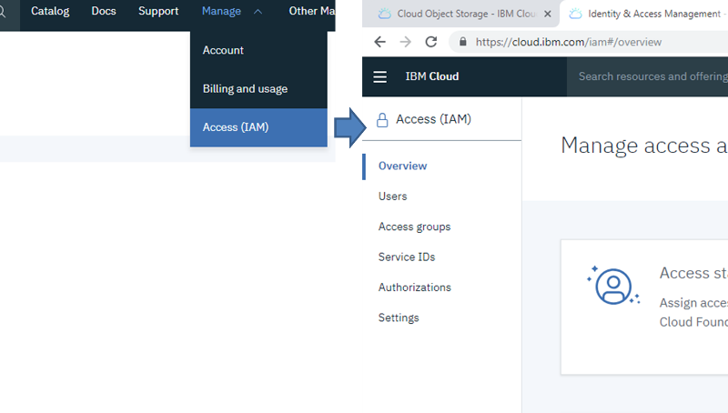 

рис.2.

Перейдіть на вкладку Users. Відкрийте налаштування користувача через пункт Manage user details (рис.3).

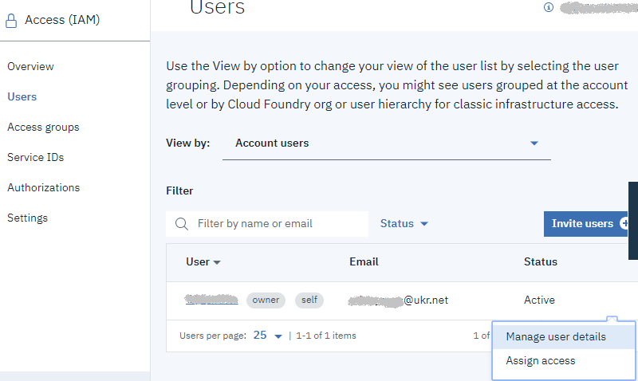 

рис.3.

Передивіться зміст усіх закладок User details, Access groups, Access policies.

###### 1.2. Перегляд вікон налаштування  IAM для Service ID  

Перейдіть до вкладки ServiceIDs (рис.4) . Для вашого аккаунту повинен бути автоматично створений як мінімум один Service ID, який можна налаштувати. Також це вікно дає можливість створювати нові Service ID та редагувати існуючі. Для того щоб передивитися деталі для даного ServiceID перейдіть на його налаштування, клікнувши за посиланням в полі Name, або клікнувши по Manage service ID в контекстному меню. З опису (Description) видно, що даний ServiceIDs був створений для доступу до Cloudant.  

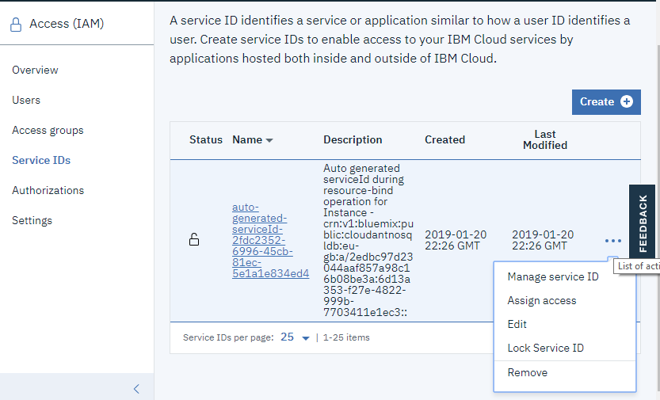 

рис.4.

## 2. Створення, наповнення та адміністрування IBM Cloud Object Storage  

[IBM Cloud Object Storage](https://console.bluemix.net/docs/services/cloud-object-storage/about-cos.html#about-ibm-cloud-object-storage) (надалі, **COS**) - це хмарне сховище даних, яке за своїми функціями подібне до файлового серверу). [Глосарій термінів](https://cloud.ibm.com/docs/overview?topic=overview-glossary).

###### 2.1. Створення  IBM Cloud Object Storage 

Відкрийте IBM Cloud і увійдіть в систему. Перейдіть [на вкладку з ресурсами](https://cloud.ibm.com/resources) і натисніть на Object Storage (рис.5). 

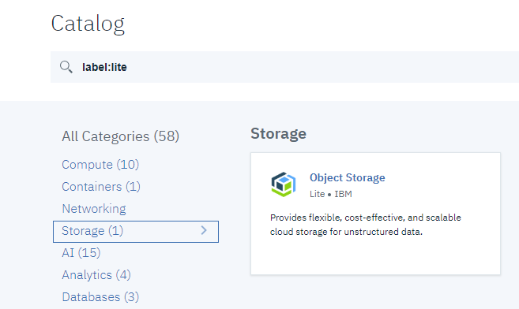  

Рис.5.

​      У вікні налаштувань створення сервісу (рис.6) вкажіть ServiceName, відповідно до вашого прізвища та імені, наприклад для Іваненко Івана згідно та шаблону:

```
IvanenkoIvanStorageCOS
```

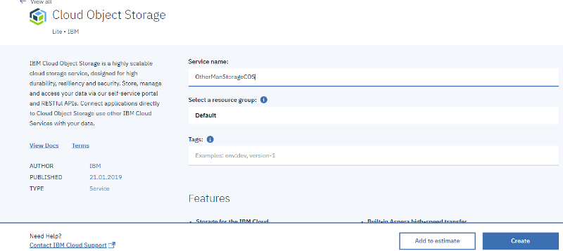 

Рис.6. 

###### 2.2. Створення  Bucket 

Після створення сервісу, автоматично відкриється вікно швидкого старту (рис.7), де запропонують створити Bucket (буквальний переклад «Відро»).  **Bucket** – це розділ для сховища об’єктів, який за своїми функціями схожий на папку, в якій зберігаються файли. З цієї точки зору об’єкти також в певному наближенні можна вважати файлами. Новий Bucket також можна створювати з розділу Buckets. 

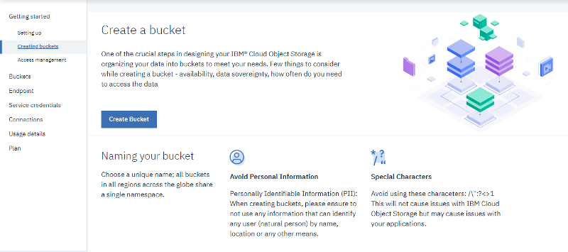 

Рис.7.

Натисніть кнопку “Create Bucket” для створення нового  Bucket (рис.8). Вкажіть Bucket Name, відповідно до вашого прізвища та імені, наприклад для Іваненко Івана згідно та шаблону:

```
ivanenko-ivan-files
```

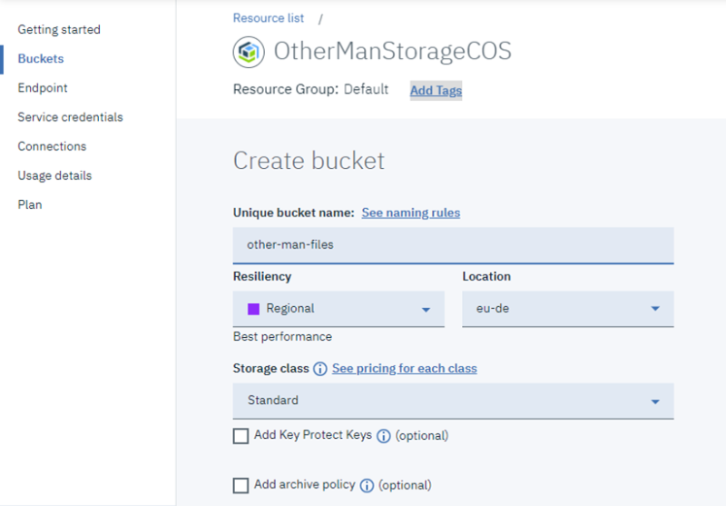 

Рис.8.

Дочекайтеся, поки буде створений Bucket, після чого ви отримаєте повідомлення і автоматично перейдете до вкладки Objects (рис.9).

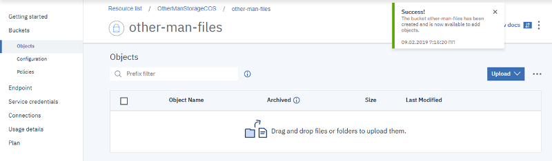 

Рис.9.

###### 2.3. Добавлення файлів в Bucket.

За допомогою кнопки `Upload -> Files` (у спливаючому вікні виберіть Standard Upload), або шляхом перетягування, добавте в новостворений Bucket якийсь файл *.jpg (наприклад своє фото). Після завантаження у переліку буде показаний завантажений файл (рис.10).

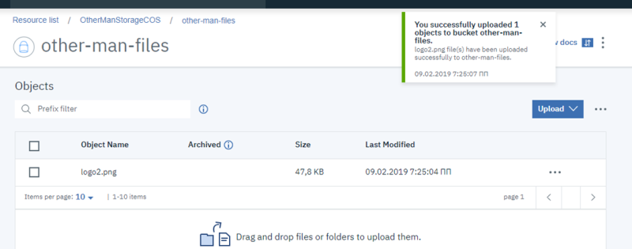 

Рис10.

###### 2.4. Налаштування доступу до об’єктів Bucket.

Об’єктами COS можна користуватися як з сервісів IBM Cloud, так і поза ними. Для того, щоб мати можливість користуватися цими об’єктами поза межами IBM Cloud (через HTTP API) необхідно налаштувати доступ. Нижче наведені деякі поняття, які необхідні для розуміння. 

[Service credential](https://cloud.ibm.com/docs/overview?topic=overview-glossary#x8878996) (**облікові дані**) - це сукупність важливої інформації, яку розробники використовують для підключення до екземпляра об'єкта зберігання даних. 

[Resource instance ID / Service instance ID](https://console.bluemix.net/docs/services/cloud-object-storage/basics/glossary.html#resource-instance-id-service-instance-id) - коли створюється або надається екземпляр сервісу, йому присвоюється унікальний ідентифікатор у вигляді імені ресурсу хмари (**CRN** - Cloud Resource Name).

[Identity endpoint](https://console.bluemix.net/docs/services/cloud-object-storage/basics/glossary.html#identity-endpoint) – кінцева точка IAM (`iam.bluemix.net`), що використовується для отримання маркера доступу (**access token**) в обмін на ключ API (API key). Цей маркер надалі використовується в заголовку авторизації (`Authorization`) всіх запитів REST API, надісланих кінцевій точці служби зберігання об'єктів.

[Service endpoints](https://console.bluemix.net/docs/services/cloud-object-storage/basics/glossary.html#service-endpoints) (наприклад, `s3.us-south.objectstorage.softlayer.net`) – це базові URLs куди надсилаються запити API, які взаємодіють з даними. 

[Object Storage bucket location](https://console.bluemix.net/docs/services/cloud-object-storage/basics/glossary.html#object-storage-bucket-location) – всі buckets в Object Storage находяться в певному місці. Це або регіон (такий як `us-south` або `us-east`) або географічне місце (такі як `eu-geo` або `us-geo`). У цьому місцезнаходженні об'єкти поділені та розподілені по трьох різних фізичних розташуваннях.

[Regions](https://console.bluemix.net/docs/services/cloud-object-storage/basics/glossary.html#regions). Регіон і розташування часто використовуються як взаємозамінні, але на відміну від більшості сервісів, доступних в IBM Cloud Platform, сховище об'єктів - це "глобальна" служба. IBM Cloud Platform існує в різних регіонах (наприклад, в `US South`` або ``United Kingdom`), а деякі сервіси - у місці їх створення. Хоча кожен екземпляр сховища об'єктів вважається "глобальним", кожен окремий bucket має певну комбінацію розташування, стійкості та класу зберігання.

Як наведено вище, для доступу інших сервісів до ресурсів IBM cloud, необхідно створити Service ID, у якому назначити права доступу до конкретних ресурсів через ролі. Потім в межах цього Service ID необхідно вказати  API key. Далі, будь який сервіс в Інтернеті, щоб скористатися цим ресурсом, повинен доступитися до кінцевої точки ідентифікації (Identity endpoint) з вказівкою API key, щоб отримати маркер доступу (access token). Маючи цей маркер, Інтернет-сервіс звертається до Service endpoints, на якому безпосередньо і знаходиться цільовий ресурс. 

Для того щоб всю необхідну інформацію для доступу надати розробнику в одному місці в IBM Cloud існує можливість створити JSON-файл з обліковими даними (Service credential), використовуючи помічника, якому треба вказувати потрібні вже створені ключі та ідентифікатори. Однак, можна піти зворотнім шляхом, одразу запустивши помічник створення Service credential, який автоматично створить необхідні ключі та ідентифікатори.

Зайдіть в налаштування Service credentials (рис.11). 

 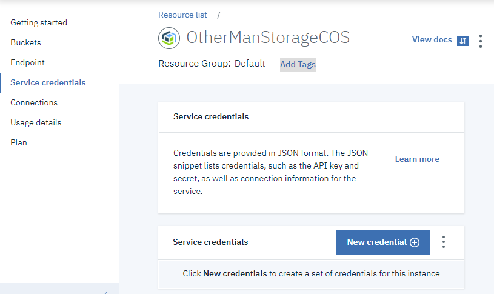 

Рис11.

Натисніть кнопку «New credential», у новому вікні введіть назву подібну до вказану на рис.12. Також виставте опцію “Include HMAC Credential”. Усі інші поля залиште без змін. 

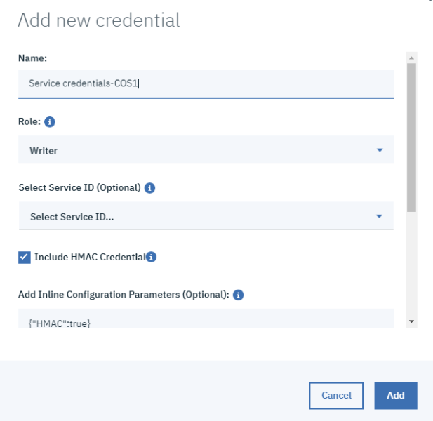 

Рис12.

---

**Редакція 2020 року**

У випадку, якщо вибір опції “Include HMAC Credential” не з'являється, необхідно створити ключ через   командний рядок та консольний клієнт `ibmcloud`, для цього виконайте наступні команди:

- завнтажте та встановіть консольну утиліту `ibmcloud` https://github.com/IBM-Cloud/ibm-cloud-cli-release/releases/
- відкрийте на комп'ютері консоль командного рядка (`cmd`)
- зареєструйтеся в системі через команду login

```bash
ibmcloud login
```

- введіть почтову скриньку та пароль, які використовуються для доступу до хмарної платформи IBM Cloud  

- копіюйте в консоль вказаний нижче фрагмент та замініть там `cloud-object-storage-lz` на назву вашого екземпляра COS

```bash
ibmcloud resource service-key-create service-credentioal-cos-1 Writer --instance-name cloud-object-storage-lz --parameters "{\"HMAC\":true}"   
```

---

Повинен створитися файл з обліковими даними (рис.13), та всі супутні записи. Вони знадобляться Вам для налаштування клієнтських сервісів, що будуть доступатися до ресурсів.

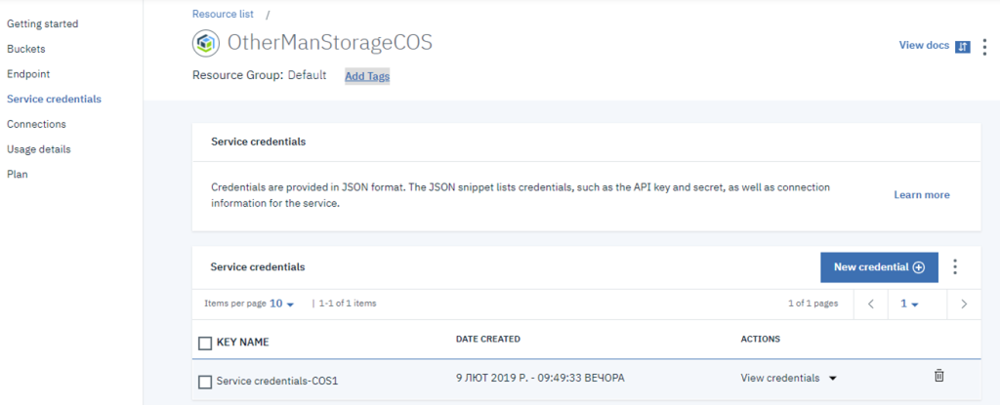 

Рис13.

###### 2.5. Перегляд створеного Service ID.

Після виконання попереднього пункту, в IBM Cloud повинен автоматично створитися Service ID.  Перейдіть до вікон налаштування IAM Manage > Access (IAM).  Знайдіть в налаштування новоствореного Service ID (Manage Service ID). Новостворений запис можна визначити за датою. Зайдіть на вкладку Access policies, на ній повинен бути запис з роллю Writer (рис.14).

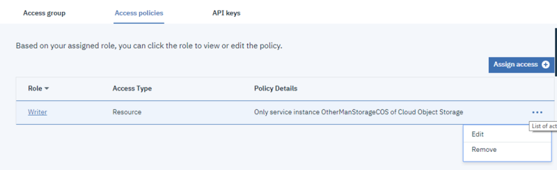

 Рис14.

​        Виберіть пункт контекстного меню Edit, для переходу до редагування ролі. У вікні налаштування ролі видно до яких об’єктів і який доступ надається даною роллю (рис.15). У полі Service Instance вказується ідентифікатор екземпляру COS, тоді як в полях типу і ідентифікатору ресурсу вказується конкретний ресурс, якого стосується дана роль. Якщо ресурс не вказується, то роль стосується доступу до всіх ресурсів екземпляру сервісу. Іншими словами, сервіс, який буде доступатися через цей Service ID в даному випадку буде мати можливість читання/запису в будь якому bucket даного екземпляру COS. На даний момент залиште поля в тому стані, в якому вони є.

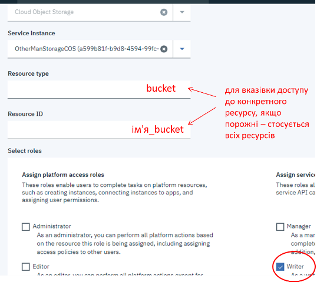 

Рис15.

## 3. Використання об’єктів IBM COS в Node-RED  

Доступ до об’єктів COS надається через HTTP API, з яким можна ознайомитися за [посиланням](https://console.bluemix.net/docs/services/cloud-object-storage/api-reference/about-api.html#about-the-ibm-cloud-object-storage-api). У Node-RED є бібліотеки, які вже надають доступ до певних сервісів без необхідності складного програмування, що дає можливість використовувати COS для збереження файлів з наступним їх використанням в застосунках IIoT.  

###### 3.1. Інсталяція пакету  node-red-contrib-cos 

Запустіть сервіс Node-RED  в IBM Cloud, перейдіть в редактор свого застосунку. Через менеджер палітри встановіть модуль `node-red-contrib-cos`. 

###### 3.2. Налаштування конфігураційного об’єкту з COS 

Створіть новий потік. Розмістіть на ньому взол `cos get`. У налаштуваннях `Storage configuration` зайдіть в редагування конфігураційного вузлу (`Add new cos-config...`) Cloud Object Storage.

Відкрийте в іншому вікні перегляд Service credentials для вашого екземпляра COS, який ви створювали в попередніх пунктах. Натисніть  кнопку «View credentials» (див. рис.13)

Скопіюйте необхідні поля з JSON файлу в налаштування вузла, як це показано на рис.16. Зверніть увагу на поле Location, там повинно бути те саме розташування, що і для Bucket. В поле ім’я впишіть “MyCOS”.  Натисніть «Update» для збереження конфігурації.  

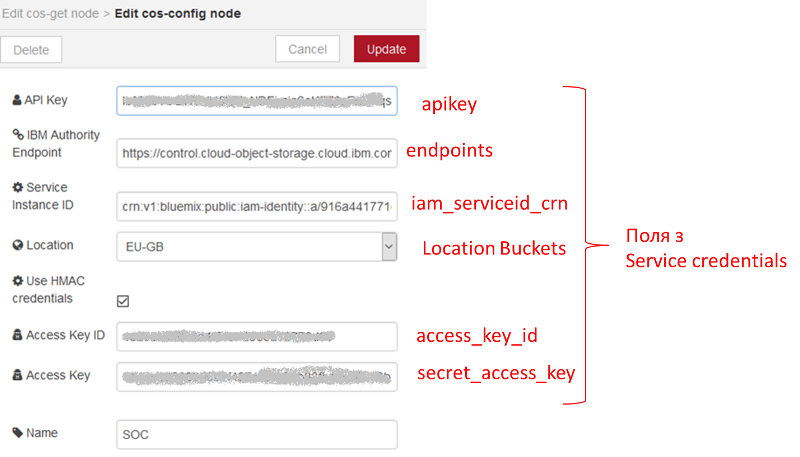 

рис.16.

###### 3.3. Отримання переліку об’єктів з COS 

Ознайомтеся з принципами роботи вузлів з «cos get» та «cos query» з  [довідника Node-RED](https://pupenasan.github.io/NodeREDGuidUKR/storage_cos/). У новоствореному потоці розмістіть вузли так, як це показано на рис.17. Зробіть розгортання проекту. 

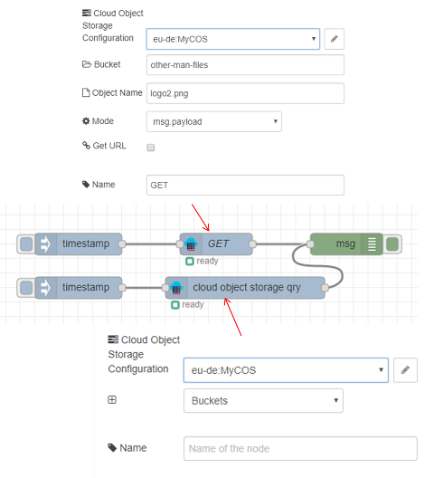  

рис.17.

​        Ініціюйте отримання переліку Bucket. У випадку вдалого отримання на панелі відлагодження Ви повинні побачити цей перелік. Якщо є помилка, перевірте правильність виконання усіх попередніх пунктів. 

###### 3.4. Отримання об’єкту з COS 

Ініціюйте отримання вказаного у вузлі GET об’єкту, у випадку вдалого отримання на панелі відлагодження Ви повинні побачити цей об’єкт у msg.payload у вигляді масиву. Якщо є помилка, перевірте правильність виконання усіх попередніх пунктів. 

###### 3.5. Ініціювання отримання об’єкту з COS через WEB-запит 

У даному пункті лабораторної роботи необхідно забезпечити ініціювання зчитування об’єктів через веб-запит. Запит повинен проводитися за шаблоном

```
host/files/file_name
```

 де host вказує на розміщення веб ресурсу Node-RED, а file_name – ім’я файлу, який необхідно отримати. У випадку позитивної відповіді необхідно вивести «Об’єкт отримано», у випадку негативної – «Об’єкт не вдалося отримати».

Модифікуйте програму, як це показано на рис.18.

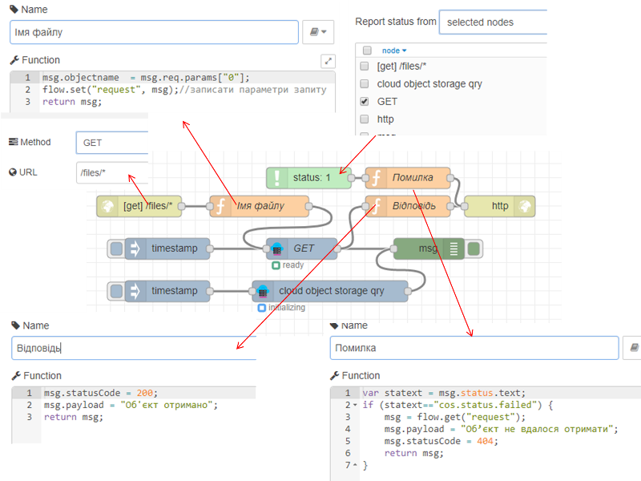 

рис.18.

​        Зробіть розгортання проекту, в новому вікні браузеру, впишіть URL, відповідно до рис.19, з вказівкою існуючого в COS файлі. На сторінці повинно відобразитися повідомлення «Об’єкт отримано». Після цього впишіть назву файлу, якого в COS немає – повинні отримати напис «Об’єкт не вдалося отримати» 

 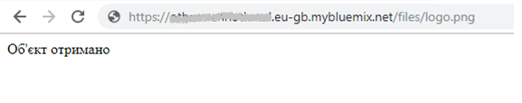

рис.19.

Видаліть з програми вузла «Відповідь» рядок 

```
msg.payload = "Об'єкт отримано";
```

Зробіть розгортання проекту. Знову задайте в рядку URL файл, який необхідно вибрати з COS. Замість повідомлення про успішне отримання файлу, він буде зберігатися на локальному ПК.

###### 3.6. Використання файлів COS в наповненні власної сторінки 

В даному пункті COS буде використовуватися в якості сховища медіа-даних для відображення на власній Веб-сторінці. Це знадобиться в наступних лабораторних роботах для формування контексту цифрового двійника в хмарі. 

Завантажте у свій COS файл [за посиланням](https://drive.google.com/open?id=10XoU9xieZSx0GixcPa1HtK4CPx7SVXe9).

Добавте в програму Node-RED фрагмент, показаний на рис.20.  Код у верхньому вузлі Template має мати наступний зміст (необхідно замінити `Ivanenkoivannodered`):

```html
<iframe id="vs_iframe" src="https://www.viewstl.com/?embedded&url=https://Ivanenkoivannodered.eu-gb.mybluemix.net/files/Dragon.stl" style="border:0;margin:0;width:100%;height:100%;"></iframe>
```

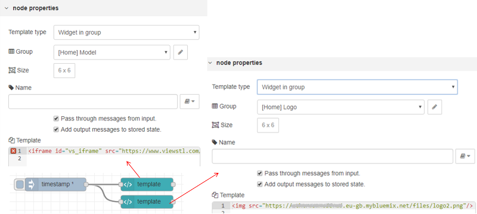

рис.20.

​        Зробіть розгортання проекту, відкрийте власну Веб-сторінку, вона повинна мати вигляд, подібний до наведеної на рис.21.

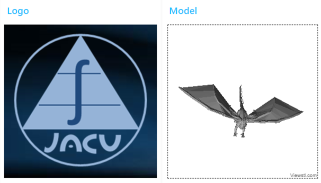  

рис.21.

**Зробіть копію екрану та разом з посиланням на сторінку відправте у звіті.**