# Лабораторна робота №4. Облачные платформы для контроля активов 

## 1. Реализация сбора данных уровня Edge   

Для выполнение заданий практического занятия следует подготовить данные для отправки. В качестве объекта контроля будет использоваться имитационная модель кондиционирования, реализованная в UA CPP сервере.

### 1.1. Инсталляция и проверка тестового OPC UA сервера и клиента

- [ ] Инсталлируйте тестовый [OPC UA C++ Demo Server](https://www.unified-automation.com/downloads/opc-ua-servers.html) , если еще не инсталлирован
- [ ] Инсталлируйте тестовый OPC UA Client [UaExpert](https://www.unified-automation.com/downloads/opc-ua-clients.html), если еще не инсталлирован
- [ ] Запустите OPC UA C++ Demo Server и OPC UA Client, соедините их и проверьте взаимодействие 

Работа с указанными тестовыми клиентами и серверами дана в практический занятиях предыдущего модуля. 

### 1.2. Инсталляция пакета Node-RED для OPC UA 

- [ ] Инсталлируйте модуль `node-red-contrib-opcua`, если он еще не инсталлирован.  Рекомендуется поставить версию 0.2.52 через npm:

```bash
npm install -g node-red-contrib-opcua@0.2.52
```

### 1.3. Импорт и проверка работы потока для сбора данных

- [ ] на локальном ПК запустите Node-RED 
- [ ] создайте новый проект
- [ ] скачайте [файл экспорта потока](https://drive.google.com/file/d/1sG11-TY4EOX3Sk9N1mJyQCGGNj01NExx/view?usp=sharing) для сбора данных и импортируйте 


- [ ] сделайте разворачивание потока, просматривая и изменяя значения переменных с помощью OPC UA Client UaExpert проверьте, что в глобальном контексте "RTDB" данные обновляются
- [ ] просмотрите и проанализируйте содержание потока  


**Далее на выбор предлагается одна из платформ EcoStruxure Machine Advisor от Schneider Electric или Ubidots. Обязательным является прохождения занятия на одной из них**.   

- Для практического занятия по Machine Advisor, выполните Части 2 и 3
- Для практического занятия по Ubidots выполните Часть 4 

## 2. Знакомство с EcoStruxure Machine Advisor с точки зрения оператора

https://ecostruxure-machine-advisor.se.app

**EcoStruxure Machine Advisor** - это облачная платформа, специально разработанная для оптимизации отслеживания данных, мониторинга и устранения неисправностей для промышленных машин (установок), расположенных по всему миру.

Платформа базируется на MS Azure Cloud и обеспечивает следующую функциональность:

- сбор данных с машин (установок), используя протоколы MQTT и HTTPs, или через загрузку файлов CSV
- отображение данных через приборные панели (dashboard)
- обработка данных с использованием встроенных приложений
- оповещение при нештатных ситуациях (обрыв связи, выход за пределы, прогнозирования поломки)
- возможность быстрого доступа к структуре машины и необходимой документации
- обеспечение доступа с различными профилями пользователей по командам (администраторы, разработчики, обслуживающий персонал)
- возможность планирования задач (например обслуживание и ремонт)

Вся указанная функциональность сосредотачивается вокруг **машины** (или установки). Каждая машина имеет определенное географическое расположение, которое может задаваться стационарно, или определяться по координатам, которые машина передает на платформу (широта, долгота). По сути своей эта концепция тождественна "цифровому двойнику", хотя и в несколько упрощенном варианте. 

В данном практическом занятии EcoStruxure Machine Advisor используется в качестве примера простой IIoT платформы контроля активов. Machine Advisor пока имеет ограниченные возможности, а в триал-варианте ограниченный функционал. 

В этой части практического занятия EcoStruxure Machine Advisor рассматривается с точки зрения конечного пользователя (заказчика).  

### 2.1. Регистрация на Schneider Electric

- [ ] Зайдите на страницу регистрации Schneider Electric, нажав "sign In" на странице https://ecostruxure-machine-advisor.se.app  
- [ ] Если у Вас нет аккаунта, перейдите по ссылке `Register here` и создайте бесплатный аккаунт 
- [ ] На почту придёт сообщение о регистрации, перейдите по ссылке и войдите в систему

### 2.2. Первое знакомство с Machine Advisor

- [ ] На странице "Before you start" ознакомьтесь с правилами, дайте согласие и нажмите `Start`
- [ ] На следующей странице активируйте опцию `Show Demo Organization`
- [ ] Появится страница с обзором парка подключенных машин (`FLEET overview`). Посмотрите следующие части экрана:

  - список размещений, в котором указаны географическое расположение машин, выделяя размещение оно показывается на карте 
  - список машин в выделенном месте а также их состояние 
  - кнопки перехода в отображение статической и динамической информации по машине

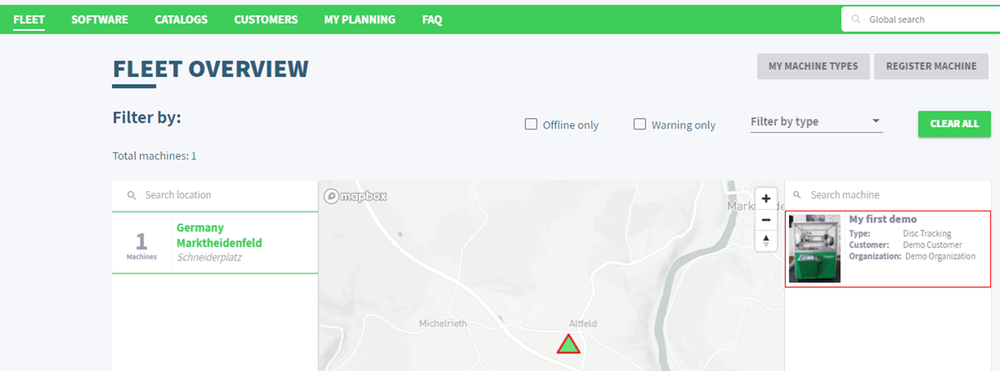

- [ ] используя [F.A.Q](https://faq.machine-advisor.com/machine-configuration/) определите состояние существующей машины

### 2.3. Просмотр статической информации (track) о машине

Доступ к нужной машине можно сделать как выбрав ее с перечня, так и через QR-код, который генерируется автоматически и доступный на сайте  (можно распечатать и прикрепить к машине). 

Статическая информация (**track**) включает в себя всю необходимую документацию на машину и компоненты (устройства) машины. Разработчик может скомбинировать техническую структуру, в которой указать компоненты (устройства) и типы соединений (сети). Типы устройств (компонентов) доступны в библиотеке, которая расширяется всеми пользователями. Каждое устройство имеет имя, производителя, отображение и описание.  

Документацию для всей машины разработчик загружает непосредственно на платформу. Это могут быть файлы PDF или видео формата MP4. Таким образом, обслуживающий персонал, выбрав необходимую машину будет иметь возможность быстро доступаться к необходимой документации. 

- [ ] Выделите машину в списке ("My first demo") и нажмите Track
- [ ] В появившемся окне найдите и посмотрите следующую информацию:
  - [ ] QR-код с ссылкой на эту страницу
  - [ ] архитектуру машины:
    - [ ] в виде архитектуры
    - [ ] в виде перечня компонентов (выбор через пиктограмму "Bill of material" внизу окна )  
    - [ ] в виде фотографии (пиктограмма "Architecture Picture")
  - [ ] в TASKS MANAGEMENT перечень задач, которые нужно сделать (open task) и сделаны (complete)
  - [ ] журнал действий (Activity), проделанных за указанный месяц
  - [ ] перечень доступных документов по машине и их содержимое 

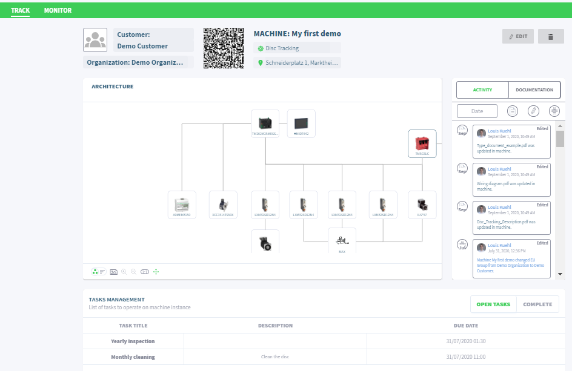

### 2.4. Просмотр динамической информации (Monitor) о машине

Динамическая информация (реального времени) доступна через вкладку **Monitor**. В основном информация предоставляется через Dashboard, который настраивается простым перетаскиванием и заданием свойств. С помощью виджетов можно представить информацию и в графическом и в текстовом виде. При необходимости можно посмотреть историю в виде трендов и таблиц для нужной точки ввода/вывода.

- [ ] Перейдите на вкладку Monitor
- [ ] Посмотрите и осмыслите предназначение каждого виджета на всех приборных панелях Dashboard (General, Machine Data, Energy Data)
- [ ] На панели "Machine Data" посмотрите детали информации с виджета "Throws good" с использованием кнопки "more>"

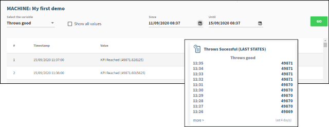

- [ ] На панели "Machine Data" посмотрите детали информации с виджета с трендами температуры использованием кнопки "Explore>":
  - [ ] выберите три переменных
  - [ ] укажите диапазон за последнюю неделю

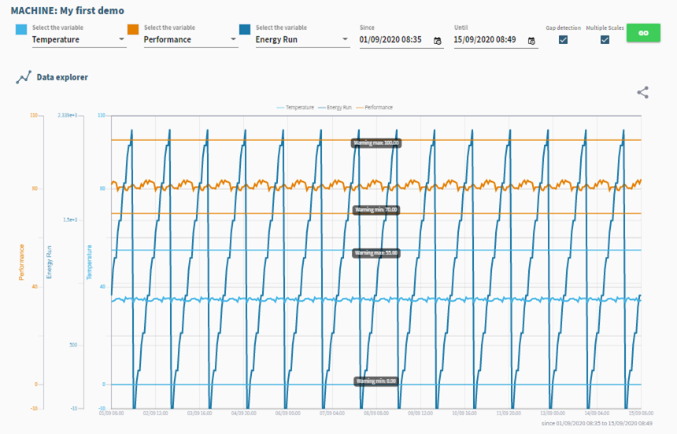

- [ ] Перейдите на панель "History", выберите одну с переменных, например OEE  и посмотрите изменение ее значения за последнюю неделю
- [ ] Перейдите на панель "Graph", его функциональность аналогична виджету с трендами

### 2.5. Просмотр информации о пользователе

- [ ] Перейдите на настройки своего аккаунта, кликнув по пиктограме с Вашим именем
- [ ] При желании измените свои данные, например свою фотографию

## 3. Работа с EcoStruxure Machine Advisor в режиме разработки

В этой части практического занятия необходимо перейти в режим разработчика и разработать цифрового двойника для своей машины.

### 3.1. Переключение на другую организацию

В предыдущей части занятия Вы работали как оператор в организации "Demo Organization", где была возможность просмотреть и пользоваться информацией. Для создания собственной машины, необходимо переключиться на свою организацию  

- [ ]  Переключитесь на свою организацию

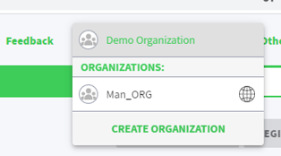

### 3.2. Создание типа машины

- [ ] Перейдите на главное окно "FLEET"
- [ ] Перейдите на "My Machine Types"
- [ ] С помощью кнопки "+" добавьте новый тип "Conditioner"
- [ ] С помощью кнопки "ViewType" перейдите на определение типа устройства
- [ ] Измените изображение, например на [это](https://drive.google.com/file/d/1vvjdmJVLrEavJlc4XL5EEg722CpIqEjw/view?usp=sharing)
- [ ] В окне "Architecture" перейдите в режим "Edit"
- [ ] Переключитесь редактор архитектуры в режим "Bill of Material" и добавьте:
  - один ПЛК, например M251
  - операторскую панель, например HMIGTO
  - ПЧ, например ATV32    

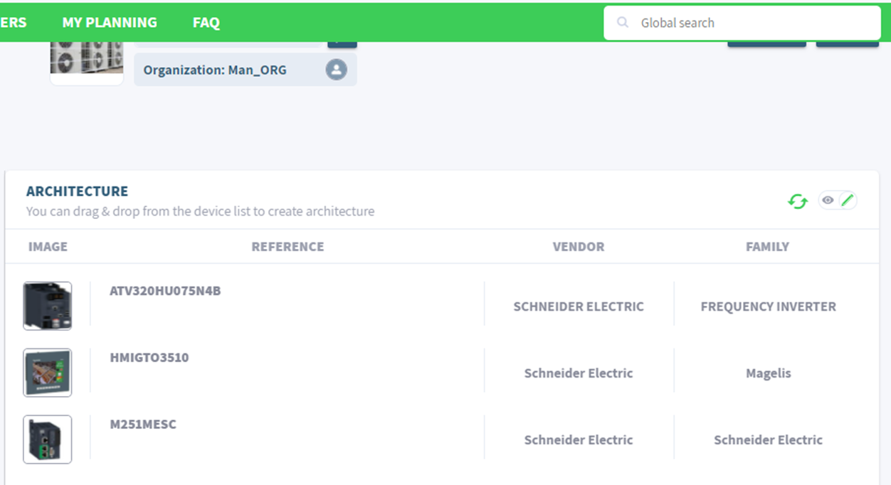

- [ ] переключите редактор архитектуры в режим "Architecture", потом "Selection Tool", соедините устройства, как показано на рисунке: связь межу устройствами можно выбрать Modbus TCP/IP и Modbus

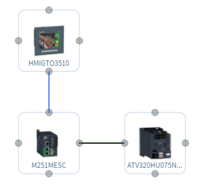

- [ ] переключитесь в режим "Architecture Picture" и через меню Upload Picture загрузите туда [рисунок](https://drive.google.com/file/d/1na6hAOB95WfMuPHrNqcS_3yKeNflj0Up/view?usp=sharing) и нажмите "Save" (изображение карандаша).

### 3.3. Добавление документации на машину

- [ ] Через панель "Documetation" добавьте один любой файл pdf
- [ ] Выделите документ и прикрепите к нему тег "ATV", теперь документацию можно фильтровать по указанному тегу

### 3.4. Создание задачи на обслуживание

- [ ] Создайте задачу (тип) на обслуживание машины "Create Task" с именем "поменять фильтры" и "общий осмотр"

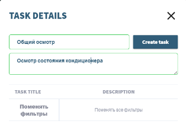

### 3.5. Регистрация экземпляра машины

- [ ] Зайдите в "FLEET->Register Machine"
- [ ] Создайте две машины `Conditioner_1` и `Conditioner_2`:
  - [ ] тип `Conditioner`
  - [ ] customer - собственный
  - [ ] две различные локации 

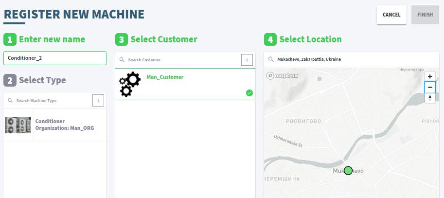

### 3.6. Редактирование экземпляра

- [ ] Зайдите в настройки TRACK одного с созданных экземпляров
- [ ] Поменяйте в экземпляра архитектуру, например сеть между устройствами
- [ ] Укажите дату следующего обслуживания  в "DUE DATE" для осмотра состояния кондиционера 
- [ ] Подтвердите проведение осмотра  путем активирования опции (галочки), задание перейдет в состояние "COMPLETED" 

### 3.7. Обновление профиля пользователя

Для использования функций обмена данными с уровнем Edge необходимо обновить профиль пользователя. После этого дается 3 месяца пробного использования функций связи и отображения динамических данных.

- [ ] Перейдите в настройки профиля пользователя
- [ ] Перейдите на закладку "Go digital"
- [ ] Нажмите "Upgrafe You Profile"
- [ ] Повторно зайдите в систему
- [ ] Заполните дополнительные поля
- [ ] Перейдите в настройки профиля пользователя
- [ ] Зайдите на вкладку "MyLicenses" и нажмите "Start Trial", в появившемся окне подтвердите свой выбор
- [ ]  Зайдите в настройки организации ("Manage Organiation") и укажите себя как покупателя лицензии ("SET ME AS THE PURCHASER")  

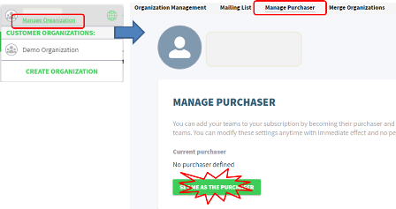

### 3.8. Активация подключение данных 

- [ ] Выберите машину "Conditioner_1"
- [ ] Перейдите в режим "Monitor"
- [ ] Выберите режим "Connect your machine"
- [ ] Выберите лицензию "Subscription"

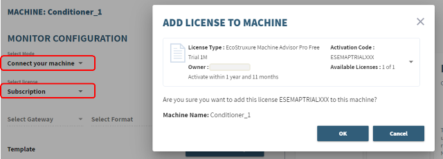

### 3.9. Настройка формата и источника подключения данных 

- [ ] На странице "Manage Dashboard" в настройках "Config" определите формат и источник обмена:
  - [ ] Gateway - `Custom`
  - [ ] формат обмена (Select format) - `Charlie`
  - [ ] протокол (Select Transport) - `HTTPs`

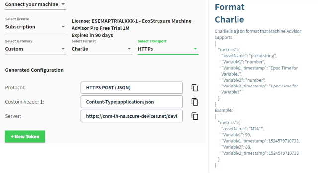

- [ ] на этой же странице найдите формат отображения Charlie

### 3.10. Создание Token 

Для защиты подключения создается секретный маркер (Token), который передается вместе с сообщением. Он создается на определенный период. Сообщение принимаются только при правильном Token. 

- [ ] На странице "Manage Dashboard" в настройках "Config" создайте маркер "New Token" и скопируйте его в текстовый файл для дальнейшего использования 

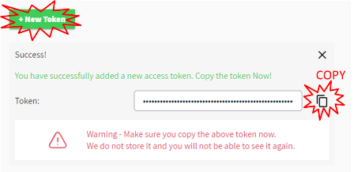

- [ ] нажмите крестик для закрытия окна отображения генерации маркера

### 3.11. Создание программы в Node-RED для отправки данных 

- [ ] В Node-RED создайте новый поток (вкладку)
- [ ] Создайте программу

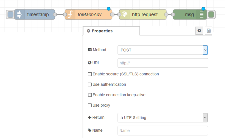

- [ ] Скопируйте указанный ниже код в функцию

```js
msg.url = "тут должен быть URL c настройки Server";
msg.headers = {
	"Content-Type": "application/json",
	"Authorization": "Authorization;SharedAccessSignature .. тут записвается выданный Вам маркер"
};
msg.headers.Authorization=msg.headers.Authorization.replace(/^.*SharedAccessSignature/,"SharedAccessSignature");

let RTDB = global.get ("RTDB");
let j=0;
//заполняем сообщения для каждого кондиционера в формате Charlie
for (const assetname in RTDB)
{
    //имя asset можно было бы взять с имени кондиционера, но оно очень долгое
    let assetname_s = "A" + (++j);
    let ob = {"metrics": {"assetName" : assetname_s}};
    let asset = RTDB[assetname];
    for (const tag in asset){
        ob.metrics[tag] = asset[tag].val;
        ob.metrics[tag + "_timestamp"] =asset[tag].ts;
    }
    msg.payload = ob;
    node.send (msg);
}
```

- [ ] замените в программе значение свойства `msg.url` на значение с поля Server

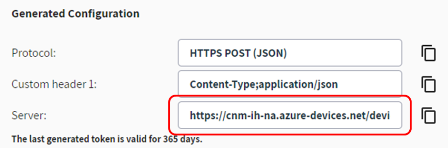

- [ ] замените в программе значение свойства "Authorization" на сохраненный ранее маркер 
- [ ] Сделайте разворачивание потока

### 3.12. Проверка отправки данных 

- [ ] Инициируйте поток для отправки данных
- [ ] проконтролируйте, что нет ошибок в окне отладки
- [ ] на платформе перейдите на вкладку Values и посмотрите полученные значения 

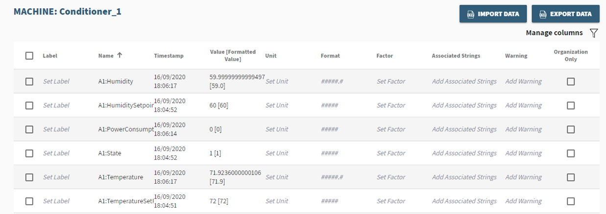

- [ ] для температур добавьте:
  - [ ] единицы измерения (Unit - °С),
  - [ ] формат `00.00` 
  - [ ] границы для Warning 
- [ ] измените программу в Node-RED так, чтобы сообщение отправлялось каждые 10 секунд
- [ ] На вкладках "Hystory" и "Graph" посмотрите как менялись значения переменных во времени 

### 3.13. Создание Dashboard 

- [ ] Нажмите "Managed Dashboard"
- [ ] Создайте Dashboard 
- [ ] Используя "Add Widget" разместите по одному виджету для каждого типа
- [ ] Настройте элементы как показано с следующих пунктах

#### 3.13.1. Value

- [ ] Настройте отображение всех значений

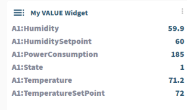

#### 3.13.2. GAUGE/Thermometer 

- [ ] Отобразите значение температуры, настройте границы для изменения цвета шкалы

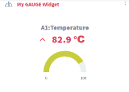

- [ ] С помощью OPC UA Client измените задание температуры `AirConditioner_1.TemperatureSetPoint` в такое значение, чтобы сработал Warning

#### 3.13.3. STATS

- [ ] Отобразите статистику по температуре за последний день 

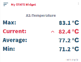

#### 3.13.4. DOUGHNUT/PROGRESSION BAR

- [ ] Отобразите 4-ре любые переменные

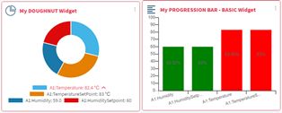

#### 3.13.5. PROGRESSION BAR - COMPARE

- [ ] Отобразите текущие и заданные температуры и влажности

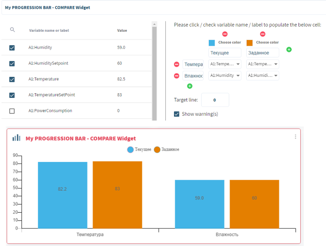

#### 3.13.6. Pareto  

- [ ] Отобразите текущие и заданные температуры и влажности

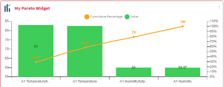

#### 3.13.7. TREND 

- [ ] Отобразите текущие значения температуры и влажности

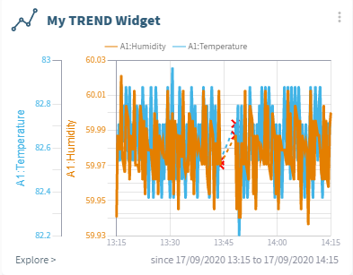

#### 3.13.8. LAST STATES

- [ ] Отобразите текущие значения влажности за последние сутки

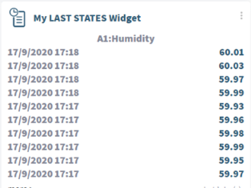

#### 3.13.9.  Traffic light 

- [ ] Отобразите текущие значения температуры 

#### 3.13.10. Text 

- [ ] Отобразите какой-то текст в формате Markdown

#### 3.13.11. Single Photo 

- [ ] Отобразите какой-то рисунок и выведите значение некоторых переменных 

### 3.14. Создание Application

Кроме отображения данных на приборных панелях, платформа предоставляет использовать приложения. Среди приложений, описанных в документации (вернее в FAQ) есть "Health Application", но оно не доступно в FREE подписке. Согласно документации, это приложение собирает данные для обучения, после чего анализирует данные реального времени, обнаруживает аномалии и сообщает об этом через почту или СМС. После чего пользователь может сделать анализ трендов и написать свой отзыв об аномалии. Для процесса обучения приложения нужно минимум две недели. 

Другие доступные приложения представлены калькуляционными, которые выполняют арифметические и статистические преобразования, и функции оповещения по электронной почте и SMS. 

- [ ] Перейдите на раздел "Application"
- [ ] Добавьте функцию Agregation с названием "Average" для нескольких переменных с функцией расчета среднего значения(Average)
- [ ] Значения будут доступны через сутки

### 3.15. Добавление пользователя в организацию разработчика

- [ ] Перейдите в `Manage Organization`
- [ ] Добавьте пользователя pupena_san@ukr.net 
- [ ] Попросите преподавателя чтобы он подтвердил приглашение

### 3.16. Подтверждение добавления пользователя в организацию разработчика

- [ ] После подтверждения запроса пользователя обновите страничку `Manage Organization`

Теперь новый пользователь может участвовать как разработчик

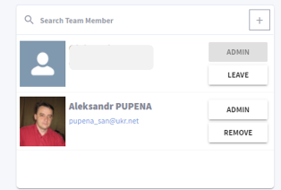

### 3.17. Добавления пользователя в организацию заказчика

- [ ] Удалите добавленного пользователя с разработки
- [ ] Перейдите на вкладку Customers и добавьте туда пользователя pupena_san@ukr.net 
- [ ] Попросите преподавателя чтобы он подтвердил приглашение
- [ ] После подтверждения запроса пользователя обновите страничку

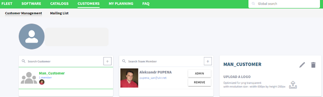

Теперь пользователь сможет только просматривать Dashboard

## 4. Работа с платформой Ubidots

https://ubidots.com/manufacturing/

Ограничение бесплатной лицензии описано [тут](https://help.ubidots.com/en/articles/639806-what-is-the-difference-between-ubidots-and-ubidots-stem)

### 4.1.Регистрация на платформе Ubidots

- [ ] Зайдите на сайт <https://ubidots.com/manufacturing/>
- [ ] Нажмите на "Start a Free Treal" или перейдите [по ссылке](https://industrial.ubidots.com/accounts/signup_industrial/) 
- [ ] Нажмите "Take Me To Ubidots Stem"
- [ ] Укажите регистрационные данные и "Sign Up Free".
- [ ] Помощник сделает демонстрационное устройство   

### 4.2.Просмотр демонстрационного устройства

- [ ] Зайдите в перечень устройств, там по умолчанию должно быть устройство "Demo", выберите его 

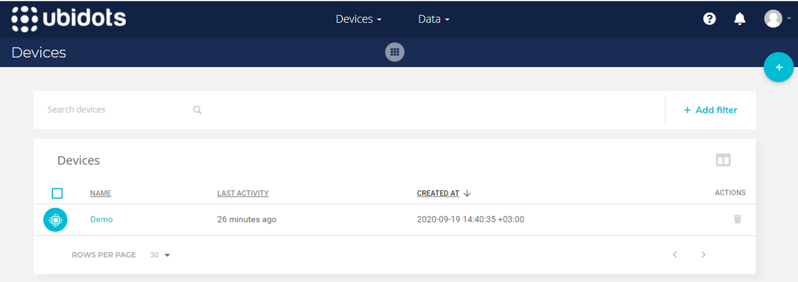

- [ ] Посмотрите какие настройки можно задать в устройстве:
  - [ ] описание (Description)
  - [ ] маркер доступа (Token)
  - [ ] теги (tags) для фильтрации
  - [ ] тип устройства (для платной лицензии)
  - [ ] размещение (Loaction): вручную или из переменной
  - [ ] определенные пользователем [свойства устройства](https://help.ubidots.com/en/articles/2132945-device-properties)

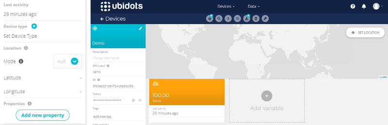

- [ ]  Нажмите на переменной "Demo", откройте для просмотра ее настройки
- [ ]  Посмотрите доступные свойства переменной и настройки просмотра 

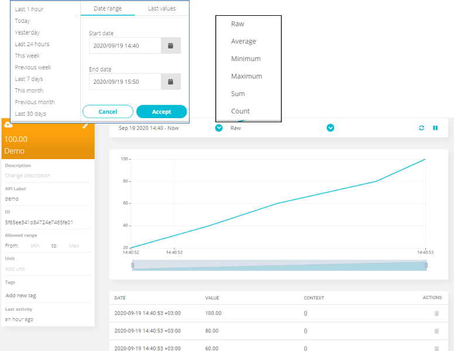

### 4.3.Просмотр демонстрационных Dashboard

- [ ] Используя меню "Data" зайдите в Dashboards

### 4.4.Создание и настройка нового устройства

- [ ] Зайдите в раздел "Devices"
- [ ] Нажмите "+" для создания нового устройства
- [ ] В предложенном списке типов выберите "Blank Devices"
- [ ] Дайте имя устройству "Conditioner_1"
- [ ] Укажите расположение соответствующее текущему вашому с помощью "set location"

### 4.5.Создание программы в Node-RED для отправки данных

- [ ] На локальном ПК запустите Node-RED, если он не запущен
- [ ] Установите библиотеку [ubidots-nodered](https://flows.nodered.org/node/ubidots-nodered) после чего перезапустите Node-RED
- [ ] Создайте поток (закладку) с именем "ubidots"
- [ ] Реализуйте в потоке приведенную ниже программу, обратите внимание на то, что в поле `Token` нужно вставить скопированный с одноименного поля в Devices. Обновление поставьте раз/минуту, при частом обновлении быстро закончится дневной лимит точек. Ограничение бесплатной лицензии описано [тут](https://help.ubidots.com/en/articles/639806-what-is-the-difference-between-ubidots-and-ubidots-stem)    

   

```js
let cond = global.get ("RTDB.ns=3;s=AirConditioner_1");
let ob = {};
//https://ubidots.com/docs/hw/#introduction
for (const tag in cond){
    ob[tag] = {
        "value":cond[tag].val,
        "timestamp":cond[tag].ts,
        "context": { "key1": "value1", "key2": "value2"}, 
        "created_at": cond[tag].ts
    };
}
msg.payload = ob;
return msg;  
```

- [ ] Сделайте разворачивание потока

### 4.6.Просмотр переменных на платформе 

- [ ] Перейдите на платформу, откройте устройство, обновите страничку, если она была открыта

Вы должны увидеть переменные в виде их текущих значений

- [ ] Используйте кнопку "Toggle View" для изменения формата отображения

 

- [ ] Выберите переменную температуры для ее детального анализа 


- [ ] Выставите свойства:
  - [ ] масштаба "Allowed range" (0-100)
  - [ ] единицы измерения (°С)
  - [ ] цвет (кликнуть по кисточке)
- [ ] Настройте цвета для остальных переменных  

### 4.7.Создание и настройка Dashboard 

- [ ] Перейдите в Dashboards
- [ ] В левом верхнем углу откройте меню и создайте новый Dashboard с именем "Conditioner1"

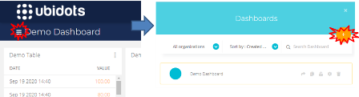

- [ ] Настройте чтобы на Dashboard отображались последние 10 минут информации

### 4.8.Добавление различных виджетов

- [ ] Самостоятельно добавте различные виджеты на  Dashboard с привязкой к разлчиным переменным. Обратите внимание, что некоторые виджеты требуют одной переменной, другие нескольких. Пока  добавляйте следующие виджеты:
  - [ ] HTML Canvas
  - [ ] Manual input
  - [ ] Slider
  - [ ] Switch


### 4.8.Добавление виджета HTML Canvas

- [ ] Добавьте виджета Canvas [по примеру Simple text with an Image](https://help.ubidots.com/en/articles/754634-html-canvas-widget-examples)

### 4.9.Модификация программы для изменения задания

- [ ] Добавьте фрагмент программы с подпиской на изменение задания по влажности и температуре


### 4.10.Добавление виджетов для изменения задания

- [ ] Добавьте виджет Manual Input и настройте его на изменение задания заданной и текущей температуры
- [ ] Измените с помощью этого виджета задания на температуру и влажность
- [ ] Проведите такую же операцию с виджетом "Slider"
- [ ] Используйте виджет "Switch" для формирования задания для 2-х уставок температуры, например 15 (ON) и 25 (OFF) градусов   

### 4.11.Генерирование события 

- [ ] Перейдите на страницу настройки событий Data->Events
- [ ] Нажмите "Create Event"
- [ ] Настройте событие на отправку почтового сообщения если температура превышает 60


- [ ] Установите задание на 65 градусов, после превышения 60 градусов должно прийти сообщение на указанную почту 

### 4.12.Создание доступа  

- [ ] Перейдите в настройки Dashboard и сгенерируйте ссылку для общего доступа


- [ ] Проверьте что ссылка открывается в другом браузере

https://thingsboard.io/ 