| [<- до лаборних робіт](README.md) | [на основну сторінку курсу](../README.md) |
| --------------------------------- | ----------------------------------------- |
|                                   |                                           |

# Лабораторна робота №4. Xмарні сервіси IIoT

У частині 1 лабораторної роботи 3 (Л.Р 3.1) в якості варіанту реалізації IIoT рішення пропонувалося використання хмарного застосунку Node-RED, який взаємодіяв з пристроєм Edge з використанням WEB Socket. Перевагами такої архітектури є відсутність потреби в спеціальних IoT сервісах, які, між іншим, як правило оплачуються по кількості використаного трафіку. Тим не менше, такий варіант має ряд недоліків, зокрема:

- з боку Edge та Cloud потребується програмування

- тільки програмовані (конфігуровані) пристрої IoT Edge мають можливість використання WEB Socket

- ·     інфраструктуру IoT необхідно реалізовувати самосітйно


Для побудови IoT та IIoT рішень на базі хмарних рішень IBM пропонує сервіс Watson IoT Platform. Платформа IBM Watson ™ IoT побудована на таких ключових засадах:

- Connect - підключення пристроїв і розроблених застосунків.


- Керування інформацією - зберігання, нормалізація, перетворення та перегляд даних з пристроїв та інтеграція платформи Watson IoT з іншими сервісами.


- Analytics – означення правил, які за даними реального часу пристрою можуть викликати сповіщення та дії.


- Керування ризиками - налаштування безпечного підключення та архітектури з контролем доступу для користувачів і застосунків.


Загальна архітектура рішення IoT на базі Watson IoT Platform матиме вигляд як на рис.1. 

                               

рис.1.

Передбачається, що кінцеві Edge пристрої або шлюзи (Gateway) взаємодіють з сервісами IoT Platform з використанням MQTT, хоч можливий і варіант взаємодії через REST API. Слід звернути увагу, що додаткового MQTT-брокеру не потрібно, по суті він реалізований в самому сервісі  IoT Platform. 

Сервіси аналітики та кінцеві за стосунки взаємодіють з IoT Platform з використанням REST API. Вони можуть бути як частиною інфраструктури IBM Cloud, так і застосунками чи сервісами інших платформ. Тим не менше, слід відмітити, що інтеграція багатьох сервісів IBM Cloud з IoT Platform досить просто налаштовується.      

У даній лабораторній роботі будуть використовуватися технології та рішення, які були досліджені в минулих лабораторних роботах. Основна ідея роботи – розробити цифрового двійника (digital twin) для привода насосу, що має в своєму складі перетворювач частоти Altivar (надалі **ПЧ**). Цифровий двійник на даному етапі повинен забезпечити наступні функції:

- ·     збір даних для аналізу стану приводу в реальному часі та формування повідомлень (пошта, SMS, месенжер) у випадку тривог; 


- накопичення даних про роботу приводу для подальшого аналізу; 


- доступ до даних про привід: документація, моделі і т.п. з можливістю доступу до них у необхідному місті, наприклад через WEB інтерфейс. 


В подальшому, розроблений двійник використовуватиметься для більш глибокої аналітики. 

Структура рішення, яке пропонується, показана на рис.2. Розглянемо його більш детально.

1. **IIoT Edge.**

На стороні процесу знаходиться сам привод з ПЧ, збір даних з якого відбувається по Modbus TCP/IP. Слід зазначити, що при невеликих змінах, можливий також варіант збору даних по Modbus RTU. Збір даних відбувається в IIoT Edge, функцію якого виконує Raspbery PI з використанням Node-RED. На етапах первинного налагодження, замість плати Raspbery PI може використовуватися ПК, а замість ПЧ – імітатор Modbus TCP Server, як це робилося в ЛР №1. 

Для керування ПЧ можна використати його вбудовані засоби, або ВЕБ-інтерфейс сумісно з Node-RED.

**Увага! В лабораторній роботі використовується засоби для керування ПЧ, які не рекомендується використовувати в реальних проектах! Це небезпечно і може привести до пошкодження технічних засобів, зашкодити здоров’ю або життю людини а також навколишньому середовищу! Це зроблено виключно в навчальних цілях! При реалізації рішень** **IIoT необхідно скрупульозно продумувати структуру з точки зору функціональної та інформаційної безпеки!**   

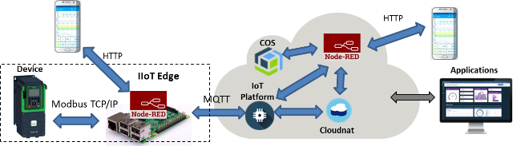 

рис.2.

Дані від IIoT Edge надходять до хмарних сервісів IoT Platform з використанням протоколу MQTT.

 

2. **IBM Cloud.**

Сервіс IoT Platform в даній лабораторній роботі забезпечує наступні функції:

- збір даних з IIoT Edge

- первинна обробка даних для Device Twin та Asset Twin 

- відправка даних та повідомлень іншим компонентам інфраструктури

- формування Device Twin та Asset Twin з усією необхідною інформацією для подальшої обробки, включаючи метадані;


Слід зазначити, що в даній лабораторній роботі використовується не усі можливості IBM Bluemix IoT Platform. 

Сервіс Cloudant слугує для збереження архівування зібраних даних з можливістю подальшого їх аналізу.

Сервіс COS слугує для збереження інформації про цифровий двійник, зокрема усіх необхідних файлів допомоги, інструкцій, моделей 

3. **Applications**

Застосунок Node-RED слугує для додаткової обробки та побудови усієї необхідної логіки взаємодії з користувачем через ВЕБ-інтерфейс. Кінцеві клієнтські застосунки в даній лабораторній роботі будуть представлені тільки звичайним Веб-браузером, який буде використовуватися для доступу до необхідної інформації в зручному вигляді. 

У першій частині лабораторної роботи проводяться роботи по побудові основних функцій збору даних з IIoT Edge їх перетворення та взаємодію з клієнтськими застосунками. Друга частина зосереджена на прикладі реалізації невеликого проекту, описаного вище з за діянням додаткових сервісів збереження даних та оповіщення.    

# Частина 1. Основи роботи з Watson IoT Platform

**Мета**: Навчитись робити з основними функціями IoT використовуючи хмарні сервіси на прикладі Watson IoT Platform. 

Цілі: 

1. створити та використати сервіс IBM Bluemix Internet of Things Platform
2. створити тестовий застосунок Edge для рішення IIoT

3. створити простий цифровий двійник активу (asset) в хмарі: тип та екземпляр віртуального пристрою для збору та обробки даних; налаштувати зв'язок локального активу та його хмарного двійника; 

Зовнішній вигляд інтерфейсу налаштування IBM Cloud постійно змінюється! Увага, набір наданих сервісів та політика ліцензування IBM Cloud може змінитися. У будь якому випадку, без використання угоди та реєстрації кредитної картки ніякі кошти за використання стягуватися не можуть.  

## 1. Створення та налаштування IoT Platform та цифрового двійника пристрою  

###### 1.1.  Створення екземпляру сервісу Internet of Things Platform 

Використовуючи консоль IBM Cloud зайдіть у свій обліковий запис IBM Cloud. Перейдіть на вкладку Catalog у списку Internet of Things виберіть Internet of Things Platform рис.3. 

 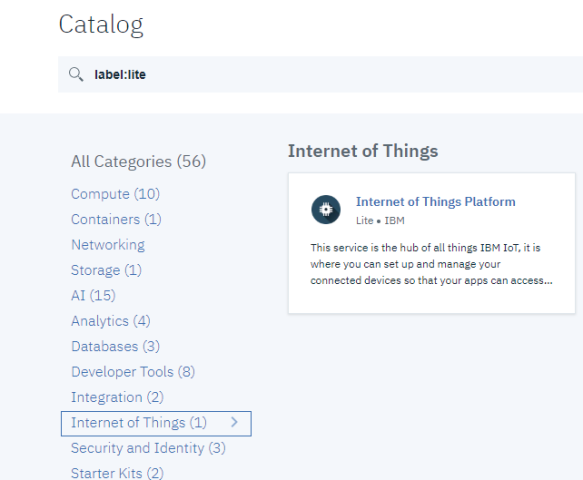

рис.3.

Змініть ім’я сервісу (за бажанням) і натисніть Create  (рис.4). 

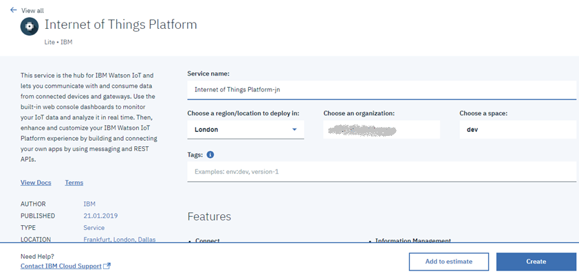

рис.4.

###### 1.2. Вхід та перегляд налаштувань сервісу IoT Platform 

При створенні автоматично відкриється вікно керування сервісом (рис.5). Якщо цього не відбулося, перейти в це вікно можна через Resource list. Натисніть **Launch** для запуску веб-консолі налаштування сервісу IoT Platform. 

 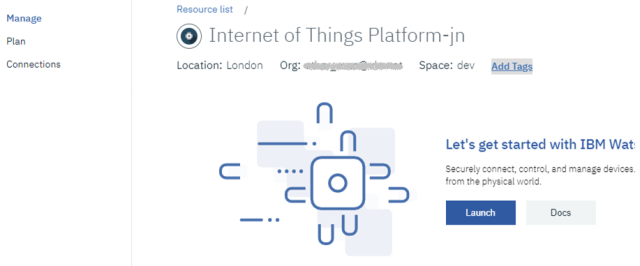

рис.5.

У консолі екземпляру IBM Watson IoT Platform можна перейти у всі вінка налаштування та керування екземпляром. У правому кутку консолі видно ім’я користувача та ідентифікатор **ORG ID**. Цей ідентифікатор необхідно буде вказувати при доступі до сервісів IoT Platform з інших сервісів та застосунків. Зверніть увагу, що ORG ID є також частиною URL сторінки, яка використовується для конфігурування. 

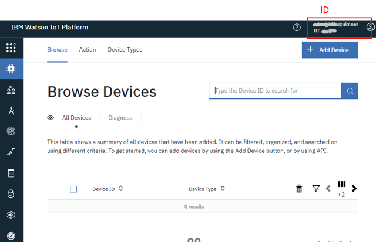 

рис.6.        

Ознайомтеся зі змістом усіх вкладок з бічної панелі. 

###### 1.3. Створення типу пристрою  

Кожен пристрій, підключений до платформи Watson IoT, повинен бути пов'язаний з типом пристрою. Типи пристроїв - це групи пристроїв, які мають спільні характеристики. 

Перейдіть на вкладку Device Types (рис.7) натисніть кнопку «Add Device Type» 

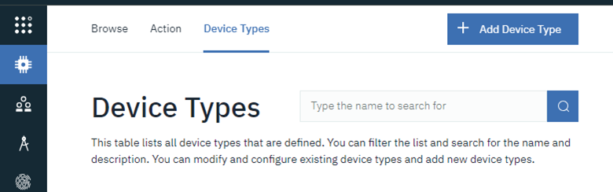  

рис.7.

У полі Name введіть ATV630, у полі Description опис пристрою, наприклад як це показано на рис.8 і натисніть Next.  

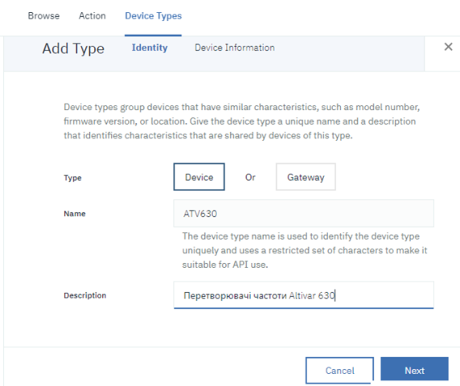 

рис.8.

У наступному вікні залиште усі поля порожніми (рис.9) натисніть кнопку Finish.

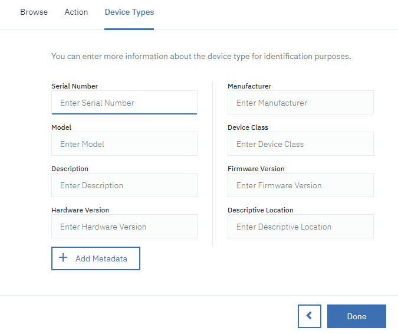 

рис.9.

Після створення типу, Вам запропонують зареєструвати пристрій та визначити інтерфейс, це буде зроблено пізніше. 

###### 1.4. Створення двійника пристрою   

Перейдіть на вкладку Browse і натисніть Add Device. 

 

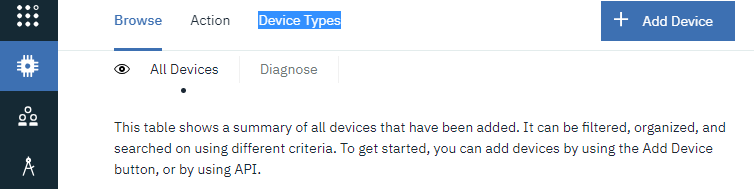 

рис.10.

У вікні Identity (рис.11) в поле Device Type вкажіть тип ATV630, який Ви щойно створили. У DeviceID  впишіть SIC101, який буде ідентифікувати даний привід (ПЧ + двигун + насос). Натисніть Next. 

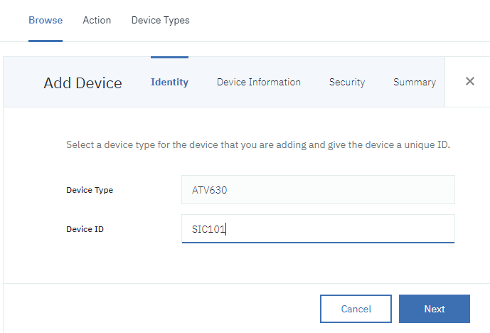 

рис.11.

У вікні Device Information (рис.12) залиште все без змін і натисніть Next.

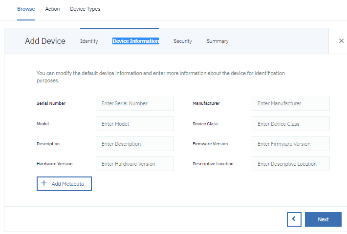 

рис.12.

У вікні Security (рис.13) пропонують ввести маркер автентифікації (Authentication Token), який потрібен пристроям для їх реєстрації в IoT Platform. Цей маркер буде гарантувати, що пристрій, який намагається підключитися до свого двійника в хмарі дійсно є тим, за кого себе видає. Якщо маркер не вказувати він сформується автоматично. 

Не вводьте значення маркеру і натисніть Next.  

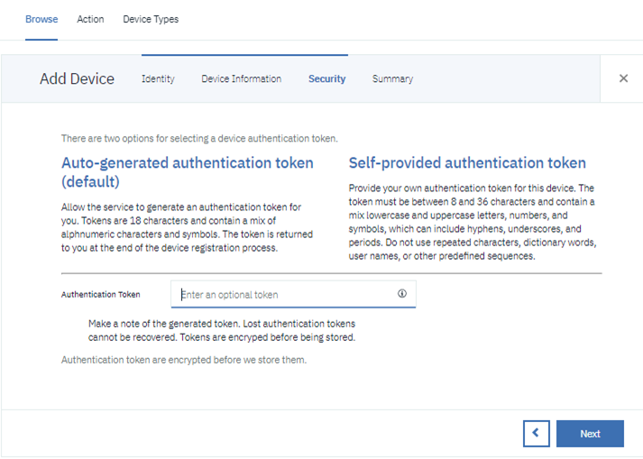 

рис.13.

У вікні Summary (рис.14) буде описано сумарну інформацію про створюваний пристрій. Натисніть Finish. 

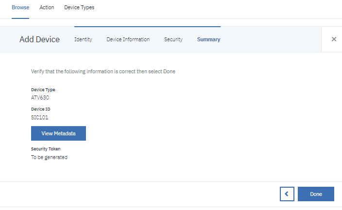 

рис.14.

Пристрій створено, у вікні що з’явиться (рис.15) буде показана вся інформація в тому числі і маркер авторизації. **Увага! Скопіюйте цей** **Authentication Token в буфер обміну і про всяк випадок вставте в блокнот та збережіть! Після закриття цього вікна маркер більше не буде доступний для перегляду, оскільки він шифрується.**  

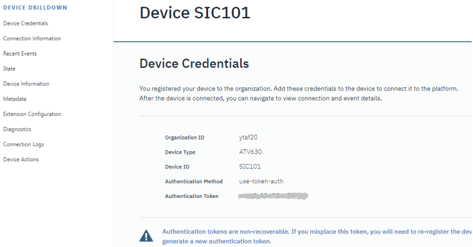 

рис.15. 

Маркер можна залишити у якихось властивостях пристрою, наприклад в Description. Такий підхід не рекомендується використовувати в реальних застосуваннях, так як маркер буде доступний усім застосункам, що матимуть доступ до двійника пристрою! Однак для лабораторної роботи це досить зручно, тому що інформація про маркер завжди під рукою ;-) . 

Не закриваючи це вікно, перейдіть на розділ Device Information (рис.16) і натисніть кнопку Edit Device Information. 

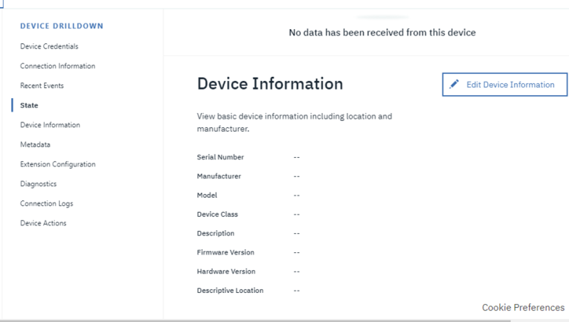 

рис.16. 

Скопіюйте маркер в поле Description, перед ним для розуміння призначення поля можна написати «Token: ». Натисніть Save.

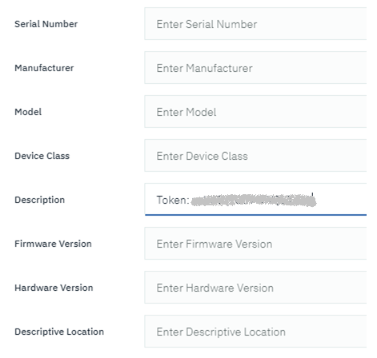

рис.17.

Вітаємо! Цифровий двійник пристрою створено! Пізніше в лабораторній роботі будуть змінюватися деякі налаштування як пристрою так і типу.

## 2. Створення та зв’язок Edge на базі Node-RED зі своїм цифровим двійником 

###### 2.1. Встановлення бібліотеки  Node-RED Watson IoT Device/Gateway

Запустіть на виконання на локальному ПК Node-RED.

Використовуючи Manage Palette встановіть бібліотеку node-red-contrib-ibm-watson-iot

###### 2.2. Налаштування та перевірка роботи  «wiotp out» на тестовому сервері

Створіть новий потік (flow) з назвою «Edge».

Ознайомтеся з роботою вузлів Watson IoT Device/Gateway в [довіднику Node-RED](https://drive.google.com/open?id=1tbhv1j-tiUGpIlAO4kWlInCRXJh0ZIqf).  

Створіть фрагмент програми, показаний на рис.18, використовуючи вузол wiotp out а також вузли «timestamp» та «sml» що були використані в п.4.4 [лабораторної роботи 3.1](https://drive.google.com/open?id=1ao03R5qOlClvLWsiVNn4jjh44yBXYo2t) (див. рис.21.а). Зробіть розгортання проекту.

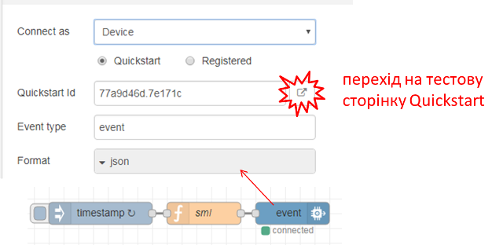 

рис.18.

Використовуючи кнопку переходу (див. рис.18) перейдіть на тестову сторінку. На сторінці можна подивитися значення будь якого поля повідомлення події (див. рис.19), а також тренд, вибравши необхідне поле зі списку. 

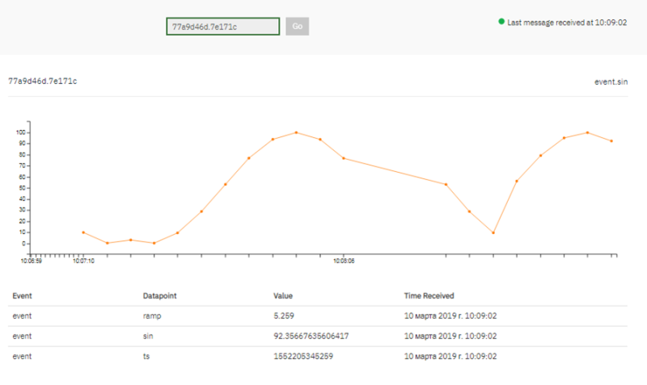 

рис.19.

###### 2.3. Створення зв’язку «wiotp out» з цифровим двійником

Доповніть програму потоку фрагментом, показаним на рис.20. При цьому створіть новий Credentionals з іменем SIC101, в якому в полі Organization вкажіть ORG ID, в Auth Token – маркер, який при створенні двійника пристрою необхідно було скопіювати і записати. 

Зробіть розгортання проекту.    

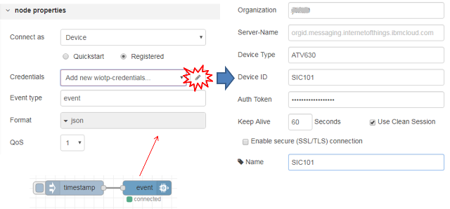 

рис.20.

Перейдіть у вікно консолі цифрового двійника в хмарі, перегляньте вікно «Logs»: у ньому повинен відобразитися час підключення. Зелений індикатор зліва показує стан «підключено».    

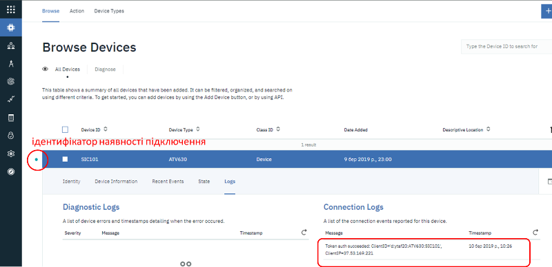 

рис.21.

 

Зробіть деактивацію потоку (Status = Disabled). Перейдіть на вікно консолі цифрового двійника: зелений індикатор повинен зникнути, в записі Connection Logs повинно з’явитися повідомлення про закриття з’єднання. Якщо запис не з’являється натисніть кнопку оновлення. 

Знову зробіть активацію потоку.  

###### 2.4. Передача події цифровому двійнику . 

Ініціюйте передачу повідомлення. Перейдіть у вікно консолі цифрового двійника в хмарі, перегляньте вікно «State» у ньому повинно відобразитися останнє повідомлення. Зверніть увагу на структуру повідомлення, вона означена [правилами MQTT connectivity for devices](https://console.bluemix.net/docs/services/IoT/devices/mqtt.html#message-format). Корисне навантаження передається у вигляді об’єкту з іменем “d”. Тип події передається як “event”, оскільки це прописано у вузлі «wiotp out».

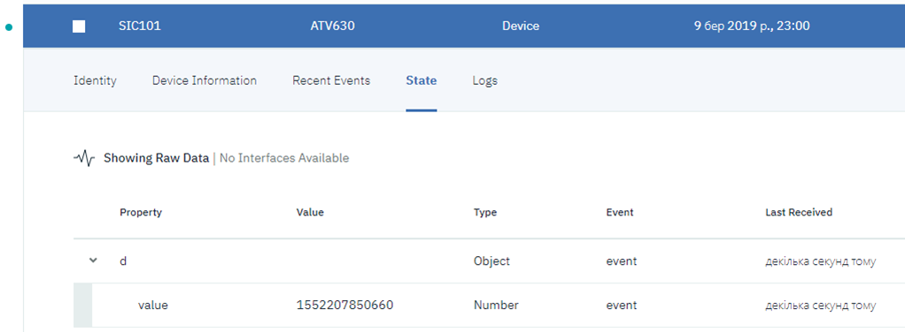 

рис.22.

## 3. Створення та використання простого інтерфейсу цифрового двійника  

Сервіс Watson IoT Platform надає вбудовані можливості по перетворенню «сирих» даних, отриманих від пристроїв в оброблені дані, які сприймаються застосунками та іншими сервісами. Цей процес дещо подібний до перетворенню даних, яке відбувається в SCADA-програмах. Крім того, процес перетворення дає можливість універсалізувати інтерфейс застосунків до пристроїв. Наприклад, прилад із датчиком температури може передавати значення в різних одиницях та діапазонах, однак клієнтським застосункам потрібно передавати вже реальні значення в конкретних одиницях. Для цього, Watson IoT Platform дає можливість трансформувати та нормалізувати зібрані дані для створення єдиної логічної моделі, щоб застосунок міг взаємодіяти з різними пристроями однаково. 

Детально про організацію двійників в можна прочитати за [цим посиланням](https://console.bluemix.net/docs/services/IoT/GA_information_management/ga_im_device_twin.html#device_twins). Тут зупинимося на основних принципах організації.

Компонент керування даними платформи Watson IoT включає функції «device twin» та «asset twin». Функція **device twin** (**двійник пристрою**) дозволяє скористатися перевагами збору, перетворення та нормалізації різних форматів даних пристрою в єдину логічну модель. Функція **asset twin** (**двійник активу**) дозволяє групувати різні пристрої, щоб створити **Thing (річ)**, що є структурою даних більш високого рівня. Речі можна також об’єднувати в річ ще вищого рівня. Клієнтський застосунок може взаємодіяти з логічною моделлю незалежно від формату даних, який використовується окремими пристроями чи речами. 

Наприклад, група пристроїв, що передають значення про температуру, вологість та степінь освітлення, може бути об'єднана в річ "офіс", щоб відобразити рівень комфорту в конкретному офісі. Ряд "офісних" речей можна об'єднати в "поверх", щоб представляти всі офіси на певному поверсі, а також кілька "поверхів". Ці речі можуть бути об'єднані в річ "будівля" і т.д. Використовуючи абстракцію Thing, застосунок відокремлюється від специфіки підключення пристроїв, від формату, в якому пристрої публікують дані про події та від способу об'єднання даних.

**Device twin (двійник пристрою)** - це хмарне цифрове представлення фізичного пристрою, підключеного до Watson IoT Platform. Двійник пристрою є логічною моделлю подій, які публікуються пристроєм і на пристрій. Після створення двійника пристрою, зв'язок з ним доступний для інших застосунків, незалежно від того, в якому він зараз режимі - онлайн чи офлайн. Властивості пристрою, включаючи інформацію про поточний стан пристрою (device state), можна отримати за допомогою запиту HTTP або підписавшись на тему по MQTT.

Близнюки пристроїв дають можливість:

- Надати розробникам застосунків узгоджені інтерфейси, щоб отримати доступ до подієво-керованих пристроєм даних, наприклад через REST.

- Доступ до стану пристрою.

- Нормалізувати дані з пристроїв різних марок або моделей, які публікують дані в різних форматах.

- Фільтрувати непотрібні дані.


Щоб створити близнюка пристрою, потрібно означити наступні ресурси в платформі Watson IoT:

- Структуру подій, які надсилаються пристроєм. Структура вхідної події означується у фізичному інтерфейсі, типі події та ресурсах схеми подій.

- Властивості, які потрібно записати. Ці властивості означують логічну структуру стану пристрою, яка може бути спожита застосунками. Властивості означуються в логічному інтерфейсі і ресурсах логічної схеми

- відображення подій фізичного інтерфейсу на властивості логічного інтерфейсу. Для відображення подій у властивості використовується «mappings resource» 


Наступна діаграма показує два різних температурних пристрої (Temperature Devices) в окремих місцях. Один пристрій повідомляє дані в градусах Цельсія, а інший - у градусах за Фаренгейтом. Дані надсилаються на платформу Watson IoT у форматах "t" і "temp". Платформа Watson IoT автоматично перетворює градуси Фаренгейта в градуси Цельсія. Формати температури "t" і "temp" нормалізуються в логічному форматі "temperature". Застосунок може запитувати стан будь-якого пристрою, звертаючись до значення параметра " temperature" або підписавшись на нього по MQTT.

 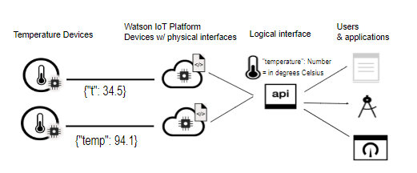 

рис.23.

Для реалізації такої схеми, в хмарному сервісі створюються два типи пристроїв: TSensor та  TempSensor, для яких вказується свій фізичний інтерфейс (рис.24). **Фізичний інтерфейс** (**Physical interface**) використовується для моделювання інтерфейсу між фізичним пристроєм і платформою Watson IoT. З фізичним інтерфейсом можуть бути пов'язані кілька типів подій. **Події** (**events**) - це механізм, за допомогою якого пристрої публікують дані на платформу Watson IoT. Пристрій керує вмістом подій і призначає ім'я для кожної події, яку він відправляє. Кожна подія містить **властивості** (**Property**) - дані, що несуть частину корисного навантаження. Так, наприклад, пристрій tSensor вміщує властивість “t” (див.рис.24). Подія публікується пристроєм, використовуючи ресурс типу події (**event** **type resource**). Тип події повинен посилатися на ресурс схеми подій (**event schema resource**). Ресурс схеми означує структуру опублікованої події.

 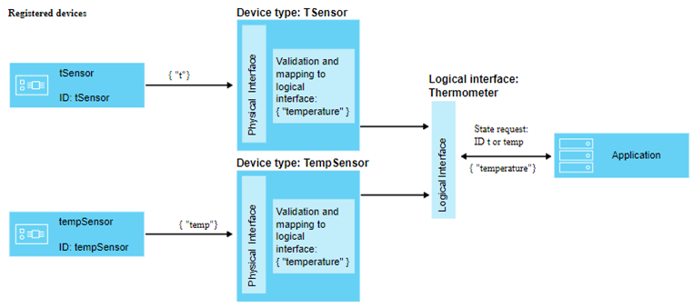

рис.24.

Останнє представлення стану фізичного пристрою, яке може включати в себе всі властивості, які були зіставлені з різних вхідних подій записується в **State** пристрою. **Логічний інтерфейс** (**Logical interface**) - програмна конструкція, до якої можуть підключитися або підписатися застосунки, щоб побачити стан пристрою. Логічний інтерфейс використовується для означення нормалізованого перегляду Стану пристрою в платформі Watson IoT. Логічний інтерфейс повинен бути пов'язаний зі схемою логічного інтерфейсу. Стан оновлюється у відповідь на вхідні події пристрою.  

**Asset twins** (Двійники активів) дозволяють розвити концепцію близнюків пристрою ще на один рівень вище. Двійник активу дозволяє агрегувати (об’єднувати) пристрої в єдине ціле, яке називається **Thing** (**Річ**). Річ, або двійник активу, є подібною концепцією до двійника пристрою, який об’єднує в єдине ціле групу пристроїв як єдину логічну модель. Можна агрегувати також Речі, щоб сформувати більш високі рівні абстракції. Наприклад, річ "Номер" може об'єднати такі пристрої:

- Пристрій з датчиком температури (термометр)

- Пристрій з датчиком вологості (гігрометр)


"Поверх" може об'єднати кілька "номерів". 

Структура Речі означується за допомогою JSON-схеми. Схема посилається на логічні інтерфейси агрегованих пристроїв тобто Речей. Властивості Речі, включаючи інформацію про її поточний стан, можна отримати за допомогою HTTP-запиту або підписавшись на тему MQTT.

Двійники активів дають можливість:

- Агрегувати декількох двійників Пристроїв або Речей для означення нових Речей.

- Доступ до стану Речі.

- Керувати активами в цілому, не піддаючись до керування їх конкретними складовими.

- Фільтрувати непотрібні дані.

- Нормалізувати інтерфейси Речі, щоб відділити застосунки від складності та деталізації того, як створені конкретні Речі. 


Щоб створити близнюка активу, потрібно означити такі ресурси в платформі Watson IoT:

- Структуру Речі. Структура Речі означується схемою Речі (Thing schema), яка означує агреговані пристрої або речі.

- Структуру бажаного стану Речі, яка складається з властивостей, які потрібно записати. Ці властивості означують логічну структуру стану Речі, яка може бути використана застосунками. Властивості означуються в логічному інтерфейсі і ресурсах логічної схеми.

- Відображення властивостей логічного інтерфейсу. Для відображення подій у властивості використовується «mappings resource» 


Наступна діаграма показує приклад, в якому датчики температури та вологості на різних пристроях публікують дані про температуру та вологість до платформи Watson IoT Platform. Два близнюки пристроїв, кожен з яких представляє фізичний пристрій, мають пов'язані логічні інтерфейси і створені в платформі Watson IoT. Дані, що публікуються з температурного пристрою відображаються в логічний інтерфейс "IThermometer". Дані, опубліковані з пристрою вологості, відображаються в логічний інтерфейс "IHygrometer". Логічні інтерфейси агрегуються у тип Речі «кімната» з логічним інтерфейсом "IRoom". Логічний інтерфейс "IRoom" означує властивості температури і вологості і дозволяє створювати власну логічну модель, агрегуючи пристрої в одну Річ, з якою може взаємодіяти застосунок.

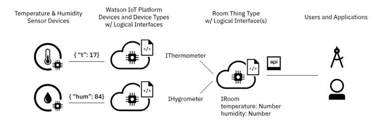 

рис.25.

На рис.26 показане логічне відображення між пристроями та застосунками на платформі Watson IoT при використанні логічних та фізичних інтерфейсів.

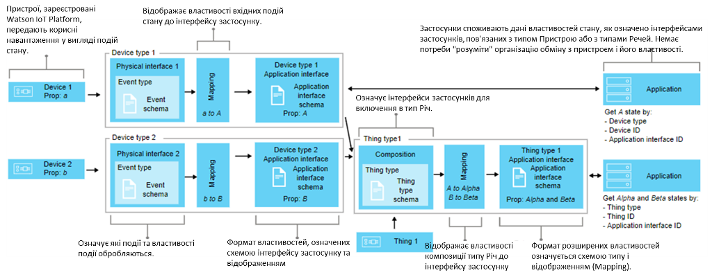 

рис.26. 

У даному пункті лабораторної роботи необхідно створити та використати простий інтерфейс, який не робить ніяких перетворень і відповідає як за фізичний так і за логічний бік представлення пристрою. У наступному пункті використовуватимуться два типи інтерфейсів – фізичний та логічний. 

###### 3.1. Створення в Node-RED структури даних пристрою та їх імітації  

Згідно поставленої на початку задачі, в хмару до двійника пристрою необхідно передавати вимірювальні параметри привода. У таблиці 1. наведені змінні, які потрібні для контролю стану двійника та їх адреси по Modbus TCP/IP для ПЧ ATV630. 

Таб.1. Змінні, що зчитуються з перетворювача частоти.

| **Назва властивості** | **ADR**  **Modbus** | **Призначення**                                   | **Примітка**                |
| --------------------- | ------------------- | ------------------------------------------------- | --------------------------- |
| STA                   | 3201                | статус                                            | див. автомат стану (рис.39) |
| RFR                   | 3202                | плинна частота, в 0.1 Гц                          |                             |
| I                     | 3204                | струм, в 0.1 А                                    |                             |
| M                     | 3205                | номінальний момент на двигуні, в  0.001 Н*м       |                             |
| U                     | 3208                | напруга, В                                        |                             |
| P                     | 3211                | потужність, %                                     |                             |
| TOTDRIVE              | 3244                | час роботи привода                                |                             |
| TOTMOTOR              | 3246                | час роботи двигуна                                |                             |
| ALMTIME               | 3235                | час тривоги                                       |                             |
| ACTPWR                | 3293                | Оціночна потужність активної  електричної енергії |                             |
| CMD                   | 8501                | слово команди                                     | запис                       |
| REF                   | 8502                | задана частота в 0.1 Гц                           | запис                       |

​        Для можливості відлагодження застосунку, спочатку необхідно створити імітаційну програму з боку Edge. Для цього в локальному Node-RED необхідно зробити Веб-інтерфейс для зміни значень полів. 

​        Добавте нову закладку на UI інтерфейс Node-RED з назвою “ATV SIM” в яку добавте групу з назвою «ATV».

Добавте фрагмент програми для реалізації імітації зміни значень полів ATV з UI, який показаний на рис.27. Зробіть розгортання, відкрийте графічний інтерфейс користувача і встановіть значення усіх змінних. У вікні налагодження повинні з’явитися усі поля з відповідними значеннями (див. рис.27).   

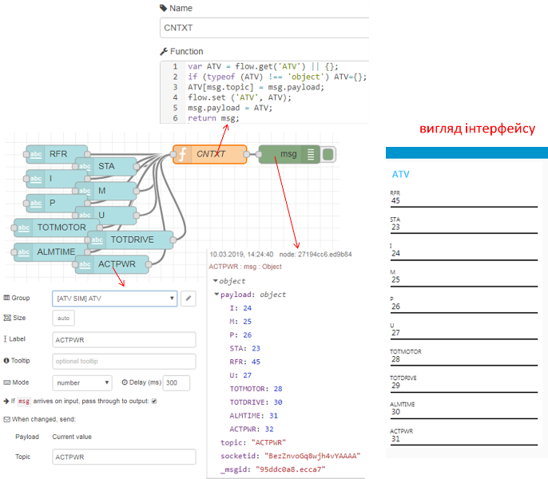 

рис.27.

Ідея наведеного фрагменту полягає в тому, щоб зберігати значення параметрів у змінній контексту потоку, який пізніше можна буде у будь який момент часу зчитати для відправки. 

###### 3.2. Передача даних пристрою до платформи Watson IoT 

​        При певній події необхідно передати збережені в контексту потоку дані ATV до хмари. Назвемо цю подію «STA_change» і вона в майбутньому буде ініціюватися при зміні значення стану. Зараз поки ініціювання передачі буде проводитися вручну. Модифікуйте фрагмент програми, що відправляла дані в хмару (див. п.2.3), як це показано на рис.28.

​          Зробіть розгортання проекту. Зробіть ініціювання відправки даних.

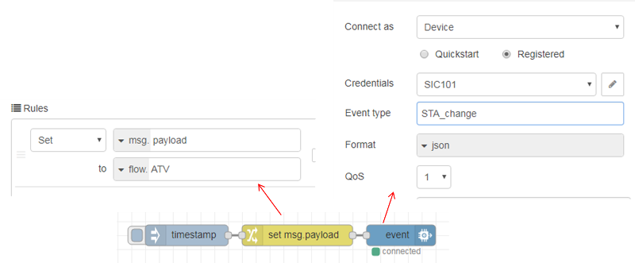 

рис.28.

​        Перейдіть у вікно консолі цифрового двійника в хмарі, у вікні «State» повинно відобразитися останнє повідомлення.  

###### 3.3. Створення простого фізичного інтерфейсу. 

Перейдіть у вікно консолі IBM Watson IoT Platform. Перейдіть в закладку  Device Types, виберіть тип ATV630 і на закладці Interface -> Simple flow натисніть кнопку «Create Physical Interface» (рис.29)  

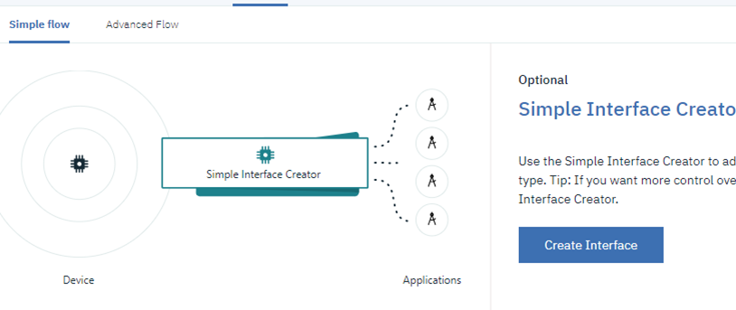 

рис.29.       

На вкладці Interface натисніть Add Property (рис.30).

 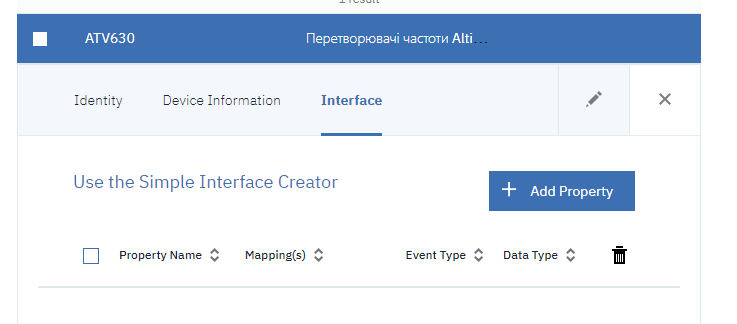

рис.30.

Повинно з’явитися вікно з останнім повідомленням (рис.31), яке необхідно вибрати (виставити опцію). Якщо повідомлення не з’являться, зробіть повторну відправку повідомлень. Після вибору натисніть “Next”. Зверніть увагу, що повідомлення повинно бути комплектним (усі значення не порожні) інакше невикористані поля не будуть враховані.

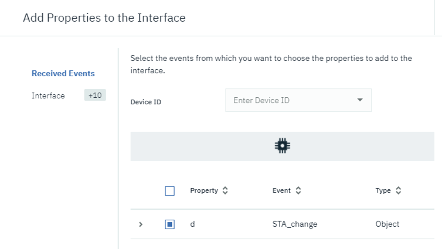 

рис.31.

У вікні добавлення властивостей (рис.32) можна змінити поля повідомлення за необхідністю. Натисніть Add для добавлення властивості до фізичного інтерфейсу.       

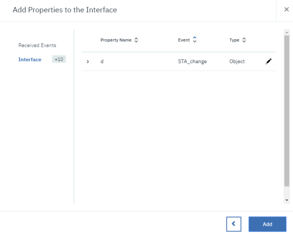 

рис.32.

Після завершення добавлення властивостей до інтерфейсу натисніть Done (рис.36)

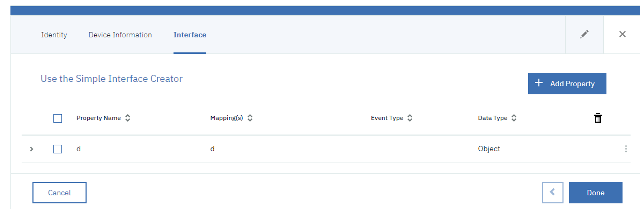 

рис.33.

На даному кроці ми створили простий фізичний інтерфейс, що повністю ідентичний логічному інтеррфейсу.  

###### 3.4. Створення точки доступу API для застосунків 

Для доступу застосунків до IoT необхідно створити API key. 

У вікні консолі IBM Watson IoT Platform перейдіть на вкладку API Keys (рис.34), і натисніть кнопку Generate API Key.

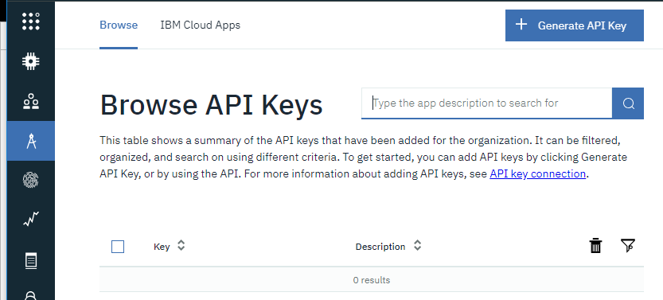  . 

рис.34. 

У наступному вікні заповніть поле Desription і натисніть Next. 

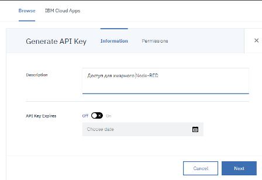 

рис.35.

У наступному вікні у дозволах (рис.36) виберіть Standard Application і натисніть «Generate Key».

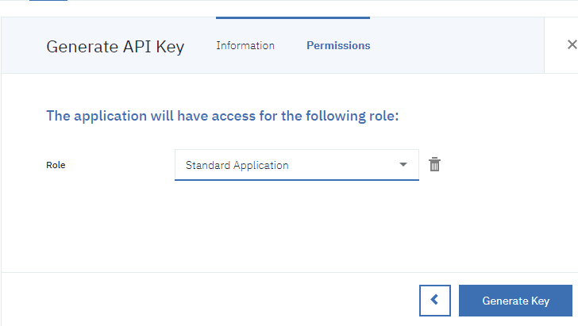 

рис.36

Після генерування ключу доступу, у вікні що з’явилося (рис.37) скопіюйте маркер (Authentication Token) в текстовий файл, бо він не буде пізніше відображатися. Як варіант, можете його зберегти в описі ключа (Description). 

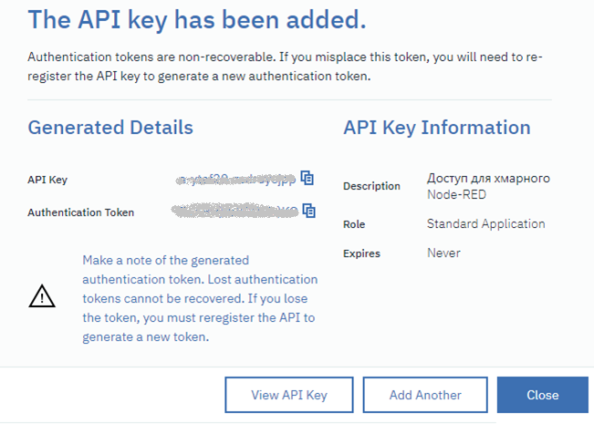 

рис.37

Ознайомтеся з роботою вузлів IBM IoT APP в [довіднику Node-RED](https://drive.google.com/open?id=1tbhv1j-tiUGpIlAO4kWlInCRXJh0ZIqf). 

###### 3.5. Використання вузлів IBM IoT APP для доступу в хмарному застосунку Node-RED 

- Перейдіть в хмарний застосунок Node-RED. 

- Деактивуйте усі створені до цього потоки.

- Створіть новий потік з назвою «IoT APP».

- Ознайомтеся з роботою вузлів IBM IoT APP в [довіднику Node-RED](https://drive.google.com/open?id=1tbhv1j-tiUGpIlAO4kWlInCRXJh0ZIqf). 


- Реалізуйте фрагмент програми показаний на рис.38. В API Key та API Token впишіть відповідні значення зі створеної точки доступу API. Зробіть розгортання проекту. Під вузлом IBM IoT повинен з’явитися зелений кружечок з написом «Connected»


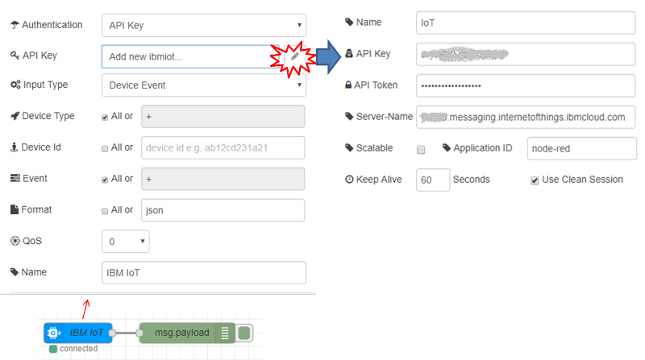 

рис.38

- Ініціюйте в локальному Node-RED (з боку Edge) відправку даних в хмару. За допомогою вікна відлагодження подивіться що повідомлення дійсно прийшло до Застосунку. 

- Зробіть копію екрану.  

- Змініть у вузлі IBM IoT тип Input Type на  “Device Status”. Зробіть розгортання проекту. 

- На локальному Node-RED (з боку Edge) деактивуйте потік «Edge». У вікні відлагодження повинно з’явитися повідомлення «Disconnect». Повторно активуйте потік «Edge» у локальному Node-RED. 


**Увага, кожного разу перед завершенням роботи рекомендується деактивовувати потоки хмарного** **Node-RED, що використовують** **IoT, інакше хмарний застосунок буде використовувати лімітований трафік!**  

## 4. Створення та використання логічного інтерфейсу цифрового двійника  

Розроблений простий інтерфейс не забезпечує ніякого перетворення, а тільки організовує доступ застосунків до пристроїв IoT. Для додаткових перетворень, що були описані у вступній частині, необхідно створити логічний інтерфейс, та описати схеми перетворень. Це необхідно робити в розширеному режимі.

Для початку означимо призначення логічного інтерфейсу. Деякі перетворення опишемо тут, інші буде зроблено пізніше. По перше, необхідно робити перетворення (масштабування) величин. Зокрема (див таб.1 з п.3.1) величини: 

- •             плинна частота в 0.1 Гц

- струм 0.1 А

- номінальний момент на двигуні, 0.001


По друге, слово статусу STA може за значенням відрізнятися для різних ПЧ. У будь якому випадку в застосунках кінцевих користувачів цікавить тільки кілька станів: операційний/неопераційний, аварія. По факту, для ПЧ Altivar, що керуються по профілю CIA402, станів набагато більше. На рис.39 показаний автомат стану, де ETA (те саме, що STA) може бути в багатьох станах, тому необхідно реалізувати перетворення ETA (STA) в якусь властивість логічного інтерфейсу «State», який би показував стан як Operational (TRUE) і Not Operational(FALSE), а також властивість «Fault», яка б показувала чи є помилка (при TRUE).  Для зручності деталізованого відображення STA можна передавати його як STRING, з означенням плинного стану, відповідно до автомату станів на рис.39.   

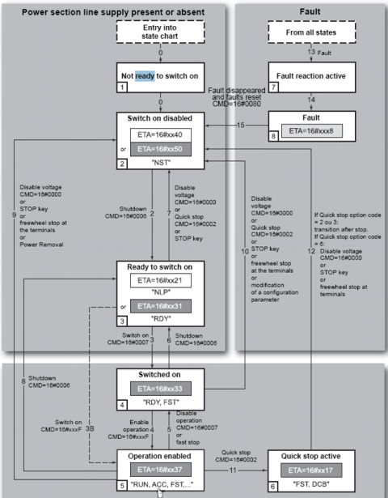  

рис.39

###### 4.1. Розділення простого інтерфейсу на фізичний і логічний інтерфейси 

Використовуючи консоль IBM Cloud зайдіть в означення Device Types, далі в панель налаштування типу ATV630. Виберіть вкладку «Interface» і натисніть вкладку «редагувати» (рис.40).  

 

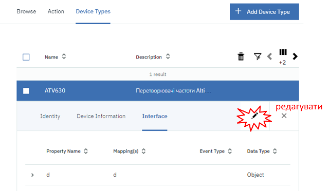  

 рис.40 

Після цього перейдіть в розширений режим налаштування через команду «Use Advanced Interface Creator». 

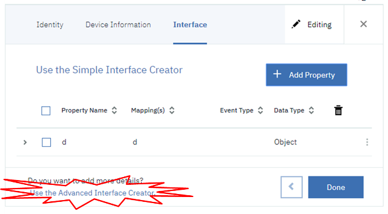 

 рис.41

У розширеному режимі можна редагувати окремо логічні і фізичні інтерфейси. При переході в розширений режим, єдиний простий інтерфейс розділиться на 2 – фізичний та логічний. Тому для початку в розширеному режимі необхідно зробити Активацію вже існуючих створених інтерфейсів, які пов’язані між собою, за допомогою кнопки Activate (рис.42)

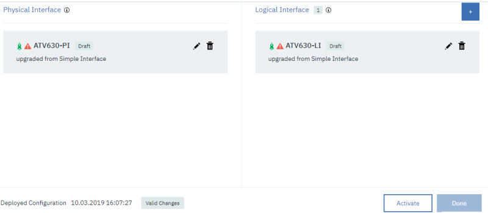 

 рис.42

У випадаючому вікні підтверджуємо кнопкою «Deploy».

###### 4.2. Редагування логічного інтерфейсу в простому редакторі 

У вікні, що з’явилося необхідно перейти до редагування логічного інтерфейсу (рис.43)

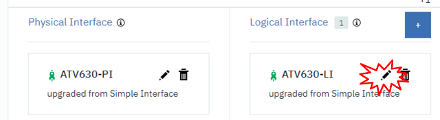 

рис.43

У вікні Identity натисніть (рис.44) Next.

 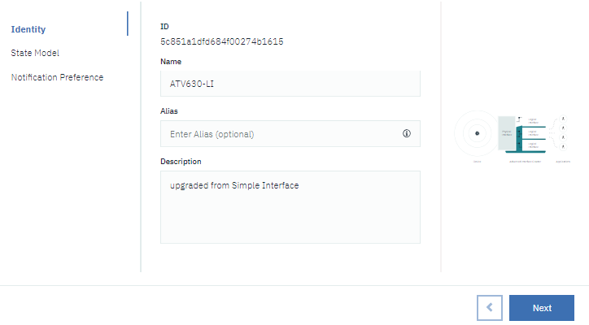

 рис.44

Відкрийте структуру об’єкту “d”, щоб можна було доступитися до вікна налаштування властивостей. Перейдіть до редагування властивості «I» (рис.45) 

 

 рис.45

У вікні редагування властивості, видно що вона просто копіює значення з фізичного інтерфейсу. Перейдіть у режим редагування властивості.  

 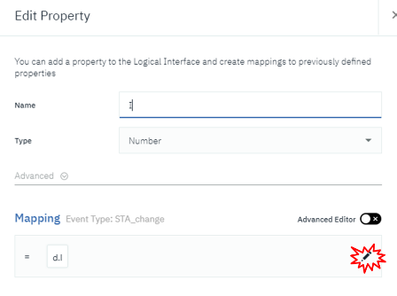

 рис.46

Дане значення властивості (струму) треба просто перемножити на 0.1, оскільки саме в цих одиницях воно передається з пристрою Edge, тому відповідно і у фізичному інтерфейсі. Використовуючи кнопки «X» та «Value» запишіть формулу, як це показано на рис.47, після чого натисніть опцію підтвердження і кнопку “Save”.

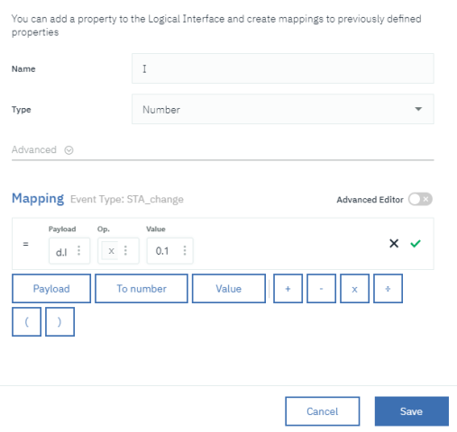 

 рис.47

Аналогічні дії зробіть для 

- плинна частота, в 0.1 Гц

- номінальний момент на двигуні, в 0.001 Н*м


Після усіх дій натисніть “Next” (рис.48)

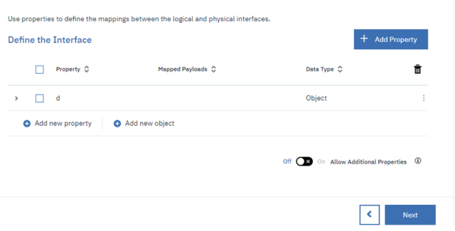 

 рис.48 

У наступному вікні виберіть події, які будуть повідомлятися підписувачам (рис.49) і натисніть «Done». Дочекайтеся коли завершиться процес оновлення інтерфейсу (це може зайняти кілька секунд) і зробіть активацію інтерфейсів кнопкою Active. 

 

 рис.49

###### 4.3. Перевірка роботи логічного інтерфейсу 

Модифікуйте програму в хмарному застосунку, змінивши у вузлі IBM IoT поле «Input Type» рівним “Device State Event”. Активуйте передачу даних з Edge в хмару, у вікні відладки хмарного застосунку подивіться, які значення прийшли в застосунок через логічний інтерфейс, вони повинні бути відмасштабовані. 

###### 4.4. Редагування властивості STA логічного інтерфейсу з використанням розширеного редакторку  

Для редагування простих перетворень, в якому приймають участь арифметичні операції достатньо використовувати стандартний редактор. Тим не менше платформа IoT дозволяє використовувати в логічному інтерфейсі досить складні перетворення з використанням JSONata.  JSONata описана в [доіднику по Node-RED](https://drive.google.com/open?id=1tbhv1j-tiUGpIlAO4kWlInCRXJh0ZIqf).  Правила використання JSONata в описі перетворень для платформи IBM IoT описані за [наступним посиланням](https://console.bluemix.net/docs/services/IoT/GA_information_management/mapping_expression_language.html#mapping_expression). 

У випадку даної задачі, необхідно створити дві властивості «State» (String) і «Fault» (Boolean) 

Перейдіть в редагування логічного інтерфейсу. На вікну етапу «State Model» переведіть властивість STA в режим редагування. Переведіть редактор в Advanced Editor та змініть формулу як це показано на рис.50. Нижче наведений текст формули:

```yaml
(($event.d.STA % 65280 = 64) ? "Заборона запуску" : "" ) & (($event.d.STA % 65280 = 80) ? "Заборона запуску" : "" ) & (($event.d.STA % 65520 = 8) ? "Помилка" : "" ) & (($event.d.STA % 65280 = 33) ? "Готовий до подачі живлення" : "" ) & (($event.d.STA % 65280 = 49) ? "Готовий до подачі живлення" : "" ) & (($event.d.STA % 65280 = 51) ? "Живлення подане" : "" ) & (($event.d.STA % 65280 = 55) ? "Операційний режим " : "" ) & (($event.d.STA % 65280 = 23) ? "Швидка зупинка" : "" )
```

 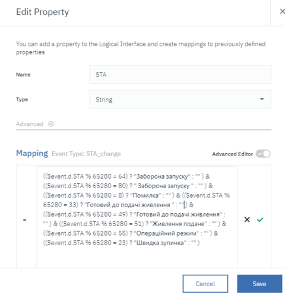 

рис.50

Зробіть підтвердження та збереження (Save). Перейдіть на інший крок (Next) після чого виберіть пункт «For All Events» (при таких налаштуваннях простіше вести налагодження). Після цього натисніть Done. 

На вікні інтерфейсів натисніть кнопку «Activate”->”Deploy”, після чого «Done».  

Для розуміння формули ознайомтеся з таблицею 2. Спочатку отримується молодший байт значення шляхом отримання остачі від ділення на FF00HEX (65280DEC), це робиться по причині відсутності побітових операторів в JSONata. Далі складуються усі результати умовних виразів в один текстовий рядок. Оскільки при невиконанні умов добавляється пустий рядок («»), то тільки одна умова сформує текстове представлення стану.  

таб.2. Значення стану 

| **Шістнадцяткове** | **Десяткове** | **Текстове значення**      | **Примітка**               |
| ------------------ | ------------- | -------------------------- | -------------------------- |
| xx40               | 64            | Заборона запуску           |                            |
| xx50               | 80            | Заборона запуску           |                            |
| xxx8               | 8             | Помилка, використовувати   | дільник 65520DEC (FFF0HEX) |
| xx21               | 33            | Готовий до подачі живлення |                            |
| xx31               | 49            | Готовий до подачі живлення |                            |
| xx33               | 51            | Живлення подане            |                            |
| xx37               | 55            | Операційний режим          |                            |
| xx17               | 23            | Швидка зупинка             |                            |

###### 4.5. Перевірка роботи перетворення властивості STA логічного інтерфейсу  

У консолі IBM Watson IoT Platform відкрийте вікно стану (State) пристрою SIC101 (рис.50), виберіть логічний інтерфейс. У користувацькому інтерфейсі локального Node-RED змініть значення STA на 64, після чого активуйте пересилання даних в хмару. У вікні State повинно з’явитися повідомлення з текстом.    

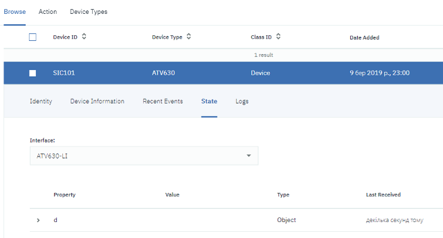 

рис.51

Також у хмарному Node-RED повинно з’явитися повідомлення зі значенням STA, рівним «Заборона запуску». Поступово змінюючи значення STA в локальному Node-RED, перевірте спрацювання інших станів.

###### 4.6. Добавлення в хмарний сервіс вузла отримання помилок статусу пристрою 

Для отримання помилок, пов’язаних зі статусом пристрою можна використати режим Device State Error Event. 

У хмарному Node-RED вставте ще один вузол IBM IoT in, аналогічно як це було зроблено в п.3.5. Необхідно також створити ще один конфігураційний вузол API Key (наприклад з назвою IoT2), інакше тільки один з вузлів в один момент часу буде отримувати повідомлення. У налаштуваннях Input Type вкажіть Device State Error Event.  

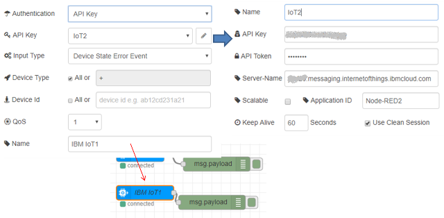 

рис.52

​        Тепер, коли при обробці стану виникне якась помилка, вона буде відображатися в налагоджувальній панелі. 

###### 4.7. Добавлення властивостей STATUS та FAULTдо логічного інтерфейсу 

**Виконується самостійно!**

- Добавте до існуючого логічного інтерфейсу властивості STATUS та FAULT типу BOOLEAN. 
  - STATUS=TRUE при STA=xx37HEX (Операційний режим)
  - FAULT=TRUE при STA=xxx8HEX (Помилка)

- Перевірте роботу, забезпечте щоб з’явилися повідомлення зі STATUS=TRUE та FAULT=TRUE. 

- Зробіть копії екранів з повідомленнями. 


При налагодженні перевіряйте помилки в налагоджувальній панелі хмарного Node-RED за допомогою фрагмента програми, що був створений в п.4.7.

 

 