**Технології індустрії 4.0. Лабораторний практикум. ** Автор і лектор: Олександр Пупена 

| [<- до лаборних робіт](README.md) | [на основну сторінку курсу](../README.md) |
| --------------------------------- | ----------------------------------------- |
|                                   |                                           |

# Лабораторна робота №4. Xмарні сервіси IIoT

# Частина 2. Використання цифрового двійника. 

**Мета**:  Навчитись створювати застосунки з використанням цифрових двійників з хмарними сервісами на прикладі Watson IoT Platform. 

Цілі: 

1)   реалізувати архівування IoT  в Cloudant;

2)   реалізувати вбудовані IoT Dashboards для аналізу роботи обладнання; 

3)   реалізувати збір даних з ПЧ та передачу їх в хмару;

4)   використовуючи Node-RED, реалізувати застосунок для цифрового двійника: відображення поточного стану обладнання (ПЧ), історії за останні 5 хвилин, документації, 3D моделі, та доступ до сторінки двійника з телефону по QR-коду ;  

**Зовнішній вигляд інтерфейсу налаштування** **IBM Cloud постійно змінюється! Увага, набір наданих сервісів та політика ліцензування** **IBM Cloud може змінитися. У будь якому випадку, без використання угоди та реєстрації кредитної картки ніякі кошти за використання стягуватися не можуть.**  

## 1. Реалізація архівування даних з використанням IoT в Cloudant   

Для ведення історії даних, отриманих з IoT Edge, в даній частині лабораторної роботи використовується сервіс IBM Cloudant.  

###### 1.1. Налаштування архівування в Cloudant 

Зайдіть в консоль налаштування IBM Watson IoT Platform. 

Увага! У IBM Watson IoT Platform заходити треба через консоль IBM Cloud! 

Перейдіть на вкладку Extensions. Натисніть кнопку «Setup»  для “Historical Data Storage”.                                 

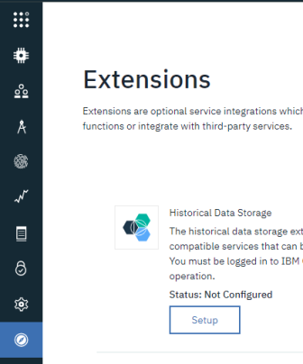 

рис.1.

Виберіть готовий сервіс Cloudant зі списку і натисніть «Select» (рис.2). 

 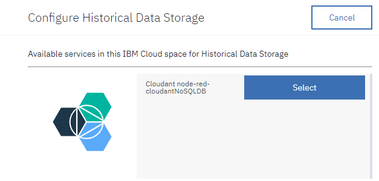

рис.2.

У наступному вікні (рис.3) необхідно налаштувати Bucket (базу даних). У Bucket Interval вказується глибина запису для однієї БД, часова зона, відносно якої почнеться нова БД, та її ім’я. У випадку назви за замовченням:  

```
iotp_<orgID>_<dbname>_<bucket_name>
```

 

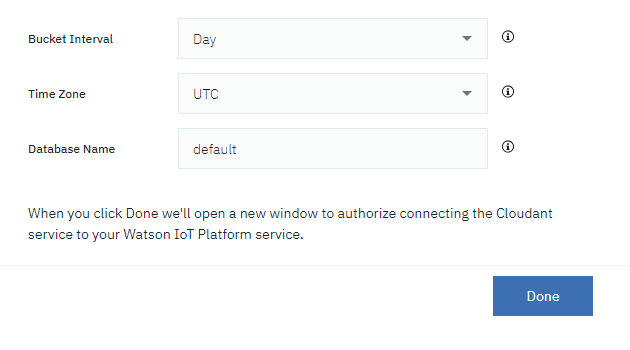 

рис.3.

Залиште все за замовченням і натисніть «Done». У вікні, що з’явиться, підтвердьте налаштування кнопкою «Confirm». При вдалому підтвердженні з’явиться повідомлення  «Authorization successful!». Пізніше можна буде змінити налаштування в цьому ж вікні “Extensions”. 

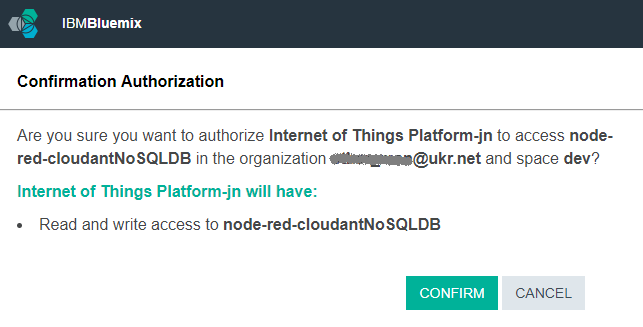 

рис.4.

###### 1.2. Перевірка збережених даних в Cloudant 

Запустіть локальний Node-RED. Відкрийте Веб-інтерфейс налагодження імітатора ATV, змініть значення кожного поля. Відкрийте вкладку з реалізацією Edge. Зробіть кілька раз ініціювання відправки даних в хмарний сервіс IoT (аналогічно як в п.3.2 л.р.4.1). За допомогою вікна State в IBM IoT Browse Devices  перевірте, що дані дійсно дійшли до двійника. 

Відкрийте вікно адміністрування Cloudant. Серед баз даних повинна з’явитися база даних з назвою у форматі `iotp_<orgID>_<dbname>_<bucket_name>`, наприклад 

```
iotp_ytaf20_default_2019-04-07
```

Відкрийте цю БД. Перегляньте перелік записів упорядкованих по даті (рис.5)

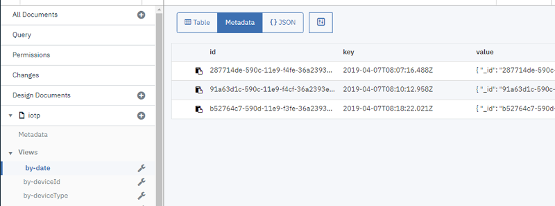 

рис.5

Відкрийте самий останній за часом запис (документ). Він матиме приблизно такий формат, як на рис.6.

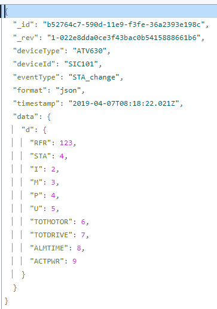 

рис.6

###### 1.3. Перевірка конфігурації індексів і виглядів (view) Cloudant 

Перейдіть до розділу бази даних «Design Documents». Там повинен бути документ з назвою "_design/iotp", відкрийте його. Перегляньте структуру індексів і view (рис.6.а). 

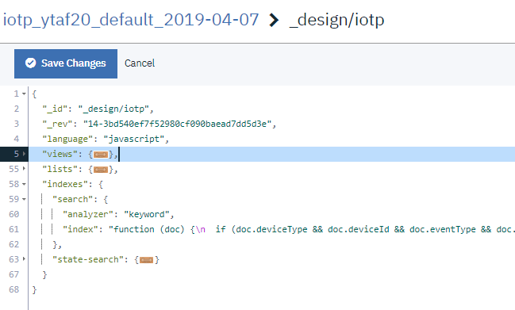  

 рис.6.а

Подібно до створюваного файлу в лабораторній роботі 3.1, IBM Cloud IoT створив документ з індексами. Серед індексів є два: «search» і «state-search». В індексі search є усі поля, які пишуться в документи від IoT двійника. Таким чином пошук можна проводити як за часом, так і за іншими полями, у тому числі ідентифікатором пристрою. При цьому документ/ключ треба буде вказувати як    

```
iotp/search
```

## 2. Використання вбудованих IoT Dashboards  

###### 2.1. Перегляд існуючих  Dashboards  

У консолі налаштування IBM Watson IoT Platform перейдіть на вкладку Boards. Там вже будуть доступні два дашбоарди: моніторингу використання ресурсів і перегляд ризиків та безпеки (рис.7). Перегляньте ці дашбоарди.

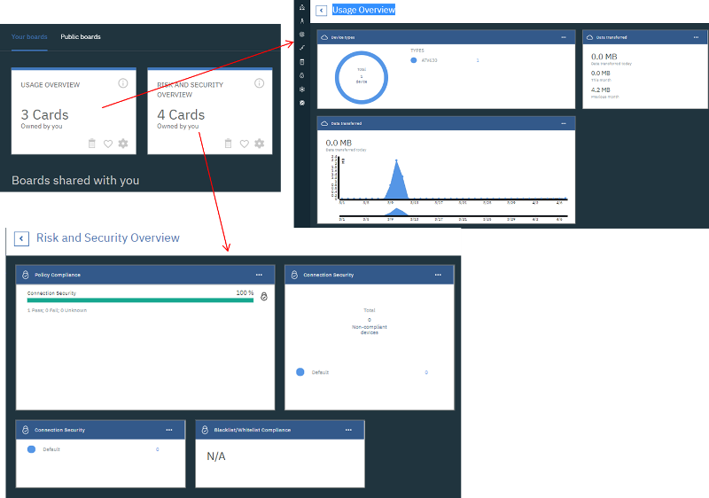 

рис.7

###### 2.2. Створення власного Dashboard для двійника IoT   

На вкладці Boards натисніть «+» для добавлення нового дашбоарда. Впишіть ім’я «ATV630» та натисніть «Next». На наступній вкладці натисніть «Submit». 

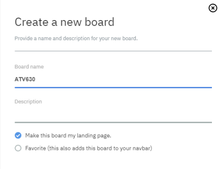 

рис.8

###### 2.3. Створення індикатору струму

- Після створення Dashboard відкрийте його. 
- На локальному Node-RED зробіть ініціювання відправки даних в хмарний сервіс IoT (як в п.3.2 л.р.4.1), щоб освіжити приймальний буфер IoT.
- Натисніть «Add New Card».  Пройдіть всю послідовність кроків для налаштування приладу відображення струму (рис.9). 

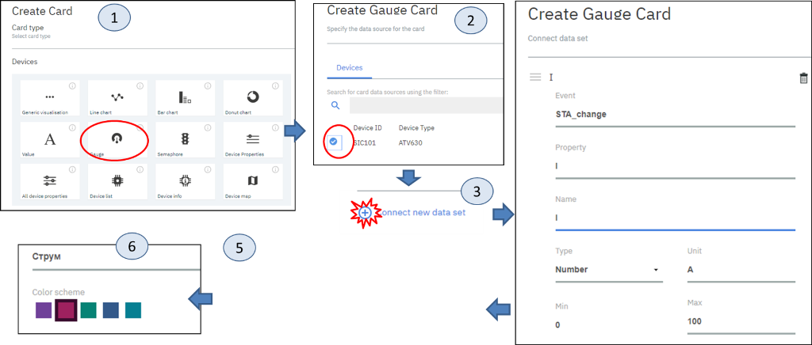 

 рис.9

Після проведення усіх дій на дашбоарді повинен з’явитися індикатор струму. У локальному Node-RED змініть значення струму через веб інтерфейс на значення 23.5 та ініціюйте відправку даних в хмарний сервіс IoT. Значення в індикаторі повинно змінитися.  

###### 2.4. Імітація вимірювання струму

Для імітації періодичної зміни індикатору струму модифікуйте програму в локальному Node-RED, як це показано на рис.10.

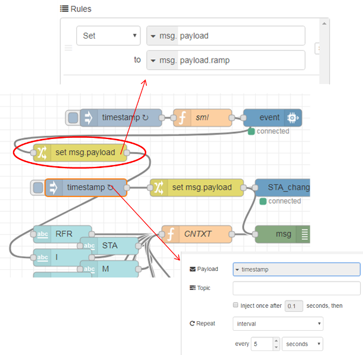 

 рис.10

Тепер значення струму (I) буде змінюватися кожні 5 секунд і кожні 5 секунд воно буде відправлятися до хмарного IoT сервісу. Зробіть розгортання, перевірте що індикатор на новому дашбоарді оновлюється.

###### 2.5. Створення панелі тренду

Добавте нову карту - «Add New Card». Виберіть тип «Line Chart» - тренд. Налаштуйте тренд таким чином, щоб він відображав струм (рис.11). 

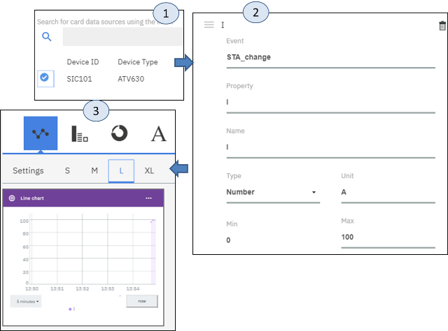  

рис.11 

При відображенні тренду виберіть діапазон відображення 5 хвилин. На рис.12 показано як відображатиметься тренд. 

###### 2.6. Імітація вимірювання частоти та виведення на тренд

Змініть програму в локальному Node-RED для імітації зміни частоти, як це показано на рис.12. 

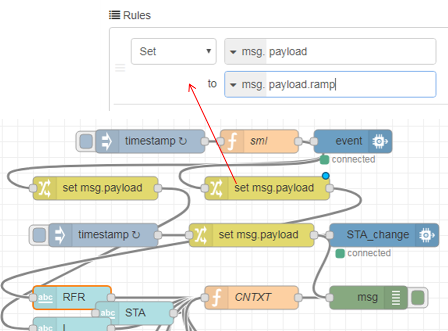  

рис.12

Добавте на тренд IoT Dashboard ще одну криву RFR, як це показано на рис.13.

 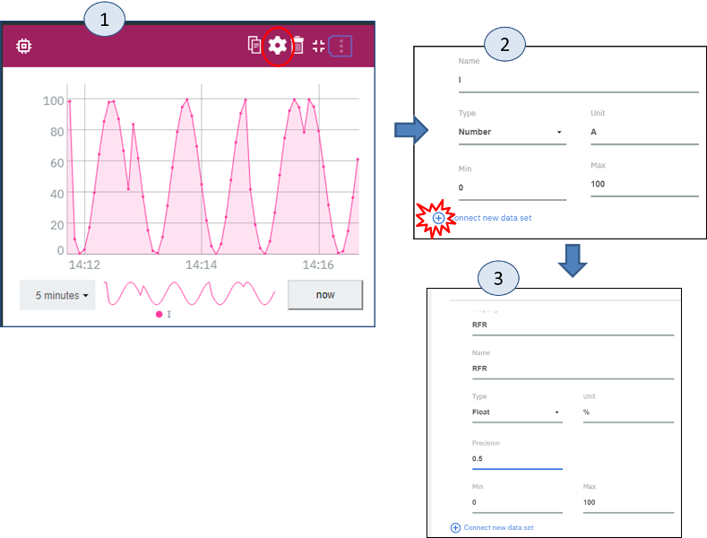

рис.13.

Результат повинен вийти, як на рис.14.

 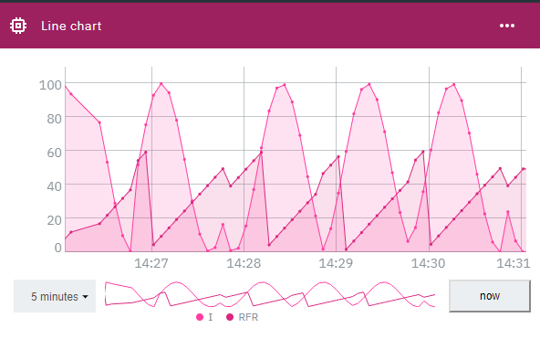 

рис.14.

Зверніть увагу, що інтерфейс тренда передбачає вибір іншої дати відображення через кнопку “Now”. 

 

## 3. Реалізація IIoT Edge з використанням Node-RED для локального керування та контролю перетворювачем частоти  

**Увага! Керування реальним перетворювачем частоти може відбуватися тільки під наглядом викладача!**

**Увага! В лабораторній роботі використовується засоби для керування ПЧ, які не рекомендується використовувати в реальних проектах! Це небезпечно і може привести до пошкодження технічних засобів, зашкодити здоров’ю або життю людини а також навколишньому середовищу! Керування ПЧ зроблено виключно в навчальних цілях! При реалізації рішень** **IIoT необхідно скрупульозно продумувати структуру з точки зору функціональної та інформаційної безпеки!**   

**Увага! В один момент часу тільки один пристрій може керувати ПЧ! Після завершення частини лабораторної роботи, що відповідає за керування ПЧ, відключіть з’єднання вузла** **ATV з** **Write , для того щоб інші студенти могли ним керувати.**

###### 3.1. Імпорт та налаштування підпрограми керування ПЧ  

Завантажте код [за цим посиланням](https://drive.google.com/open?id=18DLkVh5AwwlV9y5JipuC5nLucwA00VVf) , та у локальному Node-RED імпортуйте його в окремий потік «ATV_CTRL» для керування ПЧ. Програма матиме вигляд як на рис.15. 

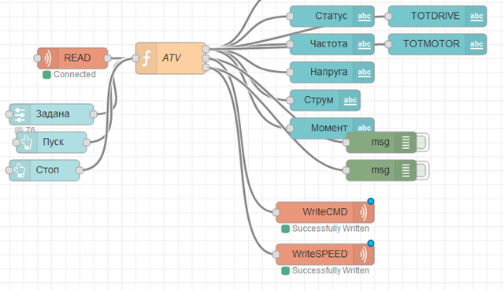 

рис.15.

За необхідності (якщо IP пристрою відрізняється) змініть налаштування конфігураційного вузлу Modbus/TCP (рис.16)

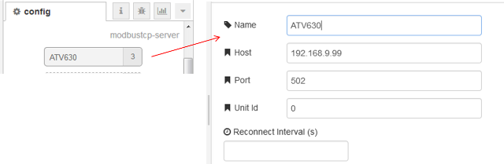 

рис.16.

###### 3.2. Перевірка роботи програми керування ПЧ 

- Відкрийте UI-інтерфейс локального Ned-RED на вкладці ATV (рис.17). 
- Попросіть викладача перевірити, чи увімкнений ПЧ і чи налаштований на зв'язок по Modbus TCP/IP. Змініть задане значення частоти, кнопкою «Пуск» запустіть двигун. Змінюючи задану частоту подивіться як змінюються значення частоти, напруги, струму і моменту.  
- Зупиніть двигун кнопкою «Стоп». 

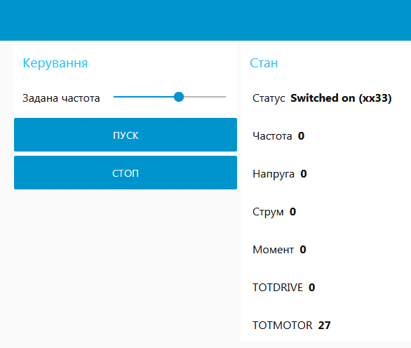 

рис.17.

###### 3.3. Взаємодія підпрограми керування ПЧ з підпрограмою Edge.   

- У потоці Edge локального Node-RED, видаліть зв’язки що пов’язують імітовані значення з RFR та I. Реалізуйте зв'язок між підпрограмою керування ПЧ у потоці «ATV_CTRL» та «Edge». Для цього скористайтеся вузлами «link in» та «link out». Модифікований потік “ATV_CTRL” показаний на рис.18.

 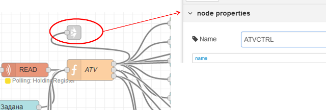

  рис.18.

Модифікований потік “Edge” показаний на рис.19.

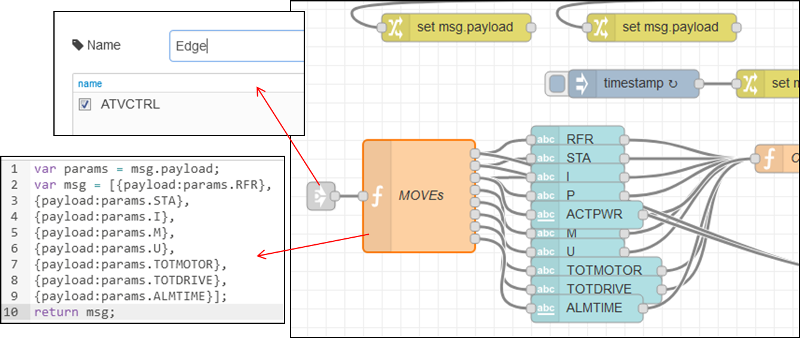 

  рис.19.

- Зробіть розгортання проекту, використовуючи вкладки ATV та ATV_SIM подивіться що дані на вкладці ATV_SIM ідентичні тим, що відображені на вкладці ATV.

###### 3.4. Перевірка отримання даних для цифрового двійника в IBM Cloud.   

- Відкрийте Dashboard, зроблений в п.2.5. Подивіться що значення трендів відповідають значенням в Edge.
- Зробіть копію екрану для звіту.

## 4. Створення переглядача трендів в хмарному Node-RED  

###### 4.1. Отримання всіх документів з записаних даних  

Аналогічно п.4.6 лабораторної роботи 3.1 можна отримати всі записані дані за одну добу. Для цього необхідно дізнатися назву БД.

Відкрийте хмарний Node-RED,створіть нову вкладку з назвою LAB4_2. Створіть тестову програму аналогічно, як це показано на рис.20. Зверніть увагу, що назва сервісу вибирається зі списку, там повинен бути Ваш екземпляр сервісу Cloudant. В поле Database необхідно вказати Вашу БД за сьогоднішній день.  

 

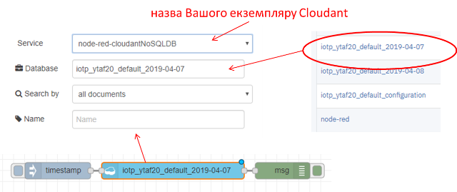 

рис.20.

 

Зробіть розгортання проекту, зробіть ініціювання зчитування. В полі Debug повинно бути виведене повідомлення з усіма отриманими записами (документами).

###### 4.2. Формування назви БД по сьогоднішній даті  

Хоч реалізація зчитування записаних історичних даних з використанням вузлу «Cloudant In» налаштовується досить просто, у нього є суттєве обмеження, яке не дозволяє динамічно задавати ім’я бази даних. Тому для реалізації задачі зчитування історичних даних необхідно скористатися HTTP API та  використовувати вузол HTTP Request, який був апробований в лабораторній роботі №2. 

Для початку сформуйте фрагмент, який буде формувати назву БД по сьогоднішній даті. Для цього добавте фрагмент в програму в хмарному Node-RED,  як це показано на рис.21. Функція “DB Name” буде формувати назву БД по теперішній даті. Зверніть увагу, що у Вашому випадку префікс (prefix) буде іншим (див.п.1.2). 

Зробіть розгортання, ініціюйте виклик, в полі Debug повинно відобразитися повідомлення з назвою БД.  

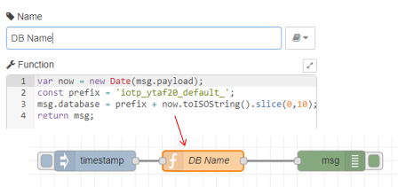 

рис.21.

###### 4.3. Визначення необхідних даних для використання REST API при доступі до IBM Cloudant.   

Документація по API Cloudant доступна [за цим посиланням](https://console.bluemix.net/docs/services/Cloudant/api/index.html#api-reference-overview).

Коротка стаття, що допомагає ввести в тему - [Query and Process Watson IoT Device Data from Cloudant NoSQL DB](https://developer.ibm.com/recipes/tutorials/cloudant-nosql-db-as-historian-data-storage-for-ibm-watson-iot-partii/)

Для отримання потрібних даних необхідно сформувати запит, подібно до того, як це робилося в лабораторній роботі 3.1. Однак структура даних та ключ в даному випадку відрізняються, що треба врахувати при реалізації. Також необхідно врахувати, що цей фрагмент програми буде використовувати поля повідомлення, в яких будуть вказані параметри запиту: дата та час початку, глибина відображення та ідентифікатор пристрою. Це дозволить реалізувати навігацію в майбутніх проектах. 

Як вже було зазначено, для доступу до сервісів Cloudant використовуватиметься HTTP API та вузол «HTTP Request». Для початку треба дізнатися про користувача та пароль, за ким відбувається доступ а також правила формування URL для доступу. Ця інформація в хмарному Node-RED доступна через змінні середовища, тому її можна отримати двома шляхами: через налаштування Cloudant і через змінні середовища хмарного застосунку Node-RED.

Використовуючи командний рядок за допомогою команди **cf env** відобразіть змінні середовища затосунку Node-RED. Пригадати як це робиться ви зможете з п.2.6 з ЛР3.3.

У змінній "VCAP_SERVICES" в об’єкті "cloudantNoSQLDB" **скопіюйте** в блокнот значення host, password і username (див. рис.22).   

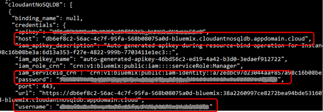 

рис.22.

Проконтролюйте, що ті самі значення ви бачите в Service credentials в налаштуваннях Cloudant.

Змінні середовища також можна вивести в Node-RED з використанням наприклад Inject, JSONATA або через JS. Таким чином, можна не вписувати значення host, password і username а просто взяти їх з VCAP_SERVICES.

###### 4.4. Формування фрагменту програми запиту даних по вказаному ідентифікатору, даті та часу а також часовому відрізку  

Модифікуйте програму в хмарному Node-RED, щоб він мав вигляд як на рис.23. Зверніть увагу, що host, password і username треба вказувати відповідно до Ваших налаштувань, визначених в попередньому пункті. 

Код функції «Пошуковий запит» доступний [за посиланням](https://drive.google.com/open?id=1Asuc2_u-bBr1oJNng-RmQQ-_XU-5oS_w). 

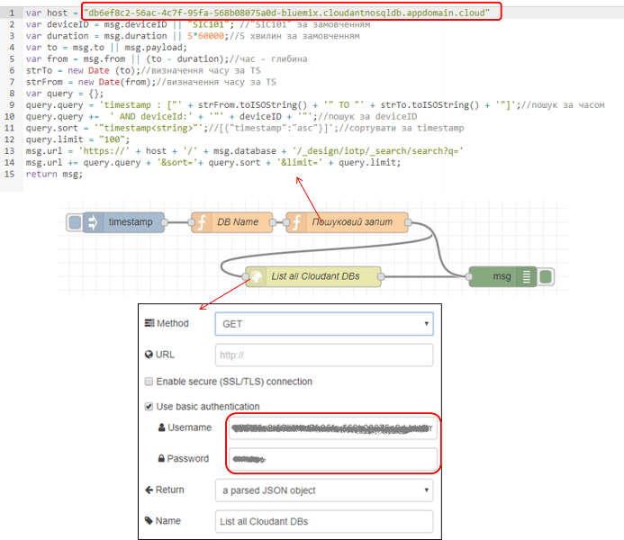 

рис.23.

Зробіть розгортання, ініціюйте відправку запиту. На панелі Debug повинні з’явитися два повідомлення з запитом і відповіддю. У відповіді в Payload, повинна знаходитися інформація отримана за останні 5 хвилин з IBM Cloudant, подібно до рис.24. 

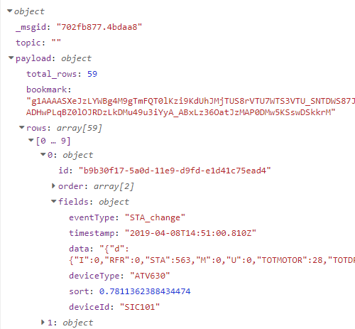   

рис.24.

###### 4.5. Створення сторінки для IoT Digital Twin та відображення на ній тренду  

- У хмарному Node-RED створіть нову закладку з назвою “ATV630”, а в ній групу з назвою «Trend» з шириною 10. Модифікуйте програму відповідно до рис.25.

Код функції пошуковий запит:

```javascript
var result = msg.payload.rows;
var strRecord ="";
var record = {};
var ts = 0;
var chart = [{
    "series":["I","RFR", "U", "M"],
    "data":[],
    "labels":[""]
}];
chart[0].data[0]=[];
chart[0].data[1]=[];
chart[0].data[2]=[];
chart[0].data[3]=[];

for (var i = 0; i < result.length; i++) {
    strRecord = result[i].fields.data;
    record = JSON.parse (strRecord);
    ts = result[i].fields.timestamp;
    chart[0].data[0][i] = {"x":ts,"y":record.d.I};
    chart[0].data[1][i] = {"x":ts,"y":record.d.RFR};
    chart[0].data[2][i] = {"x":ts,"y":record.d.U};
    chart[0].data[3][i] = {"x":ts,"y":record.d.M};
}
msg.payload = chart;
return msg;
```

 

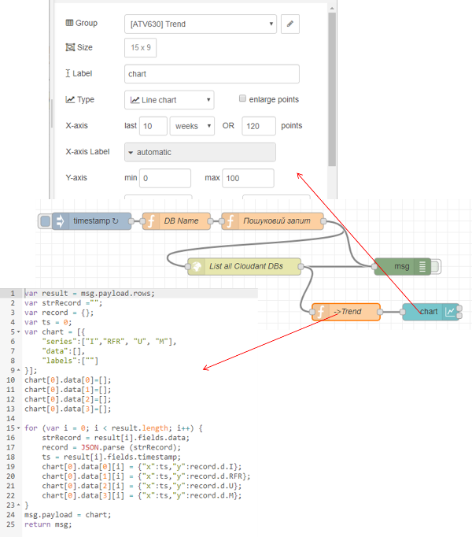 

рис.25.

- Зробіть розгортання проекту, на вкладці UI ATV630 хмарного Node-RED повинен відображатися тренд за останні 5 хвилин частоти, струму, моменту і напруги. 
- За бажанням спробуйте реалізувати кнопки перемотування тренду. 

## 5. Реалізація веб-інтерфейсу цифрового двійника Node-RED  

###### 5.1. Використовуючи вузол IBMIoT in реалізуйте відображення всіх даних, отриманих з цифрового двійника

У хмарному Node-RED на UI створіть додаткові групи на вкладці «ATV630».

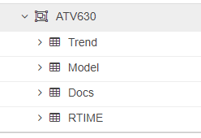  

рис.26.

По аналогії з Л.Р.4.1 п.3.5, на хмарному Node-RED зробіть зчитування даних з Input Type = «Device State Event». 

Самостійно реалізуйте відображення даних на вкладці «ATV630» групі «RTIME» користувацького інтерфейсу. 

Зробіть копію екрану для звіту. 

###### 5.2. Завантаження файлів цифрового двійника на COS.

Завантажте файл 3D-моделі [за цим посиланням](https://drive.google.com/open?id=1a2jRlaWaBOxASYFvaOcHoyentz-lAf7P).

Завантажте файл документації для ATV630 [за цим посиланням](https://drive.google.com/open?id=1C3G2ziL9GA1QOTnO5dBUzx-O7L5kFSWt).

Завантажте ці файли в сховище даних COS, як це робили в лабораторній роботі 3.2. 

###### 5.3. Збереження даних в полі Meatadata пристрою для інформації про пристрій. 

В консолі IBM Watson IoT Platform перейдіть в режим редагування пристрою «SIC101». Після чого натисніть «Edit metadata» (рис.26a)

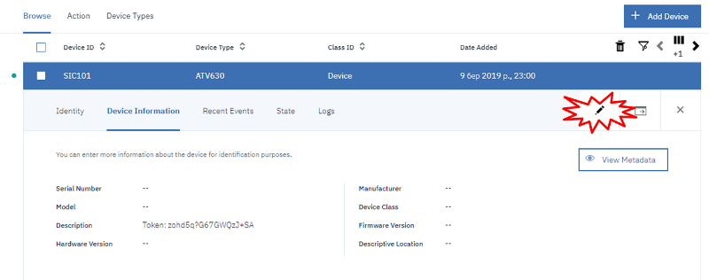 

рис.26a.

В редагованому полі метаданих впишіть шлях до фалів, аналогічно як Ви це робили в п.3.6 лабораторної роботи 3.2 (див. рис.27, необхідно замінити othermannodered на Вашу назву ). Натисніть «Update», після чого «Save».

```json
{
"Doc": "https://othermannodered.eu-gb.mybluemix.net/files/ATV600_Programming_Manual_EN_EAV64318_06.pdf",
"Model": "https://othermannodered.eu-gb.mybluemix.net/files/atv630u07m3.stl"
}
```

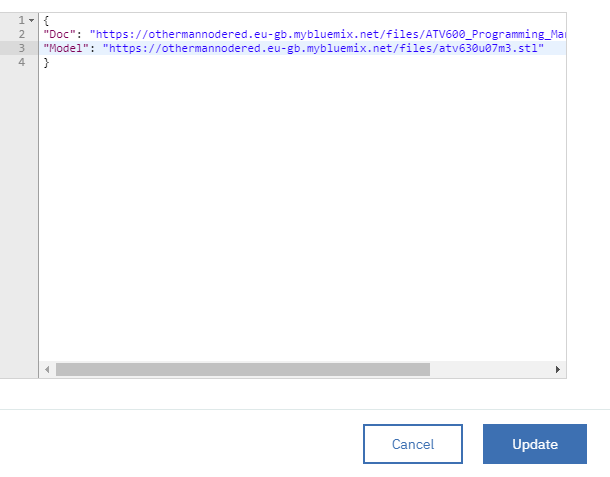 

рис.27.

###### 5.4. Доступ до інформації про пристрій через HTTP API. 

Детальний опис HTTP API наведений [за посиланням](https://console.bluemix.net/docs/services/IoT/reference/api.html#api_overview).  Опис Device Bulk Configuration [за цим посиланням](https://docs.internetofthings.ibmcloud.com/apis/swagger/v0002/org-admin.html#!/Device_Bulk_Configuration/get_bulk_devices).

Для виконання даного пункту Вам необхідно визначити:

**orgId** , вказується в правому верхньому кутку екрану консолі IBM IoT, наприклад ytaf20

**APIKey** – взяти з п.3.4 ЛР4.1

**Token** - взяти з п.3.4 ЛР4.1 

Модифікуйте програму в хмарному Node-RED, добавивши туди фрагмент, наведений на рис.28. Замініть **orgId** , **APIKey** та **Token** Вашими значеннями. Зробіть розгортання, ініціюйте запит. Результат повинен бути як на рис.28 (справа). Проаналізуйте, яка інформація Вам доступна і знайдіть метадані пристрою.  

```
https://ytaf20.internetofthings.ibmcloud.com/api/v0002/bulk/devices
```

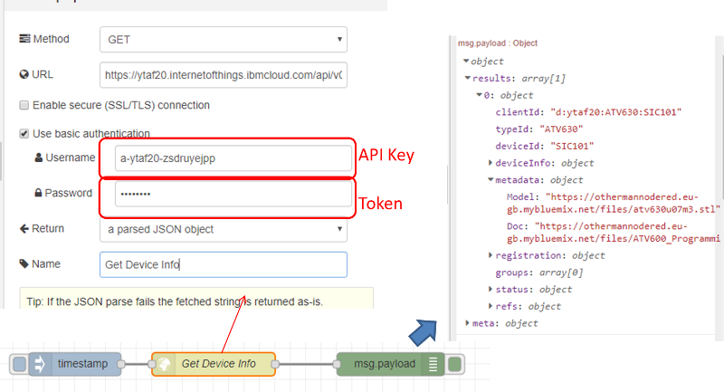 

рис.28.

###### 5.5. Використання метаданих для відображення інформації про пристрій 

У хмарному сервісі Node-RED активуйте вкладку, що відповідала за зчитування об’єктів COS через веб-запит в п.3.5 ЛР3.2 (якщо вона була деактивована).  

Модифікуйте програму в хмарному Node-RED для відображення документації та 3D-моделі по продукту, як це показано на рис.29.  

```html
<iframe id="vs_iframe" src="https://www.viewstl.com/?embedded&url={{payload}}" style="border:0;margin:0;width:100%;height:100%;"></iframe>
<embed src="{{payload}}" width="500" height="600" />
```

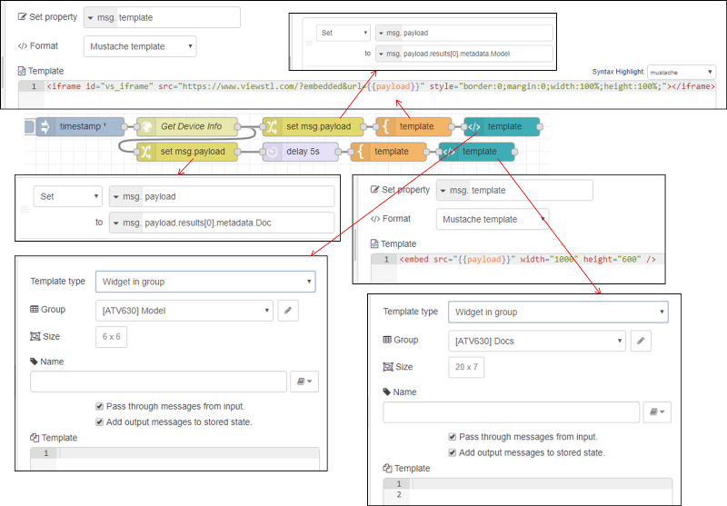 

рис.29. 

Зверніть увагу, що для коректної роботи PDF-переглядача необхідно щоб на ПК був встановлений Adobe Reader, а перевірку проводити в Google Chrome або Internet Explorer.  

Зробіть копію екрану, де відображається веб-інтерфейсу хмарного двійника.

###### 5.6. Генерування QR-коду для доступу до сторінки двійника 

Використовуючи один із сервісів генерування QR-кода (наприклад [цей](https://www.the-qrcode-generator.com) ), сформуйте код по тексту URL Вашої сторінки. Використовуючи смартфон або планшет перейдіть по QR-коду на сторінку цифрового двійника.  

**Деактивуйте вкладки з** **вузами** **IBMIoT в хмарному сервісі, інакше вони споживатимуть оплачувані ресурси.**

  

 