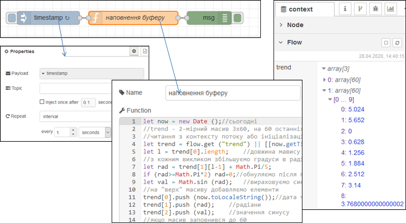
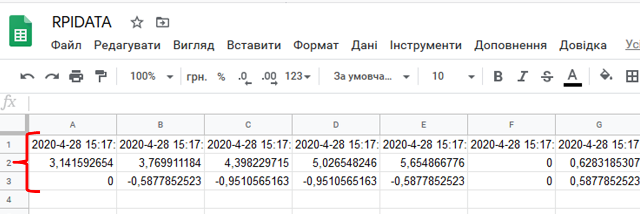
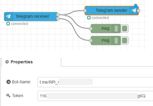
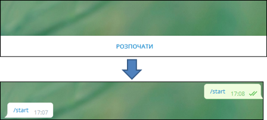
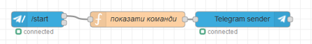
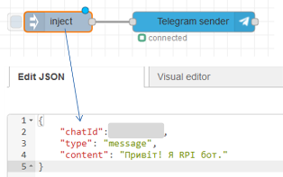
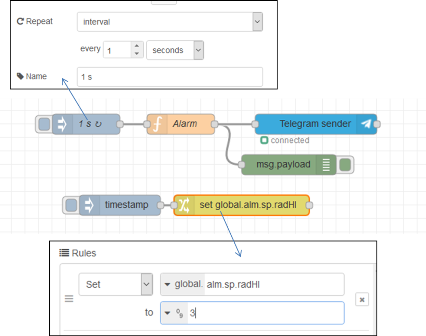
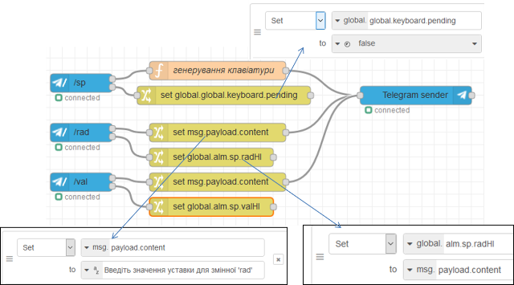
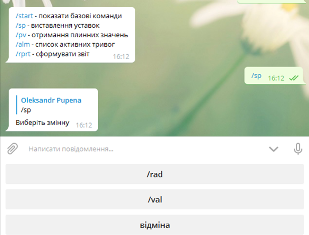

**Технології індустрії 4.0. Лабораторний практикум. ** Автор і лектор: Олександр Пупена 

| [<- до лаборних робіт](README.md) | [на основну сторінку курсу](../README.md) |
| --------------------------------- | ----------------------------------------- |
|                                   |                                           |

# Лабораторна робота №5. Інтегрування з хмарними застосунками та сервісами.

У цій лабораторній роботі необхідно забезпечити інтегрування Node-RED з хмарним застосунком `Google Sheet` (Електронна таблиця) та сервісом `Telegram`. Це дасть можливість забезпечити передачу даних з RaspberryPI на хмару для аналізу та взаємодію з віддаленим користувачем. Node-RED можна запускати як на ПК так і на RPI.   


# Частина 1. Інтегрування з застосунками Google.

У даній частині лабораторної роботи необхідно забезпечити запис значень з Node-RED в електронну таблицю, що обслуговується хмарним електронним застосунком `Google Sheet`. 

###### 0.Створення облікового запису Google.

Якщо у Вас немає облікового запису Google - створіть його [на сайті](https://www.google.com/). Це безкоштовно, потребується тільки поштова скринька і номер телефону. 

###### 1.Створення та налаштування сервісного аккаунту Google (для доступу іншого сервісу) 

Використовуючи рекомендації з довідника з [створення та налаштування сервісного аккаунту Google (для доступу іншого сервісу)](../Довідники/googleauth.md):

- створіть сервісний аккаунт, для якого добавте ключ
- активуйте доступ до хмарного застосунку`Google Sheets` 

**Увага! Нікому не передавайте інформацію про свої ключі , так як їх можна використати для доступу до всіх ваших відкритих застосунків в Google.**

###### 2.Встановлення бібліотеки node-red-contrib-google-sheets

- запустіть Node-RED
- встановіть бібліотеку `node-red-contrib-google-sheets` 

###### 3.Створення таблиці `Google Sheet` 

`Google Sheet` - це хмарний застосунок від Google для роботи з електронними таблицями. За функціональністю і принципами роботи він схожий на `Microsoft Excel`. Усі створені таблиці зберігаються на Гугл Диску (`Google Drive`) 

- Зайдіть на головну сторінку [Google](https://www.google.com/) і зайдіть в застосунок `Google Sheet`(`Таблиці`)


рис.1

Альтернативно можна відразу перейти [на сторінку](https://docs.google.com/spreadsheets)  

- У новому вікні натисніть кнопку "+" (створити) щоб створити нову електронну таблицю
- збережіть документ на Гугл диску

###### 4.Створення фрагменту для наповнення буферу

У даному пункті необхідно створити фрагмент, який буде вміщувати буфер останніх 60-ти значень імітованих змінних `rad ` та `val` а також дати та часу їх зміни. Такий буфер можна організувати різним чином, однак для спрощення були використані властивості масивів в JavaSript як черг та стеків. Кожне нове обчислення записується на верх масиву. Таким чином, спочатку "буфер-масив" буде наповнюватися аж до 60-го елементу. Коли елементів стане більше ніж 60 (тобто 61), нижні елементи виймаються, і масив "зсувається" вниз. І так кожного разу при виклику функції. Для збереження даних масиву між викликами використовується контекст потоку. 

Про всяк випадок, зроблена також перевірка на переповнення масиву: коли кількість елементів повинна бути 60, а вона все одно більша - масив обрізається до 60-ти елементів. Така ситуація не повинна відбуватися, але бажано передбачати такі випадки.   

- Створіть новий потік з назвою`clouds`.

- добавте туди фрагмент, який наведений на рисунку, код функції наведений під рисунком 2  



рис.2

```javascript
let now = new Date ();//сьогодні
//trend - 2-мірний масив 3x60, на 60 останніх значень 
//читання з контексту потоку або ініціалізація масиву-буферу
let trend = flow.get ("trend") || [[now.getTime()],[0],[0]];
let l = trend[0].length;    //довжина мавису
//з кожним викликом збільшуємо градуси в радіанах
let rad = trend[1][l-1] + Math.PI/5;   
if (rad>=Math.PI*2) rad=0;//обнуляємо після повного кола
let val = Math.sin (rad);   //вираховуємо синус
//на "верх" масиву добавляємо елементи 
trend[0].push (now.toLocaleString());//дата час
trend[1].push (rad);    //радіани
trend[2].push (val);    //значення синусу
//якщо масив заповнився до 60
if (trend[0].length >60){
    trend[0].shift ();//вилучаємо перший (найстаріший) елемент
    trend[1].shift ();
    trend[2].shift ();
    //після цього масиви повинні зменшитися на 1 елемент (60) 
    //і зсунутися вниз
    //у випадку, якщо раптом елементів більше 60
    //наприклад були добавлені випадково стороннім кодом
    //зробити кількість елементів =60
    trend[0].length = 60;//
    trend[1].length = 60;
    trend[2].length = 60; 
}
flow.set ("trend", trend);//записати в контекст потоку
return msg;
```

- зробіть розгортання потоку
- проаналізуйте контекст потоку, як він наповнюється з кожною секундою, він повинен мати вигляд як на рисунку 2  (не забудьте натискати кнопку оновлення), в

###### 5.Створення фрагменту запису в електронну таблицю значень буферу 

- Користуючись рекомендаціями щодо [роботи з базовими функціями читання та запису Google Sheet](https://pupenasan.github.io/NodeREDGuidUKR/google/googlesheet.html) :
  - надайте доступ до Гугл таблиці створеному раніше сервісному аккаунту
  - добавте наступний фрагмент потоку.


рис.3

- зробіть розгортання потоку
- перейдіть до Гугл таблиці там повинні відображатися дані з буфера і кожні 5 секунд оновлюватися



рис.4

###### 6.Створення діаграми

-   Виділіть три рядки з даними і створіть по ним діаграму залежності значень змінних від часу


рис.4

- Зробіть копію екрану для звіту.

- Зробіть доступ для читання до таблиці і відправте посилання у звіті.

Цікаві посилання.

http://tbarmann.webfactional.com/presentations/nenpa/google-sheets-updating-charts.pdf

https://developers-dot-devsite-v2-prod.appspot.com/chart/interactive/docs

https://flows.nodered.org/node/node-red-contrib-google-sheets


# Частина 2. Створення Телеграм-бота.

У цій частині лабораторної роботи необхідно реалізувати Телеграм-бота, який буде в онлайн режимі забезпечувати зв'язок користувача з RPI.  

###### 0.Створення облікового запису Telegram.

Якщо у Вас немає облікового запису Telegram - завантажте клієнтський застосунок і створіть обліковий запис [за посиланням](https://telegram.org/). Це безкоштовно, потребується тільки номер телефону. 

###### 1.Створення телеграм-бота.

Використовуючи [інструкцію](../Довідники/bot.md) створіть телеграм бота.

###### 2.Встановлення бібліотеки 

Запустіть Node-RED, встановіть бібліотеку `node-red-contrib-telegrambot`

###### 3.Перший запуск бота.

- Ознайомтеся з [описом](https://pupenasan.github.io/NodeREDGuidUKR/bots/telegrambot.html) бібліотеки `node-red-contrib-telegrambot`

- створіть в Node-RED новий потік з іменем `bot` 
- створіть потік, як показано на рис.1; з правилами заповнення конфігураційного вузла ознайомтеся в [описі](https://pupenasan.github.io/NodeREDGuidUKR/bots/telegrambot.html) 



рис.1

Цей потік робить ехо-відповіді на будь яке повідомлення в приватному чаті.

- зробіть розгортання потоку
- зайдіть в Telegram добавте контакт свого бота, якщо ще не добавили
- зайдіть в чат і натисніть кнопку `Розпочати` або команду `/start` 
- якщо бот працює, Вам повинна повернутися та сама команда 



рис.2

###### 4.Аналіз отриманого повідомлення 

У вікні налагодження перегляньте структуру повідомлення (рис.3). Визначте `chatId` він вам знадобиться для відправки повідомлення до вказаного чату.     


рис.3.

###### 5.Формування стартового повідомлення допомоги

У подальшому бот буде використовуватися в діалозі тільки з використанням команд. Перша команда - це `/start` має виводити список доступних команд.

- видаліть попередній фрагмент потоку для ехо-відповіді, створіть новий потік 

 

рис.4

- функція "показати команди має наступний вигляд"

```javascript
let txtmsg = "/start - показати базові команди\r\n";
txtmsg += "/sp - виставлення уставок\r\n";
txtmsg += "/pv - отримання плинних значень\r\n";
txtmsg += "/alm - список активних тривог\r\n";
txtmsg += "/rprt - сформувати звіт\r\n";
msg.payload.content = txtmsg;
return msg;
```

- зробіть розгортання потоку, у чаті наберіть команду `/start`, повинной вийти повідомлення з командами
- натисніть на команду `/start` - дія повинна повторитися, що показує, що команди в списку можна натискати 

###### 6.Відправка тестового повідомлення 

- Модернізуйте потік так, щоб можна було відправити текстове повідомлення у вказаний чат. Ідентифікатор `chatId` необхідно було визначити в пункті 4.

> зверніть увагу, що в `inject` повинен бути формат корисного навантаження `{}JSON`



рис.5.

- згенеруйте відправку повідомлення в чат і проконтролюйте його отримання

###### 7.Генерування тривог

У цьому пункті необхідно зробити формування повідомлення в Телеграм, коли значення змінних `rad` та `val` що імітувалися в попередній частині лабораторної роботи будуть вище заданих значень.

- модифікуйте функцію `наповнення буферу` з попередньої частини лабораторної роботи, вставивши фрагмент між  `flow.set ("trend", trend);` та `return`

```javascript
flow.set ("trend", trend);//записати в контекст потоку
//-------------------
let rtdb = { //глобальна змінна
    trend: trend,
    rad: rad,
    val: val
}
global.set ("rtdb", rtdb);
//---------------------
return msg;
```

цей фрагмент записує буфер, та значення змінних в глобальний контекст

- добавте до потоку `bot` наступний фрагмент:



рис.6

Функція `Alarm`  має наступний зміст

```javascript
let rtdb = global.get ("rtdb") || {}; 
let alm = global.get ("alm") || { //система тривог 
    state:{radHI:false, valHI:false}, //стан тривог 
    sp: {radHI:10.0, valHI:2.0}     //уставки тривог
    };

let almmsg = "";
//умова тривоги активна?
let alm_radHI = rtdb.rad > alm.sp.radHI;
let alm_valHI = rtdb.val > alm.sp.valHI;
//якщо тривога тільки активувалася
if (alm_radHI && !alm.state.radHI) {
    almmsg += "Радіани дорвінюють " + rtdb.rad + " , що вище зданого значення " + alm.sp.radHI + "\r\n";
}
if (alm_valHI && !alm.state.valHI) {
    almmsg += "Синус дорвінює " + rtdb.val + " , що вище зданого значення " + alm.sp.valHI + "\r\n"
}
//запис у стан тривоги
alm.state.radHI = alm_radHI;
alm.state.valHI = alm_valHI;
//збереження станів тривоги в глобальному контексті
global.set ("alm", alm);
//якщо хоча виникла хоча б одна тривога - відправка повідомлень 
if (almmsg.length > 1) {
    msg.payload = {chatId : #########, //тут має бути ваш ідентифікатор
                   type : 'message', 
                   content : almmsg}
    return msg;
}
```

Вузол `change` потрібен для того щоб змінювати уставку для однієї з змінних, наприклад для `rad`. Ця уставка аварійно високого значення зберігається в глобальному контексті як  `alm.sp.radHI`. Значення  `rad` змінюється від `0` до `6.28` а `val` від `-1` до `1`. Таким чином, щоб згенерувати тривогу про високе значення, необхідно його вказати в цих межах.

- використовуючи фрагмент з вузлом `timestamp` та `change` сформуйте значення `alm.sp.radHI` рівним `3`. 

У результаті з певним періодом повинні генеруватися в чаті тривоги про перевищення значення. 

- верніть `alm.sp.radHI` в значення вище  `6.28` , щоб тривоги не генерувалися

###### 8.Виставлення уставок

У цьому пункті необхідно зробити зміну уставок з чатую Для цього використовується команда `/sp` яка формує клавіатуру з 3-ма кнопками:

- `/rad` - вибору уставки верхнього рівня для змінної `rad` , відправиться відповідна команда
- `/val` - вибору уставки верхнього рівня  для змінної `val`, відправиться відповідна команда
- `відміна ` - відмова від вибору

Далі при виборі змінної формується відповідна команда, яка обробляється окремим обробником, що просить ввести значення цих змінних уставок.  

- добавте до потоку `bot` наступний фрагмент:



рис.7

- код функції `генерування клавіатури` наведений нижче

```javascript
context.global.keyboard = {pending : true};
let opts = {
    reply_to_message_id: msg.payload.messageId,
    reply_markup: JSON.stringify({
        keyboard: [
            ['/rad'],
            ['/val'],
            ['відміна']],
        	'resize_keyboard' : true,
        	'one_time_keyboard' : true
    })
};
msg.payload.content = 'Виберіть змінну';
msg.payload.options = opts;
return [msg];
```

- зробіть розгортання потоку
- введіть команду `/sp`



- натисніть кнопку `/rad`
- введіть значення 3
- проконтролюйте, що тривоги будуть спрацьовувати, поверніть задане значення до 10
- аналогічним чином змініть значення уставки для змінної `/val` (наприклад `0.5`)  

###### 9.Отримання плинних значень

- реалізуйте самостійно команди:
  - видачі активних значень змінних у форматі "назва - значення" у новому рядку
  - видачі списку активних тривог у форматі "назва тривоги" у новому рядку, якщо активних тривог немає - видати повідомлення "Немає активних тривог"
- команда на формування звіту буде використана на наступній лабораторній роботі  

###### 10.Тестування чат бота в приватному чаті товариша.

- попросіть свого товариша протестувати Вашого чат-бота
- відправте ім'я чат-бота для перевірки викладачем 

###### 11.Тестування чат бота в загальному чаті (не обов'язкове для виконання).

Виконання даного пункту буде враховуватися як додаткові 5 балів на іспиті

- попросіть у викладача запрошення на бот-чат групу
- відлагодіть ваш бот, щоб він правильно працював у групі   


# Питання до захисту. 

1. Назвіть основні причини, чому стандарти кібербезпеки в сфері ІТ не підходять для систем АСКТП.

2. Дайте визначення поняттю "кібератака".

3.   Яка мета та причини кібератак?

4.   Розкажіть про внутрішні та зовнішні загрози кібератак.

5.   Що таке вектор атак. Назвіть приклади векторів атак?

6.   Наведіть приклади вразливостей для кібератак в системі.

7.   Навіщо потрібні політики безпеки?

8.   Наведіть приклади вхідних вразливих точок для підприємства з інтегрованою системою керування, що має впроваджений зв'язок з Інтернет.

9.   Що передбачає ідентифікація та контроль активів і персоналу?

10. Що передбачають архітектурні підходи до захисту? 

11. Що таке зона безпеки і тракт?

12. Що таке демілітаризована зона?

13. Що передбачає захист фізичного доступу? 

14. Назвіть мережні захисні компоненти.

15. Що передбачає керування доступом?

16. Що таке зміцнення конфігурацій?

17. Що дає шифрування повідомлень?

18. Розкажіть про стратегію захисту вглибину.

19. Прокоментуйте "13 хороших практик" для кіберзахисту АСКТП.

 