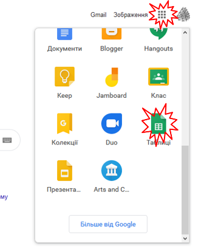

**Технології індустрії 4.0. Лабораторний практикум. ** Автор і лектор: Олександр Пупена 

| [<- до лаборних робіт](README.md) | [на основну сторінку курсу](../README.md) |
| --------------------------------- | ----------------------------------------- |
|                                   |                                           |

# Лабораторна робота №3. Інтегрування з хмарними застосунками та сервісами.

У цій лабораторній роботі необхідно забезпечити інтегрування Node-RED з хмарним застосунком `Google Sheet` (Електронна таблиця) та сервісом `Telegram`. Це дасть можливість забезпечити передачу даних з RaspberryPI на хмару для аналізу та взаємодію з віддаленим користувачем. Node-RED можна запускати як на ПК так і на RPI.   


рис.3.1.Структура системи з використанням хмарних застосунків.

### 1.Створення та налаштування сервісного аккаунту Google (для доступу іншого сервісу) 

#### 1.1.Створення облікового запису Google

Якщо у Вас немає облікового запису Google - створіть його [на сайті](https://www.google.com/). Це безкоштовно, потребується тільки поштова скринька і номер телефону. 

#### 1.2.Створення сервісного аккаунту Google  

- [ ] Зайдіть на сторінку налаштування API для сервісів, якими Ви користуєтеся на GoogleCloud  [https://console.cloud.google.com/apis](https://console.cloud.google.com/apis). 
- [ ] При першому входженні Вам запропонують прийняти умови використання. Для того, щоб користуватися сервісами виставте опцію "Приймаю умови використання" після чого натисніть кнопку "Прийняти і продовжити" 

 

рис.3.2. Прийняття умов користування

#### 1.3. Створення проекту

- [ ] Натисніть "Створити проект"

 

рис.3.3. Створення проекту 

#### 1.4. Налаштування проекту

- [ ] Заповніть налаштування проекту, як показано на рисунку.


рис.3.4. Створення проекту (назва)

#### 1.5. Створення сервісного аккаунту

- [ ] Зайдіть в головне меню і перейдіть в розділ створення сервісних аккаунтів 
- [ ] Натисніть "Створити сервісний аккаунт".


рис.3.5. Створення сервісного акаунту

- [ ] На першому кроці означте назву


рис.3.6. Створення сервісного акаунту (назва)

- [ ] На другому кроці можна поки нічого не вписувати, а просто натиснути "Продовжити".  
- [ ] На третьому кроці кроці виберіть "Створити ключ", після чого у новому вікні виберіть "Створити". 
- [ ] Система запропонує відкрити або зберегти файл JSON. Збережіть цей файл, він Вам потребується в майбутньому. 
- [ ] Після збереження, натисніть "Готово". 


рис.3.7. Створення ключа сервісного акаунту

#### 1.6. Надання доступу до сервісів Google Sheet

- [ ] Перейдіть на сторінку з сервісами. 


рис.3.8. Активація доступу до сервісів Гугл

- [ ] Зайдіть в розділ `G Suite` 
- [ ] Знайдіть `Google Sheets`


рис.3.9. Вибір хмарного сервісу

- [ ] Натисніть "Включити" для активації доступу до цього сервісу.


рис.3.10. Включення активації сервісу

### 2. Інтегрування з застосунками Google

У даній частині лабораторної роботи необхідно забезпечити запис значень з Node-RED в електронну таблицю, що обслуговується хмарним електронним застосунком `Google Sheet`. 

#### 2.1.Встановлення бібліотеки node-red-contrib-google-sheets

- [ ] запустіть Node-RED

- [ ] встановіть бібліотеку `node-red-contrib-google-sheets` 

#### 2.2.Створення таблиці `Google Sheet` 

`Google Sheet` - це хмарний застосунок від Google для роботи з електронними таблицями. За функціональністю і принципами роботи він схожий на `Microsoft Excel`. Усі створені таблиці зберігаються на Гугл Диску (`Google Drive`) 

- [ ] Зайдіть на головну сторінку [Google](https://www.google.com/) і зайдіть в застосунок `Google Sheet`(`Таблиці`)



рис.3.11. Створення таблиці Google Sheet

Альтернативно можна відразу перейти [на сторінку](https://docs.google.com/spreadsheets)  

- [ ] У новому вікні натисніть кнопку "+" (створити) щоб створити нову електронну таблицю

- [ ] Змініть назву документу на якусь більш прийнятну, наприклад RPIData

#### 2.3. Створення фрагменту для наповнення буферу

У даному пункті необхідно створити фрагмент, який буде вміщувати буфер останніх 60-ти значень імітованих змінних `rad ` та `val` а також дати та часу їх зміни. Такий буфер можна організувати різним чином, однак для спрощення були використані властивості масивів в JavaSript як черг та стеків. Кожне нове обчислення записується на верх масиву. Таким чином, спочатку "буфер-масив" буде наповнюватися аж до 60-го елементу. Коли елементів стане більше ніж 60 (тобто 61), нижні елементи виймаються, і масив "зсувається" вниз. І так кожного разу при виклику функції. Для збереження даних масиву між викликами використовується контекст потоку. 

Про всяк випадок, зроблена також перевірка на переповнення масиву: коли кількість елементів повинна бути 60, а вона все одно більша - масив обрізається до 60-ти елементів. Така ситуація не повинна відбуватися, але бажано передбачати такі випадки.   

- [ ] Запустіть Node-RED, якщо він не запущений
- [ ] Створіть новий потік з назвою `clouds`.
- [ ] добавте туди фрагмент, який наведений на рисунку, код функції наведений під рис. 3.12.  


рис.3.12. Фрагмент програми для запису даних в масив

```javascript
let now = new Date ();//сьогодні
//trend - 2-мірний масив 3x60, на 60 останніх значень 
//читання з контексту потоку або ініціалізація масиву-буферу
let trend = flow.get ("trend") || [[now.getTime()],[0],[0]];
let l = trend[0].length;    //довжина мавису
//з кожним викликом збільшуємо градуси в радіанах
let rad = trend[1][l-1] + Math.PI/5;   
if (rad>=Math.PI*2) rad=0;//обнуляємо після повного кола
let val = Math.sin (rad);   //вираховуємо синус
//на "верх" масиву добавляємо елементи 
trend[0].push (now.toLocaleString());//дата час
trend[1].push (rad);    //радіани
trend[2].push (val);    //значення синусу
//якщо масив заповнився до 60
if (trend[0].length >60){
    trend[0].shift ();//вилучаємо перший (найстаріший) елемент
    trend[1].shift ();
    trend[2].shift ();
    //після цього масиви повинні зменшитися на 1 елемент (60) 
    //і зсунутися вниз
    //у випадку, якщо раптом елементів більше 60
    //наприклад були добавлені випадково стороннім кодом
    //зробити кількість елементів =60
    trend[0].length = 60;//
    trend[1].length = 60;
    trend[2].length = 60; 
}
flow.set ("trend", trend);//записати в контекст потоку
return msg;
```

- [ ] зробіть розгортання потоку

- [ ] проаналізуйте контекст потоку, як він наповнюється з кожною секундою, він повинен мати вигляд як на рис.3.12  (не забудьте натискати кнопку оновлення)

#### 2.4.Створення фрагменту запису в електронну таблицю значень буферу 

- [ ] Користуючись рекомендаціями щодо [роботи з базовими функціями читання та запису Google Sheet](https://pupenasan.github.io/NodeREDGuidUKR/google/googlesheet.html) :

  надайте доступ до Гугл таблиці створеному раніше сервісному аккаунту

- [ ] добавте наступний фрагмент потоку.


рис.3.13. Фрагмент запису в електронну таблицю значень буферу

- [ ] зробіть розгортання потоку
- [ ] перейдіть до Гугл таблиці там повинні відображатися дані з буфера і кожні 5 секунд оновлюватися


рис.3.14. Таблиця з записаними даними 

#### 2.5.Створення діаграми

- [ ] Виділіть три рядки з даними і створіть по ним діаграму залежності значень змінних від часу


рис.3.15. Відображення діаграми за записаними в Google Sheet даними 

# Питання до захисту. 

1. Назвіть основні причини, чому стандарти кібербезпеки в сфері ІТ не підходять для систем АСКТП.

2. Дайте визначення поняттю "кібератака".

3.   Яка мета та причини кібератак?

4.   Розкажіть про внутрішні та зовнішні загрози кібератак.

5.   Що таке вектор атак. Назвіть приклади векторів атак?

6.   Наведіть приклади вразливостей для кібератак в системі.

7.   Навіщо потрібні політики безпеки?

8.   Наведіть приклади вхідних вразливих точок для підприємства з інтегрованою системою керування, що має впроваджений зв'язок з Інтернет.

9.   Що передбачає ідентифікація та контроль активів і персоналу?

10. Що передбачають архітектурні підходи до захисту? 

11. Що таке зона безпеки і тракт?

12. Що таке демілітаризована зона?

13. Що передбачає захист фізичного доступу? 

14. Назвіть мережні захисні компоненти.

15. Що передбачає керування доступом?

16. Що таке зміцнення конфігурацій?

17. Що дає шифрування повідомлень?

18. Розкажіть про стратегію захисту вглибину.

19. Прокоментуйте "13 хороших практик" для кіберзахисту АСКТП.

 