**Технології індустрії 4.0. Лабораторний практикум. ** Автор і лектор: Олександр Пупена 

| [<- до лаборних робіт](README.md) | [на основну сторінку курсу](../README.md) |
| --------------------------------- | ----------------------------------------- |
|                                   |                                           |

# Лабораторна робота №3. Інтегрування з хмарними застосунками та сервісами.

# Частина 2. Створення Телеграм-бота.

У цій частині лабораторної роботи необхідно реалізувати Телеграм-бота, який буде в онлайн режимі забезпечувати зв'язок користувача з RPI. 


 

#### 1. Створення облікового запису Telegram

- [ ] Якщо у Вас немає облікового запису Telegram - завантажте клієнтський застосунок і створіть обліковий запис [за посиланням](https://telegram.org/). Це безкоштовно, потребується тільки номер телефону. 

#### 2. Реєстрація нового телеграм-бота.

- [ ] Знайдіть в телеграмі і додайте до своїх контактів `@BotFather` - це бот, який створює ботів

- [ ] і введіть команду `/start` з'явиться вікно з доступними командами 

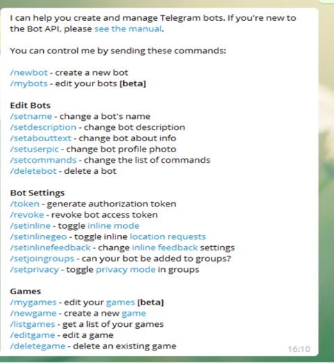

рис.3.16. Доступні команди створення телеграм-бота

- [ ] напишіть (або натисніть) команду `/newbot` для створення нового бота


рис.3.17. Команда створення телеграм-бота

- [ ] дайте йому ім'я, наприклад `RPI Ivanenko Ivana`

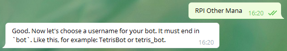

рис.3.18. Надання імені телеграм-боту

- [ ] тепер треба ввести ім'я користувача для бота, який повинен закінчуватися на ` Bot` , наприклад 

`RPI_IvanenkoIvana_Bot` За допомогою цього нікнейма можна знайти й додати вашого бота  до своїх контактів. 

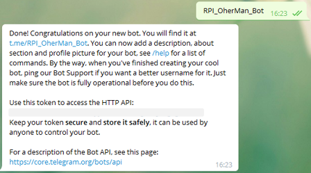

рис.3.19. Надання імені користувача телеграм-боту

- [ ] Збережіть токен, який видав бот, бо він нам  знадобиться згодом для керування.

- [ ] Добавте бота до своїх контактів `t.me/<username>`.

- [ ] за допомогою `RPI_IvanenkoIvana_Bot` ви зможете завжди відредагувати своїх ботів

#### 3. Встановлення бібліотеки в Node-RED 

- [ ] Запустіть Node-RED, встановіть бібліотеку `node-red-contrib-telegrambot`

#### 4. Створення першого варіанту бота

- [ ] Ознайомтеся з [описом](https://pupenasan.github.io/NodeREDGuidUKR/bots/telegrambot.html) бібліотеки `node-red-contrib-telegrambot`

- [ ] створіть в Node-RED новий потік з іменем `bot` 

- [ ] створіть потік, як показано на рис.3.20; з правилами заповнення конфігураційного вузла ознайомтеся в [описі](https://pupenasan.github.io/NodeREDGuidUKR/bots/telegrambot.html) 

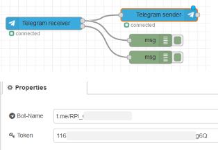

рис.3.20. Перший варіант бота в Node-RED

#### 5. Перший запуск бота

Зроблений потік робить ехо-відповіді на будь яке повідомлення в приватному чаті.

- [ ] зробіть розгортання потоку

- [ ] зайдіть в Telegram добавте контакт свого бота, якщо ще не добавили

- [ ] зайдіть в чат і натисніть кнопку `Розпочати` або команду `/start` 

- [ ] якщо бот працює, Вам повинна повернутися та сама команда 

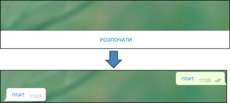

рис.3.21. Перший запуск бота - перевірка

#### 6. Аналіз отриманого повідомлення 

- [ ] У вікні налагодження перегляньте структуру повідомлення (рис.3.22). 
- [ ] Визначте `chatId` він вам знадобиться для відправки повідомлення до вказаного чату.     

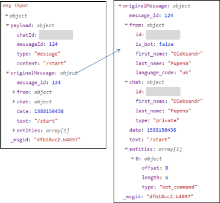

рис.3.22. Аналіз отриманого повідомлення

#### 7. Формування стартового повідомлення допомоги

У подальшому бот буде використовуватися в діалозі тільки з використанням команд. Перша команда - це `/start` має виводити список доступних команд.

- [ ] видаліть попередній фрагмент потоку для ехо-відповіді, створіть новий потік 

 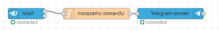

рис.3.23. Формування стартового повідомлення допомоги

Функція "показати команди має наступний вигляд"

```javascript
let txtmsg = "/start - показати базові команди\r\n";
txtmsg += "/sp - виставлення уставок\r\n";
txtmsg += "/pv - отримання плинних значень\r\n";
txtmsg += "/alm - список активних тривог\r\n";
txtmsg += "/rprt - сформувати звіт\r\n";
msg.payload.content = txtmsg;
return msg;
```

- [ ] зробіть розгортання потоку, у чаті наберіть команду `/start`, повинной вийти повідомлення з командами

- [ ] натисніть на команду `/start` - дія повинна повторитися, що показує, що команди в списку можна натискати 

#### 8. Відправка тестового повідомлення 

- [ ] Модернізуйте потік так, щоб можна було відправити текстове повідомлення у вказаний чат. Ідентифікатор `chatId` необхідно було визначити в пункті 2.5.

> зверніть увагу, що в `inject` повинен бути формат корисного навантаження `{}JSON`

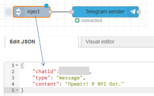

рис.3.24. Відправка тестового повідомлення

- [ ] згенеруйте відправку повідомлення в чат і проконтролюйте його отримання

#### 9. Генерування тривог

У цьому пункті необхідно зробити формування повідомлення в Телеграм, коли значення змінних `rad` та `val` що імітувалися в попередній частині лабораторної роботи будуть вище заданих значень.

- [ ] модифікуйте функцію `наповнення буферу` з попередньої частини лабораторної роботи, вставивши фрагмент між  `flow.set ("trend", trend);` та `return`

```javascript
flow.set ("trend", trend);//записати в контекст потоку
//-------------------
let rtdb = { //глобальна змінна
    trend: trend,
    rad: rad,
    val: val
}
global.set ("rtdb", rtdb);
//---------------------
return msg;
```

цей фрагмент записує буфер, та значення змінних в глобальний контекст

- [ ] добавте до потоку `bot` наступний фрагмент:

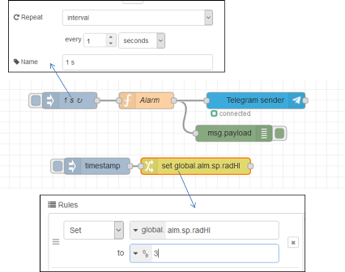

рис.3.25. Генерування тривог - програма

Функція `Alarm`  має наступний зміст

```javascript
let rtdb = global.get ("rtdb") || {}; 
let alm = global.get ("alm") || { //система тривог 
    state:{radHI:false, valHI:false}, //стан тривог 
    sp: {radHI:10.0, valHI:2.0}     //уставки тривог
    };

let almmsg = "";
//умова тривоги активна?
let alm_radHI = rtdb.rad > alm.sp.radHI;
let alm_valHI = rtdb.val > alm.sp.valHI;
//якщо тривога тільки активувалася
if (alm_radHI && !alm.state.radHI) {
    almmsg += "Радіани дорвінюють " + rtdb.rad + " , що вище зданого значення " + alm.sp.radHI + "\r\n";
}
if (alm_valHI && !alm.state.valHI) {
    almmsg += "Синус дорвінює " + rtdb.val + " , що вище зданого значення " + alm.sp.valHI + "\r\n"
}
//запис у стан тривоги
alm.state.radHI = alm_radHI;
alm.state.valHI = alm_valHI;
//збереження станів тривоги в глобальному контексті
global.set ("alm", alm);
//якщо хоча виникла хоча б одна тривога - відправка повідомлень 
if (almmsg.length > 1) {
    msg.payload = {chatId : #######, //тут має бути ваш ідентифікатор
                   type : 'message', 
                   content : almmsg}
    return msg;
}
```

Вузол `change` потрібен для того щоб змінювати уставку для однієї з змінних, наприклад для `rad`. Ця уставка аварійно високого значення зберігається в глобальному контексті як  `alm.sp.radHI`. Значення  `rad` змінюється від `0` до `6.28` а `val` від `-1` до `1`. Таким чином, щоб згенерувати тривогу про високе значення, необхідно його вказати в цих межах.

- [ ] використовуючи фрагмент з вузлом `timestamp` та `change` сформуйте значення `alm.sp.radHI` рівним `3`. 

У результаті з певним періодом повинні генеруватися в чаті тривоги про перевищення значення. 

- [ ] верніть `alm.sp.radHI` в значення вище  `6.28` , щоб тривоги не генерувалися

#### 10. Виставлення уставок

У цьому пункті необхідно зробити зміну уставок з чатую Для цього використовується команда `/sp` яка формує клавіатуру з 3-ма кнопками:

- `/rad` - вибору уставки верхнього рівня для змінної `rad` , відправиться відповідна команда
- `/val` - вибору уставки верхнього рівня  для змінної `val`, відправиться відповідна команда
- `відміна ` - відмова від вибору

Далі при виборі змінної формується відповідна команда, яка обробляється окремим обробником, що просить ввести значення цих змінних уставок.  

- [ ] добавте до потоку `bot` наступний фрагмент:

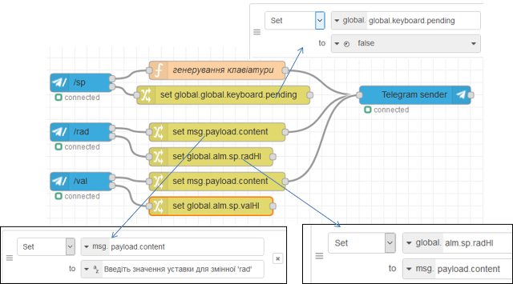

рис.3.26.  Виставлення уставок - програма

- [ ] означте код функції `генерування клавіатури` , який наведений нижче

```javascript
context.global.keyboard = {pending : true};
let opts = {
    reply_to_message_id: msg.payload.messageId,
    reply_markup: JSON.stringify({
        keyboard: [
            ['/rad'],
            ['/val'],
            ['відміна']],
        	'resize_keyboard' : true,
        	'one_time_keyboard' : true
    })
};
msg.payload.content = 'Виберіть змінну';
msg.payload.options = opts;
return [msg];
```

- [ ] зробіть розгортання потоку

- [ ] введіть команду `/sp`

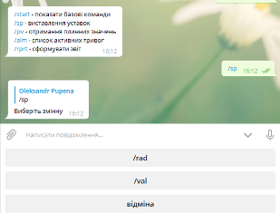

рис.3.27. Виставлення уставок - перевірка

- [ ] натисніть кнопку `/rad`

- [ ] введіть значення 3

- [ ] проконтролюйте, що тривоги будуть спрацьовувати, поверніть задане значення до 10

- [ ] аналогічним чином змініть значення уставки для змінної `/val` (наприклад `0.5`)  

#### 11. Отримання плинних значень

- [ ] реалізуйте самостійно команди:

- видачі активних значень змінних у форматі "назва - значення" у новому рядку
- видачі списку активних тривог у форматі "назва тривоги" у новому рядку, якщо активних тривог немає - видати повідомлення "Немає активних тривог"

- [ ] команда на формування звіту може бути використана в курсовому проекті  

#### 12. Тестування чат бота в приватному чаті товариша

- [ ] попросіть свого товариша протестувати Вашого чат-бота

- [ ] відправте ім'я чат-бота для перевірки викладачем 

#### 13. Тестування чат бота в загальному чаті (не обов'язкове для виконання)

Виконання даного пункту буде враховуватися як додаткові 5 балів на іспиті

- [ ] попросіть у викладача запрошення на бот-чат групу

- [ ] відлагодіть ваш бот, щоб він правильно працював у групі   

## Питання до захисту

1. Розкажіть про основні кроки реєстрації Telegram Bot.
8. Розкажіть про налаштування вузлів Node-RED для роботи з Telegram Bot.
9. Які функції виконував Telegram Bot в даній лабораторній роботі?
10. Прокоментуйте роботу фрагмента програми що генерує тривоги.
11. Прокоментуйте роботу фрагмента програми що змінює уставки для тривог з Telegram Bot.      