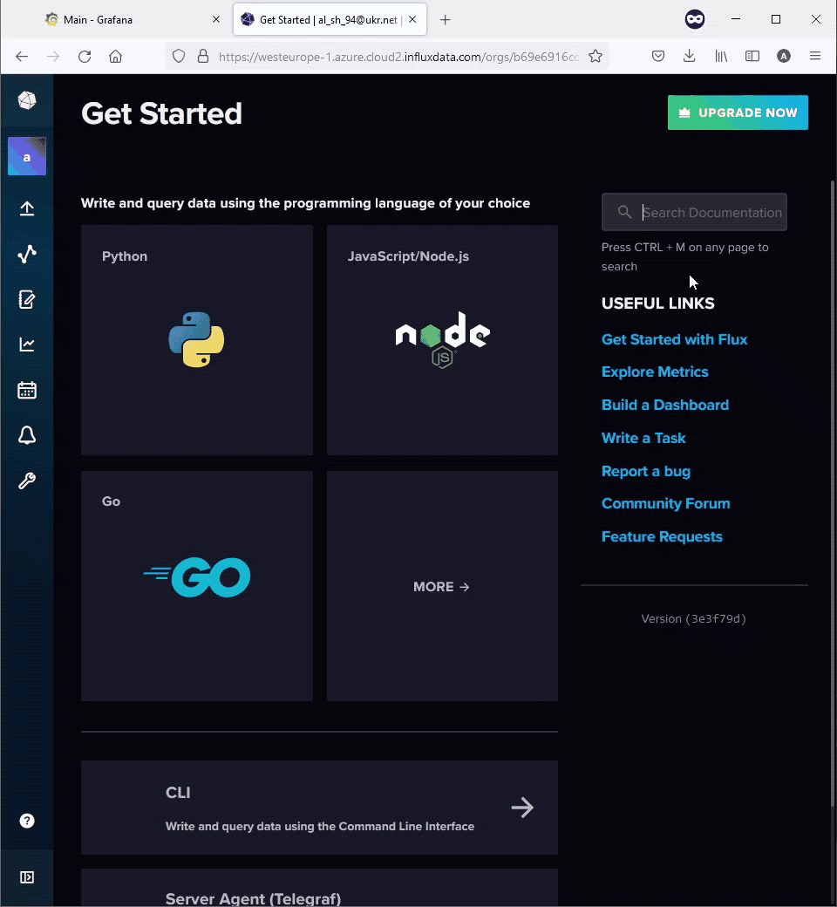
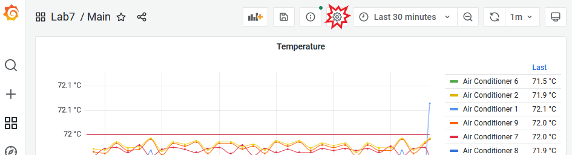
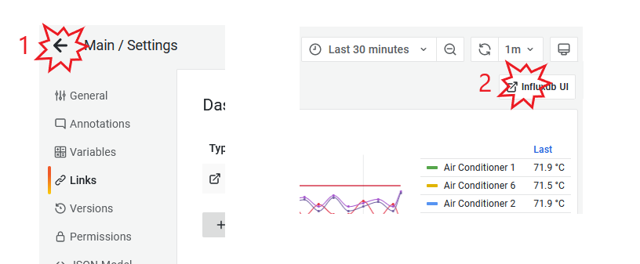

**`Технології` індустрії 4.0. Лабораторний практикум. ** Автор і лектор: Олександр Пупена 

| [<- до лаборних робіт](README.md) | [на основну сторінку курсу](../README.md) |
| --------------------------------- | ----------------------------------------- |
|                                   |                                           |

# Лабораторна робота №7. Grafana. Основи роботи з Grafana. Налаштування джерел даних. Створення Dashboard
Завдання лабораторної роботи навчитися основам роботи з Grafana у парі з базою даних часових рядів Influxdb.

## Порядок виконання лабораторної роботи

### 1.Створення безкоштовного облікового запису на Grafana Cloud Portal

- [ ] На порталі [Grafana Cloud Portal](https://grafana.com/) перейдіть на сторінку створення безкоштовного акаунта. 
 

Рис.1. Портал Grafana Cloud Portal

- [ ] Заповніть форму або використайте Google, GitHub чи Microsoft акаунти для реєстрації.
   

Рис.2. Форма реєстрації на порталі Grafana

- [ ] Запустіть `Grafana`  з порталу Grafana Cloud. My Account ->плитка Grafana -> Launch.
    

Рис.3. Запуск Grafana з порталу Grafana Cloud Portal

### 2.Створення джерела даних в Grafana

#### 2.1. Генерація API токена для доступу до бакету "firstbucket" в Influxdb з Grafana

- [ ] В Influxdb UI перейдіть в розділ `API TOKENS`: пункт меню **Load Data** -> **API Tokens**.
- [ ] Натисніть **+ Generate API Token** у верхньому правому куті, оберіть опцію **Custom API Token**.
- [ ] У вікні "Generate a custom API token" в поле description вставте `Access to firstbucket from Grafana`. В розділі **Resourses** для firstbucket оберіть опції читання та запису.


Рис.4. Налаштування токена доступу

- [ ] Натисніть **Generate**.
- [ ] Скопіюйте та збережіть згенерований токен.

 

Запис.1. Генерація API токена для доступу до бакету "firstbucket"

#### 2.2. Створення джерела даних Influxdb в Grafana

- [ ] В інтерфейсі користувача Grafana перейдіть в пункт меню `Configuration` (шестерня зліва внизу).


Рис.5. Налаштування Grafana

- [ ] В розділі **Data sources** натисніть `Add data source`.
- [ ] В якості джерела даних оберіть `InfluxDB`.
- [ ] В налаштуваннях джерела даних InfluxDB поле **Name** залиште без змін, тобто `InfluxDB`.
- [ ] Опцію **Default **біля поля **Name** активуйте.
- [ ] Для опції **Query Language** оберіть мову `Flux`.

 

Запис.2. Створення джерела даних в Grafana

- [ ] В розділі налаштувань **HTTP** джерела даних InfluxDB для поля **URL** скопіюйте `Cluster URL` з налаштувань організації в Influxdb UI (Influxdb UI -> пункт меню Account -> Organization settings -> Cluster URL).
- [ ] В розділі налаштувань **HTTP** опцію **Access** залиште без змін, тобто `Server (Default)`.

 

Запис.3. Створення джерела даних в Grafana

- [ ] В розділі налаштувань **AUTH**  деактивуйте опцію `Basic auth`.
- [ ] В розділі налаштувань **InfluxDB Details** в поле  **Organization** скопіюйте `Organization ID` з налаштувань організації в Influxdb UI (Influxdb UI -> пункт меню Account -> Organization settings -> Organization ID).
- [ ] В поле **Token** вставте токен, створений в пункті 2.1.
- [ ] В поле **Default Bucket** напишіть `firstbucket`.
- [ ] Натисніть кнопку `Save & test`.

#### 2.3. Відновлення запису даних в influxdb

- [ ] Запустіть OPCUA сервер `UaCPPServer` та `node-red`, тобто відновіть запис даних з OPC UA сервера в `influxdb`, який було налаштовано в попередній лабораторній роботі по Influxdb.

### 3.Створення першого Dashboard

#### 3.1. Створення загальної директорії для зберігання дашбоардів лабораторної роботи

- [ ] Наведіть курсор на ` +` (**Create**) бокового меню, оберіть пункт `Folder`.
- [ ] Дайте назву новій директорії – `Lab7`.
- [ ] Натисніть кнопку `Create`.

#### 3.2. Створення дашбоарду

Після створення директорії, за замовчуванням, відкриваються дашбоарди, які зберігаються в даній папці. Оскільки вона пуста, пропонується створити новий дашбоард.

- [ ] Натисніть кнопку `+ Create Dashboard`.
- [ ] Збережіть дашбоард під іменем `Main`. Для цього натисніть іконку дискети у правому верхньому куті. У поле Dashboard Name вставте ім'я `Main`. Натисніть кнопку `Save`.


Рис.6. Збереження дашбоарду

#### 3.3. Навігація в Grafana

Для навігації між різними директоріями та дашбоардами використовується пункт меню Dashboards -> Browse.

- [ ] Наведіть курсор на іконку Dashboards, оберіть пункт `Browse`.
- [ ] Зверніть увагу, що через меню Browse доступні всі створені вами директорії, а також системна директорія **GrafanaCloud**. Звідси також можна створити новий дашбоард або нову директорію.
- [ ] Натисніть на назву папки `Lab7`, відкрийте дашбоард `Main`.

#### 3.4. Створення та редагування інформаційної панелі (Panel)

- [ ] Додайте нову інформаційну панель в дашбоард **Main**. Для цього натисніть `+` (Add Panel) у верхньому правому куті дашбоарду.
- [ ] Натисніть `Add a new panel`.


Рис.7. Створення панелі

##### 3.4.1. Налаштування візуалізації `Time series` для відображення температур (усереднені значення щохвилини) всіх кондиціонерів за останні 30 хвилин

- [ ] Переконайтеся, що в режимі редагування панелі встановлено тип візуалізації `Time series`.
- [ ] Встановіть часовий діапазон для відображення – `30 хвилин`.


Рис.8. Редагування панелі

- [ ] Переконайтеся, що в якості джерела даних встановлено `InfluxDB` (під час конфігурування джерела даних InfluxDB ми означили його як джерело даних за замовчуванням). В іншому випадку оберіть `InfluxDB` з випадального списку. 


Рис.9. Редагування панелі

- [ ] В поле запиту Flux вставте запит для читання температур всіх кондиціонерів та їх агрегування (розрахунок середнього значення щохвилини). 

```js
from(bucket: "firstbucket")
  |> range(start: v.timeRangeStart, stop: v.timeRangeStop)
  |> filter(fn: (r) => r["_measurement"] == "Building")
  |> filter(fn: (r) => r["_field"] == "Temperature")
  |> filter(fn: (r) => r["device"] == "AirConditioner_1" or r["device"] == "AirConditioner_10" or r["device"] == "AirConditioner_2" or r["device"] == "AirConditioner_3" or r["device"] == "AirConditioner_4" or r["device"] == "AirConditioner_5" or r["device"] == "AirConditioner_6" or r["device"] == "AirConditioner_7" or r["device"] == "AirConditioner_8" or r["device"] == "AirConditioner_9")
  |> aggregateWindow(every: 1m, fn: mean, createEmpty: false)
```

- [ ] Натисніть кнопку `Apply`.


Рис.10. Редагування панелі

- [ ] Розтягніть панель на всю ширину екрана (дашбоарду).
- [ ] Збережіть зміни дашбоарду, залишивши виставлений часовий діапазон як діапазон дашбоарду за замовчуванням (дискета у правому верхньому куті дашбоарду).


Запис.4. Створення панелі, збереження дашбоарду

- [ ] Вручну оновіть дашбоард (іконка оновлення в правому верхньому куті дашбоарду ).
- [ ] Встановіть період оновлення дашбоарду – 1 хвилина. 


Рис.11. Період оновлення дашбоарду

- [ ] Збережіть дашбоард.
- [ ] Поверніться до редагування панелі. Для цього натисніть на назві панелі та оберіть опцію `Edit`.
- [ ] Для панелі встановіть наступні налаштування на вкладці `All`:

- Panel options -> Title: `Temperature`
- Tooltip -> Tooltip mode: `All`
- Tooltip -> Values sort order: `Ascending`
- Legend -> Legend mode: `Table`
- Legend -> Legend placement: `Right`
- Legend -> Legend values: `Last`
- Graph styles -> Line interpolation: `Smooth`
- Graph styles -> Point size: `3`
- Axis -> Placement: `Left`
- Axis -> Label: `Temperature`
- Standard options -> Unit: `Celsium (°C)`
- Standard options -> Decimals: `2`
- Thresholds -> `72: red`
- Thresholds -> Show thresholds: `As lines`

- [ ] Встановіть налаштування на вкладці `Overrides`: назва трендів замість "Temperature AirConditioner_1, ... , Temperature AirConditioner_10" – `Air Conditioner1, ... , Air Conditioner 10` відповідно. Для цього:

  - [ ] натисніть на кнопку `+ Add field override`
  - [ ] Оберіть опцію `Field with name`
  - [ ] З випадального списку оберіть `Temperature AirConditioner_1`
  - [ ] Натисніть на `+ Add override property`
  - [ ] Оберіть властивість Standard options -> Display name
  - [ ] Дайте назву поля `Air Conditioner 1`
  - [ ] Повторіть процедуру для всіх 10-ти кондиціонерів

  


Запис.5. Налаштування властивості override

- [ ] Збережіть налаштування панелі – кнопка `Apply`.
- [ ] Збережіть дашбоард.
- [ ] Спробуйте змінити часовий проміжок відображення дашбоарду за допомогою `time picker`, а також виділенням потрібної області на графіку.
- [ ] Спробуйте відображати різні тренди, активуючи їх в легенді.  


Запис.6. Зміна часового діапазону для відображення

#### 3.5. Налаштування посилань дашбоарду

- [ ] Скопіюйте посилання на дашбоард "Building" в Influxdb UI.



Запис.7. Посилання на дашбоард в Influxdb UI

- [ ] Відкрийте налаштування дашбоарду (шестерня в верхньому правому кутку дашбоарду).



Рис.12. Налаштування дашбоарду

- [ ] Перейдіть до пункту `Links`.
- [ ] Натисніть `+ Add dashboard link`.
- [ ] Налаштуйте посилання наступним чином:
- Title: `Influxdb UI`
- Type: `Link`
- URL: раніше скопійоване посилання на дашбоард "Building" в Influxdb UI
- Tooltip: `Influxdb dashboard`
- Icon: `external link`
- Open link in a new tab: активувати опцію
- [ ] Збережіть дашбоард.


Рис.13. Налаштування лінку дашбоарду

- [ ] Поверніться на дашбоард та перевірте роботу посилання.



Рис.14. Повернення до дашбоарду, перевірка роботи лінку

#### 3.6. Налаштування змінної дашбоарду для динамічного вибору кондиціонера для відображення на панелі (аналогічно до змінних Influxdb)

##### 3.6.1. Ознайомлення із можливостями Explore

Для відлагодження запитів до баз даних, Grafana надає окремий інструмент Explore.

- [ ] Перейдіть до пункту бокового меню `Explore`.


Рис.15. Explore

- [ ] Переконайтеся, що в якості джерела даних обрано `InfluxDB`.


Рис.16. Explore

- [ ] В поле **A** для запиту вставте запит на мові Flux для читання всіх значень тегу **device** за останній рік. Запит наведено нижче:

```js
import "influxdata/influxdb/v1"
v1.tagValues(bucket: "firstbucket", tag: "device", predicate: (r) => true, start: -1y)
```

- [ ] Натисніть кнопку `Run query`.
- [ ] Під полем для запиту перегляньте таблицю з результатом виконання запиту.


Рис.16. Результат запиту

##### 3.6.1. Створення змінної `device` дашбоарду Main

- [ ] Відкрийте дашбоард `Main` (через пункт меню Browse).
- [ ] Відкрийте налаштування дашбоарду (шестерня в верхньому правому кутку дашбоарду).
- [ ] Перейдіть до пункту `Variables`.
- [ ] Налаштуйте змінну наступним чином:

- Name: `device`
- Label: `Device`
- Type: `Query`
- Query Options: Data source – `InfluxDB`, Refresh – `On dashboard load`

```js
import "influxdata/influxdb/v1"
v1.tagValues(bucket: "firstbucket", tag: "device", predicate: (r) => true, start: -1y)
```

- Multi-value: активувати опцію
- Include All option: активувати опцію

- [ ] Натисніть `Update`.
- [ ] Натисніть `Save dashboard`.


Рис.17. Налаштування змінної дашбоарду

- [ ] Поверніться до редагування панелі `Temperature`.
- [ ] Замініть фрагмент запиту:

```js
|> filter(fn: (r) => r["device"] == "AirConditioner_1" or r["device"] == "AirConditioner_10" or r["device"] == "AirConditioner_2" or r["device"] == "AirConditioner_3" or r["device"] == "AirConditioner_4" or r["device"] == "AirConditioner_5" or r["device"] == "AirConditioner_6" or r["device"] == "AirConditioner_7" or r["device"] == "AirConditioner_8" or r["device"] == "AirConditioner_9")
```

**на**

```js
|> filter(fn: (r) => r["device"]  =~ /^${device:regex}$/ )
```

Звернення до змінної реалізується за допомогою `$`+назва змінної. Щоб забезпечити множинний вибір девайсів для відображення на графіку, окрім звернення до змінної безпосередньо – застосували регулярний вираз.

- [ ] Застосуйте зміни панелі (кнопка `Apply`) та збережіть дашбоард.
- [ ] Перевірте роботу змінної Device, змінюючи її, в тому числі використовуючи множинний вибір.


Запис.8. Перевірка роботи змінних дашбоарду

#### 3.7. Налаштування візуалізації `Stat` для відображення останнього значення температури в числовому вигляді

- [ ] Скопіюйте запит з панелі `Temperature`.

- [ ] Додайте нову інформаційну панель в дашбоард **Main**. Для цього натисніть `+` (Add Panel) у верхньому правому куті дашбоарду.
- [ ] Натисніть `Add a new panel`.
- [ ] Оберіть візуалізацію `Stat`.
- [ ] Вставте запит з панелі `Temperature`.

- [ ] Для панелі встановіть наступні налаштування на вкладці `All`:

- Panel options -> Title: `${device}`
- Repeat options -> Repeat by variable: `device`
- Repeat options -> Max per row: `8`
- Value options -> Show: `Calculate`
- Value options -> Calculation: `Last*`
- Stat styles -> Graph mode: `None`
- Standard options -> Unit: `Celsium (°C)`
- Standard options -> Decimals: `2`
- Standard options -> Color scheme: `From thresholds`
- Thresholds -> `72: red`

- [ ] Застосуйте зміни панелі (кнопка `Apply`) та збережіть дашбоард.

- [ ] Перевірте роботу змінної Device, змінюючи її, в тому числі використовуючи множинний вибір.


Рис.18. Дашбоард Main

### 4.Створення дашбоарду журнал подій – `Events`

#### 4.1. Організація запису змін станів кондиціонерів в Influxdb

- [ ] Імпортуйте в node-red в потік **OPC UA to influxdb** наведені нижче вузли:

```json
[
    {
        "id": "40ebca3949a03fc6",
        "type": "inject",
        "z": "42cdb79f439ee463",
        "name": "",
        "props": [
            {
                "p": "payload"
            },
            {
                "p": "topic",
                "vt": "str"
            }
        ],
        "repeat": "",
        "crontab": "",
        "once": true,
        "onceDelay": 0.1,
        "topic": "",
        "payloadType": "date",
        "x": 110,
        "y": 200,
        "wires": [
            [
                "deed70ad5094bdfe"
            ]
        ]
    },
    {
        "id": "deed70ad5094bdfe",
        "type": "function",
        "z": "42cdb79f439ee463",
        "name": "multiplesubscribe",
        "func": "msg.payload=10000;\nfor(i=1;i<11;i++){\n   msg.topic=`ns=3;s=AirConditioner_${i}.State`;\n   node.send(msg);\n    }\n",
        "outputs": 1,
        "noerr": 0,
        "initialize": "",
        "finalize": "",
        "libs": [],
        "x": 290,
        "y": 200,
        "wires": [
            [
                "1c7613ca498e131c"
            ]
        ]
    },
    {
        "id": "1c7613ca498e131c",
        "type": "OpcUa-Client",
        "z": "42cdb79f439ee463",
        "endpoint": "501a96153c7c8d57",
        "action": "subscribe",
        "deadbandtype": "a",
        "deadbandvalue": 1,
        "time": "1",
        "timeUnit": "s",
        "certificate": "n",
        "localfile": "",
        "localkeyfile": "",
        "securitymode": "None",
        "securitypolicy": "None",
        "folderName4PKI": "",
        "name": "",
        "x": 500,
        "y": 200,
        "wires": [
            [
                "500d758fa01f947b"
            ]
        ]
    },
    {
        "id": "500d758fa01f947b",
        "type": "switch",
        "z": "42cdb79f439ee463",
        "name": "",
        "property": "topic",
        "propertyType": "msg",
        "rules": [
            {
                "t": "cont",
                "v": "ns=3;s=AirConditioner",
                "vt": "str"
            }
        ],
        "checkall": "true",
        "repair": false,
        "outputs": 1,
        "x": 615,
        "y": 200,
        "wires": [
            [
                "8c90ebf4b87e9109"
            ]
        ],
        "l": false
    },
    {
        "id": "8c90ebf4b87e9109",
        "type": "function",
        "z": "42cdb79f439ee463",
        "name": "",
        "func": "let str=\"\";\nlet obj={};\nstr=msg.topic.replace(\"ns=3;s=\",\"\");\nobj.device=str.replace(\".State\",\"\");\nobj.fields={State:msg.payload};\nobj.timestamp=msg.serverTimestamp;\nmsg={};\nmsg.payload=obj;\nreturn msg;",
        "outputs": 1,
        "noerr": 0,
        "initialize": "",
        "finalize": "",
        "libs": [],
        "x": 675,
        "y": 200,
        "wires": [
            [
                "a153c3bec6acf22a"
            ]
        ],
        "l": false
    },
    {
        "id": "a153c3bec6acf22a",
        "type": "join",
        "z": "42cdb79f439ee463",
        "name": "",
        "mode": "custom",
        "build": "array",
        "property": "payload",
        "propertyType": "msg",
        "key": "topic",
        "joiner": "\\n",
        "joinerType": "str",
        "accumulate": false,
        "timeout": "1",
        "count": "",
        "reduceRight": false,
        "reduceExp": "",
        "reduceInit": "",
        "reduceInitType": "num",
        "reduceFixup": "",
        "x": 775,
        "y": 200,
        "wires": [
            [
                "0ba540df0fcba817"
            ]
        ],
        "l": false
    },
    {
        "id": "0ba540df0fcba817",
        "type": "function",
        "z": "42cdb79f439ee463",
        "name": "msgtoinflux",
        "func": "let datastore=[];\nconst State = new Map([\n  [0, 'Вимкнено'],\n  [1, 'Увімкнено'],\n  ]);\nclass sample {\n  constructor(payload) {\n    this.data={\n        measurement:'Building_log',\n        tags: {\n            device: payload.device,\n        },\n        fields: {message:payload.device+\" \"+State.get(payload.fields.State)},\n        timestamp: new Date(payload.timestamp).getTime()\n    }\n  }\n}\nfor (let i=0; i<msg.payload.length;i++){\n    dataobj=new sample(msg.payload[i]);\n    datastore.push(dataobj.data);\n}\nmsg.payload = {\n    bucket:'firstbucket',\n    precision: 'ms',\n    data:datastore,\n};\nreturn msg;",
        "outputs": 1,
        "noerr": 0,
        "initialize": "",
        "finalize": "",
        "libs": [],
        "x": 930,
        "y": 200,
        "wires": [
            [
                "260f8e645e064f0c"
            ]
        ]
    },
    {
        "id": "501a96153c7c8d57",
        "type": "OpcUa-Endpoint",
        "endpoint": " opc.tcp://DESKTOP-E871FG5:48010",
        "secpol": "None",
        "secmode": "None",
        "login": false
    }
]
```

- [ ] З'єднайте вузол `msgtoinflux` з наявним вузлом `InfluxDBwrite`.


Рис.19. Нові вузли для node-red

- [ ] Зробіть деплой.

Імпортовані вузли забезпечуються опитування стану 10-ти кондиціонерів і запис цього стану у вигляді текстового повідомлення в той самий бакет Influxdb (`firstbucket`) проте в інший **measurement** – `Building_log`.

#### 4.2. Створення дашбоарду `Events`

- [ ] Скопіюйте URL дашбоарду `Main`.


Рис.20. Посилання на дашбоард Main

- [ ] Зверніть увагу, що посилання містить назви змінних/змінної активної для дашбоарду.
- [ ] В папці `Lab7` створіть дашбоард з назвою `Events`. 


Запис.9. Створення дашбоарду `Events`

- [ ] Додайте нову панель в дашбоард `Events`.
- [ ] Оберіть візуалізацію типу `Table`.
- [ ] В поле запиту вставте наступний запит:

```js
from(bucket: "firstbucket")
  |> range(start: -1y)
  |> filter(fn: (r) => r["_measurement"] == "Building_log")
  |> filter(fn: (r) => r["_field"] == "message")
  |> group(columns:["_field"])
  |> sort(columns: ["_time"], desc: true) 
  |> drop(columns:["_measurement"])
```

- [ ] Для панелі встановіть наступні налаштування на вкладці `All`:
- Panel options -> Title: `Events`
- Header and footer -> Show header: `деактивувати опцію`

- [ ] Для панелі встановіть наступні налаштування на вкладці `Overrides`:

  - [ ] Натисніть `+Add field Override`.
  - [ ] Оберіть опцію `field with name`.
  - [ ] З випадального списку оберіть `device (base field name)`.
  - [ ] Натисніть `+Add override property`.
  - [ ] Оберіть опцію `Data Links -> data links`.
  - [ ] Натисніть `Add link`.
  - [ ] У поле URL вставте посилання на дашбоард **`Main`** , змінене наступним чином:

  **з**

  ```js
  https://******.grafana.net/d/*******/main?orgId=1&var-device=AirConditioner_1&var-device=AirConditioner_10&var-device=AirConditioner_2
  ```

  **на**

  ```js
  https://******.grafana.net/d/*******/main?orgId=1&var-device=${__value.raw}
  ```

  **зірочками позначена індивідуальна для кожного частина посилання*

  - [ ] Активуйте опцію `Open in new tab`.
  - [ ] Натисніть `Save`.

  

Рис.21. Data link комірки таблиці

- [ ] Застосуйте зміни для панелі та збережіть дашбоард.
- [ ] Розтягніть панель на всю сторінку. 
- [ ] За допомогою OPC UA клієнта `UA Expert`, викличте методи для зміни станів кількох кондиціонерів.
- [ ] Вручну оновіть дашбоард `Events` та перегляньте результат.


Запис.10. Генерація подій (вкл/викл кондиціонер)

- [ ] Натисніть на посилання довільної комірки третього стовпчика.
- [ ] Зверніть увагу, що в новій вкладці відкрився дашбоард `Main`, з активною однією змінною, на назву якої ви натиснули.

### 5.Створення анотацій

#### 5.1. Створення анотації вручну

Анотації дозволяють робити помітки на графіку з прив'язкою до часу, щоб забезпечити контекст.

- [ ] По панелі Time series дашбоарду `Main` зробіть клік лівою кнопкою миші (по графіку).
- [ ] Натисніть `Add annotation`.
- [ ] В поле description напишіть `test annotation`.
- [ ] Натисніть `Save`.
- [ ] Зверніть увагу на результат.


Запис.11. Ручне створення анотацій

#### 5.2. Створення автоматичних анотацій з прив'язкою до подій з журналу подій

- [ ] Відкрийте налаштування дашбоарду `Main` (шестерня в верхньому правому кутку дашбоарду).
- [ ] Перейдіть до пункту `Annotations`.
- [ ] Натисніть кнопку `Add annotation query`.
- [ ] Налаштуйте анотацію наступним чином:

- Name: `Event`
- Data source: `InfluxDB`
- Enabled: активуйте опцію
- Color: по бажанню
- Query:

```js
from(bucket: "firstbucket")
  |> range(start: v.timeRangeStart, stop: v.timeRangeStop)
  |> filter(fn: (r) => r["_measurement"] == "Building_log")
  |> filter(fn: (r) => r["device"] =~ /^${device:regex}$/)
  |> filter(fn: (r) => r["_field"] == "message")
```

- [ ] Натисніть `Save dashboard`
- [ ] Поверніться до перегляду дашбоарду `Main`.
- [ ] Оновіть дашбоард.
- [ ] Згенеруйте події шляхом увімкнення / вимкнення деяких кондиціонерів за допомогою клієнта OPC UA.
- [ ] Поверніться до перегляду дашбоарду `Main`.
- [ ] Зверніть увагу на залежність відображуваних анотацій від активованих змінних дашбоарду. Поясніть це.

### 6.Означення стартового дашбоарду

- [ ] Натисніть зірочку біля назви дашбоарду `Main`.


Рис.22. Додавання дашбоарду до улюблених

Таким чином дашбоард додано до улюблених.

- [ ] Наведіть курсор на іконку Акаунта в боковому меню.


Рис.23. Налаштування акаунта

- [ ] Перейдіть до пункту `Preferences`.
- [ ] Змініть поле **Home dashboard** на `Lab7/ Main`.
- [ ] Натисніть `Save`.

- [ ] Перевірте дане налаштування, перейшовши на сторінку `Home` Grafana. (Бокове меню Dashboards -> Home)
- [ ] Для переходу в режим повноекранного переглядання дашбоарду, два рази натисніть `Cycle view mode` у верхньому правому кутку дашбоарду.


Рис.24. Повноекранний режим

- [ ] Щоб вийти з повноекранного режиму, натисніть `ESC`.

Щоб видалити дашбоард, потрібно перейти в його налаштування і натиснути кнопку `Delete`. **Видаляти не потрібно, довідкова інформація**.