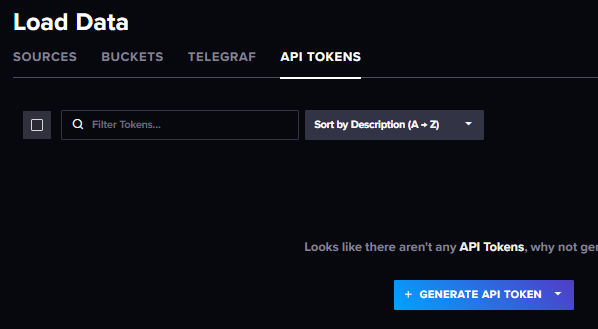

**Технології індустрії 4.0. Лабораторний практикум. ** Автор і лектор: Олександр Пупена 

| [<- до лаборних робіт](README.md) | [на основну сторінку курсу](../README.md) |
| --------------------------------- | ----------------------------------------- |
|                                   |                                           |

# Лабораторна робота №8. Influx DB. Збір даних та основи роботи з вибіркою даних.
Завдання лабораторної роботи навчитися писати дані в базу даних часових рядів Influxdb та ознайомитися з основами роботи з інтерфейсом користувача Influxdb (Influxdb UI) з метою налаштування бази даних, побудови запитів та перегляду даних часових рядів.

**Зверніть увагу, зовнішній вигляд та функції можуть відрізнятися від наведених у даних методичних рекомендаціях. У будь якому випадку курс не передбачає використання платних сервісів. За будь яких відмінностей проконсультуйтеся у викладача!** 

## 1.Створення облікового запису InfluxDB Cloud та знайомство з консоллю

### 1.1. Створення безкоштовного облікового запису InfluxDB Cloud 

- [ ] Перейдіть на сторінку [реєстрації InfluxDB Cloud](https://cloud2.influxdata.com/signup) та заповніть форму або використайте Google чи Microsoft акаунти.
 

- [ ] Введіть довільну назву компанії та організації/проекту та натисніть Continue. 
 

- [ ] Оберіть план використання InfluxDB Cloud – **free tier**.
 

У наступному вікні відмітьте найбільші відповідні опції та натисніть "continue"


### 1.2.Навігація по графічній консолі

У головному вікні ліва бічна панель надає доступ до навігації по всім розділам. На це вікно можна завжди перейти лівої верхньої кнопки.


Наступна кнопка "**Load Data**" дає можливість перейти до вікон керування завантаженням даних.


Зокрема там доступні:

- Sources - для означення ресурсів даних та завантаження існуючих даних
- Buckets - налаштування та керування бакетами (відро), в яких зберігаються дані часових рядів
- Telegraf - налаштування конфігурацій telegraf, який забезпечує один з можливих клієнтських підключень для збору даних
- API Tokens - керування токенами (маркерами) доступу до Influx DB 




- [ ] Перегляньте всі вікна з меню Load Date, що наведені вище.

## 2. Створення нового бакету

**Бакет** – це іменована локація зберігання даних часових рядів. Усі бакети мають період збереження, тривалість часу, протягом якого кожен елемент  даних зберігається. InfluxDB скидає всі елементи даних з мітками часу, старшими за період зберігання бакету. Бакет належить організації.

- [ ] Відкрийте пункт меню "Load data" –> Buckets.
- [ ] Натисніть **+ Create Bucket** у верхньому правому куті.
- [ ] Введіть назву `firstbucket`. У плані використання InfluxDB Cloud **free tier** максимальний період збереження 30 днів, тому налаштування **Delete Data** залиште за замовчуванням.
- [ ] Натисніть **Create**.

 

Після створення, новий бакет з'явиться у списку бакетів.

## 3. Створення токену повного доступу

**Токени API InfluxDB** забезпечують безпечну взаємодію між користувачами та даними. Токен належить організації та визначає дозволи InfluxDB в організації. Токен – це ключ до даних (бакетів, файлів телеграфу). Influxdb надає два типи токенів: [All-Access token](https://docs.influxdata.com/influxdb/cloud/security/tokens/#all-access-token), [Read/Write token](https://docs.influxdata.com/influxdb/cloud/security/tokens/#readwrite-token). 

- All-Access token – надає повний доступ для читання та запису до всіх ресурсів організації.

- Read/Write token – надає доступ для читання, запису або і те й інше до певних бакетів в організації.


- [ ] Відкрийте пункт меню "Load data" –> API Tokens.
- [ ] Натисніть **+ Generate API Token**.
- [ ] Виберіть **All Access API Token**.
- [ ] Напишіть опис токену в полі **Description** , наприклад, `my all access token` та натисність `save`


Після цього з'явиться повідомлення про успішне створення токену

- [ ] Скопіюйте згенерований токен (довгий набір символів), натиснувши кнопку **Copy To Clipboard**.
- [ ] **Обов'язково збережіть скопійований токен** для подальшого використання у лабораторній роботі. Токен доступний для копіювання лише після створення. Після цього закрийте вікно

 

## 4. Налаштування запису даних з OPC UA сервера в influxdb

У цьому пункті ви спробуєте два способи збору та запису даних в InfluxDB. Перший спосіб (4.1) передбачає збір та запис даних з використанням Node-RED та спеціальних вузлів бібліотеки. Другий спосіб (4.2) - використовуючи службу Telegraf. 

### 4.1. Запис даних за допомогою Node red

- [ ] Запустіть тестовий сервер UaCPPServer, з яким ви працювали в Лабораторній роботі №4 – [Робота з OPC UA](lab_opcua.md) 
- [ ] Запустіть Node-RED. Встановіть модуль `node-red-contrib-stackhero-influxdb-v2`.
- [ ] Можете продовжити працювати в проекті Node-Red з лабораторної роботи №4 [Робота з OPC UA](lab_opcua.md) або створити новий проект. Імпортуйте код нового потоку:
```json
[{"id":"760f23939087cb96","type":"tab","label":"OPC UA to influxdb","disabled":false,"info":"","env":[]},{"id":"ab472f9b460178a2","type":"function","z":"760f23939087cb96","name":"multiplesubscribe","func":"msg.payload=10000;\nfor(i=1;i<11;i++){\n   msg.topic=`ns=3;s=AirConditioner_${i}.Temperature`;\n   node.send(msg);\n    }\n","outputs":1,"noerr":0,"initialize":"","finalize":"","libs":[],"x":290,"y":80,"wires":[["a21fad02e87d5aa8"]]},{"id":"c8770202d16a3012","type":"inject","z":"760f23939087cb96","name":"","props":[{"p":"payload"},{"p":"topic","vt":"str"}],"repeat":"","crontab":"","once":true,"onceDelay":0.1,"topic":"","payloadType":"date","x":110,"y":80,"wires":[["ab472f9b460178a2"]]},{"id":"c79ed1b84a742571","type":"debug","z":"760f23939087cb96","name":"","active":false,"tosidebar":true,"console":false,"tostatus":false,"complete":"true","targetType":"full","statusVal":"","statusType":"auto","x":1090,"y":200,"wires":[]},{"id":"a21fad02e87d5aa8","type":"OpcUa-Client","z":"760f23939087cb96","endpoint":"501a96153c7c8d57","action":"subscribe","deadbandtype":"a","deadbandvalue":1,"time":"10","timeUnit":"s","certificate":"n","localfile":"","localkeyfile":"","securitymode":"None","securitypolicy":"None","folderName4PKI":"","name":"","x":500,"y":80,"wires":[["1ef5bdfa8f62c7a1"]]},{"id":"d3727b6cd9633b8f","type":"Stackhero-InfluxDB-v2-write","z":"760f23939087cb96","server":"","name":"InfluxDBwrite","x":1010,"y":80,"wires":[["c79ed1b84a742571"]]},{"id":"24c0e70e64d3ab41","type":"join","z":"760f23939087cb96","name":"","mode":"custom","build":"array","property":"payload","propertyType":"msg","key":"topic","joiner":"\\n","joinerType":"str","accumulate":false,"timeout":"","count":"10","reduceRight":false,"reduceExp":"","reduceInit":"","reduceInitType":"num","reduceFixup":"","x":735,"y":80,"wires":[["769db09ab15b6d24"]],"l":false},{"id":"1ef5bdfa8f62c7a1","type":"switch","z":"760f23939087cb96","name":"","property":"topic","propertyType":"msg","rules":[{"t":"cont","v":"ns=3;s=AirConditioner","vt":"str"}],"checkall":"true","repair":false,"outputs":1,"x":615,"y":80,"wires":[["53fdf054dc0c9e9f"]],"l":false},{"id":"53fdf054dc0c9e9f","type":"function","z":"760f23939087cb96","name":"","func":"let str=\"\";\nlet obj={};\nstr=msg.topic.replace(\"ns=3;s=\",\"\");\nobj.device=str.replace(\".Temperature\",\"\");\nobj.fields={Temperature:msg.payload};\nobj.timestamp=msg.serverTimestamp;\nmsg={};\nmsg.payload=obj;\nreturn msg;","outputs":1,"noerr":0,"initialize":"","finalize":"","libs":[],"x":675,"y":80,"wires":[["24c0e70e64d3ab41"]],"l":false},{"id":"769db09ab15b6d24","type":"function","z":"760f23939087cb96","name":"msgtoinflux","func":"let datastore=[];\nclass sample {\n  constructor(payload) {\n    this.data={\n        measurement:'Building',\n        tags: {\n            device: payload.device,\n        },\n        fields: payload.fields,\n        timestamp: new Date(payload.timestamp).getTime()\n    }\n  }\n}\nfor (let i=0; i<msg.payload.length;i++){\n    dataobj=new sample(msg.payload[i]);\n    datastore.push(dataobj.data);\n}\nmsg.payload = {\n    bucket:'firstbucket',\n    precision: 'ms',\n    data:datastore,\n};\nreturn msg;","outputs":1,"noerr":0,"initialize":"","finalize":"","libs":[],"x":850,"y":80,"wires":[["d3727b6cd9633b8f"]]},{"id":"501a96153c7c8d57","type":"OpcUa-Endpoint","endpoint":"","secpol":"None","secmode":"None","login":false,"credentials":{}}]
```


- [ ] Налаштуйте вузол `OPC UA Client`, прописавши відповідний URL.

 

- [ ] Для вузла InfluxDBwrite необхідно налаштувати джерело даних, в яке будуть записуватися значення температур 10 кондиціонерів кожні 10 секунд. Цим джерелом буде бакет  influxdb "firstbucket", створений в пункті 2. Нижче рисунка наведено опис кожного поля вузла.

 

- [ ] Значення властивості `Host` необхідно взяти з посилання у консолі (див. рис. нижче) між `https://`  та `/org`. Наприклад на рисунку нижче це буде `us-east-1-1.aws.cloud2.influxdata.com`.


 

- [ ] Значення властивості `Port` – необхідно залишити стандартний https port – `443`.
- [ ] В поле `Token` вставте рядок, скопійований та збережений в пункті 3 при створені токену повного доступу. 
- [ ] Значення властивості `Organization` також береться з рядку підключення. Цей Organization ID йде після `orgs` (див. рис. вище).  

- [ ] У полі `Default bucket` вкажіть назву бакету "firstbucket", створеного в пункті 2.

Налаштування матимуть вигляд приблизно як на рисунку нижче.


- [ ] Зверніть увагу на код вузла **msgtoinflux** якщо у Вас відрізняється назва бакета. Значенню властивості об'єкта `msg.payload bucket` повинна відповідати назва бакету, створеного в пункті 2.
   
- [ ] Розгорніть новий потік. Якщо всі налаштування були зроблені правильно, то у вікні відладки Node-RED кожні 10 секунд приходитиме повідомлення з пустим рядком `""`. У іншому випадку буде видавати помилки. 


### 4.2. Запис даних за допомогою Telegraf

Telegraf – серверний агент, який збирає та надсилає метрики з різних джерел даних (баз даних, систем та IoT). Перед тим як збирати дані з OPC UA server за допомогою Telegraf, необхідно його інсталювати на комп'ютер, на якій ви запускаєте UaCPPServer. Для цього необхідно завантажити Telegraf. 

Нижче наведений перелік кроків для встановлення Telegraf на 64-розрядній ОС Windows.

- [ ]  Запустіть Windows Power Shel від **імені адміністратора**.


- [ ] Виконайте команду: 

```powershell
wget http://dl.influxdata.com/telegraf/releases/telegraf-1.22.1_windows_amd64.zip -UseBasicParsing -OutFile telegraf-1.22.1_windows_amd64.zip
```

Ця команда завантажить телеграф конкретної версії. 

- [ ] Дочекайтеся  коли файл буде завантажено, після чого введіть команду

```powershell
Expand-Archive .\telegraf-1.22.1_windows_amd64.zip -DestinationPath 'C:\Program Files\InfluxData\telegraf'
```

- [ ] Після розпакування проконтролюйте що Telegraf зберігається в папці `C:\Program Files\InfluxData\telegraf`. Закрийте Power Shell

Якщо ви працюєте з іншою операційною системою, тоді слідуйте вказівкам із сторінки [завантажень InfluxDB](https://portal.influxdata.com/downloads/), обравши Telegraf v1.22 та відповідну платформу. 

- [ ] Створіть конфігурацію для Telegraf в інтерфейсі користувача InfluxDB cloud. Пункт меню "Load Data" -> Telegraf -> Create Configuration. 

- [ ] Оберіть попередньо створений бакет у випадальному списку "firstbucket".

- [ ] В полі пошуку плагінів для телеграфу, напишіть "opcua". Це прискорить пошук вхідного плагіну, який дозволяє налаштувати телеграф для передачі даних із OPC UA серверу в бакет influxdb.


- [ ] Оберіть плагін "OPC UA Client". Натисніть кнопку "Continue Configuring". 

- [ ] Дайте назву конфігурації, наприклад, `OPC UA server`.
- [ ] Сконфігуруйте плагін, прибираючи потрібні параметри (прибрати "#") та змінюючи їх значення, зокрема:

  - [ ] Змініть конфігурацію вхідного плагіну (`inputs`) як це показано на рисунку нижче. Враховуйте, що значенню параметра `endpoint` відповідає URL OPC UA Вашого сервера. Значення параметру Nodes скопіюйте звідси: 

  - [ ] Змініть налаштування розділу `[[inputs.opcua.group]]` як показано на рис нижче, перелік items наведено нижче рисунку

```json
[
   {name="Humidity", tags=[["device", "AirConditioner_1" ]], identifier="AirConditioner_1.Humidity"},
   {name="Humidity", tags=[["device", "AirConditioner_2" ]], identifier="AirConditioner_2.Humidity"},
   {name="Humidity", tags=[["device", "AirConditioner_3" ]], identifier="AirConditioner_3.Humidity"},
   {name="Humidity", tags=[["device", "AirConditioner_4" ]], identifier="AirConditioner_4.Humidity"},
   {name="Humidity", tags=[["device", "AirConditioner_5" ]], identifier="AirConditioner_5.Humidity"},
   {name="Humidity", tags=[["device", "AirConditioner_6" ]], identifier="AirConditioner_6.Humidity"},
   {name="Humidity", tags=[["device", "AirConditioner_7" ]], identifier="AirConditioner_7.Humidity"},
   {name="Humidity", tags=[["device", "AirConditioner_8" ]], identifier="AirConditioner_8.Humidity"},
   {name="Humidity", tags=[["device", "AirConditioner_9" ]], identifier="AirConditioner_9.Humidity"},
   {name="Humidity", tags=[["device", "AirConditioner_10" ]], identifier="AirConditioner_10.Humidity"},                        
  ]
```

- [ ] Натисніть кнопку "Save and Test".


 

- [ ] З пункту "Configure your API Token" (вікно Test your configuration) скопіюйте згенерований токен в якийсь текстовий файл для подальшого налаштування доступу до конфігураційного файлу та бакету. Вікно конфігурації також можна буде відкривати пізніше через пункт "Setup Instruction" конкретного налаштування Telegraf.  


 

- [ ] У операційній системі вашого ПК створіть змінну середовища `INFLUX_TOKEN`, яка буде зберігати токен доступу, який ви щойно скопіювали. Якщо ви працюєте на ОС Windows: Панель керування -> Система -> Додаткові параметри системи -> Змінні середовища -> Змінні середовища користувача -> Створити. Ім'я змінної – "INFLUX_TOKEN", значення змінної – скопійований токен.


- [ ] З пункту "Start Telegraf" (вікно Test your configuration) скопіюйте в блокнот команду для запуску телеграфа. Атрибут --config вказує на шлях до конфігураційного файлу, який в даному випадку зберігається в influxdb cloud.


 

- [ ] Натисніть **Finish**.

За замовчуванням інтервал запису даних, зазначений у конфігураційному файлі телеграфу, дорівнює 20 секунд. Щоб його змінити, потрібно відкрити конфігураційний файл в інтерфейсі користувача Influxdb: пункт меню "Load data" –> Telegraf, обрати необхідну конфігурацію (в нашому випадку `OPC UA server`). Параметр, який відповідає за інтервал запису, називається "Interval". 
 

Змінювати інтервал не потрібно, залиште конфігураційний файл без змін, натиснувши кнопку **Cancel**.

- [ ] Перейдіть в директорію, де зберігається telegraf – `C:\Program Files\InfluxData\telegraf\telegraf-1.22.1`. Запустіть з папки командний рядок, прописавши в шлях провідника "cmd". В командному рядку виконайте команду для запуску телеграфу, скопійовану у попередньому пункті.  Повинно 


 

Серед повідомлень у вас зявиться попередження, на яке не потрібно звертати увагу:

```
W! [inputs.opcua] Failed to load certificate: open /etc/telegraf/cert.pem: The system cannot find the path specified.
```

- [ ] Якщо видає помилку `401` спробуйте перезавантажити комп'ютер і спробувати знову.

## 5. Основи роботи з вибіркою даних. Data Explorer

Інтерфейс користувача InfluxDB UI це інструмент для роботи з даними часових рядів та InfluxDB. Інтерфейс користувача InfluxDB дозволяє:
- створювати запити для візуалізації даних часових рядів. Для вибору доступний широкий спектр типів візуалізації.
- редагувати код [Flux](https://docs.influxdata.com/influxdb/cloud/query-data/get-started/) (функціональна мова, розроблена спеціально для роботи з форматом даних InfluxDB) у редакторі скриптів Flux.
- редагувати код InfluxQL (SQL-подібний) у редакторі скриптів SQL
- створювати інформаційні панелі – dashboards, та блокноти – notebooks.
- керувати кількома користувачами організації.
- cтворювати та керувати завданнями – [tasks](https://docs.influxdata.com/influxdb/cloud/process-data/get-started/) (скрипт Flux, який виконується за розкладом; скрипт приймає потік вхідних даних, модифікує або аналізує його якимось чином, потім записує змінені дані назад до InfluxDB або виконує інші дії).
- cтворювати перевірки – checks та сповіщення – notifications. Перевірки та сповіщення – це спеціальні типи завдань (task), які дозволяють створювати аварійні повідослення – alerts.

Варто зауважити що повний перелік наведених функцій доступний тільки в платній підписці. 

Data Explorer в інтерфейсі користувача InfluxDB дозволяє створювати, виконувати та візуалізувати запити SQL. **Query Builder** (конструктор запитів) дозволяє створювати SQL запити без написання коду на мові SQL. 

- [ ] У інтерфейсі користувача хмарного сервісу InfluxDB відкрийте пункт меню "Data Explorer". За допомогою Конструктора запитів побудуйте запит зчитування значень температур за останні 15 хвилин трьох довільних кондиціонерів:

1. В розділі From оберіть бакет, в який пишуться дані.
2. В розділі "measurement" оберіть вимірювання **Building**.
3. В розділі "fields" оберіть поле **Temperature**.
4. В розділі "device" оберіть три довільні кондиціонери.
5. В полі вибору часового діапазону **Time range** оберіть останні 15 хв "Past 15m".
6. Натисніть кнопку **Run** для виконання сконфігурованого запиту.


7) Подивіться на таблицю з отриманими результатами


8) Виберіть режим відображення "Graph", у бічній панелі в якості відображення параметр "Temperature" і подивіться лінійний тренд.


- [ ] Проаналізуйте SQL запит, який зробив майстер

```sql
SELECT *
FROM "Building"
WHERE
time >= now() - interval '15 minutes'
AND
("Temperature" IS NOT NULL)
AND
"device" IN ('AirConditioner_1','AirConditioner_10','AirConditioner_2')
```

- [ ] Data Explorer надає різні типи візуалізації даних. Перегляньте наявні візуалізації (Data Explorer –> спадний список) та їх налаштування (кнопка **Customize**) . 

# Питання до захисту. 

1. Що таке бакет Influxdb?
1. Де можна знайти конфігураційні файли телеграфу в Influxdb UI?
1. Для чого потрібні змінні дашбоардів?
1. Як можна подивитися записані дані в Influx DB?  

