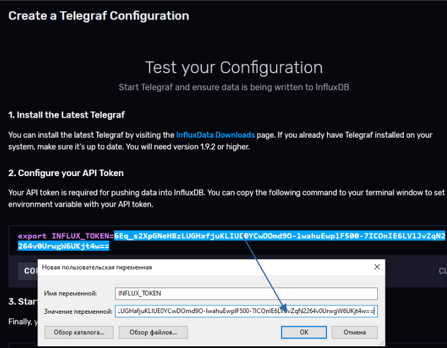
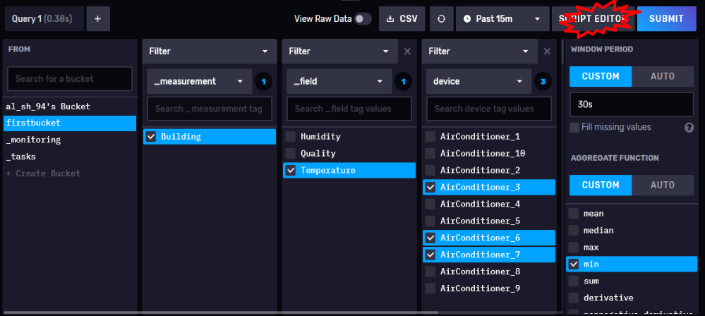

**Технології індустрії 4.0. Лабораторний практикум. ** Автор і лектор: Олександр Пупена 

| [<- до лаборних робіт](README.md) | [на основну сторінку курсу](../README.md) |
| --------------------------------- | ----------------------------------------- |
|                                   |                                           |

# Лабораторна робота №6. Influx DB. Збір даних та основи роботи з вибіркою даних.
# Частина 1

Завдання лабораторної роботи

### 1.Створення безкоштовного облікового запису InfluxDB Cloud
- [ ] Перейдіть на сторінку [реєстрації InfluxDB Cloud](https://cloud2.influxdata.com/signup) та заповніть форму або використайте Google чи Microsoft акаунти.

 

- [ ] Оберіть будь-якого постачальника хмарних послуг і регіон, близький до вашого місця розташування. 

 

- [ ] Оберіть план використання InfluxDB Cloud – **free tier**

 


### 2.Створення нового бакету

 

### 3. Створення токену повного доступу

 

### 4. Налаштування запису даних з OPC UA серверу в influxdb
#### 4.1. Запис даних за допомогою Node red

- [ ] Запустіть тестовий сервер UaCPPServer, з яким ви працювали в Лабораторній роботі №4 – [Робота з OPC UA](lab_opcua.md) 
- [ ] Запустіть Node-RED. Встановіть модуль `node-red-contrib-stackhero-influxdb-v2`.
- [ ] Продовжуйте працювати в проекті Node-Red з лабораторної роботи №4 – [Робота з OPC UA](lab_opcua.md) . Імпортуйте код нового потоку:
```json
[{"id":"760f23939087cb96","type":"tab","label":"OPC UA to influxdb","disabled":false,"info":"","env":[]},{"id":"ab472f9b460178a2","type":"function","z":"760f23939087cb96","name":"multiplesubscribe","func":"msg.payload=10000;\nfor(i=1;i<11;i++){\n   msg.topic=`ns=3;s=AirConditioner_${i}.Temperature`;\n   node.send(msg);\n    }\n","outputs":1,"noerr":0,"initialize":"","finalize":"","libs":[],"x":290,"y":80,"wires":[["a21fad02e87d5aa8"]]},{"id":"c8770202d16a3012","type":"inject","z":"760f23939087cb96","name":"","props":[{"p":"payload"},{"p":"topic","vt":"str"}],"repeat":"","crontab":"","once":true,"onceDelay":0.1,"topic":"","payloadType":"date","x":110,"y":80,"wires":[["ab472f9b460178a2"]]},{"id":"c79ed1b84a742571","type":"debug","z":"760f23939087cb96","name":"","active":false,"tosidebar":true,"console":false,"tostatus":false,"complete":"true","targetType":"full","statusVal":"","statusType":"auto","x":1090,"y":200,"wires":[]},{"id":"a21fad02e87d5aa8","type":"OpcUa-Client","z":"760f23939087cb96","endpoint":"501a96153c7c8d57","action":"subscribe","deadbandtype":"a","deadbandvalue":1,"time":"10","timeUnit":"s","certificate":"n","localfile":"","localkeyfile":"","securitymode":"None","securitypolicy":"None","folderName4PKI":"","name":"","x":500,"y":80,"wires":[["1ef5bdfa8f62c7a1"]]},{"id":"d3727b6cd9633b8f","type":"Stackhero-InfluxDB-v2-write","z":"760f23939087cb96","server":"","name":"InfluxDBwrite","x":1010,"y":80,"wires":[["c79ed1b84a742571"]]},{"id":"24c0e70e64d3ab41","type":"join","z":"760f23939087cb96","name":"","mode":"custom","build":"array","property":"payload","propertyType":"msg","key":"topic","joiner":"\\n","joinerType":"str","accumulate":false,"timeout":"","count":"10","reduceRight":false,"reduceExp":"","reduceInit":"","reduceInitType":"num","reduceFixup":"","x":735,"y":80,"wires":[["769db09ab15b6d24"]],"l":false},{"id":"1ef5bdfa8f62c7a1","type":"switch","z":"760f23939087cb96","name":"","property":"topic","propertyType":"msg","rules":[{"t":"cont","v":"ns=3;s=AirConditioner","vt":"str"}],"checkall":"true","repair":false,"outputs":1,"x":615,"y":80,"wires":[["53fdf054dc0c9e9f"]],"l":false},{"id":"53fdf054dc0c9e9f","type":"function","z":"760f23939087cb96","name":"","func":"let str=\"\";\nlet obj={};\nstr=msg.topic.replace(\"ns=3;s=\",\"\");\nobj.device=str.replace(\".Temperature\",\"\");\nobj.fields={Temperature:msg.payload};\nobj.timestamp=msg.serverTimestamp;\nobj.statuscode=msg.statusCode.value;\nmsg={};\nmsg.payload=obj;\nreturn msg;","outputs":1,"noerr":0,"initialize":"","finalize":"","libs":[],"x":675,"y":80,"wires":[["24c0e70e64d3ab41"]],"l":false},{"id":"769db09ab15b6d24","type":"function","z":"760f23939087cb96","name":"msgtoinflux","func":"let datastore=[];\nclass sample {\n  constructor(payload) {\n    this.data={\n        measurement:'Building',\n        tags: {\n            device: payload.device,\n        },\n        fields: payload.fields,\n        timestamp: new Date(payload.timestamp).getTime()\n    }\n  }\n}\nfor (let i=0; i<msg.payload.length;i++){\n    dataobj=new sample(msg.payload[i]);\n    datastore.push(dataobj.data);\n}\nmsg.payload = {\n    bucket:'firstbucket',\n    precision: 'ms',\n    data:datastore,\n};\nreturn msg;","outputs":1,"noerr":0,"initialize":"","finalize":"","libs":[],"x":850,"y":80,"wires":[["d3727b6cd9633b8f"]]},{"id":"501a96153c7c8d57","type":"OpcUa-Endpoint","endpoint":"","secpol":"None","secmode":"None","login":false,"credentials":{}}]
```


- [ ] Налаштуйте вузол `OPC UA Client`, прописавши відповідний URL.

 

- [ ] Для вузла InfluxDBwrite необхідно налаштувати джерело даних, в яке будуть записуватися значення температур 10 кондиціонерів кожні 10 секунд. Цим джерелом буде бакет influxdb створений в пункті 2. 

 

- [ ] Значення властивості `Host` у випадку використання хмарної версії influxdb можна подивитися у загальних налаштуваннях організації в інтерфейсі користувача influxdb cloud. Пункт меню акаунт (email) ->  Organization -> Settings -> Cluster URL. Наприклад, `westeurope-1.azure.cloud2.influxdata.com`, вказувати `https://` **не потрібно**.

 

- [ ] Значення властивості `Port` – прописуємо стандартний https port – `443`.
- [ ] В поле `Token` – вставляємо рядок скопійований та збережений в пункті 3 при створені токену повного доступу. 
- [ ] Значення властивості `Organization` можна подивитися у загальних налаштуваннях організації в інтерфейсі користувача influxdb cloud. Пункт меню акаунт (email) ->  Organization -> Settings -> Organization ID. 

 

- [ ] `Default bucket` – назва бакету створеного в пункті 2.
- [ ] Зверніть увагу на код вузла **msgtoinflux**. Значенню властивості об'єкта msg.payload bucket повинна відповідати назва бакету, створеного в пункті 2.
 
- [ ] Задеплойте новий потік. Якщо всі налаштування були зроблені правильно, то у вікні відладки кожні 10 секунд приходитиме повідомлення з пустим рядком `""`. 


#### 4.2. Запис даних за допомогою Telegraf
Telegraf – серверний агент, який збирає та надсилає метрики з різних джерел даних (баз даних, систем та IoT). Перед тим як збирати дані з OPC UA server за допомогою Telegraf, необхідно його інсталювати на машину, на якій ви запускаєте UaCPPServer. Для цього завантажте Telegraf. Якщо ви працюєте з операційною системою  Windows, тоді запустіть Windows Power Shell від **імені адміністратора** та виконайте команди: 

```powershell
wget https://dl.influxdata.com/telegraf/releases/telegraf-1.22.1_windows_amd64.zip -UseBasicParsing -OutFile telegraf-1.22.1_windows_amd64.zip
```

```powershell
Expand-Archive .\telegraf-1.22.1_windows_amd64.zip -DestinationPath 'C:\Program Files\InfluxData\telegraf'
```

Тепер Telegraf зберігається в папці `C:\Program Files\InfluxData\telegraf`.

Якщо ви працюєте з іншою операційною системою, тоді слідуйте вказівкам із сторінки [завантажень InfluxDB](https://portal.influxdata.com/downloads/). Оберіть Telegraf v1.22 та відповідну платформу. 

- [ ] Створіть конфігурацію для Telegraf в інтерфейсі користувача InfluxDB cloud. Пункт меню "Load Data" -> Telegraf -> Create Configuration.


 

- [ ] Оберіть попередньо створений бакет у випадальному списку "firstbucket".

- [ ] В полі пошуку плагінів для телеграфу, напишіть "opcua". Це прискорить пошук вхідного плагіну, який дозволяє налаштувати телеграф для передачі даних із OPC UA серверу в бакет influxdb.
- [ ] Оберіть плагін "OPC UA Client". Натисніть кнопку "Continue Configuring".

 

- [ ] Дайте назву конфігурації, наприклад, "OPC UA server".

- [ ] Плагін слід належним чином конфігурувати. Потрібні параметри необхідно розкоментувати (прибрати "#") та означити. Змініть конфігурацію вхідного плагіну наступним чином як на рисунку, враховуйте, що значенню параметра `endpoint` відповідає URL OPC UA сервера. 

 
 

- [ ] Натисніть кнопку "Save and Test".


 

- [ ] З пункту "Configure your API Token" (вікно Test your configuration) скопіюйте згенерований токен для доступу до конфігураційного файлу та бакету.


 

- [ ] Створіть змінну середовища `INFLUX_TOKEN`, вона буде зберігати токен доступу, який ви щойно скопіювали. Якщо ви працюєте на ОС Windows: Панель керування -> Система -> Додаткові параметри системи -> Змінні середовища -> Змінні середовища користувача -> Створити. Ім'я змінної – "INFLUX_TOKEN", значення змінної – скопійований токен.


 

- [ ] З пункту "Start Telegraf" (вікно Test your configuration) скопіюйте команду для запуску телеграфа. Атрибут --config вказує на шлях до конфігураційного файлу, який в даному випадку зберігається в influxdb cloud.


 

- [ ] Перейдіть в директорію, де зберігається telegraf – `C:\Program Files\InfluxData\telegraf\telegraf-1.22.1`. Запустіть з папки командний рядок, прописавши в шлях провідника "cmd". В командному рядку виконайте команду для запуску телеграфу. 


 


### 5. Робота з інтерфейсом користувача Influxdb

Інтерфейс користувача InfluxDB UI це інструмент для роботи з даними часових рядів та InfluxDB. Інтерфейс користувача InfluxDB дозволяє:
- створювати запити для візуалізації даних часових рядів. Для вибору доступний широкий спектр типів візуалізації.
- редагувати код [Flux](https://docs.influxdata.com/influxdb/cloud/query-data/get-started/) (функціональна мова, розроблена спеціально для роботи з форматом даних InfluxDB) у редакторі скриптів Flux.
- створювати інформаційні панелі – dashboards, та блокноти – notebooks.
- керувати кількома користувачами організації.
- cтворювати та керувати завданнями – [tasks](https://docs.influxdata.com/influxdb/cloud/process-data/get-started/) (скрипт Flux, який виконується за розкладом; скрипт приймає потік вхідних даних, модифікує або аналізує його якимось чином, потім записує змінені дані назад до InfluxDB або виконує інші дії).
- cтворювати перевірки – checks та сповіщення – notifications. Перевірки та сповіщення – це спеціальні типи завдань (task), які дозволяють створювати аварійні повідослення – alerts.

#### 5.1. Основи роботи з вибіркою даних. Data Explorer
Data Explorer в інтерфейсі користувача InfluxDB дозволяє створювати, виконувати та візуалізувати запити Flux. **Query Builder** (конструктор запитів) дозволяє створювати Flux запити без написання коду на мові Flux, а **Script Editor** (редактор скриптів) – це редактор коду Flux, де можна вручну редагувати запит. При переході на сторінку Data Explorer, за замовчуванням завантажується Конструктор запитів.

- [ ] Відкрийте Data Explorer в інтерфейсі користувача InfluxDB. За допомогою Конструктора запитів побудуйте запит зчитування значень температур за останні 15 хвилин трьох довільних кондиціонерів:

1. В розділі From оберіть бакет, в який пишуться дані.
2. В наступному розділі "Filter" (автоматично обрано тег "\_measurement" ) оберіть вимірювання "Building".
3. В наступному "Filter" (автоматично обрано тег "\_field" ) оберіть поле "Temperature".
4. В наступному "Filter" (автоматично обрано тег "device" ) оберіть поле три довільні кондиціонери.
5. В полі вибору часового діапазону "Time range" оберіть останні 15 хв "Past 15m".
6. Натисніть кнопку "Submit" для виконання сконфігурованого запиту.
6. Проаналізуйте лінійний тренд.


 


- [ ] Змініть період та [функцію агрегування](https://docs.influxdata.com/flux/v0.x/function-types/#aggregates) значень: у віконці "Window period" оберіть `Custom` та виставте `30s`;  у віконці "Aggregate functions" оберіть `Custom` та виставте функцію `min`. Проекспериментуйте з різними функціями агрегування.


 


- [ ] Перегляньте та проаналізуйте код побудованого запиту на мові Flux, натиснувши кнопку `SCRIPT EDITOR`. Основи мови Flux буде розглянуто в другій частині лабораторної роботи присвяченої InfluxDB.


 

#### 5.2. Налаштування інформаційних панелей

- [ ] Створіть новий Dashboard з назвою "Building":
  1. У навігаційному меню ліворуч виберіть **Dashboards**.

    
  
  2. Натисніть **+ Create Dashboard** у верхньому правому куті та виберіть **New Dashboard**.
  3. Введіть назву для своєї інформаційної панелі в поле **Name this dashboard** у верхньому лівому куті.


- [ ] Додайте нову комірку з лінійним трендом "Humidity" для першого кондиціонера. Для цього натисніть **Add Cell**, щоб відкрити Data Explorer і налаштувати нову комірку для інформаційної панелі.

- [ ] Побудуйте запит на читання значень "Humidity" одного кондиціонера "AirConditioner_1" за останні 15 хвилин, не застосовуючи функцію агрегування.


    

- [ ] Налаштуйте відображення тренду: 
  1. Згладжування тренду (опція Interpolation -> Smooth)
  1. Заповнення простору під лінією, (опція "Shade Area Below Lines").
  1. Назва осі Y `Humidity`.
  1. Одиниці вимірювання `%` на осі Y (опція "Y Axis Suffix").
  1. Статичне відображення легенди (опція "Display Static Legend").


- [ ] Дайте назву комірці – `Humidity`. Збережіть налаштування комірки.

  1. Введіть назву комірки в поле **Name this cell** у верхньому лівому куті.
  2. Для збереження натисніть "Галочку" у верхньому правому куті.
      
- [ ] Розтягніть комірку у всю ширину сторінки.


- [ ] Вручну оновіть Dashboard.


 

- [ ] Налаштуйте автоматичне оновлення кожні 30 секунд Dashboard (опція "Set Auto Refresh").


 

 

Створіть змінну Dashboard (Dashboard Variable) для зміни конкретних компонентів запитів без необхідності редагування запитів.


# Питання до захисту. 

1. 

