**Технології індустрії 4.0. Лабораторний практикум. ** Автор і лектор: Олександр Пупена 

| [<- до лаборних робіт](README.md) | [на основну сторінку курсу](../README.md) |
| --------------------------------- | ----------------------------------------- |
|                                   |                                           |

# Лабораторна робота №10. Робота з запитами на мові flux в Grafana

## Порядок виконання лабораторної роботи

### 1. Запуск та перевірка роботи Node-RED

- [ ] Запустіть OPCUA сервер `UaCPPServer` та `node-red`, тобто відновіть запис даних з OPC UA сервера в `influxdb`, який було налаштовано в лабораторній роботі по Influxdb.
- [ ] У інтерфейсі користувача хмарного сервісу InfluxDB відкрийте пункт меню "Data Explorer" і передивіться чи пишуться дані на сервер, як це описано в лабораторній роботі [по InfluxDB](lab_influx1.md).

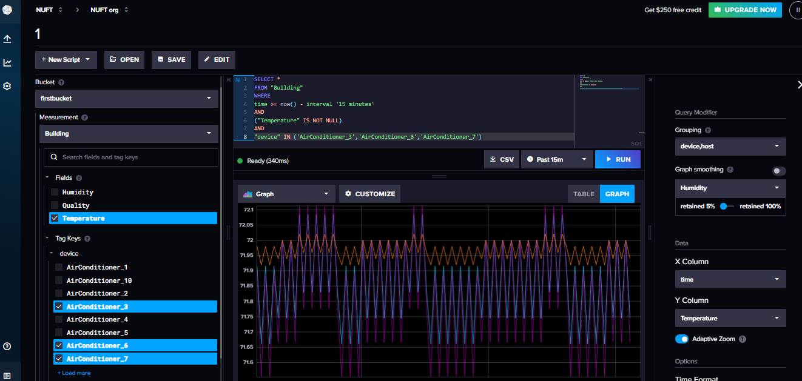

рис.1. Перевірка даних в Influx DB 

### 2. Аналіз базового запиту в Grafana

- [ ] Уважно прочитайте додаток 1

- [ ] Зайдіть у аккаунт Grafana, перейдіть в розділ `Explorer`

- [ ] В поле введення запиту `A` введіть наступний запит

```js
from(bucket: "firstbucket") //джерело даних
 |> range(start: v.timeRangeStart, stop: v.timeRangeStop) // фільтрація даних за часом
```

- [ ] У полі часу виберіть останні 5 хвилин та натисніть `Run query` 

За замовченням Ви отримаєте графік, як показано на рисунку нижче:

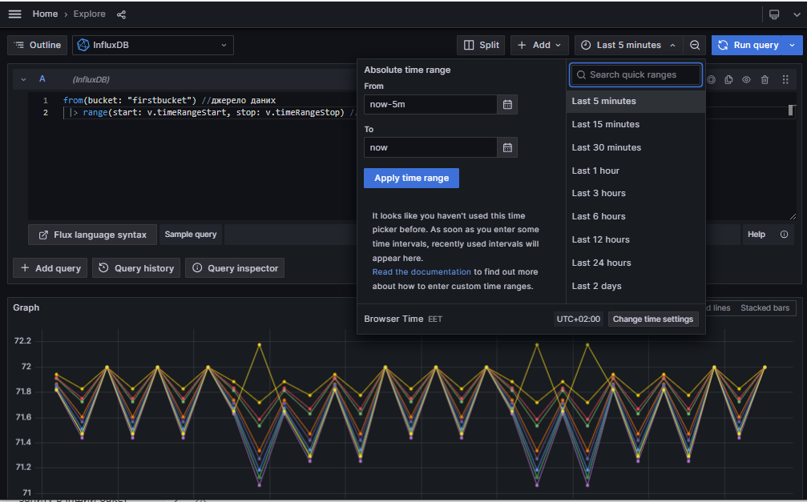

- [ ] Прокрутіть полосу прокрути нижче, щоб отримати табличне представлення

 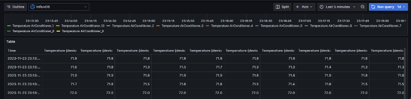

- [ ] Натисніть кнопку `Qery Inspector`

У вікні що з'явиться можна переглянути кілька результатів.

- [ ] Перемкніться на закладку `Stats`, подивіться статистичні дані запиту:  


- [ ] Переключіться на закладку `Query` і натисніть `Refresh`. На ній видно який запит відправляється по REST API та відповідь. 

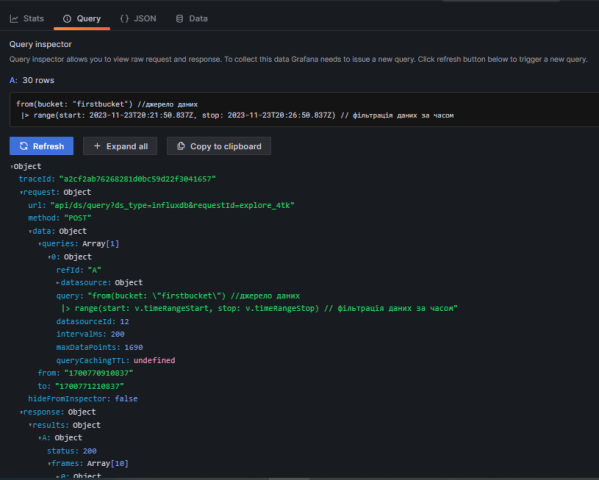

- [ ] Подивіться дані відповіді в форматі JSON

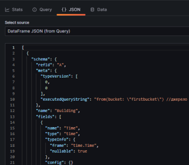

- [ ] Подивіться дані відповідей у вигляді таблиць

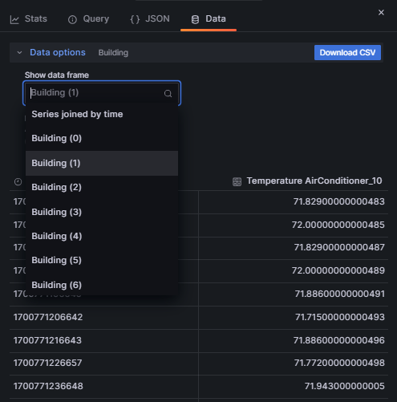

### 3. Фільтр за полями та тегами

- [ ] Перейдіть у редактор скриптів. Проаналізуйте скрипт: в даному випадку запит включає 

- означення джерела даних 
- означення вибірки за часом (останні 5 хв)
- фільтрацію даних за:
  - назвою `_measurement`
  - полями `_field` зі значенням `Temperature`
  - тегами `device` 

```js
from(bucket: "firstbucket")
 |> range(start: -5m)
 |> filter(fn: (r) => r["_measurement"] == "Building")
 |> filter(fn: (r) => r["_field"] == "Temperature")
 |> filter(fn: (r) => r["device"] == "AirConditioner_1" or r["device"] == "AirConditioner_7")
```

- [ ] Запустіть запит з означенням часу за останні 5 хвилин. Подивіться на результат у вигляді графіку та таблиці. Зробіть копії екрану для звіту.  

### 4. Статистичні розрахунки

- [ ] З додатку 1 прочитайте про функції `mean()`, `max()` та `yield`
- [ ] Розрахуйте середнє значення вибірки для кожного кондиціонера, додавши до скрипта наступний рядок:


```js
|> mean()
```

- [ ] Проаналізуйте отриману відповідь у табличному вигляді. Зверніть увагу на кількість та значення рядків.

- [ ] Виведіть максимальне значення з вибірки для кожного кондиціонера, зберігаючи при цьому розрахунок середнього значення. Для цього напишіть наступний скрипт:

```js
data=from(bucket: "firstbucket")
 |> range(start: v.timeRangeStart, stop: v.timeRangeStop)
 |> filter(fn: (r) => r["_measurement"] == "Building")
 |> filter(fn: (r) => r["_field"] == "Temperature")
 |> filter(fn: (r) => r["device"] == "AirConditioner_1" or r["device"] == "AirConditioner_7")
 |> limit(n:4)
data  
   |> mean()
   |> yield(name:"mean")
data  
   |> max()
   |> yield(name:"max")
```

- [ ] Проаналізуйте отриманий результат (рис.5). 

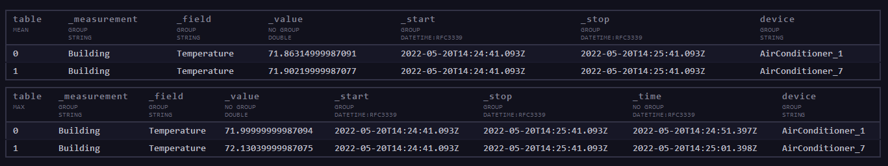

рис.5. Результат виконання розрахунку максимальних зачень

У зв'язку з тим, що виникла необхідність представити кілька результатів (розрахунок середнього і максимального), тут використано функцію `yield()`. Функція `yield()` вказує на те, що отримані вхідні таблиці мають бути **показані** як результат запиту. `yield()` виводить вхідний потік без змін. Запит може мати кілька результатів, кожен із яких ідентифікується іменем, наданим функції `yield()`.

Зверніть увагу, що на відміну від попередніх прикладів, проміжний результат запиту присвоюється змінній `data`.  Тобто для проміжного збереження вибірки використовується змінна `data`, щоб далі по різному обробити дану вибірку. В даному прикладі видно, що змінній може присвоюватися не конкретний літерал, а цілий потік операцій, реалізований за допомогою оператора `|>`. Тобто змінна `data` в даному випадку – це потік таблиць (дві таблиці), які отримані з конкретного джерела даних, відфільтровані за часом, за значеннями стовпців і обмежені 4-ма першими рядками. Далі змінна data використовується як вхід функції `mean()` та вхід функції `max()`.

### 7. Групування таблиць

- [ ] Почитайте про модифікацію структури представлення даних з додатку 1.
- [ ] Модифікуйте запит, виводячи мінімальне значення температури серед усіх значень температур обох кондиціонерів. Модифікований скрипт матиме вигляд:


```js
data=from(bucket: "firstbucket")
 |> range(start: v.timeRangeStart, stop: v.timeRangeStop)
 |> filter(fn: (r) => r["_measurement"] == "Building")
 |> filter(fn: (r) => r["_field"] == "Temperature")
 |> filter(fn: (r) => r["device"] == "AirConditioner_1" or r["device"] == "AirConditioner_7")
 |> limit(n:4)
data  
   |> mean()
   |> yield(name:"mean")
data  
   |> max()
   |> yield(name:"max")
data  
   |> group(columns: ["_field"])
   |> yield(name:"allinonetable")
   |> min()
   |> yield(name:"min")
```

- [ ] Проаналізуйте резульати запитів.

Оскільки, функцію пошуку мінімального значення `min()` потрібно застосувати до всіх значень температур незалежно від приналежності до кондиціонера, необхідно об'єднати всі температури в одну таблицю. Це можна зроби змінивши груповий ключ (`group key`), тобто застосувавши функцію `group()` з параметром **columns**, по якому групуються рядки в таблиці. Для всіх температур значення стовпчика **_field** є однаковим. Таким чином об'єднавши всі рядки функція `min()` застосовується до всіх значень температур. 

### 8. Фільтрація за умовою

- [ ] Почитайте про фільтрацію даних з додатку 1.

- [ ] Перевірте роботу запиту для фільтрування загальної вибірки температур за останню хвилину двох довільних кондиціонерів ( незалежно від кондиціонера) за умовою: температура > 72. Запит матиме вигляд:

```js
from(bucket: "firstbucket")
 |> range(start: v.timeRangeStart, stop: v.timeRangeStop)
 |> filter(fn: (r) => r["_measurement"] == "Building")
 |> filter(fn: (r) => r["_field"] == "Temperature")
 |> filter(fn: (r) => r["device"] == "AirConditioner_1" or r["device"] == "AirConditioner_7")
 |> group(columns: ["_field"])
 |> yield(name: "before")
 |> filter(fn: (r) => r._value > 72.0)  
 |> yield(name: "filtered")
```

- [ ] Проаналізуйте результат. 

В цьому запиті використовується функція `filter()` з параметром `fn`, який є функцією предиката, тобто означує умову.

- [ ] Відфільтруйте значення температур за останню хвилину двох довільних кондиціонерів за наступною умовою: значення температур першого кондиціонера > 72 і значення температур другого кондиціонера < 72. Для цього виконайте наступний запит:

```js
from(bucket: "firstbucket")
 |> range(start: v.timeRangeStart, stop: v.timeRangeStop)
 |> filter(fn: (r) => r["_measurement"] == "Building")
 |> filter(fn: (r) => r["_field"] == "Temperature")
 |> filter(fn: (r) => r["device"] == "AirConditioner_1" or r["device"] == "AirConditioner_7")
 |> yield(name: "before")
 |> filter(fn: (r) => if r["device"] == "AirConditioner_1"
 then r._value>72.0
 else r._value<72.0)
 |> yield(name: "conditions")
```

### 9. Агрегування даних

- [ ] Почитайте про функції агрегування, зокрема про `aggregateWindow`, що наведені в додатку 2. 

- [ ] Побудуйте два графіки: 
  - всі значення температур першого кондиціонера за останні 5 хвилин; 
  - усередненні значення температур першого кондиціонера за останні 5 хвилин (період усереднення 30s). 

- Для цього виконайте наступний запит та виведіть їх у формі графіку (вікдлючити View raw data) за 5 хвилин:

```js
from(bucket: "firstbucket")
 |> range(start: v.timeRangeStart, stop: v.timeRangeStop)
 |> filter(fn: (r) => r["_measurement"] == "Building")
 |> filter(fn: (r) => r["_field"] == "Temperature")
 |> filter(fn: (r) => r["device"] == "AirConditioner_1")
 |> yield(name: "before")
 |> aggregateWindow(every: 30s, fn: mean, createEmpty: false)
 |> yield(name: "mean")
```

- [ ] Проаналізуйте отримані результати.

### 10. Відображення даних у формі Band

У даному пункті необхідно побудувати графік усереднених значень температур першого кондиціонера за 15 хвилин з відображенням верхньої (максимальне за період агрегування) та нижньої (мінімальне за період агрегування) межі. 

- [ ] Виконайте наступний запит:

```js
data=from(bucket: "firstbucket")
 |> range(start: v.timeRangeStart, stop: v.timeRangeStop)
 |> filter(fn: (r) => r["_measurement"] == "Building")
 |> filter(fn: (r) => r["_field"] == "Temperature")
 |> filter(fn: (r) => r["device"] == "AirConditioner_1")
 data |> aggregateWindow(every: 30s, fn: mean, createEmpty: false)
 |> yield(name: "mean")
data |> aggregateWindow(every: 30s, fn: max, createEmpty: false)
 |> yield(name: "max")
data |> aggregateWindow(every: 30s, fn: min, createEmpty: false)
 |> yield(name: "min")
```
- [ ] Використовуйте візуалізацію **Band**, який зображує значення Main Column в межах порогів `Upper Column` та `Lower Column` . Візуалізацію налаштуйте наступним чином:

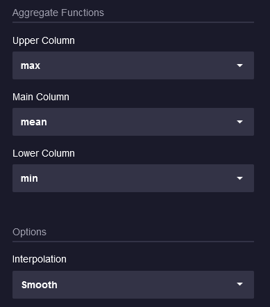

рис.6. Налаштування  **Band**

### 11. Виведення даних у реляційну таблицю 

У цьому пункті необхідно відобразити у вигляді реляційної таблиці температури двох кондиціонерів за останні 5 хвилин. 

- [ ] З додатку 2 дізнайтеся про функції `pivot` та `keep`
- [ ] Виконайте наступний запит (Візуалізація із ввімкненою опцією View Raw Data):

```js
from(bucket: "firstbucket")
 |> range(start: v.timeRangeStart, stop: v.timeRangeStop)
 |> filter(fn: (r) => r["_measurement"] == "Building")
 |> filter(fn: (r) => r["_field"] == "Temperature")
 |> filter(fn: (r) => r["device"] == "AirConditioner_1" or r["device"] == "AirConditioner_6")
 |> pivot(rowKey:["_time"], columnKey: ["device"], valueColumn:"_value" )
 |> keep(columns: ["_time", "AirConditioner_1","AirConditioner_6"] )
 |> yield(name: "Temperature")
```

- [ ] Зверніть увагу на табличне представлення виводу, зокрема на назви стовпців. Функція `pivot()` допомагає приводити таблиці баз даних часових рядів до реляційного вигляду.

### 12. Формування нових стовпчиків в таблиці 

- [ ] Обрахуйте різницю температур двох кондиціонерів у кожен момент часу, створивши додатковий стовпчик. Для цього використайте наступний запит:

```js
from(bucket: "firstbucket")
 |> range(start: v.timeRangeStart, stop: v.timeRangeStop)
 |> filter(fn: (r) => r["_measurement"] == "Building")
 |> filter(fn: (r) => r["_field"] == "Temperature")
 |> filter(fn: (r) => r["device"] == "AirConditioner_1" or r["device"] == "AirConditioner_6")
 |> pivot(rowKey:["_time"], columnKey: ["device"], valueColumn:"_value" )
 |> keep(columns: ["_time", "AirConditioner_1","AirConditioner_6"] )  
 |> map(fn: (r)=>({r with difference:r.AirConditioner_1-r.AirConditioner_6})  )
 |> yield(name: "Temperature")
```

- [ ] Зверніть увагу на табличне представлення виводу, зокрема на назви та значення стовпців.

### 13. Запис результатів запиту в інший бакет 

- [ ] Створіть бакет з іменем `stsconds`.

- [ ] Виконайте наступний запит, який створює таблицю, що зберігає стани першого кондиціонера та записує її в інший бакет. 

```js
import "influxdata/influxdb"
import "array"
import "date"
arr1={_time:date.sub(from: now(), d: 10s ),_measurement: "Building",_field:"state", _value:1.0,device:"AirConditioner_1"}
arr2={_time:date.sub(from: now(), d: 20s ),_measurement: "Building",_field:"state", _value:0.0,device:"AirConditioner_1"}
arr3={_time:date.sub(from: now(), d: 1m ),_measurement: "Building",_field:"state", _value:1.0,device:"AirConditioner_1"}
arr4={_time:date.sub(from: now(), d: 1h ),_measurement: "Building",_field:"state", _value:0.0,device:"AirConditioner_1"}
array.from(rows: [arr1, arr2, arr3, arr4])
 |> influxdb.to(bucket: "stsconds")
```

- [ ] Перевірте, що дані дійсно збережено у бакеті.

В цьому запиті використовується функція [array.from()](https://docs.influxdata.com/flux/v0.x/stdlib/array/from/), яка дозволяє вручну створювати таблиці. Для запису даних у бакет за допомогою Flux використовується функція influxdb.to().

### 14. Створення комірок в дашбоарді для відображення основних статистичних показників 

- [ ] **Самостійно!** Створіть комірки на дашбоарді (з першої частини лабораторної роботи) для відображення основних статистичних показників по температурі для кожного кондиціонера: математичне сподівання,  середньоквадратичне відхилення, мода, медіана. Для візуалізації використовуйте **Single stat**

## Питання до захисту

1. Для чого використовується оператор `pipe forward` `|>`?

1. Як фільтрувати дані за тегами, з використанням логічного "і" чи "або"?
1. Для чого використовується функція `map()`?
1. Яка структура базового запиту?
1. Назвіть приклади функцій агрегування.
1. Назвіть функції для фільтрації за часом.
1. Назвіть приклади функцій вибору (селектори).


## Додаток 1. Синтаксис Flux

### Д1.1. Модель даних Flux

Завдання лабораторної роботи ознайомитися з мовою flux, навчитися будувати базові запити на мові flux. Перші два пункти лабораторної роботи містять теоретичний матеріал, **третій пункт – практичний**.

[Flux](https://docs.influxdata.com/flux/v0.x/get-started/) — це функціональна скриптова мова, розроблена для виконання широкого спектру операцій обробки даних та аналітичних операцій.

Модель даних Flux включає в себе:

- Stream of tables – потік таблиць
- Table – таблиця
- Column – стовпчик
- Row – рядок
- Group key – груповий ключ

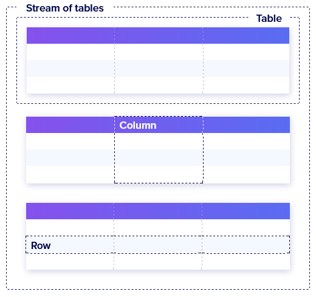

рис.Д1. Модель даних Flux

**Потік таблиць (stream of tables)** – це набір з нуля або більше таблиць. Джерела даних повертають результати у вигляді потоку таблиць. 

**Таблиця** — це набір рядків, об'єднаних за груповим ключем. 

**Стовпець** — це набір значень одного й того самого типу, що містить одне значення (value) для кожного рядка. 

**Рядок** — це набір відповідних значень стовпців. 

**Груповий ключ** означує, які стовпці та конкретні значення стовпців включати в таблицю. Усі рядки таблиці містять однакові значення в ключових стовпцях групи. Усі таблиці в потоці таблиць мають унікальний груповий ключ, але зміни групового ключа застосовуються до потоку таблиць. Тобто за груповим ключом усі записи обєднуються в таблиці.

### Д1.2. Основи побудови запитів flux  

Нижче наведений приклад запиту на мові flux 

```js
from(bucket: "firstbucket") //джерело даних
 |> range(start: v.timeRangeStart, stop: v.timeRangeStop) // фільтрація даних за часом
 |> filter(fn: (r) => r["_measurement"] == "Building") //фільтрація за значеннями стовпців
 |> filter(fn: (r) => r["_field"] == "Temperature")//фільтрація за значеннями стовпців
 |> filter(fn: (r) => r["device"] == "AirConditioner_1")//фільтрація за значеннями стовпців
 |> group(columns:["_measurement"]) //зміна структури даних
 |> max() // обробка даних
```

Більшість запитів на мові Flux включають такі кроки:

- Означення джерела даних 
- Фільтрація
- Модифікація структури представлення даних
- Обробка даних

#### Означення джерела даних

Вхідні функції ([input functions](https://docs.influxdata.com/flux/v0.x/function-types/#inputs)) отримують дані з різних джерела даних. Усі функції введення повертають потік таблиць (stream of tables). Flux підтримує кілька джерел даних, включаючи бази даних часових рядів (такі як InfluxDB і Prometheus), реляційні бази даних (такі як MySQL і PostgreSQL), CSV тощо. Зокрема функція `from()` надає дані з influxdb тієї ж організації бази даних, функція `sql.from()` - з джерел даних SQL. 

##### from()

Вхідна функція  `from()`  надає дані з influxdb. У прикладі вище, фрагмент  

```js
from(bucket: "firstbucket") 
```

звертається до бакета "firstbucket" як до джерела даних з тієї ж організації бази даних  Синтаксис передбачає також звернення до інших хостів:  

```js
from(
    bucket: "example-bucket",
    host: "https://example.com",
    org: "example-org",
    token: "MySuP3rSecr3Tt0k3n",
)
```

#### Спрямування потоку даних

Флюкс запит описує порядок обробки потоку даних.  Для того щоб вказати, щоб результати виконання функції передавилися наступній функції за потоком, використовується оператор `|>` (Pipe-forward).

##### Оператор Pipe-forward `|>`

Оператор `|>` (Pipe-forward) направляє вихід однієї функції як вхід до наступної функції. У наведеному вище прикладі, потік таблиць з бакету "firstbucket" передається наступній функції з іменем `range`

```js
from(bucket: "firstbucket") //джерело даних
 |> range(start: v.timeRangeStart, stop: v.timeRangeStop) // фільтрація даних за часом
```

#### Фільтрація

Враховуючи що дані з джерела потрібні надаватися відповідно до певних умов (часовий діапазон, необхідні теги та все інше), згідно потребам, в запиті необхідно вказати умови фільтрації.  У мові `flux` для цього є функції фільтрації, які перебирають і оцінюють кожен рядок введення, щоб перевірити, чи відповідає він заданим умовам. Тільки рядки, що відповідають умовам, включаються у вихідні дані функції. А рядки, які не відповідають вказаним умовам - видаляються. 

Flux надає такі основні функції фільтрації: `range()` та `filter()`

##### range()

Функція [`range()`](https://docs.influxdata.com/flux/v0.x/stdlib/universe/range/) фільтрує дані за часом, тобто записи кожної вхідної таблиці фільтруються, у межах означеного часу. 

```js
from(bucket: "firstbucket") 
range(start: -12h, stop: -15m)
//
range(start: 2018-05-22T23:30:00Z, stop: 2018-05-23T00:00:00Z)
```

Функція має два параметри:

**start** – час, починаючи з якого виводяться результати; може бути заданий значенням типу `duration`, `time`, `int`  (див. додаток 2) 

**stop** – час, до якого виводяться результати; може бути заданий значенням типу `duration`, `time`, `int`  (див. додаток 2) .

##### filter()

Функція [`filter()`](https://docs.influxdata.com/flux/v0.x/stdlib/universe/filter/) фільтрує дані за значеннями стовпців. Для фільтрування використовується функція, яка перевіряє для кожного рядку усіх таблиць потоку, умову спрацювання. Рядки, для яких умова справджується передаються далі по потоку. 

Для означення функції в flux використовують синтаксис функцій-стрілок, аналогічно як в js. Наприклад:

```js
function1 = (arg1) => arg1>5.0 //обявлення функції function1
function1 (arg1: 8.0) //виклик функції з передачею аргументу зі значенням 8.0
```

У першому рядку об'явили функцію з іменем `function1`, в якій використовується один аргумент з назвою  `arg1`. Функція повертає результат порівняння (`true` або `false`). Другий рядок викликає цю функцію з аргументом `8.0`, тому повертає `true`. Це проста функція, яка не потребує внутрішніх змінних. У flux передбачений також варіант написання власних функцій з внутрішніми змінними ([деталі](https://docs.influxdata.com/flux/v0.x/define-functions/)).     

Функцію, яка повертає результат умови порівняння (аналогічно наведеної вище), називають функцією предиката. Вираз-предикат порівнює значення за допомогою операторів порівняння, логічних операторів.

У наведеному спочатку прикладі запиту в функції `filter()`, в якості аргументу `fn` використовується функція предиката для фільтрації рядків. Ця функція предикату немає імені (в js також є такий синтаксис), а в якості аргументу приймає змінну `r`, що є рядком (записом, record). У цій функції прикладу перевіряється чи поле  `_measurement` в записі (`r["_measurement"]`) дорівнює "Building". 

```js
from(bucket: "firstbucket") //джерело даних
 |> range(start: v.timeRangeStart, stop: v.timeRangeStop) // фільтрація даних за часом
 |> filter(fn: (r) => r["_measurement"] == "Building") //фільтрація за значеннями стовпців
 |> filter(fn: (r) => r["_field"] == "Temperature")//фільтрація за значеннями стовпців
 |> filter(fn: (r) => r["device"] == "AirConditioner_1")//фільтрація за значеннями 
```

Таким чином, наведений вище фрагмент буде пропускати тільки ті рядки, в яких "\_measurement" буде дорівнювати "Building", "\_field" буде дорівнювати  "Temperature" і "device" - "AirConditioner_1".

#### Модифікація структури представлення даних

Нагадаємо, що результатом роботи запитів flux є як правило кілька таблиць (потік таблиць), кожна з яких формується за спільним груповим ключем. Часто ці таблиці треба групувати за різними критеріями (значення стовпців, часом, назв стовпців), або навпаки розділювати, видаляти стовпці і т.п. Для перегрупування даних використовуються спеціальні функції, які змінюють представлення даних, шляхом формування групового ключа. До даних функцій відноситься `group()`, яка змінює груповий ключ шляхом явної вказівки стовпців для його формування (як аргумент `columns`). 

 В наведеному ничже фрагменті з відфільтрованих значень формуються таблиці, що мають однакові значення поля "_measurement". Враховуючи що усі записи після фільтрації мають `r["_measurement"] == "Building"` , це буде одна таблиця.

```js
from(bucket: "firstbucket") //джерело даних
 |> range(start: v.timeRangeStart, stop: v.timeRangeStop) // фільтрація даних за часом
 |> filter(fn: (r) => r["_measurement"] == "Building") //фільтрація за значеннями стовпців
 |> filter(fn: (r) => r["_field"] == "Temperature")//фільтрація за значеннями стовпців
 |> filter(fn: (r) => r["device"] == "AirConditioner_1")//фільтрація за значеннями стовпців
 |> group(columns:["_measurement"]) //зміна структури даних
 |> max() // обробка даних
```

Для зміни групового ключа також використовуються функції: 

- `window()`: розділення таблиці на кілька таблиць за вказаним періодом, що приводить до зміни значення `_start` і `_stop` у рядках ([деталі](https://docs.influxdata.com/flux/v0.x/stdlib/universe/window/))

- `pivot()`: для приведення до вигляду канонічного реляційного формату ([деталі](https://docs.influxdata.com/flux/v0.x/stdlib/universe/pivot/))
- `drop()`: для видалення окремих стовпців ([деталі](https://docs.influxdata.com/flux/v0.x/stdlib/universe/drop/))
- `keep()`: для зберігання конкретних стовпців та видалення всіх інших ([деталі](https://docs.influxdata.com/flux/v0.x/stdlib/universe/keep/))

#### Обробка даних

Обробка даних передбачає різноманітні маніпуляції зі значеннями даних. Наприклад в наведеному нижче фрагменті після групування вибираються максимальні значення з усіх таблиць (тобто одне, бо таблиця одна). 

```js
from(bucket: "firstbucket") //джерело даних
 |> range(start: v.timeRangeStart, stop: v.timeRangeStop) // фільтрація даних за часом
 |> filter(fn: (r) => r["_measurement"] == "Building") //фільтрація за значеннями стовпців
 |> filter(fn: (r) => r["_field"] == "Temperature")//фільтрація за значеннями стовпців
 |> filter(fn: (r) => r["device"] == "AirConditioner_1")//фільтрація за значеннями стовпців
 |> group(columns:["_measurement"]) //зміна структури даних
 |> max() // обробка даних
```

Обробка даних може приймати різні форми і включає наступні типи операцій (див. додаток 2):

- Агрегування даних
- Вибірка конкретних точок
- Перерахунок та Перезапис рядків

## Додаток 2. Типи даних, функції та оператори flux

### Базові типи даних

До базових типів належать:

- Boolean
- Duration
- String
- Time
- Float
- Integer
- Bytes
- Unsigned integers
- Nulls

#### Boolean

```js
var1=true
var2=false
```

Для перетворення базових типів у тип boolean використовується функція `bool()`:

- string: має приймати значення "true" або "false".
- float: має приймати значення 0.0 (false) або 1.0 (true).
- int: має приймати значення 0 (false) або 1 (true).
- uint: має приймати значення 0 (false) або 1 (true)

```js
bool(v: 0.0)
// Повертає false
```

Щоб перетворити стовпець **_value** на логічні значення, використовується функція `toBool()` (працює виключно із стовпцем **_value**).

```js
data
    |> toBool()
```

Щоб перетворити будь-який стовпець на логічні значення, використовуються функції `map()` та `bool()`.

```js
import "array"
data=array.from(rows:[{state:1.0},{state:0.0},{state:1.0}] )
data
  |> map(fn: (r) => ({ r with state: bool(v: r.state) }))
```

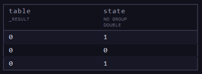 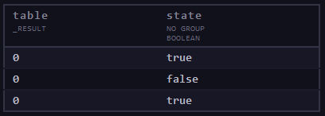

рис.Д2. Результат роботи прикладу з використанням `map` та  `bool`

#### Duration

Тип **duration** представляє проміжок часу з наносекундною точністю.
Представлення типу duration містить число (integer) і специфікатор одиниць.

- ns: наносекунда
- us: мікросекунда
- ms: мілісекунда
- s: секунда
- m: хвилина
- h: година
- d: день
- w: тиждень
- mo: календарний місяць
- y: календарний рік

```js
var1=1s
var2=3d7h9m15s
```

Для перетворення базових типів **string** (рядок, що вказує на тривалість), **int** (тривалість представлена в наносекундах), **uint** (тривалість представлена в наносекундах) у тип **duration** використовується функція `duration()`:

```js
duration(v: "1h30m")
// Повертає 1h30m

duration(v: 1000000)
// Повертає 1ms

duration(v: uint(v: 3000000000))
// Повертає 3s
```

Для виконання таких операцій, як додавання, віднімання, множення або ділення значень тривалості необхідно перетворювати тип **duration** в числове значення, виконати операції між числовими значеннями і конвертувати результат в тип **duration**.

```js
duration(v: int(v: 6h4m) + int(v: 22h32s))
// Повертає 1d4h4m32s
```

Для додавання або віднімання тривалості від значення типу **time** необхідно імпортувати `date package` та використати функції `data.add()`, `data.sub()` відповідно:

```js
import "date"
date.add(d: 1w, to: 2021-01-01T00:00:00Z)
// Повертає 2021-01-08T00:00:00.000000000Z
date.sub(d: 1w, from: 2021-01-01T00:00:00Z)
// Повертає 2020-12-25T00:00:00.000000000Z
```

#### String

Тип **string** представляє послідовність символів. Рядки незмінні і не можуть бути змінені після створення.

**String** представляється послідовністю символів, узятих у подвійні лапки ("). Будь-який символ може відображатися всередині рядкового літералу, за винятком подвійних лапок без екранування.

```js
var1="abc"
var2="string with double \" quote"
```

Для перетворення базових типів у тип string використовується функція `string()`.

```js
string(v: 42)
// Повертає "42"
```

Для виконання різноманітних операцій з рядками використовується [Flux strings package](https://docs.influxdata.com/flux/v0.x/stdlib/strings/).

Щоб інтерполювати рядки в інший рядок Flux, укладіть вбудовані вирази в знак долара та фігурні дужки `${}`. Flux замінює заповнювач результатом вбудованого виразу і повертає рядковий літерал.

```js
name = "John"
"My name is ${name}."
// My name is John.

d = 1m
"the answer is ${d}"
// the answer is 1m
```

Для об'єднання рядків використовується оператор `+`.

```js
import "array"
name = "John"
var1="My name is " + name + "."
d = 1m
var2="the answer is " + string(v: d)
array.from(rows:[{result1:var1},{result1:var2}])
```

#### Time

Тип **time** представляє один момент часу з наносекундною точністю. Літерали типу **time** представляються мітками часу [RFC3339](https://docs.influxdata.com/influxdb/cloud/reference/glossary/#rfc3339-timestamp). 

```js
YYYY-MM-DD
YYYY-MM-DDT00:00:00Z
YYYY-MM-DDT00:00:00.000Z
```

Для перетворення базових типів **string** (представлення RFC3339 мітки рядком), **int**, **uint** ([Unix nanosecond timestamp](https://docs.influxdata.com/influxdb/cloud/reference/glossary/#unix-timestamp)) використовується функція **time()**: 

```js
time(v: "2021-01-01")
// Повертає 2021-01-01T00:00:00.000000000Z

time(v: 1609459200000000000)
// Повертає 2021-01-01T00:00:00.000000000Z

time(v: uint(v: 1609459200000000000))
// Повертає 2021-01-01T00:00:00.000000000Z
```

Щоб отримати одиниці часу із значення типу **time** використовується [date package](https://docs.influxdata.com/flux/v0.x/stdlib/date/).

```js
import "date"

t0 = 2021-01-08T14:54:10.023849Z

date.minute(t: t0)
// Повертає 54

date.year(t: t0)
//  Повертає 2021

date.quarter(t: t0)
//  Повертає 1
```

#### Float

Тип **float** представляє 64-розрядне число з плаваючою крапкою IEEE-754.

```js
0.0
123.4
-123.456
```

Для перетворення базових типів **string** (число виражене рядком, наукова нотація, безкінечність, не число), **bool**, **int**, **uint** ([Unix nanosecond timestamp](https://docs.influxdata.com/influxdb/cloud/reference/glossary/#unix-timestamp)) використовується функція **float()**.

```js
float(v: "1.23")
// 1.23 (float) Число виражене рядком

float(v: "1.23456e+78")
// Повертає 1.23456e+78 (float) – наукова нотація

float(v: "+Inf")
// Повертає +Inf (float) – безкінечність


float(v: "NaN")
// Повертає NaN (float) – не число

float(v: true)
// Повертає 1.0

float(v: 123)
// Повертає 123.0
```

Для виконання різноманітних операцій із значеннями типу float використовується  [math package](https://docs.influxdata.com/flux/v0.x/stdlib/math/). Наприклад, для окрулення:

```js
import "math"

math.round(x: 1.54)
// Повертає 2.0
```

#### Integer

Тип **integer** представляє 64-розрядне ціле число зі знаком. 

**Min**: -9223372036854775808
**Max**: 9223372036854775807

```js
0
2
1254
-1254
```

Для перетворення базових типів **string** (число виражене рядком), **bool**, **duration**, **time**, **float**, **uint **використовується функція **int()**. 

```js
int(v: "123")
// 123

int(v: true)
// Повертає 1

int(v: 1d3h24m)
// Повертає 98640000000000

int(v: 2021-01-01T00:00:00Z)
// Повертає 1609459200000000000

int(v: 12.54)
// Повертає 12
```

Перед тим як конвертувати float слід застосувати функцію округлення.

#### Unsigned integers

Тип беззнакового цілого (**uinteger**) представляє беззнакове 64-розрядне ціле число.

**Min**: 0
**Max**: 18446744073709551615

Flux не забезпечує літеральний синтаксис для представлення значення типу **uinteger**. Однак можна використовувати функцію uint() для перетворення основних типів даних у **uinteger**.

#### Null

Тип **null** представляє відсутнє або невідоме значення. Flux не забезпечує літеральний синтаксис для представлення значення **null**.

За допомогою логічного оператора `exists` можна перевірити чи значення є null. 

```js
data
    |> filter(fn: (r) => exists r._value)
```

### Складені типи даних

Складені типи — це типи, створені з базових типів. Flux підтримує такі складені типи:

- Record
- Array
- Dictionary
- Function

#### Record

Набір пар властивість–значення. Властивість – тип **string**, значення може бути будь-якого типу.

```js
{foo: "bar", baz: 123.4, quz: -2}

{"Company Name": "ACME", "Street Address": "123 Main St.", id: 1123445}
```

Щоб посилатися на значення в record, використовується dot notation або bracket notation.

```js
c = {name: "John Doe", address: "123 Main St.", id: 1123445}

c.name
// Повертає John Doe – dot notation
```

```js
c = {"Company Name": "ACME", "Street Address": "123 Main St.", id: 1123445}

c["Company Name"]
// Повертає ACME – bracket notation
```

#### Array

Тип array — це впорядкована послідовність значень одного типу.

```js
["1st", "2nd", "3rd"]

[1.23, 4.56, 7.89]

[10, 25, -15]
```

Використовується bracket notation для посилання на значення в масиві. 

```js
arr = ["1st", "2nd", "3rd"]

arr[0]
// Повертає 1st

arr[2]
// Повертає 3rd
```

Щоб створити новий потік таблиць потрібно працювати з масивами. Функція `array.from()` повертає потік таблиць. Вхідний масив має бути масивом записів (record). Кожна пара властивість-значення в record представляє стовпець і його значення.

```js
import "array"

arr = [
    {fname: "John", lname: "Doe", age: "37"},
    {fname: "Jane", lname: "Doe", age: "32"},
    {fname: "Jack", lname: "Smith", age: "56"},
]

array.from(rows: arr)
```

### Оператори Flux

#### Арифметичні оператори

Арифметичні оператори приймають два числові значення (літерали або змінні) і виконують обчислення, яке повертає одне числове значення. У поточній версії Flux значення, що використовуються в арифметичних операціях, мають бути **одного числового типу** (ціле число або число з плаваючою точкою). Операції зі значеннями різних числових типів призведуть до помилки типу.

| Оператор | Опис                  | Приклад  | Результат |
| -------- | --------------------- | -------- | --------- |
| `+`      | Додавання             | `1 + 1`  | `2`       |
| `-`      | Віднімання            | `3 - 2`  | `1`       |
| `*`      | Множення              | `2 * 3`  | `6`       |
| `/`      | Ділення               | `9 / 3`  | `3`       |
| `^`      | Піднесення до степеня | `2 ^ 3`  | `8`       |
| `%`      | Остача від ділення    | `10 % 5` | `0`       |

#### Оператори порівняння

Оператори порівняння порівнюють вирази та повертають true або false на основі порівняння.

| Оператор | Опис                           | Приклад             | Результат |
| -------- | ------------------------------ | ------------------- | --------- |
| `==`     | Дорівнює                       | `"abc" == "abc"`    | `true`    |
| `!=`     | Не дорівнює                    | `"abc" != "def"`    | `true`    |
| `<`      | Менше                          | `1 < 2`             | `true`    |
| `>`      | Більше                         | `1 > 2`             | `false`   |
| `<=`     | Менше рівне                    | `1 <= 2`            | `true`    |
| `>=`     | Більше рівне                   | `1 >= 2`            | `false`   |
| `=~`     | Дорівнює регулярному виразу    | `"abc" =~ /[a-z]*/` | `true`    |
| `!~`     | Не дорівнює регулярному виразу | `"abc" !~ /[0-9]*/` | `true`    |

#### Логічні оператори

| Оператор | Опис                                                         |
| -------- | ------------------------------------------------------------ |
| `not`    | Повертає true, якщо правий операнд хибний. В іншому випадку повертає false. |
| `exists` | Повертає false, якщо правий операнд дорівнює **null**. В іншому випадку повертає true. |
| `and`    | Повертає істину, якщо обидва операнди є істинними. В іншому випадку повертає false. |
| `or`     | Повертає істину, якщо будь-який операнд є істинним. В іншому випадку повертає false. |

### Деякі функції 

#### Агрегування даних

[Функції агрегування](https://docs.influxdata.com/flux/v0.x/function-types/#aggregates) приймають всі значення вхідної таблиці та обробляють їх відповідно до обраної функції. Така трансформація формує на виході таблицю, яка включає один рядок для кожної вхідної таблиці.

Найпоширеніші функції агрегування:

- `mean()` – середнє значення, математичне сподівання
- `moda()` – мода
- `median()` – медіана
- `spread()` – різниця між максимальним та мінімальним значеннями вибірки
- [stddev()](https://docs.influxdata.com/flux/v0.x/stdlib/universe/stddev/) – середньоквадратичне відхилення
- `sum()` – сума всіх значень вибірки
- [count()](https://docs.influxdata.com/flux/v0.x/stdlib/universe/count/) – кількість записів в стовпчику
- aggregateWindow() - 

#### Вибірка конкретних точок

Такі функції вибору ([селектори](https://docs.influxdata.com/flux/v0.x/function-types/#selectors)) повертають один або більше конкретних рядків у вигляді таблиці (що задовольняють умові вибору) з кожної вхідної таблиці. Наприклад, останній або перший запис, рядок з максимальним або мінімальним значенням.

- `last()` – останній рядок
- `first()` – перший рядок
- `limit(n:10)` – перші n записів
- `max()`
- `min()`

Функція [`aggregateWindow()`](https://docs.influxdata.com/flux/v0.x/stdlib/universe/aggregatewindow/) є допоміжною. Вона застосовує функцію агрегування або функцію вибору до до визначеного періоду часу.

#### Перезапис рядків 

Функція `map()` використовується, щоб переписати кожен рядок вхідної таблиці. Тобто функція надає можливість перетворювати значення за допомогою математичних операцій, обробляти рядки, динамічно додавати нові стовпці тощо.

```js
|> map(fn: (r) => ({ r with newColumn: r._value * 2 }))
// повертає вхідну таблицю, з новим стовпчиком
|> map(fn: (r) => ({ r with _value: r._value * 2 }))
// модифікує значення, наявного стовпчика _value
```

#### Функція виведення результату `yield()`

Результат обробки запиту flux виводиться як потік таблиць за замовченням з назвою `result`. Інколи буває необхідність виводити кілька результатів окремо, а також виводити виводити проміжні результати. Для таких ситуацій необхідно скористатися функцією [`yield()`](https://docs.influxdata.com/flux/v0.x/stdlib/universe/yield/).

Функція `yield()` в потоці отримує таблиці і виводить їх далі з назвою потоку таблиць, яка означена в аргументах, при цьому самі таблиці не змінюються. Якщо використовується хоча б одна функція `yield()` то на вихід будуть виводитися тільки ті результати, які означені в функціях  `yield()`

Наприклад, в наведеному нижче фрагменті сирі дані з "firstbucket" виводяться  в потоці з іменем "raw" а фільтровані з іменем "filters".

```js
data=from(bucket: "firstbucket")
 |> range(start: v.timeRangeStart, stop: v.timeRangeStop)
 |> yield(name:"raw")
 |> filter(fn: (r) => r["_measurement"] == "Building")
 |> yield(name:"filters")
```