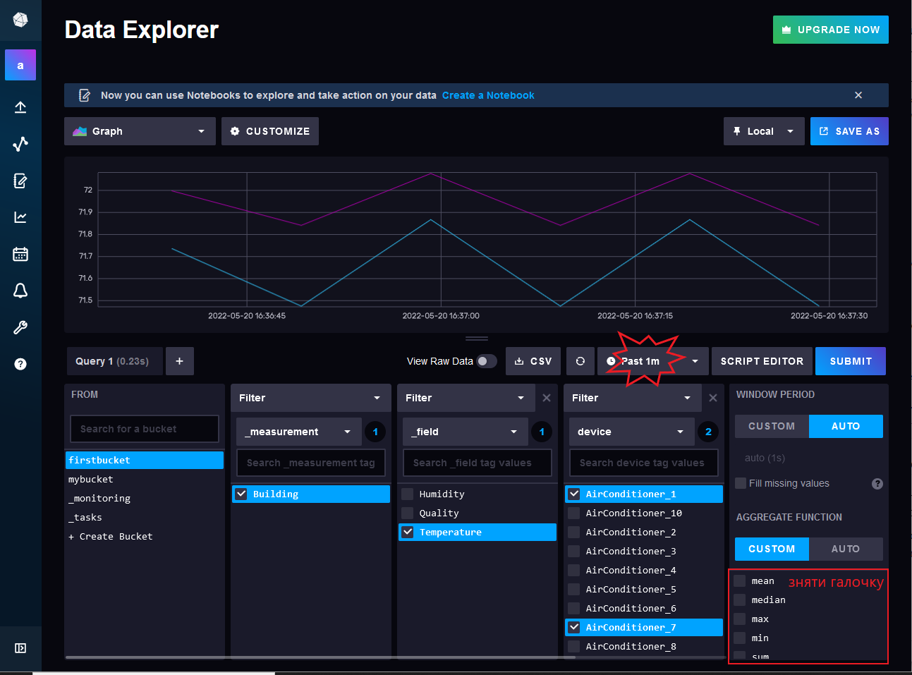
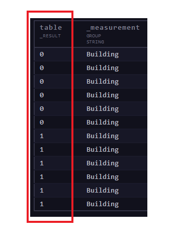
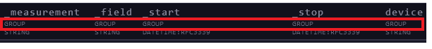

**Технології індустрії 4.0. Лабораторний практикум. ** Автор і лектор: Олександр Пупена 

| [<- до лаборних робіт](README.md) | [на основну сторінку курсу](../README.md) |
| --------------------------------- | ----------------------------------------- |
|                                   |                                           |

# Лабораторна робота №6. Influx DB. Робота з запитами на мові flux.
# Частина 2

Завдання лабораторної роботи ознайомитися з мовою flux, навчитися будувати базові запити на мові flux. Перші два пункти лабораторної роботи містять теоретичний матеріал, **третій пункт – практичний**.

[Flux](https://docs.influxdata.com/flux/v0.x/get-started/) — це функціональна скриптова мова, розроблена для виконання широкого спектру операцій обробки даних та аналітичних операцій.

Модель даних Flux включає в себе:

- Stream of tables – потік таблиць
- Table – таблиця
- Column – стовпчик
- Row – рядок
- Group key – груповий ключ


Потік таблиць – це набір з нуля або більше таблиць. Джерела даних повертають результати у вигляді потоку таблиць. 

Таблиця — це набір стовпців, розділених за груповим ключем. 

Стовпець — це набір значень одного й того самого типу, що містить одне значення (value) для кожного рядка. 

Рядок — це набір відповідних значень стовпців. 

Груповий ключ визначає, які стовпці та конкретні значення стовпців включати в таблицю. Усі рядки таблиці містять однакові значення в ключових стовпцях групи. Усі таблиці в потоці таблиць мають унікальний груповий ключ, але зміни групового ключа застосовуються до потоку таблиць.

## 1.Синтаксис Flux

### Оператор Pipe-forward `|>`

Оператор Pipe-forward `|>` направляє вихід однієї функції як вхід до наступної функції.
```js
from(bucket: "firstbucket")
 |> range(start: v.timeRangeStart, stop: v.timeRangeStop)
 |> filter(fn: (r) => r["_measurement"] == "Building")
 |> filter(fn: (r) => r["_field"] == "Temperature")
 |> filter(fn: (r) => r["device"] == "AirConditioner_1")
 |> mean()
 
```

### Базові типи даних

До базових типів належать:

- Boolean
- Duration
- String
- Time
- Float
- Integer
- Bytes
- Unsigned integers
- Nulls

#### Boolean

```js
var1=true
var2=false
```

Для перетворення базових типів у тип boolean використовується функція `bool()`:

- string: має приймати значення "true" або "false".
- float: має приймати значення 0.0 (false) або 1.0 (true).
- int: має приймати значення 0 (false) або 1 (true).
- uint: має приймати значення 0 (false) або 1 (true)

```js
bool(v: 0.0)
// Повертає false
```

Щоб перетворити стовпець **_value** на логічні значення, використовується функція `toBool()` (працює виключно із стовпцем **_value**).

```js
data
    |> toBool()
```

Щоб перетворити будь-який стовпець на логічні значення, використовуються функції `map()` та `bool()`.

```js
import "array"
data=array.from(rows:[{state:1.0},{state:0.0},{state:1.0}] )
data
  |> map(fn: (r) => ({ r with state: bool(v: r.state) }))
```

 

#### Duration

Тип **duration** представляє проміжок часу з наносекундною точністю.
Представлення типу duration містить число (integer) і специфікатор одиниць.

- ns: наносекунда
- us: мікросекунда
- ms: мілісекунда
- s: секунда
- m: хвилина
- h: година
- d: день
- w: тиждень
- mo: календарний місяць
- y: календарний рік

```js
var1=1s
var2=3d7h9m15s
```

Для перетворення базових типів **string** (рядок, що вказує на тривалість), **int** (тривалість представлена в наносекундах), **uint** (тривалість представлена в наносекундах) у тип **duration** використовується функція `duration()`:

```js
duration(v: "1h30m")
// Повертає 1h30m

duration(v: 1000000)
// Повертає 1ms

duration(v: uint(v: 3000000000))
// Повертає 3s
```

Для виконання таких операцій, як додавання, віднімання, множення або ділення значень тривалості необхідно перетворювати тип **duration** в числове значення, виконати операції між числовими значеннями і конвертувати результат в тип **duration**.

```js
duration(v: int(v: 6h4m) + int(v: 22h32s))
// Повертає 1d4h4m32s
```

Для додавання або віднімання тривалості від значення типу **time** необхідно імпортувати date package та використати функції data.add(), data.sub() відповідно:

```js
import "date"
date.add(d: 1w, to: 2021-01-01T00:00:00Z)
// Повертає 2021-01-08T00:00:00.000000000Z
date.sub(d: 1w, from: 2021-01-01T00:00:00Z)
// Повертає 2020-12-25T00:00:00.000000000Z
```

#### String

Тип **string** представляє послідовність символів. Рядки незмінні і не можуть бути змінені після створення.

**String** представляється послідовністю символів, узятих у подвійні лапки ("). Будь-який символ може відображатися всередині рядкового літералу, за винятком подвійних лапок без екранування.

```js
var1="abc"
var2="string with double \" quote"
```

Для перетворення базових типів у тип string використовується функція `string()`.

```js
string(v: 42)
// Повертає "42"
```

Для виконання різноманітних операцій з рядками використовується [Flux strings package](https://docs.influxdata.com/flux/v0.x/stdlib/strings/).

Щоб інтерполювати рядки в інший рядок Flux, укладіть вбудовані вирази в знак долара та фігурні дужки `${}`. Flux замінює заповнювач результатом вбудованого виразу і повертає рядковий літерал.

```js
name = "John"
"My name is ${name}."
// My name is John.

d = 1m
"the answer is ${d}"
// the answer is 1m
```

Для об'єднання рядків використовується оператор `+`.

```js
import "array"
name = "John"
var1="My name is " + name + "."
d = 1m
var2="the answer is " + string(v: d)
array.from(rows:[{result1:var1},{result1:var2}])
```

#### Time

Тип **time** представляє один момент часу з наносекундною точністю. Літерали типу **time** представляються мітками часу [RFC3339](https://docs.influxdata.com/influxdb/cloud/reference/glossary/#rfc3339-timestamp). 

```js
YYYY-MM-DD
YYYY-MM-DDT00:00:00Z
YYYY-MM-DDT00:00:00.000Z
```

Для перетворення базових типів **string** (представлення RFC3339 мітки рядком), **int**, **uint** ([Unix nanosecond timestamp](https://docs.influxdata.com/influxdb/cloud/reference/glossary/#unix-timestamp)) використовується функція **time()**: 

```js
time(v: "2021-01-01")
// Повертає 2021-01-01T00:00:00.000000000Z

time(v: 1609459200000000000)
// Повертає 2021-01-01T00:00:00.000000000Z

time(v: uint(v: 1609459200000000000))
// Повертає 2021-01-01T00:00:00.000000000Z
```

Щоб отримати одиниці часу із значення типу **time** використовується [date package](https://docs.influxdata.com/flux/v0.x/stdlib/date/).

```js
import "date"

t0 = 2021-01-08T14:54:10.023849Z

date.minute(t: t0)
// Повертає 54

date.year(t: t0)
//  Повертає 2021

date.quarter(t: t0)
//  Повертає 1
```

#### Float

Тип **float** представляє 64-розрядне число з плаваючою крапкою IEEE-754.

```js
0.0
123.4
-123.456
```

Для перетворення базових типів **string** (число виражене рядком, наукова нотація, безкінечність, не число), **bool**, **int**, **uint** ([Unix nanosecond timestamp](https://docs.influxdata.com/influxdb/cloud/reference/glossary/#unix-timestamp)) використовується функція **float()**.

```js
float(v: "1.23")
// 1.23 (float) Число виражене рядком

float(v: "1.23456e+78")
// Повертає 1.23456e+78 (float) – наукова нотація

float(v: "+Inf")
// Повертає +Inf (float) – безкінечність


float(v: "NaN")
// Повертає NaN (float) – не число

float(v: true)
// Повертає 1.0

float(v: 123)
// Повертає 123.0
```

Для виконання різноманітних операцій із значеннями типу float використовується  [math package](https://docs.influxdata.com/flux/v0.x/stdlib/math/). Наприклад, для окрулення:

```js
import "math"

math.round(x: 1.54)
// Повертає 2.0
```

#### Integer

Тип **integer** представляє 64-розрядне ціле число зі знаком. 

**Min**: -9223372036854775808
**Max**: 9223372036854775807

```js
0
2
1254
-1254
```

Для перетворення базових типів **string** (число виражене рядком), **bool**, **duration**, **time**, **float**, **uint **використовується функція **int()**. 

```js
int(v: "123")
// 123

int(v: true)
// Повертає 1

int(v: 1d3h24m)
// Повертає 98640000000000

int(v: 2021-01-01T00:00:00Z)
// Повертає 1609459200000000000

int(v: 12.54)
// Повертає 12
```

Перед тим як конвертувати float слід застосувати функцію округлення.

#### Unsigned integers

Тип беззнакового цілого (**uinteger**) представляє беззнакове 64-розрядне ціле число.

**Min**: 0
**Max**: 18446744073709551615

Flux не забезпечує літеральний синтаксис для представлення значення типу **uinteger**. Однак можна використовувати функцію uint() для перетворення основних типів даних у **uinteger**.

#### Null

Тип **null** представляє відсутнє або невідоме значення. Flux не забезпечує літеральний синтаксис для представлення значення **null**.

За допомогою логічного оператора `exists` можна перевірити чи значення є null. 

```js
data
    |> filter(fn: (r) => exists r._value)
```

### Складені типи даних

Складені типи — це типи, створені з базових типів. Flux підтримує такі складені типи:

- Record
- Array
- Dictionary
- Function

#### Record

Набір пар властивість–значення. Властивість – тип **string**, значення може бути будь-якого типу.

```js
{foo: "bar", baz: 123.4, quz: -2}

{"Company Name": "ACME", "Street Address": "123 Main St.", id: 1123445}
```

Щоб посилатися на значення в record, використовується dot notation або bracket notation.

```js
c = {name: "John Doe", address: "123 Main St.", id: 1123445}

c.name
// Повертає John Doe – dot notation
```

```js
c = {"Company Name": "ACME", "Street Address": "123 Main St.", id: 1123445}

c["Company Name"]
// Повертає ACME – bracket notation
```

#### Array

Тип array — це впорядкована послідовність значень одного типу.

```js
["1st", "2nd", "3rd"]

[1.23, 4.56, 7.89]

[10, 25, -15]
```

Використовується bracket notation для посилання на значення в масиві. 

```js
arr = ["1st", "2nd", "3rd"]

arr[0]
// Повертає 1st

arr[2]
// Повертає 3rd
```

Щоб створити новий потік таблиць потрібно працювати з масивами. Функція `array.from()` повертає потік таблиць. Вхідний масив має бути масивом записів (record). Кожна пара властивість-значення в record представляє стовпець і його значення.

```js
import "array"

arr = [
    {fname: "John", lname: "Doe", age: "37"},
    {fname: "Jane", lname: "Doe", age: "32"},
    {fname: "Jack", lname: "Smith", age: "56"},
]

array.from(rows: arr)
```

### Функції

#### Функція предиката

Функції предикатів використовують вирази-предикати для оцінки введених даних і повернення true чи false. Вираз-предикат порівнює значення за допомогою операторів порівняння, логічних операторів.

```js
examplePredicate = (v) => v == "foo"

examplePredicate(v: "foo")
// Повертає true

examplePredicate(v: "bar")
// Повертає false
```

Про означення користувацьких функцій більше за [посиланням.](https://docs.influxdata.com/flux/v0.x/define-functions/)

### Оператори Flux

#### Арифметичні оператори

Арифметичні оператори приймають два числові значення (літерали або змінні) і виконують обчислення, яке повертає одне числове значення. У поточній версії Flux значення, що використовуються в арифметичних операціях, мають бути **одного числового типу** (ціле число або число з плаваючою точкою). Операції зі значеннями різних числових типів призведуть до помилки типу.

| Оператор | Опис                  | Приклад  | Результат |
| -------- | --------------------- | -------- | --------- |
| `+`      | Додавання             | `1 + 1`  | `2`       |
| `-`      | Віднімання            | `3 - 2`  | `1`       |
| `*`      | Множення              | `2 * 3`  | `6`       |
| `/`      | Ділення               | `9 / 3`  | `3`       |
| `^`      | Піднесення до степеня | `2 ^ 3`  | `8`       |
| `%`      | Остача від ділення    | `10 % 5` | `0`       |

#### Оператори порівняння

Оператори порівняння порівнюють вирази та повертають true або false на основі порівняння.

| Оператор | Опис                           | Приклад             | Результат |
| -------- | ------------------------------ | ------------------- | --------- |
| `==`     | Дорівнює                       | `"abc" == "abc"`    | `true`    |
| `!=`     | Не дорівнює                    | `"abc" != "def"`    | `true`    |
| `<`      | Менше                          | `1 < 2`             | `true`    |
| `>`      | Більше                         | `1 > 2`             | `false`   |
| `<=`     | Менше рівне                    | `1 <= 2`            | `true`    |
| `>=`     | Більше рівне                   | `1 >= 2`            | `false`   |
| `=~`     | Дорівнює регулярному виразу    | `"abc" =~ /[a-z]*/` | `true`    |
| `!~`     | Не дорівнює регулярному виразу | `"abc" !~ /[0-9]*/` | `true`    |

#### Логічні оператори

| Оператор | Опис                                                         |
| -------- | ------------------------------------------------------------ |
| `not`    | Повертає true, якщо правий операнд хибний. В іншому випадку повертає false. |
| `exists` | Повертає false, якщо правий операнд дорівнює **null**. В іншому випадку повертає true. |
| `and`    | Повертає істину, якщо обидва операнди є істинними. В іншому випадку повертає false. |
| `or`     | Повертає істину, якщо будь-який операнд є істинним. В іншому випадку повертає false. |

## 2.Базовий запит на мові Flux. Структура запиту

```js
from(bucket: "firstbucket") //джерело даних
 |> range(start: v.timeRangeStart, stop: v.timeRangeStop) // фільтрація даних за часом
 |> filter(fn: (r) => r["_measurement"] == "Building") //фільтрація за значеннями стовпців
 |> filter(fn: (r) => r["_field"] == "Temperature")//фільтрація за значеннями стовпців
 |> filter(fn: (r) => r["device"] == "AirConditioner_1")//фільтрація за значеннями стовпців
 |> group(columns:["_measurement"]) //зміна структури даних
 |> max() // обробка даних
```

Більшість запитів на мові Flux включають такі кроки:

- Означення джерела даних 
- Фільтрація
- Модифікація структури представлення даних
- Обробка даних

#### Джерело даних

Вхідні функції ([input functions](https://docs.influxdata.com/flux/v0.x/function-types/#inputs)), такі як `from()`, отримують дані з різних джерела даних. Усі функції введення повертають потік таблиць (stream of tables). Flux підтримує кілька джерел даних, включаючи бази даних часових рядів (такі як InfluxDB і Prometheus), реляційні бази даних (такі як MySQL і PostgreSQL), CSV тощо.

#### Фільтрація

Функції фільтрації перебирають і оцінюють кожен рядок введення, щоб перевірити, чи відповідає він заданим умовам. Рядки, які відповідають умовам, включаються у вихідні дані функції. Рядки, які не відповідають вказаним умовам, видаляються. Flux надає такі основні функції фільтрації:

- [`range()`](https://docs.influxdata.com/flux/v0.x/stdlib/universe/range/): фільтрація даних за часом

```js
range(start: -12h, stop: -15m)

//

range(start: 2018-05-22T23:30:00Z, stop: 2018-05-23T00:00:00Z)
```

Записи кожної вхідної таблиці фільтруються, у межах означеного часу. Функція має два параметри:

**start** – може бути заданий значенням типу duration, time, int – найраніший час для включення в результати.

**stop** – може бути заданий значенням типу duration, time, int – останній час для включення в результати.

- [`filter()`](https://docs.influxdata.com/flux/v0.x/stdlib/universe/filter/): фільтрація даних за значеннями стовпців. Використовує предикатну функцію, визначену в параметрі fn, для оцінки вхідних рядків. Кожен рядок передається функції предиката як record, **r**, що містить пари властивість-значення для кожного стовпця в рядку.

#### Модифікація структури представлення даних

Часто потрібно змінювати структуру даних, щоб підготувати їх до обробки. Зазвичай такі модифікації включають перегрупування даних за значеннями стовпців або за часом або зведення значень стовпців у рядки. До функцій, які змінюють структуру даних, належать:

- group(): для зміни групового ключа.
- window(): для зміни значення _start і _stop у рядках, для групування даних за часом. Що відповідно генерує потік таблиць.
- pivot(): для приведення до вигляду реляційної таблиці.
- drop(): для видалення окремих стовпців.
- keep(): для зберігання конкретних стовпців та видалення всіх інших.

#### Обробка даних

Обробка даних може приймати різні форми і включає наступні типи операцій:

**Агрегування даних**. [Функції агрегування](https://docs.influxdata.com/flux/v0.x/function-types/#aggregates) приймають всі значення вхідної таблиці та обробляють їх відповідно до обраної функції. Така трансформація формує на виході таблицю (включає один рядок) для кожної вхідної таблиці.

Найпоширеніші функції агрегування:

- mean() – середнє значення, математичне сподівання
- moda() – мода
- median() – медіана
- spread() – різниця між максимальним та мінімальним значеннями вибірки
- [stddev()](https://docs.influxdata.com/flux/v0.x/stdlib/universe/stddev/) – середньоквадратичне відхилення
- sum() – сума всіх значень вибірки
- [count()](https://docs.influxdata.com/flux/v0.x/stdlib/universe/count/) – кількість записів в стовпчику

**Вибірка конкретних точок**. Такі функції вибору ([селектори](https://docs.influxdata.com/flux/v0.x/function-types/#selectors)) повертають один або більше конкретних рядків у вигляді таблиці (що задовольняють умові вибору) з кожної вхідної таблиці. Наприклад, останній або перший запис, рядок з максимальним або мінімальним значенням.

- last() – останній рядок
- first() – перший рядок
- limit(n:10) – перші n записів
- max()
- min()

Функція [`aggregateWindow()`](https://docs.influxdata.com/flux/v0.x/stdlib/universe/aggregatewindow/) є допоміжною. Вона застосовує функцію агрегування або функцію вибору до до визначеного періоду часу.

**Перезапис рядків**. Функція `map()` використовується, щоб переписати кожен рядок вхідної таблиці. Тобто функція надає можливість перетворювати значення за допомогою математичних операцій, обробляти рядки, динамічно додавати нові стовпці тощо.

```js
|> map(fn: (r) => ({ r with newColumn: r._value * 2 }))
// повертає вхідну таблицю, з новим стовпчиком
|> map(fn: (r) => ({ r with _value: r._value * 2 }))
// модифікує значення, наявного стовпчика _value
```

## 3.Робота з запитами на мові flux

- [ ] Запустіть OPCUA сервера, node-red та telegraf – тобто відновіть запис даних з OPC UA сервера в influxdb, який було налаштовано в першій частині лабораторної роботи по Influxdb.
- [ ] У інтерфейсі користувача хмарного сервісу InfluxDB відкрийте пункт меню "Data Explorer". За допомогою Конструктора запитів побудуйте запит на зчитування значень температур за останню хвилину двох довільних кондиціонерів.



- [ ] Перейдіть у редактор скриптів. Проаналізуйте скрипт: в даному випадку запит включає означення джерела даних та фільтрацію даних.


- [ ] Активуйте опцію **View Raw Data**. Результат переважної кількості запитів будемо переглядати з активованою опцією View Raw Data, щоб краще зрозуміти модель даних influxdb.


В результаті простого запиту отримано дві таблиці (значення стовпчика table – 0 та 1):



Такий розподіл на таблиці відбувається за рахунок групового ключа (**group key**). Груповий ключ визначає, які стовпці та конкретні значення стовпців включати в таблицю. Усі рядки таблиці містять однакові значення в ключових стовпцях. Кожна таблиця в потоці таблиць має унікальний груповий ключ, зміна групового ключа застосовується до потоку таблиць. В даному випадку груповий ключ був означений за замовчування, його формує наступний набір полів:



*Груповий ключ*=**значення "measurement" + значення усіх тегів + значення одного поля (назва стовпчика _field)**

Значення цих полів в рамках однієї таблиці повинні бути однакові.

Внаслідок розподілу даних по таблицям за груповим ключем формується потік таблиць. Усі функції обробки даних, розглянуті у попередньому пункті, застосовуються до кожної з таблиць кремо.

- [ ] Обмежте вибірку 4-ма останніми (давнішими) значеннями температур кожного кондиціонера. Для цього додайте до скрипта наступний рядок:

```js
 |> limit(n:4)
```

- [ ] Розрахуйте середнє значення вибірки для кожного кондиціонера, додавши до скрипта наступний рядок:


```js
|> mean()
```

- [ ] Розрахуйте максимальне значення з вибірки для кожного кондиціонера, зберігаючи при цьому розрахунок середнього значення. Для цього модифікуйте скрипт наступним чином:

```js

data=from(bucket: "firstbucket")

 |> range(start: v.timeRangeStart, stop: v.timeRangeStop)

 |> filter(fn: (r) => r["_measurement"] == "Building")

 |> filter(fn: (r) => r["_field"] == "Temperature")

 |> filter(fn: (r) => r["device"] == "AirConditioner_1" or r["device"] == "AirConditioner_7")

 |> limit(n:4)

data  |> mean()

   |> yield(name:"mean")

data  |> max()

   |> yield(name:"max")
```


У зв'язку з тим, що виникла необхідність представити кілька результатів (розрахунок середнього і максимального), тут використано функцію `yield()`. Функція `yield()` вказує на те, що отримані вхідні таблиці мають бути **показані** як результат запиту. `yield()` виводить вхідний потік без змін. Запит може мати кілька результатів, кожен із яких ідентифікується іменем, наданим функції `yield()`.

Також для проміжного збереження вибірки використовується змінна `data`, щоб далі по різному обробити дану вибірку. В даному прикладі видно, що змінній може присвоюватися не конкретний літерал, а цілий потік операцій, реалізований за допомогою оператора `|>`. Тобто змінна data в даному випадку – це потік таблиць (дві таблиці), які отримані з конкретного джерела даних, відфільтровані за часом, за значеннями стовпців і обмежені 4-ма першими рядками. Далі змінна data використовується як вхід функції mean() та вхід функції max().

- [ ] Розрахуйте мінімальне значення температури серед усіх значень температур обох кондиціонерів. Попередні розрахунки не видаляйте. Для цього модифікуйте скрипт наступним чином:


```js
data=from(bucket: "firstbucket")

 |> range(start: v.timeRangeStart, stop: v.timeRangeStop)

 |> filter(fn: (r) => r["_measurement"] == "Building")

 |> filter(fn: (r) => r["_field"] == "Temperature")

 |> filter(fn: (r) => r["device"] == "AirConditioner_1" or r["device"] == "AirConditioner_7")

 |> limit(n:4)

data  |> mean()

   |> yield(name:"mean")

data  |> max()

   |> yield(name:"max")

data  |> group(columns: ["_field"])

   |> yield(name:"allinonetable")

   |> min()

   |> yield(name:"min")
```

Оскільки, функцію пошуку мінімального значення min() потрібно застосувати до всіх значень температур незалежно від приналежності до кондиціонера, необхідно об'єднати всі температури в одну таблицю. Це можна зроби змінивши груповий ключ (group key), тобто застосувавши функцію group() з параметром **columns**, по якому групуються рядки в таблиці. Для всіх температур значення стовпчика **_field** є однаковим. Таким чином об'єднавши всі рядки функція min() застосовується до всіх значень температур. 

- [ ] Відфільтруйте загальну вибірку температур за останню хвилину двох довільних кондиціонерів ( незалежно від кондиціонера) за умовою: температура > 72. Для цього виконайте наступний запит:


```js
from(bucket: "firstbucket")

 |> range(start: v.timeRangeStart, stop: v.timeRangeStop)

 |> filter(fn: (r) => r["_measurement"] == "Building")

 |> filter(fn: (r) => r["_field"] == "Temperature")

 |> filter(fn: (r) => r["device"] == "AirConditioner_1" or r["device"] == "AirConditioner_7")

 |> group(columns: ["_field"])

 |> yield(name: "before")

 |> filter(fn: (r) => r._value > 72.0)  

 |> yield(name: "filtered")

```

В цьому запиті використовується функція filter() з параметром fn, який є функцією предиката, тобто означує умову.

- [ ] Відфільтруйте значення температур за останню хвилину двох довільних кондиціонерів за наступною умовою: значення температур першого кондиціонера > 72 і значення температур другого кондиціонера < 72. Для цього виконайте наступний запит:

```js
from(bucket: "firstbucket")

 |> range(start: v.timeRangeStart, stop: v.timeRangeStop)

 |> filter(fn: (r) => r["_measurement"] == "Building")

 |> filter(fn: (r) => r["_field"] == "Temperature")

 |> filter(fn: (r) => r["device"] == "AirConditioner_1" or r["device"] == "AirConditioner_7")

 |> yield(name: "before")

 |> filter(fn: (r) => if r["device"] == "AirConditioner_1"

 then r._value>72.0

 else r._value<72.0)

 |> yield(name: "conditions")
```

- [ ] Побудуйте два графіки: 1) всі значення температур першого кондиціонера за останні 5 хвилин; 2) усередненні значення температур першого кондиціонера за останні 5 хвилин (період усереднення 30s). Для цього виконайте наступний запит:


```js
from(bucket: "firstbucket")

 |> range(start: v.timeRangeStart, stop: v.timeRangeStop)

 |> filter(fn: (r) => r["_measurement"] == "Building")

 |> filter(fn: (r) => r["_field"] == "Temperature")

 |> filter(fn: (r) => r["device"] == "AirConditioner_1")

 |> yield(name: "before")

 |> aggregateWindow(every: 30s, fn: mean, createEmpty: false)

 |> yield(name: "mean")
```

Побудуйте графік усереднених значень температур першого кондиціонера за 15 хвилин з відображенням верхньої (максимальне за період агрегування) та нижньої (мінімальне за період агрегування) межі. Використовуйте візуалізацію **Band**. Виконайте наступний запит:

```js
data=from(bucket: "firstbucket")

 |> range(start: v.timeRangeStart, stop: v.timeRangeStop)

 |> filter(fn: (r) => r["_measurement"] == "Building")

 |> filter(fn: (r) => r["_field"] == "Temperature")

 |> filter(fn: (r) => r["device"] == "AirConditioner_1")

 data |> aggregateWindow(every: 30s, fn: mean, createEmpty: false)

 |> yield(name: "mean")

data |> aggregateWindow(every: 30s, fn: max, createEmpty: false)

 |> yield(name: "max")

data |> aggregateWindow(every: 30s, fn: min, createEmpty: false)

 |> yield(name: "min")
```
Візуалізацію налаштуйте наступним чином:


- [ ] Відобразіть у вигляді реляційної таблиці температури двох кондиціонерів за останні 5 хвилин. Для цього виконайте наступний запит (Візуалізація із ввімкненою опцією View Raw Data):


```js
from(bucket: "firstbucket")

 |> range(start: v.timeRangeStart, stop: v.timeRangeStop)

 |> filter(fn: (r) => r["_measurement"] == "Building")

 |> filter(fn: (r) => r["_field"] == "Temperature")

 |> filter(fn: (r) => r["device"] == "AirConditioner_1" or r["device"] == "AirConditioner_6")

 |> pivot(rowKey:["_time"], columnKey: ["device"], valueColumn:"_value" )

 |> keep(columns: ["_time", "AirConditioner_1","AirConditioner_6"] )

 |> yield(name: "Temperature")

```

Функція pivot() допомагає приводити таблиці баз даних часових рядів до реляційного вигляду.

- [ ] Обрахуйте різницю температур двох кондиціонерів у кожен момент часу, створивши додатковий стовпчик. Для цього використайте наступний запит:


```js
from(bucket: "firstbucket")
 |> range(start: v.timeRangeStart, stop: v.timeRangeStop)
 |> filter(fn: (r) => r["_measurement"] == "Building")
 |> filter(fn: (r) => r["_field"] == "Temperature")
 |> filter(fn: (r) => r["device"] == "AirConditioner_1" or r["device"] == "AirConditioner_6")
 |> pivot(rowKey:["_time"], columnKey: ["device"], valueColumn:"_value" )
 |> keep(columns: ["_time", "AirConditioner_1","AirConditioner_6"] )  
 |> map(fn: (r)=>({r with difference:r.AirConditioner_1-r.AirConditioner_6})  )
 |> yield(name: "Temperature")
```

- [ ] Створіть таблицю, яка зберігає стани першого кондиціонера та запишіть її в інший бакет (якщо інший бакет не створено, то створіть). Для цього виконайте наступний запит:


```js
import "influxdata/influxdb"

import "array"

import "date"

arr1={_time:date.sub(from: now(), d: 10s ),_measurement: "Building",_field:"state", _value:1.0,device:"AirConditioner_1"}

arr2={_time:date.sub(from: now(), d: 20s ),_measurement: "Building",_field:"state", _value:0.0,device:"AirConditioner_1"}

arr3={_time:date.sub(from: now(), d: 1m ),_measurement: "Building",_field:"state", _value:1.0,device:"AirConditioner_1"}

arr4={_time:date.sub(from: now(), d: 1h ),_measurement: "Building",_field:"state", _value:0.0,device:"AirConditioner_1"}

array.from(rows: [arr1, arr2, arr3, arr4])

 |> influxdb.to(bucket: "mybucket")
```

- [ ] Самостійно перевірте, що дані дійсно збережено у бакеті.

В цьому запиті використовується функція [array.from()](https://docs.influxdata.com/flux/v0.x/stdlib/array/from/), яка дозволяє вручну створювати таблиці. Для запису даних у бакет за допомогою Flux використовується функція influxdb.to().

- [ ] **Самостійно!** Створіть комірки на дашбоарді (з першої частини лабораторної роботи) для відображення основних статистичних показників по температурі для кожного кондиціонера: математичне сподівання,  середньоквадратичне відхилення, мода, медіана. Для візуалізації використовуйте **Single stat**.


# Питання до захисту. 

1. Для чого використовується оператор pipe forward |>?

1. Як фільтрувати дані за тегами, з використанням логічного "і" чи "або"?

1. Для чого використовується функція map()?

1. Яка структура базового запиту?

1. Назвіть приклади функцій агрегування.

1. Назвіть функції для фільтрації за часом.

1. Назвіть приклади функцій вибору (селектори).

   