# Лабораторна робота №5. Робота з OPC UA

## 1. Встановлення тестових утиліт для роботи з OPC

### 1.1.Завантаження та встановлення тестових застосунків.

- [ ] Завантажте та встановіть [OPC UA C++ Demo Server](https://www.unified-automation.com/downloads/opc-ua-servers.html)  (під Winidows). Завантаження потребує реєстрації, але це цілком безкоштовно.
- [ ] Завантажте та встановіть тестовий OPC UA Client [UaExpert](https://www.unified-automation.com/downloads/opc-ua-clients.html).

### 1.2.Перший запуск  

- [ ] Запустіть "OPC UA C++ Demo Server" та погодьтеся на внесення порту до списку дозволених брандмауером.

- [ ] У консольному вікні серверу знайдіть запис з URL кінцевої точки.

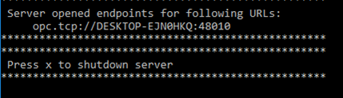 

- [ ] Запустіть UaExpert, натисніть "+" (Add server) 
- [ ] Добавте тестовий OPC UA Server через меню Custom Discovery, шляхом копіювання URL, який наведений у консольному вікні серверу 

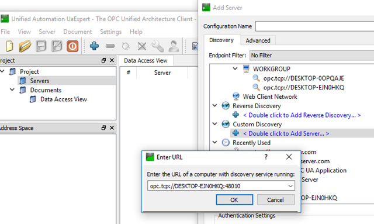

- [ ] Виберіть підключення без захисту (None) і натисніть Ok

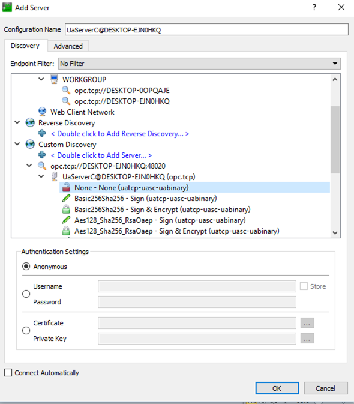

- [ ] Для доданого серверу натисніть Connect.  

  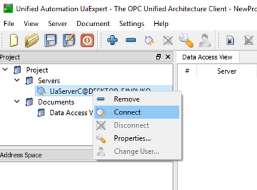

- [ ] У вікні що з'явиться,  виберіть Trust Server Certificate, після чого натисніть Continue.

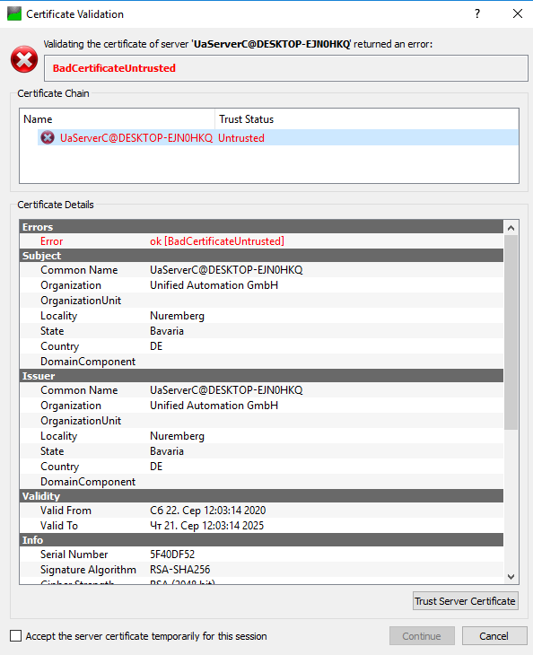

### 1.3.Перегляд сертифікатів

- [ ] Зайдіть в меню `Settings->Manage Certifacates`, передивіться сертифікат.

## 2. Використання клієнта для тестування OPC UA Сервера 

### 2.1.Аналіз об'єктів-папок

- [ ] Використовуючи UaExpert проаналізуйте зміст об'єктів першого (Root) та другого рівня (Objects, Types, Views), проаналізуйте: 
  - [ ] перелік та зміст атрибутів: NodeID, NodeClass 
  - [ ] перелік та зміст посилань (References): 
- [ ]  Проаналізуйте подібним чином ще одну з папок, вкладену в `Objects`

### 2.2.Аналіз Variable

- [ ] Відкрийте для перегляду об'єкт `BuildingAutomation.AirConditioner_1`
- [ ] Знайдіть DataVariable `Temperature`  проаналізуйте атрибути `Value` та `DataType`.
- [ ] Проаналізуйте атрибути для властивостей `AirConditioner_1.Temperature.EURange` та `AirConditioner_1.Temperature.EngineeringUnits`
- [ ] Проаналізуйте атрибути `Value` та `DataType`для наступних об'єктів:
  - [ ] `Demo.Static.Arrays.AnalogMeasurement`
  - [ ] `Demo.Static.Arrays.Structure`
  - [ ] `Demo.Static.Matrix.Float`

### 2.3.Використання Data Access View

- [ ] Якщо не відкрито вікно `Data Access View` , створіть новий документ такого типу
- [ ] Перетягніть `AirConditioner_1` на вікно  `Data Access View` , повинні поміститися усі об'єкти, що знаходяться всередині 
- [ ] Подвійним кліком по полю `Value` в `Data Access View` змініть значення `TemperatureSetPoint` рівною 75
- [ ] Через контекстне меню  в `Data Access View`  зайдіть в налаштування `Subscription Settings`, виставіть періодичність публікації рівною 4 секундам (4000). Перевірте, що значення змінюються не раніше ніж через 4 секунди. 
- [ ] Виставіть періодичність публікації рівною 1 секунді.
- [ ] Через контекстне меню `Temperature`  в `Data Access View` зайдіть в налаштування `Monitoring Item Settings` значення зони нечутливості 1 градус. 

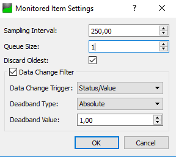

- [ ] Змініть налаштування уставки  `TemperatureSetPoint` рівною 70. Тепер значення температури повинно оновлюватися тільки при зміні на 1 градус.
- [ ] Зробіть копію екрану для звіту.

### 2.4.Використання методів

- [ ] Через контекстне меню метода `AirConditioner_1.Stop` виберіть `Call` і зупиніть установку кондиціонування. 
- [ ] Подивіться значення `AirConditioner_1.StateCondition.Message` та `AirConditioner_1.State` 
- [ ] Через контекстне меню метода `AirConditioner_1.StartWithSetpoint` виберіть `Call` і запустіть установку кондиціонування з уставкою температури = 25 градусів, і вологістю - 55%.

### 2.5.Використання History Trend View

- [ ] Подивіться значення атрибуту `Historizing` для `Temperature`  
- [ ] Створіть документ `History Trend View` (`Document->Add->History Trend View`)

- [ ] Використовуючи метод `StartLogging` запустіть реєстрацію в трендовий архів.
- [ ] Подивіться значення атрибуту `Historizing` для `Temperature` . Тепер воно має бути TRUE, що значить, що дані для цієї змінної пишуться в історію.
- [ ] Перетягніть `AirConditioner_1.Temperature` у вікно `Configuration` документа `History Trend View`
- [ ] Виберіть `Cyclic Update`  і натисніть `Start`:
  - [ ]  на закладці `Numeric Value` Ви побачите тренд
  - [ ] перейдіть на закладку з іменем змінної та перегляньте як змінюється значення
- [ ] Змініть Update Interval на 5 секунд і перезапустіть оновлення. Зверніть увагу, що через 5 секунд підтягуються усі точки для графіку.
- [ ] Зробіть копію екрану для звіту.

### 2.6.Використання Server Diagnostics View

- [ ] Створіть документ `Server Diagnostics View`
- [ ] Передивіться доступну інформацію у вікнах даного документу.

### 2.7.Підключення до серверу в Інтернеті

- [ ] Підключіть UaExpert до сервера за адресою `opc.tcp://opcuaserver.com:48010`

- [ ] Подивіться на структуру адресного простору, там повинні бути такі самі об'єкти.

## 3.Тестові клієнти для мобільних застосунків

**Необов'язкове завдання.**

### 3.1.Встановлення клієнтського застосунку

- [ ] Встановіть застосунок HMI з драйвером зв'язку OPC UA Client для Android або iOS на мобільний телефон або планшет. 
- [ ] Один з прикладів - `Suppanel HMI`. Відеоурок доступний [за посиланням](https://youtu.be/35Tt8GHt58U)

<https://play.google.com/store/apps/details?id=com.suppanel.suppanel&hl=uk>

### 3.2.Розробка HMI

- [ ] Налаштуйте зв'язок з тесовим OPC UA сервером  `opc.tcp://opcuaserver.com:48010`
- [ ] Розробіть примітив для відображення плинної температури одного з кондиціонерів.

RED

## 4. Основи роботи з клієнтськими запитами OPC UA в Node-RED

### 4.1.Завантаження та встановлення пакунку node-red-contrib-opcua

- [ ] Встановіть модуль node-red-contrib-opcua. Для роботи Node-RED OPC UA Server рекомендується поставити версію 0.2.52 через npm:

```
npm install -g node-red-contrib-opcua@0.2.52
```

### 4.2.Читання значення змінної

- [ ] Запустіть тестовий сервер UaCPPServer
- [ ] Запустіть тестовий клієнт UaExpert і підключіться до UaCPPServer
- [ ] Запустіть Node-RED та створіть новий проект. Створіть фрагмент коду, наведений нижче. Зверніть увагу, що кінцева точка буде інша. Значення NodeID: `ns=3;s=AirConditioner_1.Temperature`

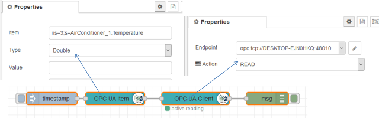


- [ ] Зробіть розгортання проекту. Ініціюйте потік. Використовуючи UaExpert подивіться чи отримане значення коректне. 

### 4.3.Читання значення масиву змінних 

- [ ] Скопіюйте фрагмент коду. Замініть NodeID: `ns=2;s=Demo.Static.Arrays.Double`
- [ ] Перевірте результат.

### 4.4.Читання значення масиву структур

- [ ] Скопіюйте фрагмент коду
- [ ] Модифікуйте його відповідно до наведеного нижче фрагменту. NodeID: `ns=2;s=Demo.Static.Arrays.Structure;datatype=ExtensionObject`

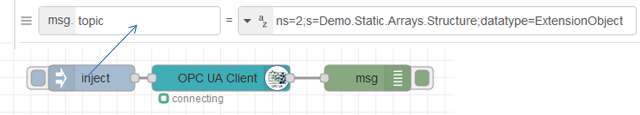 

### 4.5.Читання кількох змінних за один запит 

- [ ] Реалізуйте та перевірте фрагмент програми для зчитування кількох змінних.  

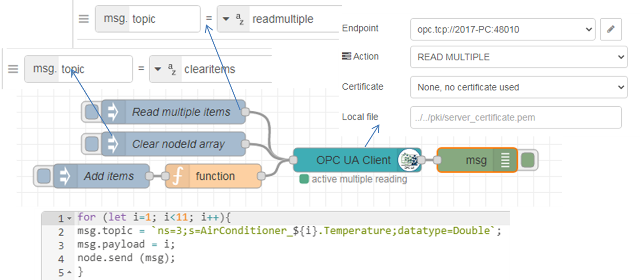

### 4.6.Запис змінної 

- [ ] Реалізуйте наведений нижче фрагмент

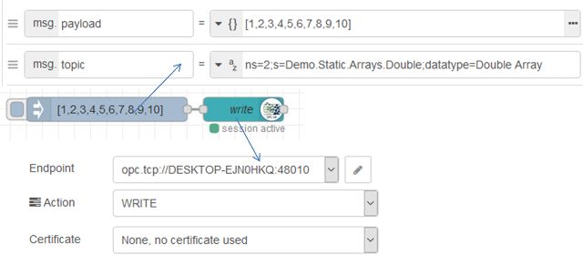

- [ ] Зробіть розгортання та ініціюйте потік.
- [ ] За допомогою клієнта UaExpert перевірте, що значення на сервері змінилися.  

### 4.7.Запис кількох змінних за один запит

- [ ] Імпортуйте код вузла `Inject`

```json
[{"id":"1eeb5ff0.f9c0e","type":"inject","z":"dd08c8ba.629018","name":"","props":[{"p":"payload"},{"p":"topic","vt":"str"}],"repeat":"","crontab":"","once":false,"onceDelay":0.1,"topic":"ns=3;s=AirConditioner_1.HumiditySetpoint","payload":"[{\"datatype\":\"Double\",\"nodeId\":\"ns=3;s=AirConditioner_1.TemperatureSetPoint\",\"value\":55},{\"datatype\":\"Double Array\",\"nodeId\":\"ns=2;s=Demo.Static.Arrays.Double\",\"value\":[1,22]}]","payloadType":"json","x":150,"y":760,"wires":[["c202eff8.0d922"]]}]
```

- [ ] Реалізуйте наступний фрагмент програми. У вузлі `Write Multiple` повинен бути вибраний режим "Writ Multiple".

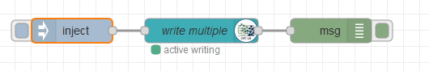

### 4.8.Підписування на змінну

- [ ] Реалізуйте та перевірте роботу наведеного нижче фрагменту.

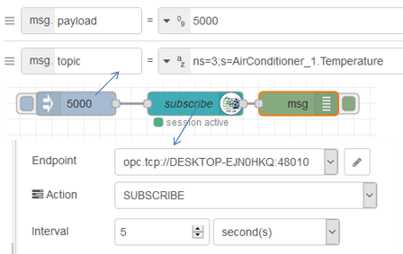

### 4.9.Підписування на кілька змінних

- [ ] Самостійно реалізуйте фрагмент коду, який буде при старті Node-RED формувати підписку на змінні `ns=3;s=AirConditioner_x.Temperature`, де X - від 1 до 10
