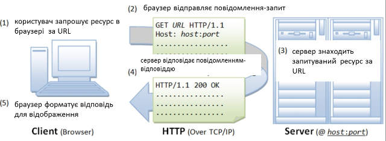
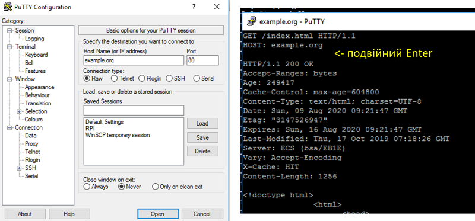
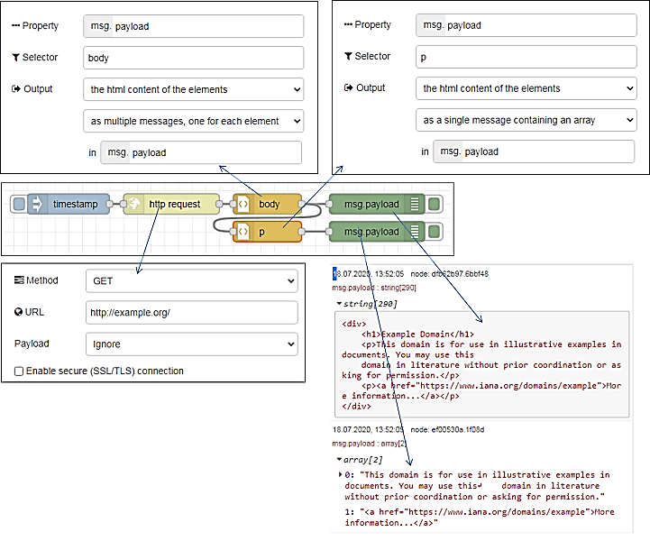

**Технології індустрії 4.0. Лекції.** Автор і лектор: Олександр Пупена 

| [<- до лекцій](README.md) | [на основну сторінку курсу](../README.md) |
| ------------------------- | ----------------------------------------- |
|                           |                                           |

# 1. Основи HTTP

## Протокол HTTP 

### Загальні приницпи функціонування

**HTTP** (HyperText Transfer Protocol — «протокол передачі гіпертексту») — протокол прикладного рівня передачі даних, який є повінстю текстовим, тобто використовуються тільки літери та цифри. Початково проткол використовувався для передачі гіпертекстових документів HTML, зараз використовується для передачі чого завгодно. 

У обміні приймають участь два застосунки (рис.1):

- HTTP Клієнт (наприклад Web Browser) - ініціатор, той застосунок, якому потрібні ресурси серверу. Він формує запит (Request Message) на сервер на виконання операціъ з ресурсом. 
-  HTTP Сервер (Web Server) - той застосунок, у якого є ресурси. Він обробляє запит клієнта і відправляє відповідь (Response Message), у якому повертає результат обробки ресурсу, або сам ресурс. 


рис.1. Клієнт-серверний обмін в HTTP.

На сьогодні інсує кілька версій: HTTP/1.1, впроваджується HTTP/2 (з 2015) та HTTP/3 (з 2019).

HTTP так само і багато споріднених протоколів використовує стандартний стек TCP, UDP, IP та інші (рис.3)  


рис.3. Стек протоколів HTTP

Розглянемо приниципи функціонування HTTP на прикладі (рис.4). 

1) Коли користувач заходить за посиланням на WEB-ресурс він вказує *URL* того ресурсу (наприклад сторінки), який необхідно завантажити. 

2) Браузер запитує цей ресурс за допомогою повідомлення в текстовому форматі, що починається з назви методу `GET` в якому передається адреса ресурсу та додаткові параметри запиту. Це повідомлення передається по TCP до серверу по вказаному порту. Якщо користувач не вказав порт він буде рівним 80 (див. попередню лекцію).    



рис.4. Приклад фунуціонування протоколу HTTP. 

3) Сервер, отримавши повідомлення на отримання ресурсу, шукає його за URL.

4) У випадку знаходження ресурсу сервер відправляє відповідь, в заголовку якої вказує позитивний результат виконання запиту `200 Ok`. Також в корисному навантаженні він передає запрошуваний ресурс. 

5) Браузер виводить ресурс, якщо це буде HTML-сторінка показує її у відповідному вигляді.

### Ідентифікація ресурсу

**Ресурси** на сервері - це документи у різному форматі, які можна отримати, записати, змінити і т.п. Для доступу до потрібного ресурсу вказується його унікальний для серверу ідентифікатор розміщення -  **URL (**Uniform Resource Locator). Він задається у вигялді рядку і має наступний формат:

```http
<схема>://<логін>:<пароль>@<хост>:<порт>/<шлях>?<параметри>#<якір>
```

- схема – це означення того, який проткол використовується для доступу ресурсу, наприклад `http` або `https`
- логін та пароль – це ім'я і пароль користувача, якщо доступ до ресурсу обмежений; як видно вони розділені двокрапкою; якщо дсотуп до ресурсу не обмежується, логін та пароль не вказуються 
- хост - доменне ім'я хоста (DNS) або IP-адреса 
- порт – TCP порт хоста, якщо не вказується,  
- шлях – інформація що уточнює місцезнаходження ресурсу
- параметри – рядок запиту з параметрами, що передаються на сервер (методом GET) 
  - використовується разділювач параметрів — знак &. 
- #<якір> - якір, тобто заголовок всередині документа, або атрибут id 

Приклади:

`https://uk.wikipedia.org/wiki/Уніфікований_локатор_ресурсів#Cтруктура` `http://asu.in.ua/viewtopic.php?p=6135#p6135`

### Структура повідомлення

Як зазначалося в протоколі HTTP повідомлення-запит та повідомлення-відповідь мають повністю текстовий формат. Повідомлення складається з (рис.5): 

- стартового рядку, який завершується символом кінця рядку і включає в себе 
  - для запиту вказується рядок запиту (`request line`): у ньому вказується метод (на рисунку `GET`), ресурс (на рисунку `/doc/test.html`) та версія протоколу (на рисунку `HTTP/1.1`) 
  - для відповіді вказується статусний рядок (`status line`): у ньому вказується версія протоколу (на рисунку `HTTP/1.1`), код статусу (на рисунку `200`) та текстове представлення статусу (на рисунку `OK`) 
- headers (заголовки), які уточнюють повідомлення; кожен заголовок закінчується символом кінця рядку; є тільки один обовязковий заголовок для клієнта - `Host`, в якому  треба вказати імя хоста, до якого відбувається звернення; усі інші заголовки добалвяються за необхідності; 
- body (тіло повідомлення), яке включає зміст ресурсу; може бути порожнім, наприклад у повідомленні-запиті на отримання ресурсу
- розділювач - пустий рядок, який розділяє заголовки і тіло повідомлення    


рис.5. Структура повідомлення HTTP 

Перевірити роботу http можна за допомогою програми-терміналу, наприклад для систем Windows це PuTTY (рис.6). Для цього треба підключитися до потрібного порта потрібного `host` в режимі передачі тексту (`raw`). Далі у консольному вікні набрати текстове повідомлення, після подвійного `Enter` з'явиться відповідь від серверу.        



рис.6. Приклад перевірки роботи HTTP за допомогою PuTTY.

### Методи запитів

Метод запиту (HTTP Method) - це означення дії, яку необхідно провести над ресурсом. За великим рахунком це може бути довільний символьний набір, але цей метод повинен підтримуватися і Client і Server.  Тим не менше є стандартні методи, зокрема:

- **GET** – запит на зміст ресурсу 
- **POST** – передача даних для існуючого ресурсу 
- **HEAD** – запит інформації про ресурс але без змісту
- **PUT** – розміщення нового ресурсу на Web-сервері
- PATCH – часткова зміна ресурсу
- DELETE – видалення ресурсу з Web-серверу
- TRACE – трасировка (ехо-запит) перевірки зміни запиту по шляху
- OPTIONS – запит підтримуваних методів HTTP та розширень
- CONNECT – підключення до Web-серверу через проксі

### Статуси відповідей

Статус відповіді вказує на результат виконання сервером запиту. Він включає числове представлення у вигялді коду та текстову рошифровку. Перша цифра тризначного коду (сотні) вказують на тип відповіді: 

- **1XX** – інформаційна; наприклад `101 switching protocols` вказує на те, що відбулося переключення на інший протокол (наприклад з HTTP на WebSocket)
- **2XX** – успішне виконання; наприклад `200 ОК`
- **3ХХ** – перенаправлення на інше розміщення ресурсу; наприклад `301` – перенаправлення на постійне розміщення, `307` – перенаправлення на тимчасове переміщення
- **4ХХ** – помилка з причини клієнта; наприклад `403` –доступ заборонений за неправильної вказівки користувача та пароля, `404` – ресурс не знайдено за вказаним посиланням
- **5ХХ** – помилка на сервері; наприклад `500` – відбулася внутрішня помилка серверу

### Заголовки

Заголовки HTTP (HTTP Headers) уточнюють повідомлення. Описуються парою `ім'я: значення` (див. рис.5). Наприклад 

```http
Content-Type: text/html;charset=utf-8
```

задає формат і спосіб представлення тіла повідомлення типу `text/html` з кодуванням `charset=utf-8`.

Існують стандартні заголовки, які описані в документах RFC. Нестандартні  заголовки повинні починатися з `X-`. Для протоколу HTTP > v1.1 заголовок «Host» в повідомленні-запиті повинен бути обов'язковим, так як на одному IP/домені може бути декілька Веб-серверів. Список заголовків можна подивитися на [Вікіпедії](https://uk.wikipedia.org/wiki/Список_заголовків_HTTP).

Розглянемо вплив заголовку `Connection` на функціонування обміну. Заголовок вказує на властивість підключення, зокрема `Connection: Keep-Alive` вказує на необхідність утримання (`persistent`) з'єднання після відповіді на запит. У протоколі `HTTP/1.0` передбачалося, що після обробки кожного запиту – з'єднання розривається. Однак для багатьох випадків це може спричинити до значних часових затрат. Розглянемо це на прикладі (рис.7). Якщо при завантаженні сторінки необхідно додатково зробити запит, наприклад, на завантаження рисунків для неї, то в звичайному варіанті після кожного запиту GET TCP-з'єднання в `HTTP/1.0` буде розриватися, хоча логічний сеанс обміну при цьому триває. Як відомо з попередньої лекції це приведе до додаткових часових затрат, тому для утримання з'єднання в HTTP/1.0 потрібен заголовок `Connection: Keep-Alive`, який після відповіді серверу тримає TCP-з'єднання активним протягом 5-15 секунд (залежить від реалізації серверу). У версії `HTTP/1.1` за замовченням вважається даний параметр `persistent` а у 2-й версії заголовок взагалі заборонений.


рис.7. Функціонування постійного з'єднання `Persisten Connection`

Інший прикладом є використання заголовку `Cache-Control`. Для прискорення обміну завантажувані ресурси можуть кешуватися, тобто зберігатися на локальних (приватних) або проміжних загальнодоступних  (shared) кешах (рис.8). Тобто якщо запит проходить через сервера, які передбачають кешування, може повернутися старе значення ресурсу. Це з одного боку зменшує трафік, так як надає багатьом клієнтам швидше доступ до одного і того ж ресурсу. З іншого боку, якщо ресурс (наприклад сторінка) змінився, усі клієнти отримають старе значення. Для вказівки параметрів роботи з кешем передбачений заголовок: `Cashe Control`, наприклад:

- `Cache-Control: no-cache, no-store` - не кешувати, не зберігати, 
- `Cache-Control: max-age=31536000` - максимальний час збереження в кеші в секундах


рис.8. Кешування

## Робота з HTTP в Node-RED 

У Node-RED є вузли для роботи як з клієнтськими запитами так і для реалізації серверної обробки. 

### HTTP requests (робота з клієнтськими запитами)

Відправляє запити HTTP і повертає відповідь на нього (рис.9). В якості вхідного значення приймає наступні властивості повідомлень:

- `url` (string) – якщо не сконфігуроване у вузлі, ця опціональна властивість виставляє url для запиту.
- `method` (string) - якщо не сконфігуроване у вузлі, ця опціональна властивість виставляє метод HTTP для запиту. Повинно бути GET, PUT, POST, PATCH бо DELETE.
- `headers` (object) – виставляє HTTP заголовки в запиті 
- `cookies` (object) – якщо вказані, можуть бути     використані для відправки куків з запитом
- `payload` – виставляє тіло для запиту
- `rejectUnauthorized` – якщо виставлено в false дозволяє робити     запити на сайти https, які використовують сертифікати, які підписуються     самостійно 
- `followRedirects` – якщо виставлено в false запобігає     наступним перенаправленням (`HTTP 301`). true за замовчуванням

 

рис.9. Налаштування вузлу HTTP requests

На виході формує:

- `payload` (string | object | buffer) – тіло     відповіді. Вузол може бути     налаштований так, щоб повернути тіло у вигляді string,     спробувати розпарсити його як рядок JSON або залишити його у вигляді     двійкового буфера. 
- `statusCode` (number) - код стану відповіді або код помилки,     якщо запит не може бути завершений.
- `headers` (object) – об’єкт, що містить     заголовки відповідей 
- `responseUrl` (string) - у випадку,     якщо під час обробки запиту відбулися будь-які перенаправлення, це     властивість є останньою адресою, що переадресовується. В іншому випадку це URL оригінального запиту.
- `responseCookies` (object) - якщо відповідь     включає файли cookie, ця властивість є об'єктом пар імені/значення для     кожного cookie.

Якщо сконфігуровано у вузлі, властивість URL може містити теги [mustache-style](http://mustache.github.io/mustache.5.html). Вони дозволяють створювати URL, використовуючи значення вхідного повідомлення. Наприклад, якщо URL-адресу встановлено `example.com/{{{topic}}}` в це місце буде автоматично додано` `msg.topic. Використання потрійних фігурних дужок `{{{...}}}` запобігає вилученню `mustache` із символів на зразок `/&`  і т.д.

Примітка: Якщо запускається за проксі-сервері, необхідно встановити стандартну змінну середовища `http_proxy=...` і перезапустити Node-RED, або використовувати вузол Proxy Configuration. Якщо було встановлено вузол Proxy Configuration, конфігурація цього вузлу має перевагу перед змінною середовища. 

Для того щоб використовувати більше одного з таких вузлів в тому самому потоці, необхідно дотримуватися властивості `msg.headers`. Перший вузол встановить цю властивість з заголовками відповіді. Тоді наступний вузол буде використовувати ці заголовки для свого запиту - це звичайно не правильно. Якщо властивість `msg.headers` залишається незмінною між вузлами, вона буде ігноруватися другим вузлом. Щоб встановити користувальницькі заголовки, `msg.headers` слід спочатку видалити або скинути порожнім об'єктом: `{}`.

Властивість cookies, передана вузлу, повинна бути об'єктом з парою ім'я : значення. Значення для встановлення значення cookie може бути string, або об'єктом з єдиною властивістю value. Будь-які файли cookie, повернені запитом, передаються назад у властивості responseCookies.

Для виконання запиту завантаження файлу, `msg.headers["content-type"]` слід встановити на `multipart/form-data` , а `msg.payload` , переданий у вузол, повинен бути об'єктом із такою структурою: 

```json
{
    "KEY": {
        "value": FILE_CONTENTS,
        "options": {
            "filename": "FILENAME"
        }
    }
}
```

Значення KEY, FILE_CONTENTS та FILENAME слід встановити у відповідні значення.

Якщо `msg.payload` є Object, вузол буде автоматично встановлювати тип контенту запиту в `application/json` і кодувати тіло відповідним чином.

Для кодування запиту як форми даних `msg.headers["content-type"]` буде встановлюватися як `application/x-www-form-urlencoded`.

На рис.10 показаний приклад з вузлом HTTP requests

 

рис.10. Приклад використання HTTP requests

### Http in (вхідне повідомлення HTTP-серверу)

  Створює точку для з`єднання  HTTP для створення веб-служб (рис.11). 

 


рис.11. Налаштування `Http in`

На виході формує:

- `Payload (object)` - Для запиту `GET` містить об'єкт з параметрами рядка запиту. В іншому випадку, містить тіло запиту HTTP.
- `req (object)` - Об'єкт запиту HTTP. Цей об'єкт містить кілька властивостей, які надають інформацію про запит. 

Вузол прослуховує конфігурований шлях для запитів певного типу. Шлях може бути повністю означений, наприклад `/user`, або включати іменовані параметри, які приймають будь-яке значення, наприклад `/user/:name`. Коли використовуються іменовані параметри, їх фактичне значення в запиті може бути доступне за посиланнями `msg.req.params`.
 Для запитів, які включають тіло, наприклад `POST` або `PUT`, вміст запиту доступний як msg.payload.

Якщо тип вмісту запиту може бути визначений, тіло буде проаналізовано до будь-якого відповідного типу. Наприклад, `application/json` буде парсений до його представлення в об'єкти JavaScript.

Примітка: цей вузол не надсилає відповіді на запит. Потік повинен містити вузол HTTP Response для завершення запиту.

### Http response (вихідне повідомлення HTTP-серверу)

  Надсилає відповіді на запити, отримані від вузла HTTP In (рис.12). 

 

рис.12. Налаштування `Http response`

В якості вхідного значення приймає наступні властивості повідомлень:

- `payload (string)` – тіло     відповіді 
- `statusCode (number)` – якщо встановлений,     використовується в якості статусного коду відповіді. За замовченням `200`
- `headers (object)` – заголовки, якщо     встановлений забезпечує HTTP заголовки, які     включаються у відповідь  
- `cookies (object)` – якщо встановлений, може     бути використаний для встановлення або видалення куків (cookies)

statusCode і headers також можуть бути встановлені в налаштуваннях самого вузла. У цьому випадку їх не можна перевизначити відповідними властивостями повідомлення.

Властивість cookies повинна бути об'єктом пар імен/значень. Значення може бути або рядком для встановлення значення куки з параметрами за замовчуванням, або це може бути об'єктом опцій.

Наступний приклад встановлює два файли cookies - один з них називається name зі значенням nick, інший називається session зі значенням 1234 з терміном дії 15 хвилин.

```json
msg.cookies = {
    name: 'nick',
    session: {
        value: '1234',
        maxAge: 900000
    }
}
```

Допустимі опції:

- `domain` - (String) ім’я домену     для куки 
- `expires` - (Date) термін дії в GMT. Якщо не вказано або встановлено на 0, створює сеансовий cookie 
- `maxAge` - (String) термін дії відносно поточного часу в мілісекундах
- `path` - (String) шлях куки, за замовченням `/`
- `value` - (String) значення для куки 

Для видалення, куки встановлюється в `null`

На рис.13 показаний приклад використання вузлів http in/out в парі. Коли відбувається запит на сторінку hello видається текстовий зміст.

 

рис.13. Приклад використання `http in/out`

## Робота зі змістом HTML повідомлень

### Тип змісту тіла повідомлення (Content-Type)

Хоч протокол HTTP повністю текстовий, за допомогою тексту можна кодувати будь-який зміст тіла, навіть бінарні файли. Однак для їх правильної інтерпретації необхідно вказати тип змісту за допомогою заголовка `Content-Type`. Заголовок може включати декілька директив, розділені крапкою з комою:

- `media-type`, тип змісту, наприклад `text/html`, або `multipart` - для вказівки багато-частинних повідомлень
- `charset` – стандарт кодування, наприклад `utf-8`
- `boundary` – для багато-частинних (`multipart`) повідомлень розділювач  

Наприклад:

```text
Content-Type: text/html; charset=utf-8 
Content-Type: multipart/form-data; boundary=something
```

Тип змісту, визначається типом **MIME**(Multipurpose Internet Mail Extensions) – стандарт на характер і формат документу, файлу або даних. Він описується парою тип/підтип, тобто:

```
type/subtype
```

Ці типи можуть бути дискретними, тобто які описують весь формат, або у випадку змішаного формату (наприклад текст та рисунки) включати кілька частин. Популярні дискретні формати

```
application/octet-stream (бінарний)
text/plain (текстовий)
text/css, text/html, text/javascript, text/xml (текстовий з ромзіткою)
image/gif, image/jpeg, image/png (зображення)
application/json (JSON)
```

Інші дискретні формати:

```
text/css, audio/mpeg, audio/ogg, audio/*, video/mp4, application/*, pplication/ecmascript
application/octet-stream ...
```

Для змісту що включає кілька розділів (зміст) виділяється тип **MIME Multipart**. На рис.14 показаний приклад використання змісту, який включає кілька розділів. Це тіло повідомлення відправлення HTML-форми. Для цього використовується директива `multipart/form-data` заголовку `Content Type` . Директива`boundary` вказує на роздільник, який використовується для ідентифікації початку частин. Далі кожен розділ тіла повідомлення починається з вказаного роздільника, після чого вказується тип формату через `Content-type` . 

 

рис.14. Приклад використання MIME Multipart

### Вузол HTML

  Витягує елементи з HTML-документа, що міститься в msg.payload  за допомогою селекторів CSS (рис.15).

В якості вхідного значення приймає наступні властивості повідомлень:

- `payload (string)` – html- рядок     з якого вилучаються елементи.
- `select (string)` -  селектор, може бути використане це значення     властивості msg, якщо воно не налаштовано на панелі редагування.

 

рис.15. Налаштування вузлу HTML

На виході формує:

- `payload` (array | string) - результатом може бути одне повідомлення з корисним     навантаженням, що містить масив відповідних елементів, або кілька     повідомлень, кожен з яких містить відповідний елемент. 
- Якщо надсилаються декілька повідомлень, вони також     мають набір parts.

Цей вузол підтримує комбінацію селекторів CSS і jQuery. Докладніше про підтримуваний синтаксис див. [за цим посиланням](https://developer.mozilla.org/uk/docs/Web/CSS/CSS_Selectors) або [Документацію css-select](https://github.com/fb55/CSSselect#user-content-supported-selectors). 

На рис.16  наведений приклад використання HTML-парсера. Вузол  `http request` робить запит на сторінку з сайту `example.org` використовуючи метод `get`. Сторінка завантажується в Payload як текстове повідомлення. Далі повідомлення проходить через вузол парсера body, який витягує html-зміст усіх html-тегів body та відправляє їх окремими повідомленнями в payload. Враховуючи, щ вузол body в html-документі тільки один, його зміст виводиться один раз на панелі налагодження. Корисне навантаження цього повідомлення переходить через інший html-парсер з іменем p де вилучаються усі абзаци (тег p) і відправляються як масив повідомлень в форматі html.

 

рис.16. Приклад використання HTML-парсера 

### Вузол Template

Вузол Template може використовуватися для створення текстового значення за допомогою означеного шаблону та властивостей повідомлення, які вказуються в конкретних полях. Для формування результату він використовує шаблонну мову [Mustache](https://mustache.github.io/mustache.5.html), у якій поля-замінники в шаблоні виділяються подвійними фігурними дужками. Наприклад, шаблон:

`This is the payload: {{payload}} !`

замінить `{{payload}}` з значенням властивості повідомлення payload.

На рис.17 показано приклад налаштування вузла `Template`. Налаштування `Property` вказує на те, яка саме властивість буде змінюватися даним вузлом на виході. У якості шаблону можна задавати статичний шаблон, який записаний у полі Template, або передати його через властивість `msg.template`. У останньому випадку необхідно щоб поле `Template` в конфігурації вузла було порожнім. Можна вибирати різний синтаксис підсвічування в залежності від призначення виходу. 

                               

рис.17. Налаштування вузла Template

На рис.18 показаний простий приклад використання вузла Template.

 

рис.18. Простий приклад використання вузла Template

Для формування замінників в шаблоні окрім властивостей повідомлення можна використовувати значення контекстів. Це може бути як контекст за замовченням `{{flow.name}}` або `{{global.name}}`, так і іменоване сховище для контексту `{{flow[store].name}}` або `{{global[store].name}}`.

За замовчуванням, Mustache замінить певні символи своїми HTML-кодами. Щоб зупинити це, треба скористатися потрійними фігурними дужками: `{{{payload}}}`. На рис.19 показаний приклад, у якому для формування змісту у форматі html використовуються обидва варіанти – з подвійним і з потрійними дужками. Шаблони для обидвох вузлів зроблені у форматі html, який включає тег тіла, що у свою чергу включає замінник msg.payload. На їх вхід подається значення у форматі html. У першому варіанті (верхній вузол) символи що використовуються у форматуванні html замінені на їх кодові представлення (спецсимволи). Це робиться тому, що подвійні дужки вказують на те, що зміст має бути представлений як текст, а не як html. Тому відбувається перетворення, щоб зберегти відображення спецсимволів на кшталт "<" , "/", ">" у тому ж вигляді. При потрійних дужках ніякого попереднього перетворення не робиться, тому увесь зміст зрештою буде інтерпретуватися як html.    

 

рис.19. Приклад використання потрійних фігурних дужок. 

Mustache за допомогою секцій підтримують прості цикли у списках. Наприклад, якщо `msg.payload` містить масив імен, таких як: `["Nick", "Dave", "Claire"]`, то шаблон типу:

```
<ul>
{{#payload}}
 <li>{{.}}</li>
{{/payload}}
</ul>
```

створить список HTML імен:

```
<ul>
 <li>Nick</li>
 <li>Dave</li>
 <li>Claire</li>
</ul>
```

Додатково про форматування Mustache можна ознайомитися за [посиланням](https://pupenasan.github.io/NodeREDGuidUKR/base/mustach.html).  Якщо шаблон генерує валідний вміст JSON або YAML, його можна налаштувати для аналізу результату на відповідний об'єкт JavaScript.

## Налаштування клієнтських і серверних з’єднань для WebSocket 

Для налаштування серверного ресурсу WebSocket для Node-RED використовуються конфігураційні вузли WebSocket-listener (рис.20). Вхідний порт для з’єднання буде тим самим, що і порт для конфігурування/WEB, тобто типово, 1880. Тому в конфігураційному вузлі вказується тільки частина URI що вказує розміщення ресурсу на сервері.  

 

рис.20.Конфігураційний вузол WebSocket-listener

Для налаштування з’єднання клієнтського вузлу WebSocket з Node-RED використовуються конфігураційні вузли WebSocket-client (рис.21). Для означення схеми на початку URL вказується ws:// для звичайного або wss:// для захищеного з’єднання. Далі вказується повний шлях до ресурсу, включаючи домен (або IP), порт (якщо не 80) та інша частина URL.   

 

рис.21.Конфігураційний вузол WebSocket- client

## WebSocket in

  Вхідний вузол WebSocket (рис.22). 

 

рис.22. Налаштування WebSocket in

За замовчуванням, дані, отримані з WebSocket, будуть знаходитись у msg.payload. Сокет може бути налаштований так, щоб очікувати правильно сформованого JSON-рядку, і в цьому випадку він розбирає JSON і надсилає отриманий об'єкт як ціле повідомлення. 

## WebSocket out

  Вихідний вузол WebSocket (рис.23).

 

рис.23. Налаштування WebSocket out

За замовчуванням msg.payload відправляє через WebSocket. Сокет може бути зконфігурований так, щоб кодувати весь об'єкт msg як рядок JSON і посилати його через WebSocket.

Якщо повідомлення, що надходить на цей вузол, запущено в вузлі WebSocket In, повідомлення буде відправлено клієнту, який ініціював потік. В іншому випадку повідомлення буде транслюватися всім підключеним клієнтам.

Якщо ви хочете передати повідомлення, яке розпочалося в вузлі WebSocket In, ви повинні видалити властивість msg._session з потоку.

# 2 WEB API

Для доступу одних застосунків до інших використовують певні протоколи, правила та синтаксиси, які прийнято називати API.  ***Прикладний програмний інтерфейс* (**інтерфейс програмування застосунків, інтерфейс прикладного програмування**)** (*Application Programming Interface*, *API*) — набір означень підпрограм, протоколів взаємодії та засобів для створення програмного забезпечення. Спрощено - це набір чітко означених методів (функцій) для взаємодії різних компонентів. API надає розробнику засоби для швидкої розробки програмного забезпечення оскільки можна скористуватися готовими об’єктами (функціями) іншого програмного забезпечення через означені в останньому правила взаємодії. API може бути для веб-базованих систем, операційних систем, баз даних, апаратного забезпечення, програмних бібліотек.

При використанні прикладного програмного інтерфейсу в контексті веб-розробки, як правило, API означується набором повідомлень-запитів HTTP та структурою повідомлень-відповідей. Повідомлення можуть мати різний формат, як правило це XML або JSON. Доступ відбувається до з однієї або декількох загальнодоступних кінцевих точок (endpoints). 

***Кінцеві точки*** є важливими аспектами взаємодії з веб-інтерфейсами на стороні сервера, оскільки вони вказують, де знаходяться ресурси, доступ до яких може отримати стороння програма. Можна зробити певну аналогію з тим, як SCADA/HMI або PLC звертається до іншого PLC з використанням адрес змінних.

Зазвичай в WEB API доступ здійснюється через URI, до якого надсилаються HTTP-запити, і звідки очікується відповідь. Кінцеві точки повинні бути статичними, інакше правильне функціонування програмного забезпечення, яке взаємодіє з нею, не може бути гарантоване. Якщо місце розташування ресурсу змінюється (і разом з ним кінцева точка), то раніше написане програмне забезпечення буде перервано, оскільки потрібний ресурс більше не може бути знайдено в одному місці. Оскільки постачальники API все ще хочуть оновлювати свої веб-API, багато хто з них запровадили систему версій в URI, яка вказує на кінцеву точку. Наприклад у Clarifai API кінцева точка для функцій позначення в Web API має такий URI: 

```http
https: //api.google.com/v1/tag/
```

де "/v1/" – це частина URI, яка означує доступ до першої версії веб-API. Якщо Clarifai вирішить оновити API до другої версії, вони можуть це зробити, зберігаючи при цьому підтримку стороннього програмного забезпечення, яке використовує першу версію.

Таким чином, один застосунок (WEB-браузер або інший застосунок в Інтернеті) може доступатися до іншого (WEB-сервер) використовуючи HTTP запити (GET, POST і т.п.) вказуючи в якості аргументів кінцеві точки, тобто які саме ресурси його цікавлять (рис.3.1). Самі HTTP-запити вказують на те, що саме необхідно зробити (хоч це може бути і не так). 

                               

3.1. Принципи роботи WEB-API.

Веб-інтерфейси Web 2.0 часто використовують взаємодії на основі таких технологій як REST та SOAP. Останнім часом тенденція змінилась на відхід від Simple Object Access Protocol (SOAP) на основі веб-сервісів і сервіс-орієнтованої архітектури (SOA) до більш прямих передач репрезентативного стану (REST) стилів веб-ресурсів та ресурсно-орієнтованої архітектури (ROA). RESTful Веб-інтерфейси зазвичай базуються на основі методів HTTP для доступу до ресурсів за допомогою URL-кодуваних параметрів та використання JSON або XML для передачі даних. 

При використанні деяких Web API, що мають певні обмеження для використання або потребують ідентифікації програмного забезпечення, що викликається, необхідно вказувати API key*. **Application programming interface key** (**API key**)* – це код, який передається комп'ютерними програмами, викликаючи прикладний програмний інтерфейс (API) на веб-сайті, для ідентифікації викликаючої програми, її розробника чи її користувача. API key використовуються для відстеження та керування використанням API, наприклад, для запобігання зловмисному використанню або зловживання API (як це визначено, можливо, умовами надання послуг). API key часто виступає і як унікальний ідентифікатор, так і секретний маркер (токен) для автентифікації, і, як правило, має набір прав доступу до пов'язаного з ним API. API key можуть базуватися на універсально унікальному ідентифікаторі (UUID) щоб забезпечити унікальність кожного користувача.

### Про REST

***REST*** (Representational State Transfer, «передача репрезентативного стану») означує ряд архітектурних принципів проектування Web-сервісів, орієнтованих на ресурси. Ці принципи включають способи обробки і передачі станів ресурсів по HTTP різноманітними клієнтськими застосунками, написаними різними мовами програмування. 

За останні кілька років REST стала переважаючою моделлю проектування Web-сервісів. Фактично REST зробила настільки великий вплив на Web, що практично витіснила розробку інтерфейсу, заснованого на SOAP і WSDL, через значно більш простий стиль проектування.

Передбачається, що конкретна реалізація Web-сервісів REST слідує чотирьом базовим принципам проектування:

–    Явне використання HTTP-методів.

–    Незбереження стану.

–    Надання URI, аналогічних структурі каталогів.

–    Передача даних в XML, JavaScript Object Notation (JSON) або в обох форматах.

Нижче  розглядаються ці чотири принципи.

### Явне використання HTTP-методів

Однією з ключових характеристик Web-сервісу RESTful є явне використання HTTP-методів згідно з протоколом, означеним в RFC 2616. Адже цей HTTP передбачає наявність всіх методів для доступу до ресурсів як для читання та запису так і для зміни. Наприклад, HTTP GET означений як метод генерування даних, використовуваний клієнтським застосунком для вилучення ресурсу, отримання даних з Web-сервера або виконання запиту в надії на те, що Web-сервер знайде і поверне набір відповідних ресурсів.

  

3.2. Принципи роботи REST-API.

REST пропонує розробникам використовувати HTTP-методи явно відповідно до означення протоколу. Цей основний принцип проектування REST встановлює однозначну відповідність між операціями create, read, update і delete (CRUD) і HTTP-методами. Згідно з цим необхідно використовувати методи:

–      POST - для створення ресурсу на сервері;

–      GET - для отримання ресурсу з серверу;

–      PUT – для зміни стану ресурсу або його поновлення;

–      DELETE - для видалення ресурсу.

Недоліком проектування багатьох Web API є використання HTTP-методів не за прямим призначенням. Наприклад, URI запиту в HTTP GET мало б означувати один конкретний ресурс. Або рядок запиту в URI містить ряд параметрів, що означують критерії пошуку сервером набору відповідних ресурсів. Принаймні саме так описаний метод GET в HTTP/1.1 RFC. Однак часто зустрічаються непривабливі Web API, що використовують HTTP GET для виконання різного роду транзакцій на сервері (наприклад, для додавання записів в базу даних). У таких випадках URI запиту GET використовується некоректно або, принаймні, не використовується в REST-стилі (RESTfully). Якщо Web API використовує GET для запуску віддалених процедур, запит для непривабливого API може виглядати приблизно так:

```http
GET /adduser?name=Robert HTTP/1.1
```

Це невдалий проект, оскільки вищезгаданий Web-метод за допомогою HTTP-запиту GET підтримує операцію, що змінює стан. Інакше кажучи, HTTP-запит GET має побічні ефекти. У разі успішного виконання запиту в сховище даних буде додано нового користувача (в нашому прикладі - Robert). Проблема тут в основному семантична. Web-сервери призначені для відповідей на HTTP-запити GET шляхом вилучення ресурсів відповідно до URI запиту (або критерію запиту) і повернення їх або їхні уявлення у відповіді, а не для додавання запису в базу даних. З точки зору передбачуваного використання і з точки зору HTTP/1.1-сумісних Web-серверів таке використання GET є неналежним.

Крім семантики ще однією проблемою є те, що для видалення, зміни або додавання запису в базу даних або для зміни будь-яким чином стану на стороні сервера GET привертає різні засоби Web-кешування (роботи) і пошукові механізми, які можуть виконувати ненавмисні зміни на сервері шляхом простого обходу посилання. Найпростішим способом вирішення цієї загальної проблеми є вставлення імен та значень параметрів URI запиту в XML-теги. Ці теги (XML-представлення створюваного об'єкта) можна відправити в тілі HTTP-запиту POST, URI якого є батьком об'єкта. Тобто наведений вище запит мав би виглядати так:

```http
POST /users HTTP/1.1
 Host: myserver
 Content-Type: application/xml
 <?xml version="1.0"?>
 <user>
  <name>Robert</name>
 </user>
```

Це зразок RESTful-запиту: HTTP-запит POST використовується коректно, а тіло запиту містить корисне навантаження. На приймаючій стороні в запит може бути доданий ресурс, що міститься в тілі, підлеглий ресурсові, визначеному в URI запиті; в даному випадку новий ресурс повинен додаватися як нащадок /users. Таке ставлення включення (containment) між новим логічним об'єктом і його батьком, вказане в запиті POST, аналогічно відношенню підпорядкування між файлом і батьківським каталогом. Клієнтська програма встановлює відношення між логічним об'єктом і його батьком і означує URI нового об'єкта в запиті POST. Потім клієнтська програма може отримати уявлення ресурсу, використовуючи новий URI, який вказує, що принаймні логічно ресурс розташований в /users      

```http
GET /users/Robert HTTP/1.1
 Host: myserver
 Accept: application/xml
```

Це правильне застосування запиту GET, оскільки він служить тільки для отримання даних. GET - це операція, яка повинна бути вільною від побічних ефектів. 

Загальноприйнятим підходом, відповідних рекомендацій REST по явному застосуванню HTTP-методів, є використання в URI іменників замість дієслів. У Web-сервісі RESTful дієслова POST, GET, PUT і DELETE вже означені протоколом. В ідеалі для реалізації узагальненого інтерфейсу і явного виклику операцій клієнтськими додатками Web-сервіс не повинен означувати додаткові команди або віддалені процедури, наприклад /adduser або /updateuser. Цей загальний принцип можна застосувати також до тіла HTTP-запиту, який призначений для передачі стану ресурсу, а не імені віддаленого методу або віддаленої процедури, що викликається.

### Незбереження стану

Серверні застосунки при RESTful не повинні орієнтуватися на стан пов'язаний з сеансом зв'язку з клієнтом. З одного боку, наявність такого стану значно ускладнює роботу ВЕБ-застосунку та його налагодження. Крім того це вимагає наявність додаткових ресурсів для кожного підключеного клієнта. Крім того для задоволення постійно зростаючих вимог до продуктивності Web-сервіси REST повинні бути масштабованими. Для формування топології сервісів, що дозволяє при необхідності перенаправляти запити з одного сервера на інший з метою зменшення загального часу реакції на виклик Web-сервісу, зазвичай застосовують кластери серверів з можливістю розподілу навантаження і аварійного перемикання на резерв, проксі-сервери і шлюзи. Використання проміжних серверів для поліпшення масштабованості вимагає, щоб клієнти Web-сервісів REST відправляли повні самодостатні запити, що містять всі необхідні для їх виконання дані, щоб компоненти на проміжних серверах могли перенаправляти, маршрутизувати і розподіляти навантаження без локального збереження стану між запитами.

При обробці повного самодостатнього запиту серверу не потрібно витягувати стан або контекст програми. Застосунок (або клієнт) Web-сервісу REST включає в HTTP-заголовки і в тіло запиту всі параметри, контекст і дані, необхідні серверному компоненту для генерування відповіді. У цьому сенсі незбереження стану (statelessness) покращує продуктивність Web-сервісу і спрощує проектування і реалізацію серверних компонентів, оскільки відсутність стану на сервері усуває необхідність синхронізації сеансових даних із зовнішнім застосунком.

### Відображення URI аналогічно до структури каталогів

З точки зору звернення до ресурсів з клієнтського за стосунку URI, що надаються, означують наскільки інтуїтивним буде Web-сервіс REST і чи буде він використовуватися так, як припускав розробник. Третя характеристика Web-сервісу RESTful повністю присвячена URI.

URI-адреси Web-сервісу REST повинні бути інтуїтивно зрозумілими. Розглядайте URI як якийсь самодокументований інтерфейс, що майже не вимагає пояснень або звернення до розробника для його розуміння і для отримання відповідних ресурсів. Тому структура URI повинна бути простою, передбачуваною і зрозумілою.

Один із способів досягти такого рівня зручності використання - побудова URI за аналогією зі структурою каталогів. Такого роду URI є ієрархічними, що походить із одного кореневого шляху, розгалуження якого відображають основні функції сервісу. Згідно з цим означенням, URI - це не просто рядок з косими як роздільниками, а скоріше дерево з встановленими вище і нижче лежачими гілками, з'єднаними в вузлах. Наприклад, в сервісі обговорень різних тем можна означити структурований набір URI такого вигляду:

```http
http://www.myservice.org/discussion/topics/{topic}
```

Корінь /discussion має нижчий вузол /topics. Нижче розташовуються назви тем (наприклад, gossip (чутки), technology (технологія) і т.д.), кожна з яких вказує на свою гілку обговорення. В рамках цієї структури можна легко викликати гілки обговорення простим введенням чогось після /topics/.

У деяких випадках каталого-подібна структура особливо добре підходить для шляхів до ресурсів. Як приклад можна назвати ресурси, впорядковані за датою. Для них дуже добре підходить ієрархічний синтаксис.

Наступний приклад інтуїтивно зрозумілий, оскільки заснований на правилах:

```http
http://www.myservice.org/discussion/2008/12/10/{topic}
```

Перший фрагмент шляху - чотири цифри року, другий - дві цифри дня і третій - дві цифри місяця. Подібне пояснення може здатися дещо спрощеним, але це саме той рівень простоти, який нам потрібен. Люди і комп'ютери можуть легко генерувати подібні структуровані URI, оскільки вони засновані на правилах. Вказівка фрагментів шляху у відповідних позиціях згідно синтаксису робить URI уніфікованими, оскільки існує закономірність їх створення:

```http
http://www.myservice.org/discussion/{year}/{day}/{month}/{topic}
```


| [<- до лекцій](README.md) | [на основну сторінку курсу](../README.md) |
| ------------------------- | ----------------------------------------- |
|                           |                                           |