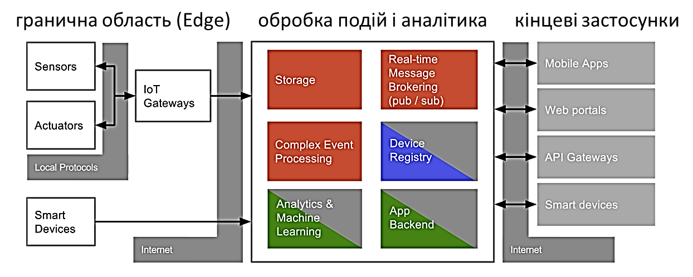
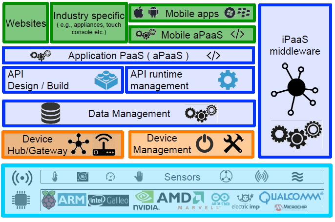
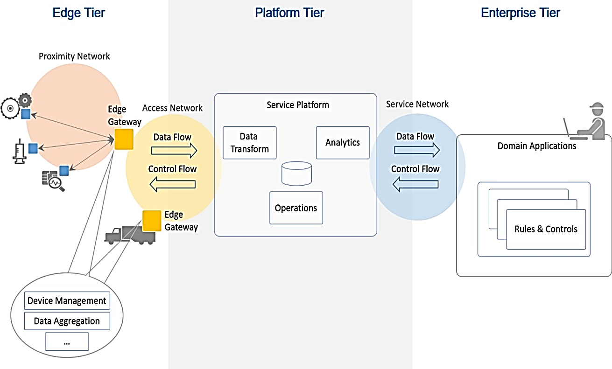

**Технології індустрії 4.0. Лекції. ** Автор і лектор: Олександр Пупена 

| [<- до лекцій](README.md) | [на основну сторінку курсу](../README.md) |
| ------------------------- | ----------------------------------------- |
|                           |                                           |

Даний матеріал є частиною посібника О. Пупени "РОЗРОБКА ЛЮДИНО-МАШИННИХ ІНТЕРФЕЙСІВ ТА СИСТЕМ ЗБОРУ ДАНИХ З ВИКОРИСТАННЯМ ПРОГРАМНИХ ЗАСОБІВ SCADA/HMI"

### Промисловий інтернет речей 

Використання концепцій IoT для промислових об’єктів носить назву ***промислового Інтернету речей*** (***Industrial IoT, IIoT***). IIoT – це підмножина сегменту рішень IoT, яка зосереджується на спеціалізованих вимогах промислових застосувань, таких як виробництво, нафта і газ та комунальні послуги. Хоча IoT та IIoT поділяють загальні технології (датчики, хмарні платформи, підключення та аналітику), на цьому їх схожість закінчується. Хоча багато людей припускають, що IoT та IIoT відрізняються функціональністю, насправді функції засобів можуть бути однакові, основні відмінності полягають у їх виконанні та структурі системи. При виборі IIoT рішення необхідно враховувати вимоги до промислового виконання. Нижче наведемо 10 особливостей IIoT порівняно з IoT [джерело](https://strategyofthings.io/industrial-iot?utm_source=IIoT-World.com.com&utm_medium=iiot-world.com/news/ ):

**Безпечність** (Security). Безпека є критичною для всіх рішень IoT, але промислові рішення IoT вимагають більш жорстких заходів. Зрив виробничого процесу з великим обсягом продукції може привести до втрат в мільйони гривень на день. А відключення електричної мережі впливає на економічну активність мільйонів людей і ставить під загрозу національну безпеку. Рішення IIoT використовують різноманітні вдосконалені заходи безпеки, зокрема побудови безпечної та стійкої архітектури системи, використання спеціалізованих плат, шифрування та аутентифікації, виявлення загроз та використання особливих алгоритмів в самих процесах керування. Деякі аспекти кібербезпеки в IIoT наведені в наступному підрозділі.  

**Сумісність** (Interoperability). Промислові IoT рішення повинні співіснувати в середовищі зі значною кількістю застарілих засобів OT, включаючи SCADA/HMI, ПЛК та інших системи керування виробництвом. Ці системи все ще функціонують і використовуються і за певних причин не можуть бути замінені на більш сучасні. Рішення IIoT повинні інтегруватися з цими системами, тому підтримувати різні протоколи та інтерфейси. Не менш важливо щоб рішення IIoT інтегрувалися також із системами класу MOM та ERP. 

**Масштабовність** (Scalability). Рішення IIoT, розгорнуті в промислових мережах, повинні мати можливість підтримувати як сотні тисяч нових датчиків, пристроїв та контролерів так і існуючих пристроїв, які не мають інтерфейсів IoT. IoT як правило орієнтується на порівняно невелику кількість даних. 

**Точність** (Precision and Accuracy). Промислові операції вимагають більш високого рівня точності. Автоматизовані високооб'ємні, високошвидкісні виробничі процеси синхронізуються до мілісекунд. Системи забезпечення якості виявляють малі відхилення та вживають негайних коригувальних дій на основі цих вимірювань. У цьому середовищі забезпечення регулювання на рівні "десь біля заданого значення» є недостатнім, і це призводить до втрати ефективності, збільшення простоїв та втрати прибутків. Промислові IoT рішення повинні підтримувати виконання операцій з високою точністю. 

**Програмованість** (Programmability). Промислові системи керування, так як програмовані логічні контролери чи машини, мають властивість зміни програми та конфігурації, що дає можливість підтримувати нові технологічні процеси. Це програмування може бути виконано віддалено, на виробничому майданчику та безпосередньо за місцем розміщення. Промислові IoT рішення повинні мати таку саме гнучкість та пристосовність для підтримки нових операцій. 

**Низька затримка реагування** (Low latency). У високошвидкісній системі неперервного виробництва з датчиками, що відстежують кожен аспект операції, кожна секунда має значення. Потрібно виявити аномалії та застосувати коригувальні дії у реальному часі. Будь-яка затримка з виявленням, оцінкою, прийняттям рішень та виконанням може привести до небезпеки працівників, погіршення якості продукції, втрат або втрачених доходів. Промислові IoT рішення повинні будуватися таким чином, щоб забезпечити вимогу до швидкодії. 

**Надійність** (Reliability). Промислові системи працюють протягом тривалого часу до їх заміни, типовим є кілька десятків років. Вони працюють у суворих кліматичних умовах, вібрації, при цьому часто віддалено від розташування обслуговуючого персоналу. Промислові IoT рішення повинні забезпечувати таку ж високу доступність, витримувати тривалі робочі цикли та працювати надійно протягом років із проведенням відключення лише для технічного обслуговування. 

**Живучість** (Resilience). Найважливіші виробничі процеси та системи, де простої (або навіть доступ до обслуговування) не є допустимими, розроблені з урахуванням живучості. Поломка в одній частині не повинна припинити роботу всієї системи. Незважаючи на те, що можуть виникнути втрати експлуатаційних можливостей, завдання можуть взяти на себе резервні системи, або необхідні процеси можуть виконуватися на резервних потужностях. Промислові рішення IoT в критичних операціях повинні підтримувати відмовостійкість або живучість. При втраті датчиків або підключення з мережею, промислові IoT системи та архітектури повинні могти компенсувати це та мати можливість задовільно завершити свої процеси та операції.

**Автоматизованість** (Automation). Багато виробничих процесів високо автоматизовані від початку до кінця, з обмеженим втручанням людини. Рішення IoT, що працюють в промислових умовах, повинні підтримувати цілий спектр вимог до автономності. Це може привести до втілення інтелекту в граничні пристрої (Edge), включення логіки керування та автоматизації в шлюз, або включення в систему можливостей глибокого навчання. 

**Зручність обслуговування** (Serviceability). Промислові системи повинні працювати надійно та передбачувано в суворих умовах протягом багатьох років. Підтримка такого рівня продуктивності вимагає регулярного обслуговування технічними службами, це може бути як заміна датчиків чи оновлення мікропрограм так і зміна налаштування шлюзів і серверів. 

​      Для розвитку IIoT та популяризації кращих практик організація Industrial Internet Consortium випускає документи, які можна вільно завантажити з [їх сайту](https://www.iiconsortium.org) . Тому розробникам систем автоматизації, які мають намір використовувати рішення IIoT, варто ознайомитися з цими документами для кращого вибору засобів та архітектурних рішень. Нижче зупинимося тільки на деяких варіантах для загальної обізнаності читача.  

Архітектура Інтернету речей відрізняється в залежності від реалізації. Тим не менше вона дещо схожа на архітектуру класичних систем АСКТП. Один із прикладів архітектури показаний на рис.9.30. 

                               

рис.9.30. Приклад архітектури IIoT

Взаємодія з «речами» відбувається через датчики (sensors) та виконавчі механізми (Actuators), аналогічно як це робиться в АСКТП для будь якого об’єкту керування. Ці датчики разом з усією інфраструктурою для інтеграції з рівнем обробки подій через мережу Internet формують так звану граничну область (***Edge***). 

Події (дані) що поступають з граничної області зберігаються і обробляються відповідно до задачі (рівень обробки подій і аналітики, ***event processing, Platform***). На цьому рівні події(дані) зберігаються (storage), обробляються (Event Processing), перенаправляються потрібним застосункам (Real-Time Message Brokering, Stream Processing). Додатково на цьому рівні відбувається адміністрування та керування пристроями з граничної області (Device Registry, Edge Device Management). Події (дані) обробляються з використанням аналітичних сервісів (Analytics) на основі них проводиться машинне навчання (Machine Learning), що дозволяє зробити певні висновки про об’єкт. Цей рівень як правило реалізований з використанням хмарних (Cloud) або туманних (Fog) обчислень. Якщо провести аналогію с АСКТП, то ці функції наближені до рівня контролерів та SCADA (за виключенням функцій HMI).    

Отримання результатів, контроль, віддалене керування та адміністрування системи проводиться через кінцеві застосунки з використанням Internet. Цей рівень можна умовно порівняти з HMI в АСКТП.  

На рис.9.31. показана подібна наведеній вище архітектура, однак у вигляді сервісів. На ньому область Edge представлений у вигляді датчиків (Sensors), Device Hub/Gateway (збір та маршрутизація даних) та Device Management (керування пристроями). Останні частково виконуються як хмарні обчислення так і на граничних пристроях. Усі функції збереження та первинної обробки подій (даних) зведені до Data Management. Усі інші функції обробки, в тому числі аналітичні показані як застосунки PaaS, що взаємодіють з сервісами керування даних через API (Application Program Interface).     

 

рис.9.31. Приклад архітектури IIoT у вигляді шарів сервісів

Ще один приклад архітектури Інтернету Речей показаний на рис.9.32. Як видно, усі наведені архітектури мають спільні риси: наявність трьох рівнів, подібні функції, наявність хмарних обчислень, використання Інтернету як інтеграційного рівня.  

 

Рис.9.32. Приклад архітектури Промислового Інтернету Речей від Industrial Internet Consortium.

 

​      Слід відмітити, що для IIoT, може бути характерним підключення цілих підсистем АСКТП. Тобто поряд з датчиками та виконавчими механізмами можуть підключатися розумні пристрої, засоби розподіленого вводу/виводу, ПЛК та SCADA/HMI. Функцією спряження цих пристроїв до хмарної платформи займається ***IoT Edge Gateway***. Якраз він і є тим пристроєм, який розуміє два світи в IIoT – OT та IT. З одного боку він підтримує різнорідні протоколи промислових мереж, з іншого – протоколи IoT та WEB, зокрема MQTT, AMQP, HTTP API, WebSocket та інші. Протокол MQTT розглянутий в розділі 4 даного посібника. Крім самих функцій шлюзування  IoT Edge Gateway виконує додаткові функції, які характерні саме для сегменту IIoT, і забезпечують вимогам, які наведені вище. Зокрема тут додатково можуть проводитися:

- первинна обробка сирих даних;
- накопичення даних у випадку відсутності зв’язку з хмарною платформою;
- контроль та керування пристроями;
- зв'язок з локальними засобами відображення та контролю

Щоб навчитися правильно оцінювати, як система буде розвиватися і рости, необхідно розібратися у всіх тонкощах і складнощах архітектури хмарних систем, який вплив на IoT-систему робить запізнювання. Крім того, не всі дані необхідно відправляти на хмарну платформу. Пересилання всіх IoT-даних обходиться значно дорожче, ніж їх обробка на кордоні мережі (граничні обчислення, Edge Computing) або включення граничного маршрутизатора в зону, яку обслуговує хмарний сервіс (туманні обчислення, Fog computing). Туманні обчислення також стандартизуються, наприклад є архітектура OpenFog.

Наступним ланцюжком в обміні даними знаходиться рівень платформи, тобто хмарні обчислення. Хоч тема хмарних обчислень виходить за рамки посібника, розробникам систем АСКТП та проектів SCADA/HMI в тому числі, варто розуміти базові принципи їх побудови, які описані в наступному параграфі. 

| [<- до лекцій](README.md) | [на основну сторінку курсу](../README.md) |
| ------------------------- | ----------------------------------------- |
|                           |                                           |