**Технології індустрії 4.0. Лекції** Автор і лектор: Олександр Пупена 

| [<- до лекцій](README.md) | [на основну сторінку курсу](../README.md) |
| ------------------------- | ----------------------------------------- |
|                           |                                           |

# 6. OPC UA

У онлайн посібнику [OPC UA Fundamentals](https://documentation.unified-automation.com/uasdkcpp/1.5.6/html/L1OpcUaFundamentals.html) можна знайти детальну інформацію про OPC UA, орієнтовану на програміста, що спеціалізується на розробки OPC Client та OPC Server. Тут зупинимося тільки на базових принципах функціонування. 

##  6.1. Загальні принципи функціонування OPC UA

***OPC UA (OPC Unified Architecture)*** - це незалежний від платформи стандарт, який дозволяє обмінюватися виробничими даними між різними типами застосунків та користуватися їх сервісами. Принциповою відмінністю в OPC UA від своїх попередників є використання іншого стеку протоколів, що дало можливість:

- відв’язатися від залежності MS Windows;
- реалізовувати застосунки на різних типах пристроїв, а не тільки ПК;
- реалізовувати зв'язок на різних типах мереж в т.ч. через Інтернет;
- будувати захищені з’єднання між застосунками;
- використовувати механізми обміну шляхом публікацій і підписки; 

OPC UA може функціонувати з використанням різних комунікаційних протоколів, при цьому дані можуть бути закодовані різними способами (рис.4.34). Означено кілька протоколів, які можна використовувати:

- OPC UA TCP
- HTTPS
- WebSockets

Визначено три способи кодування даних:

- XML/text
- UA Binary
- JSON

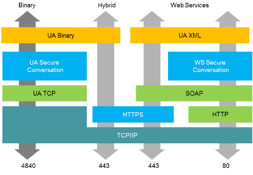                               

рис.4.34. Комунікаційна архітектура OPC UA

OPC UA так само як OPC DA має клієнт-серверну модель функціонування, в якій Сервери можуть надавати різні набори ***Сервісів (Services***). Під час підключення Сервер повідомляє клієнту, які з сервісів він підтримує. Обмін інформацією відбувається з використанням типів даних, означених як в стандартах OPC UA, так і постачальниками. 

Всі дані і сервіси доступні через ***об’єкти***, які надаються клієнтському застосунку через взаємопов’язану об’єктну модель. Сервери означують об'єктні моделі, які Клієнти можуть динамічно переглянути. Через ці об’єкти Сервери можуть надати доступ як до даних реального часу, так і до історичних (Historical), Тривог(Alarms) і Подій(Events). 

Кожен об’єкт може надавати доступ до читання/запису його змінних, або до виклику методів (рис.4.35). Користувачам OPC UA не обов’язково використовувати об'єктно-орієнтовані підходи, що передбачають використання методів та подій. Як і у класичному OPC Data Access може бути побудована проста модель адресного простору, в якій використовуються об'єкти-папки та змінні. Тим не менше, наявність розширених об'єктно-орієнтованих функцій значно полегшує представлення об'єктно-орієнтованих систем за допомогою OPC UA 

 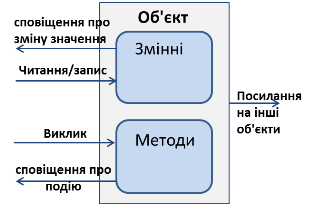

рис.4.35.Об’єктна модель OPC UA

Об’єкти можуть посилатися на інші об’єкти через різний тип зав’язків. Взаємозв’язані об’єкти серверу доступні клієнтам через механізм організації у вигляді ***адресного простору OPC UA (Address Space***). Усі об’єкти в адресному просторі знаходяться у певній взаємозалежності, що представляється через об'єктну модель OPC UA.  Для визначення взаємозв'язків між об'єктами та їх складових може використовуватися Сервіс перегляду. Елементи об’єктної моделі (об’єкти та їх складові) представлені в адресному просторі як ***Вузли (Node***). Кожен вузол представляє певний клас вузлів (тип елементів об’єктної моделі), такий як об'єкт, змінна (Змінна Даних або Властивість) або Метод і т.п. (див. рис. 4.36).

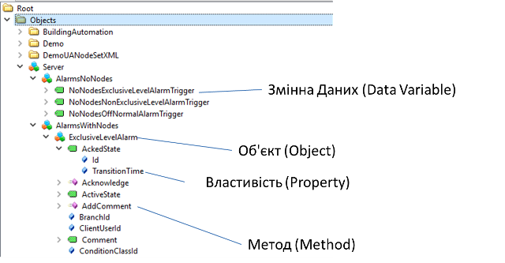 

рис.4.36. Приклад перегляду адресного простору серверу OPC UA  

***Класи вузлів (Node Classes)*** означують набір атрибутів та типів посилань для різних вузлів. OPC UA описує вісім класів вузлів (див. рис.4.35): 

- Object (Об’єкт) - використовується для представлення системних об’єктів, складових системи, об'єктів реального світу та програмних об'єктів (аналогія екземплярів в ООП);

- Variable (Змінна) - використовуються для представлення значень (вмісту) об’єкта 

- Method (Метод) - використовується для представлення методу в адресному просторі сервера;

- View (Представлення) - використовується для обмеження кількості видимих вузлів і посилань у великому адресному просторі; 

- ObjectType (Тип Об’єкту) - використовується для представлення у просторі типів об'єктів на які посилаються вузли-об’єкти (аналогія класів в ООП); 

- VariableType (Тип Змінної) – використовуються для означення Властивостей, доступних для екземпляра Змінної;

- ReferenceType (Тип Посилання) - використовується для представлення типу посилання, що використовуються сервером;

- DataType (Тип Даних)


Кожен вузол адресного простору є екземпляром одного з цих класів вузлів. Клієнтам і серверам не дозволяється означувати додаткові класи вузлів або розширювати означення цих класів (наприклад, список атрибутів для класу).

Вузли описуються атрибутами (attributes) і взаємопов'язані посиланнями (references) (див. рис.4.37).

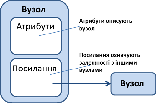 

рис.4.37. Вузли і Посилання 

***Атрибути (Attributes***) - це елементарні дані, що описують вузол. Клієнти можуть отримувати доступ до значень атрибутів за допомогою сервісів Читання(Read), Запису(Write), Запиту(Query) та Підписки/Контролю елементу (Subscription/Monitored Item). Атрибути є елементарними складовими класів вузлів, перелік і призначення яких описані в стандарті, тому заздалегідь відомі клієнтам і не є безпосередньо видимими в адресному просторі. Набір атрибутів, означених для кожного класу вузлів, не може бути розширений клієнтами або серверами. Кожне означення атрибуту складається з ідентифікатора атрибута (attribute id), імені(name), опису(description), типу даних (data type) і обов'язкового/необов'язкового індикатора (indicator). На рис.4.38 показаний набір атрибутів (Назва та значення) для вузла класу Variable

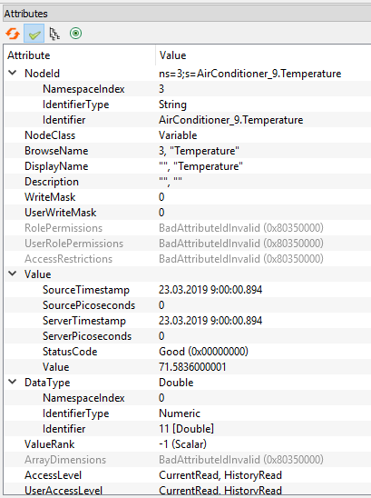 

рис.4.38. Приклад набору атрибутів для вузла класу Variable 

***Посилання (References***) використовуються для зв'язку вузлів між собою. Їх можна отримати за допомогою сервісів перегляду (browsing) та запиту (querying). Подібно атрибутам, вони означуються як фундаментальні складові вузлів. На відміну від атрибутів, посилання означуються як екземпляри вузлів класу ReferenceType, які видимі в адресному просторі. Вузол, що містить посилання, називається ***вихідним вузлом (source node***), а вузол, на який посилається, називається ***цільовим вузлом (target node***). Для унікальної ідентифікації посилань в сервісах OPC UA використовується комбінація вихідного і цільового вузлів ReferenceType. Таким чином, кожен вузол може посилатися на інший вузол з тією самою ReferenceType тільки один раз. На рис.4.39 показаний приклад посилання. Цільовий вузол може знаходитися в тому ж адресному просторі або в адресному просторі іншого OPC UA сервера. Цільові вузли, розташовані на інших серверах, ідентифікуються в сервісах OPC UA з використанням комбінації імені віддаленого сервера та ідентифікатора Вузла.

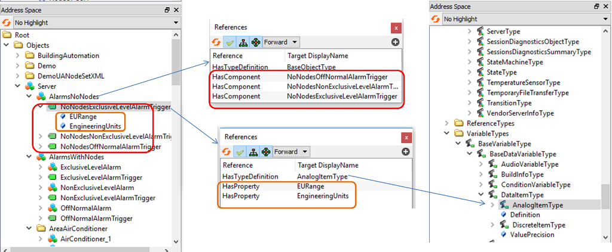 

рис.4.39. Посилання 

***Змінні (Variables***) використовуються для представлення змісту об’єктів (див.рис.4.35). Означено два типи вузлів-Змінних: Properties (Властивості) і DataVariables (Змінні Даних). Вони відрізняються різновидом даних, що представляють, та можливістю вміщувати інші змінні.

***Властивості (Properties***), подібно до атрибуту вузла, містять задані сервером метадані об'єктів, змінних даних та інших вузлів. Властивості відрізняються від атрибутів тим, що вони можуть бути означені і додані сервером і охарактеризувати те, що представляє вузол. Набір атрибутів і їх призначення є однаковим для всіх вузлів конкретного класу, тоді як властивості можуть бути означені сервером. Наприклад, властивість може використовуватися для вказівки інженерної одиниці змінних. Властивості як і інші вузли також вміщують атрибути (рис.4.40), але не можуть включати в себе інші властивості. Властивості безпосередньо видимі в адресному просторі як Вузол, тоді як атрибути не є Вузлами. Вузол (Змінна, Об’єкт) і його властивості завжди повинні знаходитися на одному сервері.

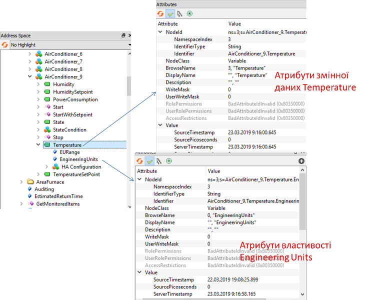 

рис.4.40. Порівняння атрибутів і властивостей 

***Змінні Даних(Data Variables***) представляють зміст (дані) об'єкта. Нагадаємо, що об'єкт є контейнером для змінних і методів (див.рис.4.35). Оскільки вузли-об'єкти (object node) безпосередньо не надають числових значення даних, це роблять вузли-змінні. 

Змінні Даних можуть включати в себе (посилатися на) властивості або інші Змінні Даних. При включенні змінних даних формуються складені (структурні) Змінні Даних. Наприклад, об'єкт-файл використовує Змінну Даних для представлення вмісту файлу у вигляді масиву байтів. При цьому для розкриття часу створення і власника об’єкту-файлу можуть бути використані Властивості. 

Наведемо інший приклад. Функціональні блоки в системах керування можуть бути представлені як об'єкти. Параметри функціонального блоку, такі як його задані значення, можуть бути представлені у вигляді Змінних Даних. Об'єкт функціонального блоку може також мати Властивості, що описують його час виконання і тип.

## 6.2. Ідентифікація вузлів в OPC UA

Класичний OPC DA Server використовує прості «символьні» ідентифікатори елементів "ItemID", який є унікальним на всьому OPC сервері. Тобто в класичному OPC існує тільки один "простір імен". Крім того, класичні сервери DA мають можливості лише простої ієрархії, тобто деревоподібної структури з гілками і листям (див.рис.4.22). Таким чином, розробники для створення унікальних ItemID мають використовувати повну ієрархію папок (наприклад, "Folder1.Folder2.Folder3.MyTemperature"). Це призводить до великої кількості надлишкових рядків, втрати пам'яті та уповільнення продуктивності під час перегляду або пошуку окремих елементів. 

При розробці стандарту OPC UA ця концепція ідентифікації була відкинута. Тут кожен об'єкт в адресному просторі є вузлом. Щоб однозначно ідентифікувати Вузол, в нього є ***NodeId***, який завжди складається з трьох елементів: Namespace Index (індекс простору імен), Identifier Type (тип ідентифікатора) та Identifier (ідентифікатор).

***Namespace Index*** - Індекс, який сервер OPC UA використовує для ідентифікації URI простору імен (Уніфікований ідентифікатор ресурсів, Uniform Resource Identifier). Ідентифікатори в межах різних просторів імен можуть бути однаковими. ***URI простору імен*** ідентифікує того, хто(що) є автором імен в його межах (подібно до XML). Такими URI можуть бути наприклад «OPC Foundation», інші стандартні органи та консорціуми, або локальний сервер. Ці URI зберігаються в так званому масиві імен (також називається таблицею імен), індекси яких і використовуються для ідентифікації просторів імен. 

Таким чином унікальність імен досягається тим, що в них є свої простори, які також є унікальними і означуються ідентифікаторами URI. Щоб посилатися не на довгі і незручні URI, у кожному сервері є таблиця цих імен, індекси (NamespaceIndex) якої можна використовувати для посилання. На рис.4.41 показані URI на сервері та їх індекси .  

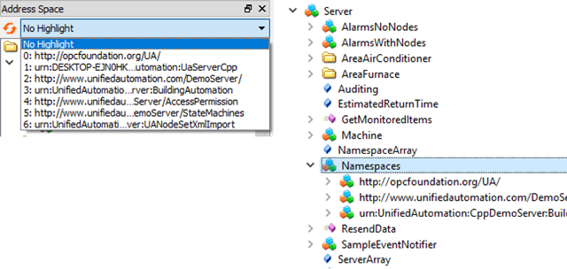 

рис.4.41. Приклади URI просторів імен серверу UACppServer

***Identifier Type*** - формат і тип даних ідентифікатора. Це може бути числове значення, рядок, глобальний унікальний ідентифікатор (GUID) або непрозоре значення (специфічний формат простору імен у форматі ByteString). Простір імен OPC UA, як означено в OPC Foundation, використовує числові NodeIds. Загальносистемні та глобальні унікальні ідентифікатори дозволяють клієнтам відстежувати вузли, що переміщуються між серверами OPC UA, що буває у випадку, коли, наприклад, робочі замовлення просуваються по ланцюжку доданої вартості.

***Identifier*** - ідентифікатор вузла в адресному просторі сервера OPC UA.

Наступне зображення показує приклади для NodeIds, що мають різні типи ідентифікаторів.

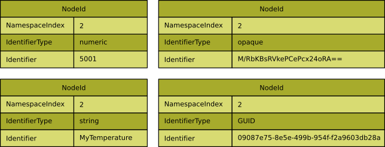 

рис.4.42.Приклади різних типів NodeIds

Існує XML-нотація, означена за допомогою схеми XML OPC UA, яка представляє повний кваліфікатор NodeId з використанням наведених вище елементів. Формат рядка:

```xml
ns=<namespaceIndex>;<identifiertype>=<identifier>
```

де `<namespace index> `- Індекс простору імен, відформатований в 10-ковій формі. Якщо індекс дорівнює 0, то "ns = 0;".

`<identifier type>`  - прапорець, який вказує на тип ідентифікатора:

`i` - NUMERIC (UInteger) 

`s` - STRING (String) 

`g` - GUID (Guid) 

`b` - OPAQUE (ByteString)

`<identifier>` - ідентифікатор, закодований як string. Ідентифікатор форматується за допомогою відображення типу даних XML для типу ідентифікатора. Зауважте, що ідентифікатор може містити будь-який ненульовий символ UTF8, включаючи пробіл. Посилатися таб. 4.3.

Таб.4.3. Приклади ідентифікаторів NodeID

| **NodeID**                                  | **Пояснення**                                    |
| ------------------------------------------- | ------------------------------------------------ |
| ns=2;s=MyTemperature                        | namespace index 2, string identifier             |
| i=2045                                      | namespace index 0, numeric  identifier           |
| ns=1;g=09087e75-8e5e-499b-954f-f2a9603db28a | namespace index 1, GUID  identifier              |
| ns=1;b=M/RbKBsRVkePCePcx24oRA==             | namespace index 1,  Opaque/ByteString identifier |

Частина ідентифікатора NodeId однозначно ідентифікує вузол у просторі імен, але можливо, що один і той самий ідентифікатор використовується в різних просторах імен для різних вузлів. Отже, тільки ідентифікатор разом з простором імен формує повністю кваліфікований ідентифікатор (див. рис. 4.43). Це означає, що якщо клієнт запитує вузол, наприклад, у службі читання, служба потребує вказівки не тільки ідентифікатора, але й простору імен, до якого належить вузол.

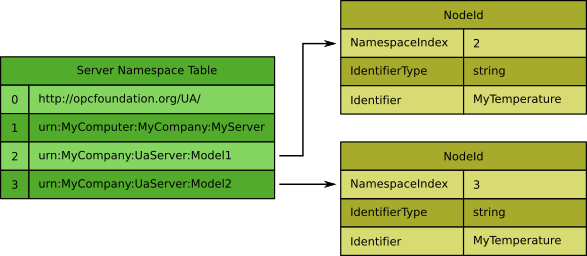 

рис.4.43.Вузли з однаковим ідентифікатором в різних просторах імен

Оскільки у сервісах OPC UA замість довгого URI використовується індекс простору імен, клієнт повинен подбати про правильне відображення URI у індекс. Поки існує активний сеанс, серверам не дозволяється змінювати індекс для конкретного URI або видаляти записи з таблиці просторів імен, щоб для активного сеансу клієнти могли кешувати таблицю простору імен. Але якщо клієнт не підключений до сервера він може змінювати індекси і видаляти записи з таблиці просторів імен. З цієї причини клієнт не повинен зберігати індекс без зберігання URI, оскільки протягом наступного сеансу він може отримати інший індекс. Таким чином, при встановленні сеансу з сервером, клієнт завжди повинен читати таблицю простору імен сервера та оновити індекси простору імен.

Розглянемо це на прикладі (див.рис.4.44). Клієнт бажає прочитати дані з Вузлу, представленого ідентифікатором `MyTemperature`, який належить до простору імен, означеним URI `urn:MyCompany:UaServer:Model2`. Клієнт зберігає власну таблицю просторів імен, що містить потрібні URI, щоб створити повністю кваліфікований NodeIds, але ще не знає відповідного індексу простору імен у таблиці імен сервера. 

Для того, щоб мати доступ до правильного вузла, клієнт повинен спочатку прочитати таблицю простору імен сервера. URI простору імен `urn:MyCompany:UaServer:Model2` представлений індексом простору імен `3` на сервері. Тепер клієнт може оновлювати індекси простору імен у своїй таблиці простору імен, тобто індекс `2` індексом `3`, і для доступу до правильного node використати адресу у форматі XML `ns=3;s=MyTemperature`.

Якби клієнт не оновив індекси в таблиці простору імен, могла б виникнути наступна ситуація. Оскільки допускається, що простір імен, ідентифікований іншим URI, наприклад   `urn:MyCompany:UaServer:Model1`, також може містити вузол, що має ідентифікатор `MyTemperature`, клієнт може навіть не помітити, що він звернувся до неправильного вузла при читанні `ns=2;s=MyTemperature`.

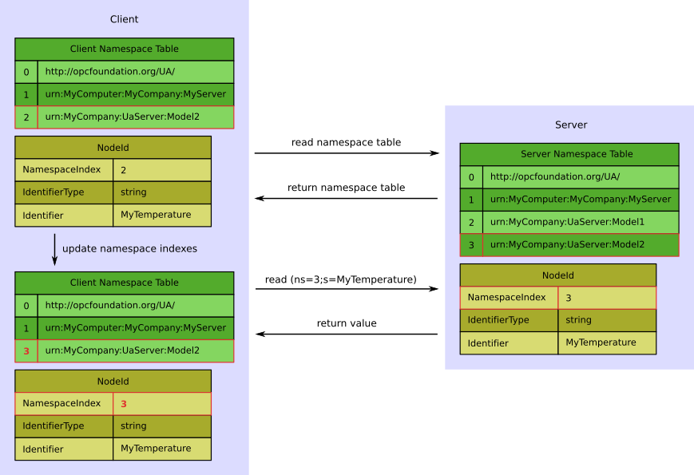 

рис.4.44. Читання і збереження таблиці простору імен

## 6.3. Функціонування читання/запису в OPC UA

Для оновлення даних на клієнті технологія OPC UA надає функціональність ***підписки*** (***Subscription***). Клієнт OPC UA може підписатися на вибрані вузли і казати серверу стежити за цими елементами. Таким чином сервер повідомлятиме клієнта тільки про якісь зміни значень або стану. Цей механізм значно зменшує обсяг переданих даних. Окрім зменшення завантаження на мережу, цей механізм надає додаткові переваги і є рекомендованим механізмом «зчитування» інформації з OPC UA серверу.

Клієнт може підписатися на різні типи інформації, що надається сервером OPC UA. ***Контрольовані Елементи*** ***(******Monitored Items)*** групуються разом в єдиний блок, що називається ***Notification*** (***Оповіщення***). При цьому, коли клієнт підписується на зміни даних та події, залучається ряд сервісів, які показані на рис.4.45.

. 

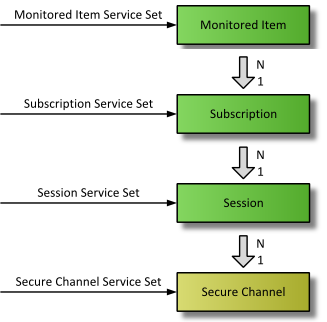 

рис.4.45. Контекст, що необхідний для підписки на зміни даних і Події

Підписка складається, принаймні, з одного Контрольованого Елементу, який повинен бути створений в контексті ***сеансу (Session)*** і може бути переданий до іншого сеансу. Щоб створити сеанс, необхідно встановити захищений канал (Secure Channel) між клієнтом і сервером.

Існує три різні типи "змін", на які може підписатися Клієнт, додаючи Контрольовані Елементи до Підписки:

- підписатися на зміну значень змінних (атрибут Value змінної);

- підписатися на події об'єктів (атрибут EventNotifier об'єкта та набору фільтрів подій);

- підписатися на агреговані значення, які обчислюються у означених клієнтом часових інтервалах, на основі поточних змінних значень.


Налаштування, доступні для Контрольованих Елементів (Monitored Items) та Підписки (Subscription), наведені на рисунку 4.46.

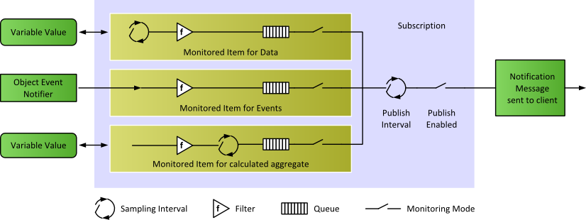 

рис.4.46. Налаштування Контрольованих Елементів (Monitored Items) та Підписки (Subscription)

***Інтервал вибірки (sampling interval***) означує часовий інтервал індивідуально для кожного Контрольованого Елементу в підписці. Це період, з якою сервер перевіряє джерело даних на зміни. Вибірка може проводитися набагато частіше, ніж Клієнту відправлятиметься повідомлення. У цьому випадку Сервер може записувати вимірюване значення протягом певного часу в чергу, а згодом публікувати повну чергу. У випадку ***Агрегованих Контрольованих Елементів (Aggregate Monitored Items)*** інтервал вибірки означує інтервал, для якого агрегуються дані.

***Фільтри*** (***filter***) містять декілька критеріїв, за якими можна вказати, які зміни даних або події слід повідомляти а які повинні бути заблоковані (не передаватися). У випадку Агрегованих Контрольованих Елементів він також містить інтервал дискретизації необроблених даних, який означує швидкість вибірки значень з джерела даних.

UA-сервер може підтримувати запис в чергу (буфер) вимірюваних даних або подій. Розмір черги, тобто максимальне число значень, які можна поставити в чергу, можна налаштувати для кожного Контрольованого Елемента. Коли дані надходять до клієнта (при публікації) черга очищається. Кожна черга має політику відкидання (наприклад, відхилення найстаріших) у разі виникнення переповнення. 

Встановивши режим моніторингу, вибірку даних та звітність можна увімкнути або вимкнути.

Існує два параметри, які впливають на саму підписку: Publishing Interval і Publish Enabled. Після кожного ***Publishing Interval*** (***Інтервалу Публікації***) сповіщення, зібрані в черзі, доставляються клієнту в повідомленні сповіщення (Publish Response). Клієнт повинен гарантувати, що сервер отримав достатню кількість маркерів публікації (Publish Tokens = Publish Requests), так що всякий раз, коли закінчиться інтервал публікації і повідомлення буде готово до відправки, сервер використовує такий маркер і надсилає дані в межах Publish Response. У випадку, якщо нічого не повідомляється (наприклад, ніяких значень не було змінено), сервер надішле повідомлення Клієнту KeepAlive, яке є пустим Publish-повідомленням, щоб вказати, що сервер ще працює, тільки йому нічого відправляти. Надсилання повідомлення сповіщення можна ввімкнути або вимкнути, змінивши параметр ***Publish Enabled*** (Опублікування ввімкнено).

## 6.4. Принципи підключення до OPC UA Server та захисту

Щоб підключитися до сервера, клієнту необхідно вказати мережну адресу, протокол і параметри безпеки. Для цього OPC UA означує набір функцій виявлення. Вся інформація, необхідна для встановлення підключення клієнту до серверу, зберігається в його ***кінцевій точці (\******endpoint)\****.* Сервер може надати кілька кінцевих точок, кожна з яких містить (див. рис.4.47)

- URL кінцевої точки (протокол і адреса     мережі)
- політика безпеки (Security     Policy, назва для набору     алгоритмів безпеки та довжина ключа)
- режим захисту повідомлень (Message     Security Mode, рівень     безпеки для обміну повідомленнями)
- тип маркера користувача (User     Token Type, типи     автентифікації користувача, що підтримуються сервером)

Якщо існує декілька серверів OPC UA, для надання інформації про доступні сервери можна використовувати ***Сервер Виявлення*** *(* ***Discovery Server***), на які попередньо реєструються OPC UA Сервери. Клієнти можуть запитувати список всіх доступних серверів з Сервера Виявлення, після чого можна використовувати службу «Get Endpoints» для отримання інформації про доступні з'єднання з сервера.

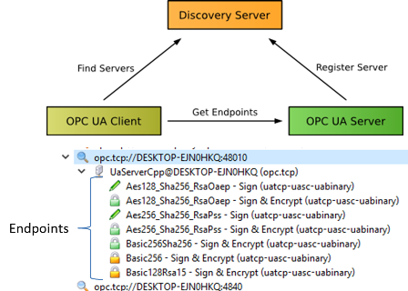 

рис.4.47. Принципи роботи Серверу Виявлення та приклад переліку кінцевих точок 

Щоб ідентифікувати себе для комунікаційних партнерів, кожен встановлений застосунок або пристрій OPC UA потребує ***Application Instance Certificate*** (***Сертифікат екземпляру застосунку***) та пов'язану пару публічних/приватних ключів (див. параграф 9.5.6). Відкритий ключ розповсюджується разом із сертифікатом. Приватний ключ повинен залишатися таємним і використовується для підписування та/або розшифровки повідомлень. Партнер зв'язку може використовувати відкритий ключ для перевірки відношення довіри, перевірки підпису повідомлень і шифрування повідомлень. Сертифікат екземпляра застосунку, включаючи публічний і приватний ключ, може бути згенерований застосунком або наданий адміністратором.

Сертифікати зберігаються в ***Сховищі Сертифікатів*** (***Certificate Store***), що містить окремі місця для довірених і власних сертифікатів, а також сертифікати органів сертифікації, які використовуються для перевірки ланцюгів (chain) сертифікатів. Додаткове місце відхилених сертифікатів може містити сертифікати застосунків, які намагалися підключитися, але їм досі не довіряють.

Сертифікати, що видаються самим застосунком, називаються ***само-підписаними сертифікатами*** (***self-signed certificates***). Вони зазвичай генеруються під час інсталяції застосунку або при першому запуску. Щоб встановити відношення довіри між клієнтом OPC UA і сервером, само-підписані сертифікати партнера зв'язку добавляються в ***список довіри*** (***trust list***). Сертифікат клієнта добавляється в список довіри сервера і сертифікат сервера до списку довіри клієнта. Якщо сертифікат застосунку видаляється зі списку довіри, встановлення зв'язку більше неможливе.

Сертифікати, підписані ***органами сертифікації*** (***Certificate Authorities***, **CA**), дозволяють організувати центральне довірче керування для групи застосунків або пристроїв OPC UA. У цьому випадку у список довіри застосунків OPC UA повинен бути встановлений тільки сертифікат CA. Після встановлення сертифіката CA всі інші застосунки з сертифікатами, підписаними CA, можуть взаємодіяти один з одним. Щоб виключити з комунікації раніше довірені застосунки, CA зберігає ***список відкликаних сертифікатів*** (***Certificate Revocation List****, **CRL***). Кожен встановлений сертифікат CA повинен мати встановлений асоційований CRL. Цей CRL необхідний для перевірки відносини довіри. OPC UA Global Discovery Server забезпечує механізм центрального керування підписаними CA сертифікатами та оновлення відповідних CRL. 

Сертифікати CA можуть створювати ланцюжок. Наприклад: 

```
кореневий CA для компанії -> CA для заводу, на якому CA підписаний кореневим CA -> CA для виробничої лінії на заводі.
```

Застосунок OPC UA у виробничій лінії буде лише довіряти CA для виробничої лінії. Інші сертифікати CA використовуються лише для перевірки ланцюжка.

Сховище сертифікатів базується на основі файлів, в якому містяться наступні каталоги (Імена та структури можуть відрізнятися між застосунками):

- ***Own*** - cертифікат     екземпляра та закритий ключ застосунку
- ***Trusted*** -  cамо-підписані сертифікати довірених     застосунків OPC UA або сертифікатів CA для довірених CA. Кожен     сертифікат CA     поставляється з CRL, який вимагає частого оновлення.
- ***Issuers***  - cертифікати CA, які не мають прямої довіри, але необхідні для     перевірки ланцюжка сертифікатів CA. Кожен сертифікат CA поставляється з     CRL, який вимагає частого оновлення.

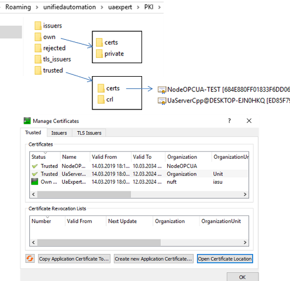 

рис.4.48. Сховища сертифікатів

Крім того, типово існує каталог ***відхилених сертифікатів*** (***Rejected***), де застосунок OPC UA може зберігати сертифікати з інших застосунків, які намагалися підключитися, але не були довірені. Адміністратори можуть переміщувати сертифікати з Rejected до Trusted, якщо дозволено підключення до застосунку.

Таким чином після встановлення OPC UA Серверу, його конфігурація складається з:

- сертифікату екземпляра застосунку, що     ідентифікує інсталяцію сервера;
- сховище сертифікатів, включаючи список     довірених і відхилених сертифікатів екземплярів застосунків;
- принаймні одну кінцеву точку (Endpoint);

Сервер повинен надати принаймні одну кінцеву точку, до якої можуть підключатися клієнти. Клієнт використовує ***Discovery URL*** (як правило, ідентичну URL кінцевої точки) для запиту з сервера списку кінцевих точок, включаючи конфігурацію безпеки. Цей запит через сервіс GetEndpoints завжди працює без перевірки безпеки. Адреса Discovery URL зазвичай надається серверами Discovery, але може бути надана користувачем вручну.

*URL* кінцевої точки (*Endpoint* *URL)* надає основну інформацію, яку клієнти потребують для підключення до сервера, включаючи: протокол, ім'я хоста або IP-адресу, а також номер порту. Наприклад, 

```http
opc.tcp://localhost:48020
```

Крім того, клієнт повинен знати параметри безпеки, налаштовані на сервері:

- Security Policies;

- Message Security Modes;

- User Identity Token Types;


OPC UA означує ***політику безпеки*** (***Security Policies***) та унікальний URI для кожної політики:

Таб.4.4.Варіанти політик безпеки та приклади URI

| **Security  Policy** | **URI**                                                      |
| -------------------- | ------------------------------------------------------------ |
| Basic256Sha256       | http://opcfoundation.org/UA/SecurityPolicy#Basic256Sha256    |
| Basic256             | http://opcfoundation.org/UA/SecurityPolicy#Basic256          |
| Basic128Rsa15        | http://opcfoundation.org/UA/SecurityPolicy#Basic128Rsa15    більше не вважається безпечним |
| None                 | http://opcfoundation.org/UA/SecurityPolicy#None              |

OPC UA означує наступні режими безпеки повідомлення (***Message Security Modes***): підтримують:

- None - захист не застосовується; 
- Sign - всі повідомлення підписані,     але не зашифровані; 
- Sign&Encrypt - всі повідомлення підписані та зашифровані. 

З міркувань безпеки Security Policies *Basic128Rsa15* та None, а також `Message Security Mode = None` слід вимкнути за замовчуванням. 

В даний час OPC UA підтримує наступні типи маркерів ідентифікації користувача (***User Identity Token Types***):

- Anonymous Identity Token -     інформація про користувача недоступна;
- Username Identity Token -     користувач, ідентифікований за іменем користувача та паролем; 
- X.509 Identity Token -  користувач, ідентифікований     сертифікатом X509v3;
- Issued Identity Token -  користувач,     ідентифікований WS-SecurityToken.

У таблиці 4.5 показані приклади типових установок кінцевих точок.  

Таб.4.5.Приклади установки кінцевих точок

| Endpoint 1                                                   | Endpoint 2                                                   |
| ------------------------------------------------------------ | ------------------------------------------------------------ |
| **Endpoint URL**<br />   `opc.tcp://MyServer:48001`  <br /> **Security Policy**  <br /> `Basic256`  <br /> **Message Security Mode**<br />   `Sign,` `SignAndEncrypt`   `User Token Type`   `Username, X.509` | **Endpoint URL**   `opc.tcp://MyServer:48001`  <br /> **Security Policy**   `Basic256Sha256`   <br />**Message Security Mode** <br />  `Sign,` `SignAndEncrypt`   `User Token Type`   `Username` |

Щоб OPC UA Сервери могли бути знайдені клієнтами, вони можуть реєструватися на так званих серверах виявлення (Discovery Servers). ***Локальний сервер виявлення*** (***Local Discovery Server****, **LDS***)  необхідний на мережному вузлі тільки у тому випадку, якщо на ньому доступно більше одного сервера OPC UA. Наприклад, це може бути на комп'ютері з ОС Windows, на якому встановлено кілька серверів OPC UA. У цьому випадку LDS прослуховує порт 4840, який є зареєстрованим портом IANA для OPC UA. Клієнти OPC UA використовуючи цей порт за допомогою сервісу FindServers починають процес виявлення.

Сервери OPC UA на пристроях або інших системах з одним екземпляром серверу використовують порт 4840 безпосередньо. У цьому випадку немає потреби в LDS. Кожен сервер OPC UA реалізує сервіс FindServers, що повертає посилання на самого себе.

Якщо клієнт знає, що на певному хості працюють сервери OPC UA, але не має детальної інформації про з'єднання, він може побудувати URL-адресу з'єднання з імені хоста і стандартного порту OPC UA 4840. Наприклад:

`opc.tcp://localhost:4840`

або 

`opc.tcp://targetHost:4840`

Ця URL-адреса потім використовується для підключення до сервера виявлення та виклику FindServers. Якщо в системі встановлено більше одного сервера OPC UA, на порту 4840 запускається локальний сервер виявлення.

Є також інші варіанти LDS - Multicast Subnet Discovery та Global Discovery Server. У даному посібнику вони не розглядаються. 

## 6.5. Процедура підключення OPC UA клієнта

Після встановлення OPC UA клієнта його конфігурація включає в себе:

- сертифікат     екземпляра для ідентифікації клієнтського застосунку; 
- сховище     сертифікатів, включаючи список довірених сертифікатів;
- список     кінцевих точок сервера. 

Клієнт може знайти сервери з використанням різних опцій Discovery. Як тільки клієнт знайшов сервер, до якого він має намір підключитися, він може викликати службу отримання кінцевих точок (GetEndpoints). Сервер повертає список кінцевих точок, які він надає, включаючи конфігурацію безпеки і свій сертифікат (включаючи відкритий ключ сервера) (див.рис.4.49).

 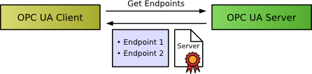

рис.4.49. Отримання списку кінцевих точок серверу і сертифікату.

Для встановлення безпечного з'єднання з сервером клієнт повинен довіряти сертифікату серверу, тобто сертифікат повинен бути доданий до списку довіри. Зазвичай відкривається діалогове вікно, яке спонукає користувача переглянути сертифікат і вирішити, чи слід довіряти йому. На рис.4.50 показане діалогове вікно в тестовому OPC UA Client “UaExpert” при спробі вперше підключитися до сервера “UAServerCpp”. Він відображає вміст сертифіката серверу і дозволяє користувачеві вирішувати, чи слід довіряти сертифікату чи ні. Якщо користувач вибирає "Trust Server Certificate", він зберігається в папці, *trusted/certs* в сховищі сертифікатів PKI UaExpert.

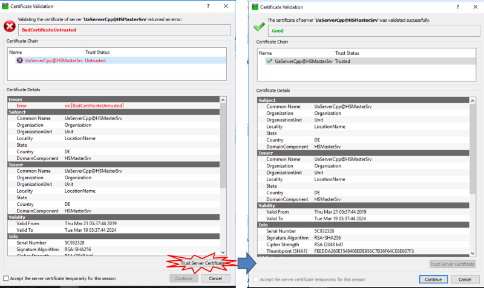 

рис.4.50. Приклад користувацького вікна для перегляду, прийняття або відхилення сертифікату

Довірившись сертифікату, клієнт може перевірити підпис (сигнатуру) повідомлень з сервера і зашифрувати повідомлення, що надсилаються на сервер. Після збереження кінцевих точок у списку з'єднань сервера завершується конфігурація клієнта.

Тепер клієнт може спробувати створити безпечний канал з сервером, відправивши йому Application Instance Certificate (включаючи відкритий ключ клієнта). Ця перша спроба з'єднання буде відхилена, оскільки сервер ще не довіряє клієнту (рис.4.51).

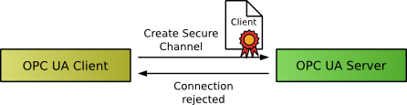 

рис.4.51. Відправка сертифікату OPC UA Серверу

Підтвердження довіри до сертифіката клієнта на сервері проводиться адміністратором. Зазвичай адміністратор сервера повинен перемістити сертифікат клієнта зі списку відхилених до списку довірених сертифікатів.

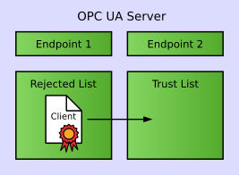 

рис.4.52. Перенесення сертифікату зі списку відхилених до списку довірених.

Наприклад, при використанні демо-сервера «UAServerCpp», це можна зробити за допомогою засобу адміністрування, як показано рис.4.53. На вкладці «Sertificates» перелічено сертифікати в сховищі сертифікатів сервера. Сертифікати з каталогу *Trusted* відображаються як довірені, а сертифікати з каталогу "*Rejected*" відображаються як недостовірні. Сертифікат UaExpert відображається як "Untrusted" (Ненадійний). Клацнувши правою кнопкою миші на сертифікаті та вибравши “Trust” (Довіряти) з контекстного меню, сертифікат переміститься з папки *rejected до* *trusted/certs* у сховищі сертифікатів сервера.

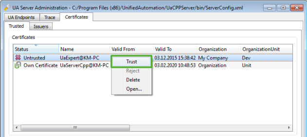 

рис.4.53. Приклад керування сертифікатами на сервері UAServerCpp

Наступна спроба клієнта створити захищений канал вже буде успішною, і він зможе створювати і активувати сеанс з сервером.

## 6.6. Тестові OPC UA клієнти та сервери

Як і для класичного OPC, для OPC UA є достатньо багато доступних безкоштовних тестових клієнтів і серверів. Враховуючи, що технологія є мульти-платформовою ці утиліти доступні не тільки для Windows і не тільки для ПК. Наявність мобільних застосунків робить її ще більш привабливою. 

Серед безкоштовних «еталонних» серверів для Windows зупинимося на UaCPPServer (OPC UA C++ Demo Server [13]) – тестовий OPC Unified Architecture Server для операційних систем Windows, в якому імітуються дані та інформаційна модель (Standard, DI та PLCopen). Після запуску ОРС-сервера створюється тільки одне консольне вікно, в якому виводиться URL кінцевої точки (рис.4.54). Для конфігурування використовується окрема програма (UA Server Administration), в якій також можна керувати сертифікатами. На рис.4.54 видно, що стоїть опція “Accept all certificates”, що дозволяє підключатися кому завгодно з будь яким сертифікатом, також дозволено підключатися без шифрування та автентифікації. Таке налаштування зручно при тестових підключеннях, але для реальних проектів **недопустимо з точки зору кібербезпеки**! Про кібербезпеку можна ознайомитися в підрозділі 9.5 даного посібника. 

 У демо-сервері UaCPPServer прописані користувачі та паролі з різними ролями (див.таб.4.6)

Таб.4.6. Користувачі та їх паролі наперед визначені в UaCPPServer 

| **UserId** | **GroupIds** | **UserName** | **Password** |
| ---------- | ------------ | ------------ | ------------ |
| 0          | 0            | root         | secret       |
| 1          | 1            | joe          | god          |
| 2          | 0,1,2        | john         | master       |
| 3          | 1,2          | sue          | curly        |

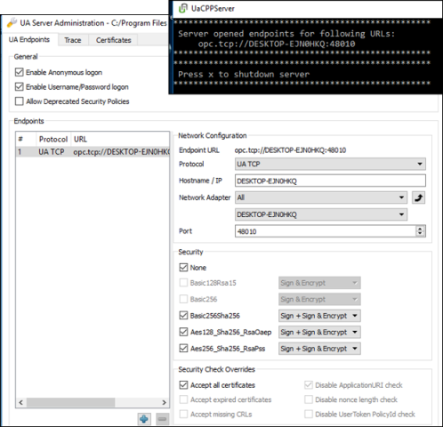 

рис.4.54. Вікно Сервера OPC UA C++ Demo (UaCPPServer) та утиліти його конфігурування. 

У якості клієнта під Windows зручною є безкоштовна утиліта UaExpert  [14] – це повнофункціональний клієнт OPC UA, який може працювати з декількома профілями та функціями OPC UA. Інтерфейс містить перелік серверів проекту з вказівкою їх стану, навігатор адресного простору, вікно вибраних об’єктів, вікно атрибутів і посилань (рис.4.55). Клієнт дає можливість змінювати значення Змінних.

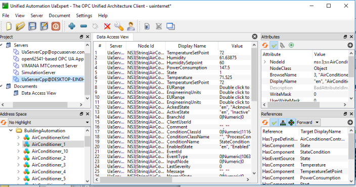    

рис.4.55. Вікно UaExpert .

Окрім офлайнових тестових утиліт є і он-лайнові. На рис.4.56 показаний зовнішній вигляд онлайнового клієнта – «OPC UA Web Client», інтерфейс якого схожий на UaExpert. 

 

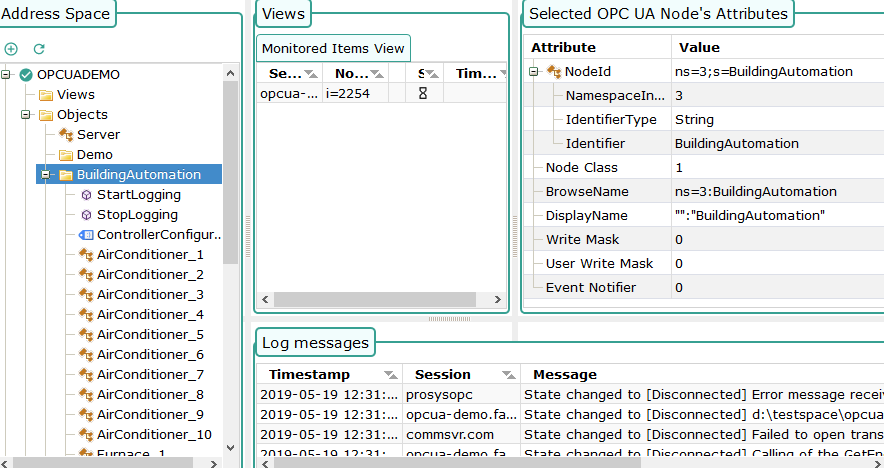  

рис.4.56. Зовнішній вигляд вікна сервісу OPC UA Web Client 

Вхід на тестовий OPC UA Севрер доступний за посиланням «opc.tcp://opcuaserver.com:4840». 

Посилання на деякі інші он-лайнові клієнти і сервери ви можете знайти на ресурсі [15]. Серед тестових клієнтів для Андроїд можна виділити «Prosys OPC UA Client for Android» [16] 

## 6.7. Приклад налаштування в SCADA Citect

У SCADA Citect починаючи з версії 8.0 (2016) з’явився драйвер OPC UA Client. Спочатку розглянемо підключення його до OPC UA Server (UaCPPServer) простим шляхом, без використання сертифікатів. Для цього зручно скористатися помічником створення нового пристрою (див.рис.4.57). У вікно адреси треба вставити URL кінцевої точки, який можна скопіювати з вікна UACppServer (див.рис.4.54). 

Для автоматичного створення тегів можна використати прив’язку пристроїв до зовнішньої бази даних тегів. У вікні налаштувань вибирається потрібний рівень об’єкта, зміст якого прив’язується з новоствореними змінними. Результат створених змінних і зв’язків  показаний на (рис.4.58). Також там наведений вигляд простору імен із вибраного об’єкта “Scalar” в тестовому клієнті UAExpert.    

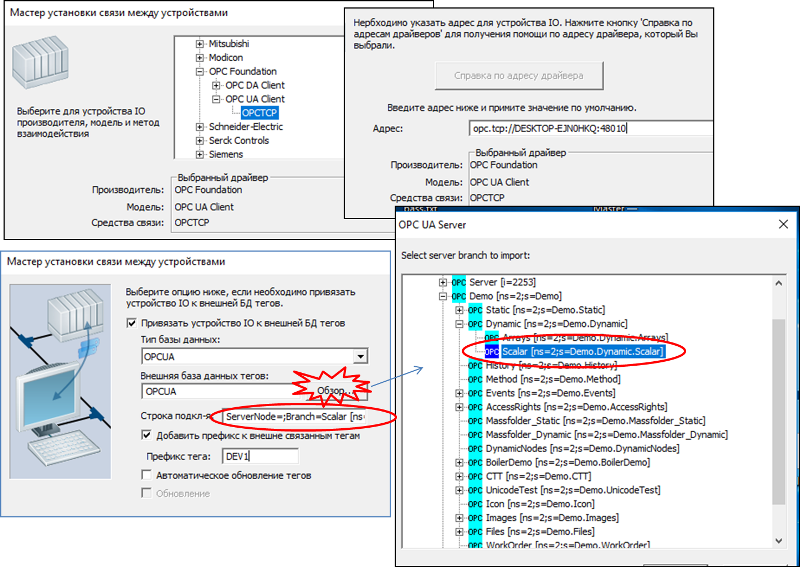 

рис.4.57. Налаштування I/O Device в Citect за допомогою помічника 

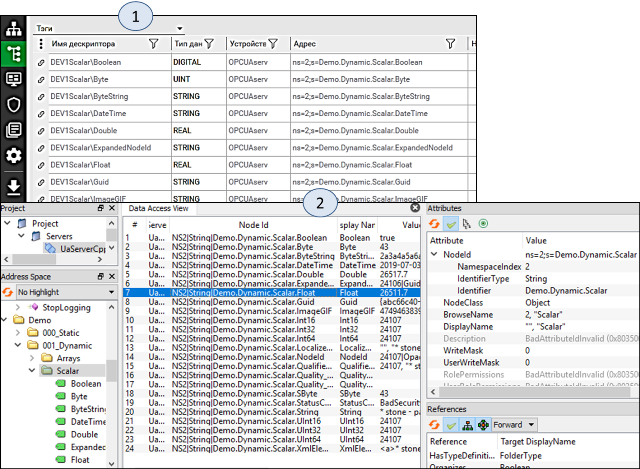 

рис.4.58. Створені теги з зв’язками до бази даних простору імен OPC UA Server та перегляд простору імен в UAExpert

Налаштування при відключених опціях захисту значно спрощує роботу на початкових етапах, але на стадії впровадження необхідно потурбуватися про кібербезпеку. Для тестового серверу UaCPPServer це робиться відключенням опції “Accept all certificates”, а також деактивацією опції «None» в параметрах Security (рис.4.59). Крім того типи «Basic128Rsa15» та «Basic256» є застарілими і за замовчуванням відключені, але драйвер Citect наразі підтримує тільки ці типи, тому їх треба активувати. Це робиться шляхом попередньої активації опції «Allow Deprecated Security settings» і виставлення інших опцій. Після зміни налаштувань і підтвердження «Apply» необхідно перезапустити UaCPPServer. 

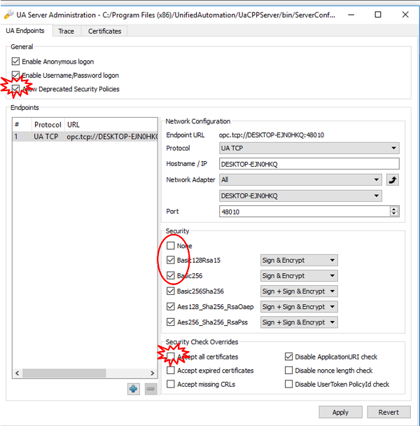 

рис.4.59. Налаштування опцій кібербезпеки UaCPPServer 

Налаштування параметрів безпеки OPC UA для Citect відбувається в спеціальному застосунку «Configurator». Після запуску конфігуратору, необхідно вибрати розділ OPC UA Client Driver і створити нові налаштування «Create new settings», які потім будуть використані для конкретного пристрою вводу/виводу. На рис.4.60 показані кроки, на яких зроблені зміни в конфігурації, усі інші закладки виставлені за замовченням. На кроці налаштування «Server» необхідно зробити імпорт сертифікату серверу. Контроль результату імпорту проводиться через повідомлення.

На кроці «Finish» використовуючи кнопку “Configure” необхідно записати конфігурацію, після чого надіслати запит на з’єднання «Test Connection», який перший раз буде відхилено (Untrusted) сервером (рис.4.61.1). Цей пробний тест потрібен для передачі сертифікату, який попаде у список відхилених. Тому після цього у налаштуваннях UaCPPServer на вкладці Certificates необхідно активувати довіру до сертифікату через команду“Trust” контекстного меню (див.рис.4.61.2). Після повторної перевірки «Test Connection» результат з’єднання має бути позитивним. 

Для того, щоб конфігурація була використана в середовищі виконання Citect, для конкретного I/O Device в Citect.INI необхідно прописати параметр, рівним назві конфігурації. В даному випадку він буде рівним (див.рис.4.61.3)

```
[OPCUA.PORT1_BOARD1.OPCUAserv] SecuritySettingsName = DEV1
```

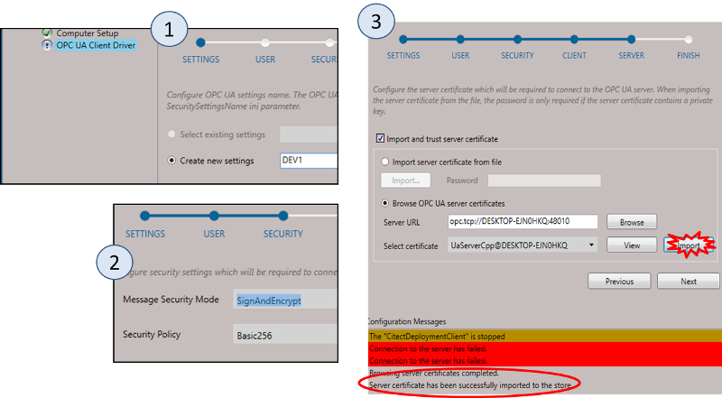 

рис.4.60. Налаштування параметрів кібербезпеки в Configurator. 

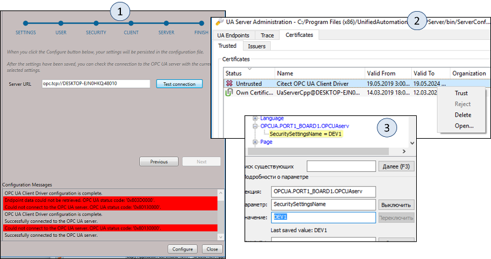

рис.4.61. Дозвіл-підтвердження клієнтського сертифікату від Citect. 

## 6.8. Приклад налаштування в SCADA zenon

У прикладі зі SCADA zenon покажемо з’єднання з UaCPPServer використовуючи автентифікацію та типу сертифікату «Basic256». У налаштуваннях UaCPPServer на вкладці «Certificates» необхідно зняти опцію «Enable Anonymous logon», щоб підключення можна було проводити тільки з автентифікацією. Усі інші налаштування серверу зробити як показано на рис.4.59.

У SCADA zenon для такого з’єднання використовується OPC UA Client Driver. У налаштуваннях драйверу необхідно вказати Discovery URL, після чого при натисканні кнопки вибору автоматично заповнюються поля «Server URL» та «Server Name» (рис.4.62.1). У ім’я користувача та пароль можна вписати одного з користувачів з Таб.4.6, наприклад «root» і «secret» відповідно. У налаштуваннях security необхідно вибрати поля відповідно до рис.4.62. Після цього необхідно підтвердити конфігурацію і зробити компіляцію проекту, щоб створилися відповідні папки та файли налаштувань. Після компіляції у папку проекту «..\Custom\Drivers\PKI\CA\certs\» необхідно скопіювати файл сертифікату серверу. Це можна зробити виділивши власний сертифікат у вікні конфігурації UaCPPServer і натиснувши «Copy Application Certificate To…». Після копіювання сертифікату, його треба вказати в налаштуваннях Connection драйверу: “Certificates” -> “Server Certificate” (рис.4.62.2).

Далі можна скористатися імпортом змінних з драйверу (рис.4.62.3). Під час першої ж спроби, zenon видасть помилку, аналогічно як це відбувається з SCADA Citect, так як сертифікат сервером буде відхилено. Тому після цього у налаштуваннях UaCPPServer на вкладці Certificates необхідно активувати довіру до сертифікату через команду “Trust” контекстного меню (див.рис.4.62.4). Повторна команда імпорту змінних видасть вікно вибору, в якому можна буде вибрати необхідні змінні з Серверу, наприклад «Demo.Dynamic.Scalar.Float» (рис.4.63.1). Налаштування змінної показано на рис.4.63.2.

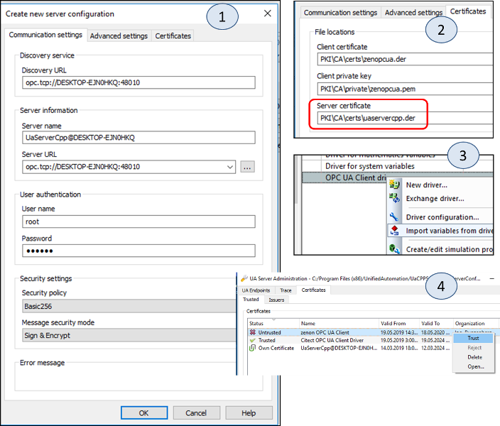 

рис.4.62. Налаштування з’єднання драйверу OPC UA Client у zenon

 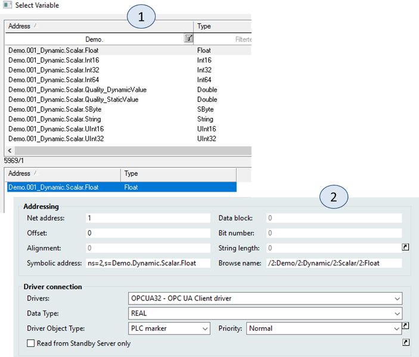

  рис.4.63. Імпорт змінних та властивість адресації змінної OPC UA Client у zenon 

## 6.9. Приклад налаштування зв’язку мобільного додатку Suppanel HMI з OPC UA Server в M241

Контролери M241 останніх версій підтримують OPC UA Server, через який можна доступатися до вибраних змінних формату IEC зі списку глобальних змінних (GVL). З можливостей параметрів безпеки M241 підтримує тільки ідентифікацію користувача.

Для активності OPC UA Server в M241, в Application повинен бути добавлений «OPC UA Symbol Configurtion…» (рис.4.64.1). У налаштуваннях OPC Server (рис.4.64.2) вказуються усі необхідні параметри підписок а також активується опція захисту по користувачу і паролю «Disable Anonymous login». При активації цього захисту для доступу з клієнта будуть використовуватися користувачі, означені в налаштуваннях захисту контролеру (рис.4.64.3).    

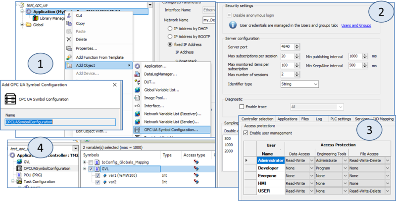 

  рис.4.64. Налаштування OPC UA Server в M241 

Для перевірки роботи OPC UA Server можна скористатися «еталонним» OPC UA Client, наприклад UAExpert. Для цього в налаштуваннях параметра з’єднання вказується користувач та пароль(рис.4.65.1). Після підключення у адресному просторі видно вибрані змінні в паці M241-M251 data (рис.4.65.2).   

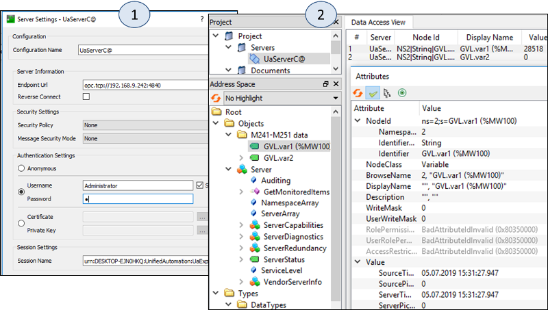 

  рис.4.65. Налаштування конфігурування в OPC UA Client 

​      У якості мобільного клієнта для даного прикладу використаємо застосунок Suppanel, який доступний для ОС Android [17](http://www.suppanel.com/index.php/en/). Приклад конфігурування від постачальника можна подивитися на відео [18]([https://](https://youtu.be/35Tt8GHt58U)[youtu.be/35Tt8GHt58U](https://youtu.be/35Tt8GHt58U)). 

​      На новостворену панель добавляється елемент OPC UA Connection (рис.4.66.1). У налаштуваннях даного елементу вказуються подібні налаштування як в UAExpert (рис.4.66.2). Для елементу відображення задається змінна (рис.4.66.3), яка вибирається з дереву перегляду (рис.4.66.4 і рис.4.66.5). Плинне значення видно в режимі виконання (рис.4.66.6)  

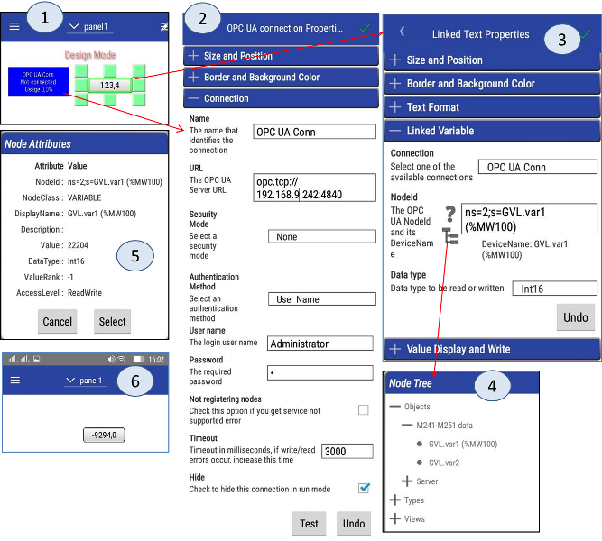 

рис.4.66. Налаштування Suppanel для зв’язку з OPC UA M241

| [<- до лекцій](README.md) | [на основну сторінку курсу](../README.md) |
| ------------------------- | ----------------------------------------- |
|                           |                                           |