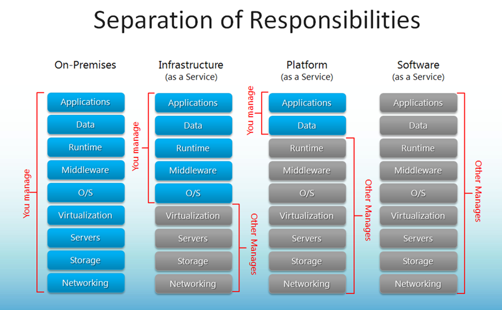

**Технології індустрії 4.0. Лекції.** Автор і лектор: Олександр Пупена 

| [<- до лекцій](README.md) | [на основну сторінку курсу](../README.md) |
| ------------------------- | ----------------------------------------- |
|                           |                                           |

У архітектурі промислового Інтернету речей та RAMI4, які є моделями для найбільш відомих державних платформ Індустрії 4.0 хмарні сервіси відіграють одну з важливих ролей. У цій темі розглядаються хмарні сервіси взагалі та їх місце в АСКТП.   

## 5.1.Поняття про хмарні сервіси 

***Хмарні обчислення*** (Cloud Computing) — модель забезпечення повсюдного та зручного доступу через мережу на вимогу до загальнодоступного набору обчислювальних ресурсів, що підлягають налаштуванню (наприклад, до комунікаційних мереж, серверів, засобів збереження даних, прикладних програм та сервісів) і які можуть бути оперативно надані та звільнені з мінімальними затратами на керування та зверненнями до провайдера.

Поняття "хмара" належить до інфраструктури обчислювальних служб, які зазвичай необхідні відповідно до запиту. На відміну від традиційного використання арендованих серверів, в хмарах набір ресурсів (обчислень, мереж, сховищ і пов'язаних з ними програмних сервісів) може швидко динамічно масштабуватися в бік збільшення або зменшення залежно від середнього навантаження і якості обслуговування. Хмари, як правило, – це великі центри оброблення даних, які надають клієнтам послуги, орієнтовані на зовнішнього споживача, і модель оплати за використання. Ці центри створюють ілюзію єдиного хмарного ресурсу, в той час як насправді може бути використано багато географічно розподілених ресурсів (наприклад серверів). Це дає користувачеві відчуття незалежності від місця їх розташування. Ресурси є еластичними (що означає масштабованість), а сервіси – це еквівалент плати за використання, незмінний дохід для провайдера. Сервіси, які працюють у хмарі, відрізняються від традиційного програмного забезпечення своєю конструкцією та реалізацією. Хмарні застосунки можуть розроблятись і розвиватися швидше і менше залежати від мінливості середовища. Таким чином, розгортання хмар відбувається дуже швидко.

У хмарному середовищі існують три різні моделі топології хмар: приватна хмара (private cloud), хмара загального користування, або публічна (public cloud), та гібридна хмара (Hybrid cloud). 

***Публічна хмара*** **(Public Cloud)** – хмарна інфраструктура, при якій серверні потужності обов'язково знаходяться на стороні провайдера хмарних послуг, який надає ресурси відразу кільком організаціям одночасно. Тут інфраструктура надається на вимогу для безлічі клієнтів і застосунків. Тут інфраструктура – це набір ресурсів, які будь-яка людина може використовувати в будь-який час у рамках своїх угод про рівень обслуговування. Перевага використання в тому, що хмарні центри оброблення даних дають змогу забезпечити безпрецедентну масштабованість для багатьох клієнтів, які обмежені тільки тим, яку частину послуг вони хочуть придбати. Прикладами публічних хмар є AWS (Amazon Web Services), Google Cloud, Microsoft Azure, IBM Cloud, Alibaba Cloud.

***Приватна хмара* (private cloud)** – хмарна інфраструктура, надана у виключне користування однієї організації або корпорації. Приватна хмара існує з ряду причин, включаючи безпеку та перевіреність якості. Тобто це потрібно для гарантування, що інформація оброблюється виключно системами, керованими клієнтом. Однак щоб вважатися хмарою, повинні існувати деякі аспекти хмарних сервісів, такі як віртуалізація й балансування навантаження. 

***Гібридна хмара*** (**Hybrid cloud**) – одночасне використання приватної та публічної хмари. 

Незалежно від моделі, каркаси хмар повинні забезпечувати динамічну масштабованість, швидкість розроблення і розгортання, а також використання в потрібному місці незалежно від його дальності. Сучасні корпоративні системи, як правило, використовують гібридну архітектуру для забезпечення безпеки критично важливих застосунків та даних за місцем і використовують публічну хмару для підключення, простоти й швидкості розгортання.

Хмарні провайдери (організації, які надають хмарні ресурси) зазвичай підтримують цілий ряд продуктів "Все як сервіс" (XaaS). Тобто послуга програмного забезпечення з оплатою за використання. Сервіс включає в себе службу мережі (NaaS), програмне забезпечення як послугу (**SaaS**), платформу як послугу (**PaaS**) та інфраструктуру як послугу (IaaS). Кожна модель представляє все більше хмарних сервісів від постачальників. Ці сервісні пропозиції – додана вартість хмарних обчислень. Як мінімум, ці послуги повинні компенсувати капітальні витрати, з якими зіштовхується клієнт для придбання і обслуговування такого обладнання центру оброблення даних, і врахувати це як експлуатаційні витрати. 

                               

*Рис. 5.1.* Різні моделі надання хмарних сервісів

***SaaS*** (Software as a Service – ***програмне забезпечення як послуга***) пропонує користувачеві використовувати готове програмне забезпечення, яке виконується в хмарі. З точки зору користувача, віртуальний SaaS фактично працює на його пристрої. Прикладами таких сервісів є різноманітні застосунки Google (наприклад, Google Sheet) або Microsoft Office 365.

***PaaS*** (Platform as a Service – ***платформа як послуга***) використовує базове устаткування і програмні засоби нижнього рівня, що надаються хмарою. У такому випадку кінцевий користувач тільки використовує апаратне забезпечення центру оброблення даних, операційну систему, проміжне ПЗ і різні бази даних постачальника для розміщення свого приватного застосунку або сервісу. Проміжне ПЗ може складатися із систем керування базами даних. Рішення IIoT частіше всього будуються з використанням спеціалізованих платформ типу Predix (GE Digital) чи MindSphere (Siemens). Тобто кінцеве рішення для клієнта розроблює інтегратор, але в якості проміжного ПЗ використовується певна платформа. Цей підхід, по суті, такий самий, як розроблення АРМ-оператора з використанням спеціалізованих програмних пакетів SCADA/HMI, за винятком того, що середовище розроблення і виконання знаходяться в хмарі, а не на локальному ПК.  

У моделі ***IaaS*** (Infrastructure as a Service – ***інфраструктура як послуга***) постачальник створює масштабовані апаратні служби в хмарі і надає модифікацію програмних каркасів для створення клієнтських віртуальних машин. По суті, клієнт отримує віртуальні комп’ютери з необхідною ОС і встановлює на них усе, що необхідно. Кількість комп’ютерів, їх графік роботи керується ззовні як користувачем так і скриптами, що надає такому рішенню гнучкості. По суті, можна розгорнути SCADA/HMI на віртуальній машині в хмарі, але слід розуміти, до чого це може привести і як будувати інфраструктуру АСКТП. Тим не менше, є програмні пакети SCADA/HMI, які призначені саме для цього, наприклад, WebAccess/SCADA від Advantech. 

## 5.2.Інтеграція АСКТП із хмарними сервісами

Шляхи інтеграції компонентів систем керування з хмарними платформами передусім залежать від необхідного завдання, яке вирішується, вибору хмарної платформи, служб, які вона надає, і, відповідно, протоколів, які підтримуються цими службами. У ряді випадків достатньо забезпечити передачу архівних даних з певною періодичністю задля виконання звітів, у інших – дані повинні передаватися в режимі реального часу з можливістю онлайн-аналізу та прийняття рішень на базі хмарних обчислень з використанням Data Mining. Тут зосередимося на способах інтегрування засобів АСКТП, особливо SCADA/HMI з хмарними сервісами з використанням рішень IoT.   

Більшість постачальників хмарних платформ надають засоби для реалізації та впровадження Інтернету речей. Наприклад,:

\-     Amazon Web Service пропонує комплексне рішення для реалізації Інтернету речей, а саме AWS IoT Core – це керована хмарна платформа, яка дає змогу підключеним пристроям просто і безпечно взаємодіяти з хмарними застосунками та іншими пристроями. Крім того, що хмарні сервіси надають значний функціонал для об’єднання пристроїв у загальну мережу та віддалене керування ними, важливим фактором для інтеграції з виробничим устаткованням та програмним забезпеченням є підтримувані цими службами протоколи. AWS IoT Core підтримує протоколи HTTP, WebSockets і MQTT. 

\-     Microsoft Azure у свою чергу пропонує комплексне рішення для Інтернету речей Azure IoT Suite. 

\-     Рішенням від Google Cloud Platform виступає Google Cloud Web of Things (IoT) Core – це повністю керована служба для безпечного підключення та керування пристроями IoT. 

\-     Подібні рішення пропонуються і IBM, причому спробувати їх значно простіше, оскільки в безкоштовній підписці вони не потребують реєстрації кредитної карточки. 

Згадані хмарні платформи належать до споживчих. Існують також промислові хмарні платформи, які набагато глибше фокусуються на завданнях ОТ. Вони розроблені таким чином, щоб забезпечувати збирання та оброблення даних під час функціонування виробничих процесів з метою підвищення продуктивності, а також прогнозуючого обслуговування. Серед них – GE Predix від GE Digital та MindSphere від Siemens AD. Ці рішення є комерційними, мають чітке промислове спрямування, простіші з точки зору використання, але можуть бути дорожчими, ніж звичайні споживчі хмарні платформи. Крім того, враховуючи, що більш застосовані споживчі платформи вже надають ресурси для реалізації промислових рішень, їх використання може бути більш доречним. Зокрема, MS Azure вже надає можливість реалізації рішень націлених на виробництво. Індустріальну платформу GE Predix теж можна розгорнути в інфраструктурі Azure, і наразі Microsoft та GE Digital ведуть переговори щодо співпраці, яка в майбутньому дасть змогу застосункам розгорнутим засобами MS Azure обмінюватися даними з Predix.

MS Azure вже зараз надає ресурси для реалізації промислового Інтернету речей та має дуже розвинену інфраструктуру. Крім того, MS Azure підтримує технологію OPC UA, яка перебуває на етапі становлення як передового стандарту для інтеграції промислового устатковання в єдину мережу. 

Значна кількість виробників апаратних та програмних засобів для АСК ТП на хвилі розвитку застосування промислового Інтернету речей мають намір залишатися конкурентоспроможними та не втрачати позиції на ринку. Як приклад, COPA-DATA для своєї SCADA zenon пропонує використання сервісів MS Azure для розгортання мобільних застосунків HMI клієнтів та WEB-сайтів для віддаленого моніторингу. Крім того, в хмарі можна розмістити інструментальний засіб для побудови звітів zenon Analyzer, що забезпечить скорочення локальних обчислювальних ресурсів та відкриту можливість доступу до звітів усім стейкхолдерам. Таке рішення потребує самостійного використання платформи MS Azure як системи типу PaaS. 

Підрозділ AVEVA від Schneider Electric пропонує своє рішення для збирання, візуалізації та аналізу промислових даних, яке являє собою систему типу SaaS, побудовану засобами MS Azure. Це рішення – Wonderware Online InSight, яке дає змогу інтегруватися з такими продуктами, як Wonderware InTouch HMI, Wonderware System Platform, Wonderware Historian та Citect SCADA . 

 

**Запитання для самоперевірки**

1. Що таке хмарні обчислення?

2. У чому особливість використання хмарних ресурсів порівняно з арендою серверів? 

3. Що таке хмара в термінах хмарних обчислень?

4. Які топології хмар виділяються? У чому їх особливості та що спільного?

5. Поясніть що таке SaaS? Наведіть приклад SaaS. 

6. Поясніть що таке PaaS? Наведіть приклад PaaS. 

7. Поясніть що таке IaaS? Наведіть приклад IaaS. 

8. Від чого залежать шляхи інтеграції компонентів систем керування із хмарними сервісами?

9. Наведіть приклади хмарних сервісів для IoT від різних провайдерів публічних хмарних псолуг.

10. Чим промислові хмарні платформи відрізняються від споживчих?

11. Наведіть приклади рішень інтегрування SCADA/HMI з хмарними сревісами. https://youtu.be/fxKvv3p8MjE)

| [<- до лекцій](README.md) | [на основну сторінку курсу](../README.md) |
| ------------------------- | ----------------------------------------- |
|                           |                                           |