Більша частина матеріалу лекції взята з  статті  [Обзор способов и протоколов аутентификации в веб-приложениях, Дмитрий Выростков](https://www.dataart.com.ua/news/obzor-sposobov-i-protokolov-autentifikatsii-v-veb-prilozheniyah/) 

# Способи і протоколи автентификації у веб-застосунках

- **Ідентифікація** - це заявка про те, ким ви являєтесь. В залежності від ситуацій, це може бути іменем, адресою електронної пошти, номером облікового запису, і тд.

- **Аутентифікація** - надання доказів, що ви насправді є тим, ким ідентифікувалися (від слова "authentic" - істинний, справжній).
- **Авторизація** - перевірка, що вам дозволено доступ до запитуваного ресурсу.

 под *идентификацией* понимают получение вашей учетной записи (identity) по username или email; под *аутентификацией* — проверку, что вы знаете пароль от этой учетной записи, а под *авторизацией* — проверку вашей роли в системе и решение о предоставлении доступа к запрошенной странице или ресурсу.

  Однако в современных системах существуют и более сложные схемы  аутентификации и авторизации, о которых я расскажу далее. Но начнем с  простого и понятного.

Під *ідентифікацією* розуміють отримання вашого профілю (identity) по `username` або `email`; під *автентификацією* - перевірку, що ви знаєте пароль від цього облікового запису, а під *авторизацією* - перевірку вашої ролі в системі і рішення про надання доступу до запитаної сторінки або ресурсу. Однак в сучасних системах існують і більш складні схеми аутентифікації і авторизації. Для початку розглянемо найпростіші

### **Аутентифікація по паролю **

   Цей метод грунтується на тому, що для успішної ідентифікації і аутентифікації в системі користувач повинен надати `username` і `password`. Пара `username` / `password` задається користувачем при його реєстрації в системі, при цьому в якості `username` може виступати адреса електронної пошти користувача. Стосовно до веб-застосунків, існує кілька стандартних протоколів для аутентифікації по паролю, які ми розглянемо нижче.

#### **HTTP автентифікація**

Цей протокол, описаний в стандартах HTTP 1.0/1.1, існує дуже давно і до цих пір активно застосовується в корпоративному середовищі. Стосовно веб-сайтів працює наступним чином:

1. Сервер, при зверненні неавторизованого клієнта до захищеного ресурсу, відсилає HTTP статус "401 Unauthorized" і додає заголовок "WWW-Authenticate" із зазначенням схеми і параметрів аутентифікації.
2. Браузер, при отриманні такої відповіді, автоматично показує діалог введення `username` і `password`. Користувач вводить деталі свого облікового запису.
3. У всіх наступних запитах до цього веб-сайту браузер автоматично додає HTTP заголовок "Authorization", в якому передаються дані користувача для аутентифікації сервером.
4. Сервер аутентифікує користувача за даними з цього заголовку. Рішення про надання доступу (авторизація) проводиться окремо на підставі ролі користувача, ACL або інших даних облікового запису.

Весь процес стандартизований і добре підтримується всіма браузерами і веб-серверами. Існує кілька схем аутентифікації, що відрізняються за рівнем безпеки:

1. **Basic** —  найбільш проста схема, при якій `username` і `password` користувача передаються в заголовку `Authorization` в незашифрованому вигляді (`base64-encoded`). Однак при використанні HTTPS (HTTP over SSL) протоколу, є відносно безпечною.
     		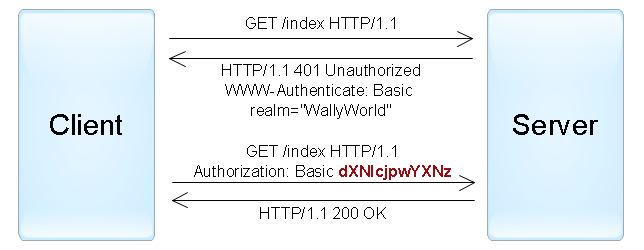
     		рис. Приклад HTTP аутентификації з використанням Basic схеми.  	
2. **Digest** —  challenge-response-схема, при якій сервер посилає унікальне значення `nonce`, а браузер передає MD5 хеш пароля користувача, обчислений з використанням зазначеного `nonce`. Більш безпечна альтернатива Basic схеми при незахищених з'єднаннях, але схильна до атак типу `man-in-the-middle` (з заміною схеми на basic). Крім того, використання цієї схеми не дозволяє застосувати сучасні хеш-функції для зберігання паролів користувачів на сервері.
3. **NTLM** (відома як Windows authentication) - також заснована на `challenge-response` підході, при якому пароль не передається в чистому вигляді. Ця схема не є стандартом HTTP, але підтримується більшістю браузерів і веб-серверів. Переважно використовується для аутентифікації користувачів Windows Active Directory в веб-застосунках. Вразлива до pass-the-hash-атакам.
4. **Negotiate** - ще одна схема з сімейства Windows authentication, яка дозволяє клієнтові вибрати між NTLM і Kerberos аутентифікації. Kerberos - більш безпечний протокол, заснований на принципі Single Sign-On. Однак він може функціонувати, тільки якщо і клієнт, і сервер знаходяться в зоні intranet і є частиною домену Windows.

Варто відзначити, що при використанні HTTP-аутентифікації у користувача немає стандартної можливості вийти з веб-застосунку, крім як закрити всі вікна браузера.

#### **Forms authentication**

Для цього протоколу немає певного стандарту, тому всі його реалізації специфічні для конкретних систем, а точніше, для модулів аутентифікації фреймворків розробки.

Працює це за наступним принципом: в веб-застосунок включається HTML-форма, в яку користувач повинен ввести свої username/password і відправити їх на сервер через HTTP POST для аутентифікації. У разі успіху веб-застосунок створює `session token`(маркер сесії), який зазвичай поміщається в `browser cookies` (куки). При наступних веб-запитах `session token` автоматично передається на сервер і дозволяє застосунку отримати інформацію про поточного користувача для авторизації запиту.

  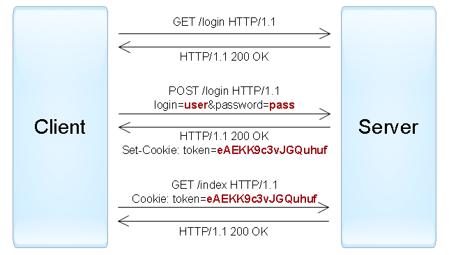
рис. Приклад forms authentication.

Застосунок може створити `session token` двома способами:

1. Як ідентифікатор автентифікованої сесії користувача, яка зберігається в пам'яті сервера або в базі даних. Сесія повинна містити всю необхідну інформацію про користувача для можливості авторизації його запитів.
2. Як зашифрований і/або підписаний об'єкт, що містить дані про користувача, а також період дії. Цей підхід дозволяє реалізувати stateless-архітектуру сервера, однак вимагає механізму поновлення сесійного маркера після закінчення терміну дії. Кілька стандартних форматів таких токенів розглядаються в пункті «Аутентифікація по токенам».

Необхідно розуміти, що перехоплення `session token` часто дає аналогічний рівень доступу, що і знання `username/password`. Тому всі комунікації між клієнтом і сервером у разі `forms authentication` повинні проводитися тільки по захищеному з'єднанню HTTPS.

#### **Інші протоколи автентификації по паролю**

Два протоколи, описані вище, успішно використовуються для аутентифікації користувачів на веб-сайтах. Але при розробці клієнт-серверних застосунків з використанням веб-сервісів (наприклад, iOS або Android), поряд з HTTP аутентифікацією, часто застосовуються нестандартні протоколи, в яких дані для аутентифікації передаються в інших частинах запиту.

Існує всього декілька місць, де можна передати username і password в HTTP запитах:

1. **URL query** - вважається небезпечним варіантом, так як рядки URL можуть запам'ятовуватися браузерами, проксі і веб-серверами.
2. **Request body** - безпечний варіант, але він застосовується лише для запитів, що містять тіло повідомлення (такі як POST, PUT, PATCH).
3. **HTTP header** оптимальний варіант, при цьому можуть використовуватися і стандартний заголовок Authorization (наприклад, з Basic-схемою), та інші довільні заголовки.

#### Поширені вразливості і помилки реалізації

Автентифікації по паролям вважається не дуже надійним способом, так як паролі часто можна підібрати, а користувачі схильні використовувати прості і однакові паролі в різних системах, або записувати їх на клаптиках паперу. Якщо зловмисник зміг з'ясувати пароль, то користувач часто про це не дізнається. Крім того, розробники застосунків можуть допустити ряд концептуальних помилок, що спрощують злом облікових записів.

Нижче представлений списоквразливостей, які найбільш часто зустрічаються в разі використання аутентифікації по паролю:

- Веб-застосунок дозволяє користувачам створювати прості паролі.
- Веб-застосунок не захищений від можливості перебору паролів (brute-force attacks).
- Веб-застосунок сам генерує і поширює паролі користувачам, однак не вимагає зміни пароля після першого входу (тобто поточний пароль десь записаний).
- Веб-застосунок допускає передачу паролів по незахищеному HTTP-з'єднанню або в рядку URL.
- Веб-застосунок не використовує безпечні хеш-функції для зберігання паролів користувачів.
- Веб-застосунок не надає користувачам можливості зміни пароля або не повідомляє користувачам про зміну їх паролів.
- Веб-застосунок використовує вразливу функцію відновлення пароля, яку можна використовувати для отримання несанкціонованого доступу до інших облікових записів.
- Веб-застосунок не вимагає повторної аутентифікації користувача для важливих дій: зміна пароля, зміни адреси доставки товарів і т.п.
- Веб-застосунок створює сесйний маркер таким чином, що вони можуть бути підібрані або передбачені для інших користувачів.
- Веб-застосунок допускає передачу сесійних маркерів по незахищеному HTTP-з'єднанню, або в рядку URL.
- Веб-застосунок вразливий для session fixation-атак (тбто не замінює мемійний ключ при переході анонімної сесії користувача в автентифіковану).
- Веб-застосунок не встановлює прапорці HttpOnly і Secure для browser cookies, що містять сесійні ключі.
- Веб-застосунок не знищує сесії користувача після короткого періоду неактивності або не надає функцію виходу з автентифікованої сесії.

### **Автентифікація по сертифікатам**

Сертифікат представляє собою набір атрибутів, що ідентифікують власника, підписаним сертифікатом від органу сертифікації (*certificate authority* (CA)). Орган сертифікації виступає в ролі посередника, який гарантує справжність сертифікатів. Також сертифікат криптографично пов'язаний з закритим ключем, яких зберігається у власника сертифіката і дозволяє однозначно підтвердити факт володіння сертифікатом.

На стороні клієнта сертифікат разом з закритим ключем можуть зберігатися в операційній системі, в браузері, в файлі, на окремому фізичному пристрої (smart card, USB token). Зазвичай закритий ключ додатково захищений паролем або PIN-кодом.

У веб-застосунках традиційно використовують сертифікати стандарту X.509. Аутентифікація за допомогою X.509-сертифіката відбувається в момент з'єднання з сервером і є частиною протоколу SSL/TLS. Цей механізм також добре підтримується браузерами, які дозволяють користувачеві вибрати і застосувати сертифікат, якщо веб-сайт допускає такий спосіб аутентифікації.

  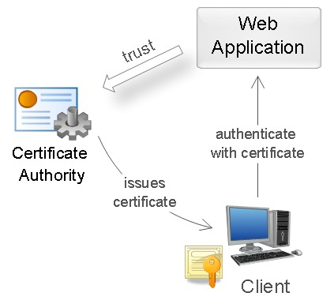
рис. Використання сертифікату для автентифікації. 

Під час аутентифікації сервер виконує перевірку сертифіката на підставі наступних правил:

1. Сертифікат повинен бути підписаний довіреним органом сертифікації CA (перевірка ланцюжка сертифікатів).
2. Сертифікат повинен бути дійсним на поточну дату (перевірка терміну дії).
3. Сертифікат не повинен бути відкликаний відповідним CA (перевірка списків виключення).

  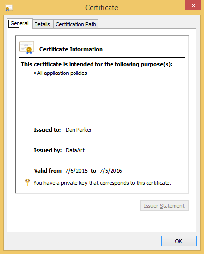
рис.  *Приклад X.509 сертификату.*

Після успішної аутентифікації веб-застосунок може виконати авторизацію запиту на підставі таких даних сертифікату, як subject (ім'я власника), issuer (емітент), serial number (серійний номер сертифіката) або thumbprint (відбиток відкритого ключа сертифіката).

Використання сертифікатів для аутентифікації - куди більш надійний спосіб, ніж аутентифікація за допомогою паролів. Це досягається створенням в процесі аутентифікації цифрового підпису, наявність якого доводить факт застосування закритого ключа в конкретній ситуації (non-repudiation). Однак труднощі з поширенням і підтримкою сертифікатів робить такий спосіб аутентифікації малодоступним в широких колах.

### **Аутентифікація за одноразовими паролями**

Аутентифікація за одноразовими паролями зазвичай застосовується додатково до аутентифікації по паролів для реалізації дво-факторної автентифікації (*two-factor authentication* (2FA)). У цій концепції користувачеві необхідно надати дані двох типів для входу в систему: щось, що він знає (наприклад, пароль), і щось, чим він володіє (наприклад, пристрій для генерації одноразових паролів). Наявність двох факторів дозволяє в значній мірі збільшити рівень безпеки, що можливо буде затребуване для певних видів веб-застосунків.

Інший популярний сценарій використання одноразових паролів - додаткова аутентифікація користувача під час виконання важливих дій: переказ грошей, зміна налаштувань і т.п.

Існують різні джерела для створення одноразових паролів. Найбільш популярні:

1. Апаратні або програмні маркери (токени), які можуть генерувати одноразові паролі на підставі секретного ключа, введеного в них, і поточного часу. Секретні ключі користувачів, які є фактором володіння, також зберігаються на сервері, що дозволяє виконати перевірку введених одноразових паролів. Приклад апаратної реалізацій токенів - [RSA SecurID](http://www.emc.com/security/rsa-securid/index.htm); програмної - застосунок [Google Authenticator](https://play.google.com/store/apps/details?id=com.google.android.apps.authenticator2).
2. Випадково генеруються коди, що передаються користувачеві через SMS або інший канал зв'язку. У цій ситуації фактор володіння - телефон користувача (точніше - SIM-карта, прив'язана до певного номера).
3. Роздруківка або `scratch card` зі списком заздалегідь сформованих одноразових паролів. Для кожного нового входу в систему потрібно ввести новий одноразовий пароль з зазначеним номером.

  
рис.  *Аппаратний маркер RSA SecurID генерирує новий код кожні 30 секунд.*

У веб-застосунках такий механізм аутентифікації часто реалізується за допомогою розширення `forms authentication`: після первинної аутентифікації по паролю, створюється сесія користувача, проте в контексті цієї сесії користувач не має доступу до застосунку до тих пір, поки він не виконає додаткову аутентифікацію за одноразовим паролем.

### **Аутентификация за ключами доступа**

Цей спосіб найчастіше використовується для аутентифікації пристроїв, сервісів або інших застосунків при зверненні до веб-сервісів. Тут в якості секрету застосовуються ключі доступу (*access key, API key*) - довгі унікальні рядки, що містять довільний набір символів, по суті замінюють собою комбінацію username/password.

У більшості випадків, сервер генерує ключі доступу за запитом користувачів, які далі зберігають ці ключі в клієнтських застосунках. При створенні ключа також можливо обмежити термін дії і рівень доступу, який отримає клієнтську програму при аутентифікації за допомогою цього ключа.

Хороший приклад застосування аутентифікації по ключу - хмара Amazon Web Services. Припустимо, у користувача є веб-застосунок, що дозволяє завантажувати і переглядати фотографії, і він хоче використовувати сервіс Amazon S3 для зберігання файлів. В такому випадку, користувач через консоль AWS може створити ключ, що має обмежений доступ до хмари: тільки читання / запис його файлів в Amazon S3. Цей ключ в результаті можна застосувати для аутентифікації веб-додатки в хмарі AWS.

  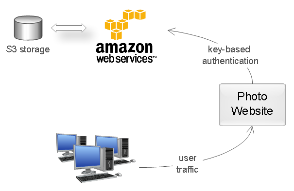
рис.  *Приклад застосування автентификації за ключем.*

Використання ключів дозволяє уникнути передачі пароля користувача стороннім застосункам (в прикладі вище користувач зберіг в веб-застосунку не свій пароль, а ключ доступу). Ключі мають значно більшу ентропією в порівнянні з паролями, тому їх практично неможливо підібрати. Крім того, якщо ключ був розкритий, це не призводить до компрометації основного облікового запису користувача - достатньо лише анулювати цей ключ і створити новий.

З технічної точки зору, тут не існує єдиного протоколу: ключі можуть передаватися в різних частинах HTTP-запиту: `URL query`, `request body` або `HTTP header`. Як і в випадку аутентифікації за паролем, найбільш оптимальний варіант - використання `HTTP header`. У деяких випадках використовують HTTP-схему Bearer для передачі токена в заголовку (Authorization: Bearer [token]). Щоб уникнути перехоплення ключів, з'єднання з сервером має бути обов'язково захищене протоколом SSL/TLS.

  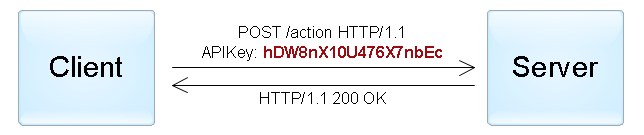
рис.  *Приклад автентифікації за ключем доступу, переданого в HTTP заголовку.*

Крім того, існують більш складні схеми аутентифікації за ключами для незахищених з'єднань. У цьому випадку, ключ зазвичай складається з двох частин: публічної і таємної. Публічна частина використовується для ідентифікації клієнта, а секретна частина дозволяє згенерувати підпис. Наприклад, за аналогією з схемою `digest authentication`, сервер може послати клієнту унікальне значення `nonce` або `timestamp`, а клієнт - повернути хеш або HMAC цього значення, обчислений з використанням секретної частини ключа. Це дозволяє уникнути передачі всього ключа в оригінальному вигляді і захищає від `replay attacks`.

### **Автентификація за маркерами (токенами)**

Такий спосіб аутентифікації найчастіше застосовується при побудові розподілених систем *Single Sign-On* (SSO), де один застосунок (*service provider* або *relying party*) делегує функцію аутентифікації користувачів іншому застосунку (*identity provider* або *authentication service* ). Типовий приклад цього способу - вхід в застосунок через обліковий запис в соціальних мережах. Тут соціальні мережі є сервісами аутентифікації, а застосунок довіряє функцію аутентифікації користувачів соціальним мережам.

Реалізація цього способу полягає в тому, що `identity provider` (IP) надає достовірні відомості про користувача в вигляді токена, а застосунок  `service provider` (SP) використовує цей токен для ідентифікації, аутентифікації і авторизації користувача.

На загальному рівні, весь процес виглядає наступним чином:

1. Клієнт автентифікується в `identity provider` одним із способів, специфічним для нього (пароль, ключ доступу, сертифікат, Kerberos, ітд.).
2. Клієнт просить `identity provider` надати йому токен для конкретного SP-застосунку. `Identity provider` генерує токен і відправляє його клієнту.
3. Клієнт автентифікується в SP-застосунку за допомогою цього токена.

  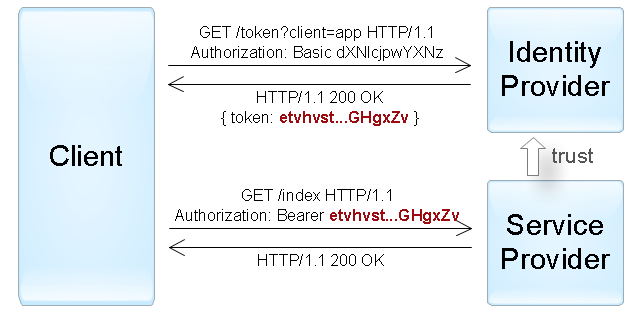
рис.  *Приклад автентифікації «активного» клієнта за допомогою токена, переданого за допомогою  Bearer схеми.*

Процес, описаний вище, відображає механізм аутентифікації *активного* клієнта, тобто такого, який може виконувати запрограмовану послідовність дій (наприклад, застосунки iOS/Android). Браузер ж - *пасивний* клієнт в тому сенсі, що він тільки може відображати сторінки, запитані користувачем. У цьому випадку аутентифікація досягається за допомогою автоматичного перенаправлення браузера між веб-застосунками identity provider і service provider.

  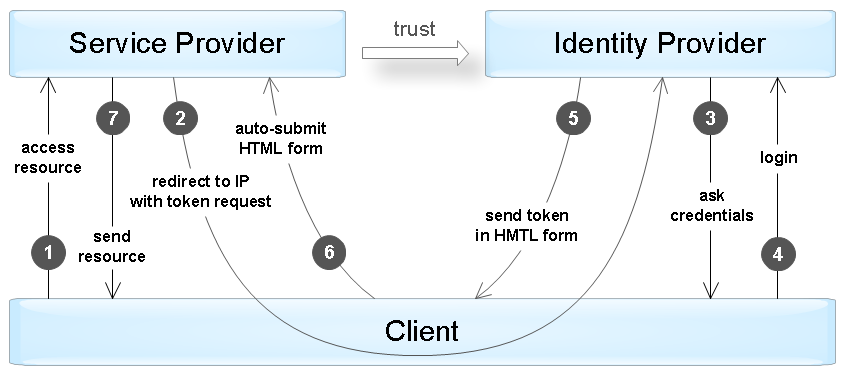
рис.  *Приклад автентификації «пасивного» клієнта шляхом перенаправлення запитів.*

Існує кілька стандартів, які в точності означують протокол взаємодії між клієнтами (активними і пасивними) і IP/SP-застосунками і формат підтримуваних токенів. Серед найбільш популярних стандартів - OAuth, OpenID Connect, SAML, і WS-Federation. Деяка інформація про ці протоколи наведені нижче.

Сам токен зазвичай представляє собою структуру даних, яка містить інформацію, хто згенерував токен, хто може бути одержувачем токена, термін дії, набір відомостей про самого користувача (claims). Крім того, токен додатково підписується для запобігання несанкціонованих змін і гарантій автентичності.

  В случае успешной проверки SP-приложение выполняет авторизацию запроса на основании данных о пользователе, содержащихся в токене.

При аутентифікації за допомогою токена SP-застосунок повинен виконати наступні перевірки:

1. Токен був виданий довіреним identity provider застосунком (перевірка поля *issuer*).
2. Токен призначається поточному SP-застосунку (перевірка поля *audience*).
3. Термін дії токена ще не закінчився (перевірка поля *expiration date*).
4. Токен справжній і не був змінений (перевірка підпису).

У разі успішної перевірки SP-застосунок виконує авторизацію запиту на підставі даних про користувача, що містяться в токені.

#### **Формати токенів**

Існує кілька поширених форматів токенів для веб-застосунків:

- Simple Web Token


(SWT) — найбільш простий формат, який представляє собою набір довільних пар ім'я/значення в форматі кодування HTML form. Стандарт означує кілька зарезервованих імен: Issuer, Audience, ExpiresOn і HMACSHA256. Токен підписується за допомогою симетричного ключа, таким чином обидва IP- і SP-застосунки повинні мати цей ключ для можливості створення/перевірки токена.

Приклад SWT токена (після декодування).

```
Issuer=http://auth.myservice.com&  Audience=http://myservice.com&  ExpiresOn=1435937883&  UserName=John Smith&  UserRole=Admin&  HMACSHA256=KOUQRPSpy64rvT2KnYyQKtFFXUIggnesSpE7ADA4o9w  
```

- JSON Web Token (JWT)


—  містить три блоки, між якими ставлять крапку: заголовок, набір полів (claims) і підпис. Перші два блоки представлені в JSON-форматі і додатково закодовані в формат base64. Набір полів містить довільні пари ім'я/значення, до того ж стандарт JWT визначає кілька зарезервованих імен (iss, aud, exp і інші). Підпис може генеруватися за допомогою і симетричних алгоритмів шифрування, і асиметричних. Крім того, існує окремий стандарт, що відписує формат зашифрованого JWT-токена.

Приклад підписаного JWT токену (після декодування 1 и 2 блоків).

```json
{ «alg»: «HS256», «typ»: «JWT» }.  { «iss»: «auth.myservice.com», «aud»: «myservice.com», «exp»: «1435937883», «userName»: «John Smith», «userRole»: «Admin» }.  S9Zs/8/uEGGTVVtLggFTizCsMtwOJnRhjaQ2BMUQhcY  
```

- **Security Assertion Markup Language (SAML)** —  означує токени (SAML assertions) в XML-форматі, що включає інформацію про емітента, про суб'єкта, необхідні умови для перевірки токена, набір додаткових тверджень (statements) про користувача. Підпис SAML-токенів здійснюється за допомогою асиметричної криптографії. Крім того, на відміну від попередніх форматів, SAML-токени містять механізм для підтвердження володіння токеном, що дозволяє запобігти перехоплення токенов через man-in-the-middle-атаки при використанні незахищених з'єднань.

### **Стандарт SAML**

Стандарт Security Assertion Markup Language (SAML) описує способи взаємодії і протоколи між identity provider і service provider для обміну даними аутентифікації і авторизації за допомогою токенів. Спочатку версії 1.0 і 1.1 були випущені в 2002 - 2003 рр, в той час як в 2005 р. версія 2.0 значно розширює стандарт і зворотньо несумісна.

Цей основоположний стандарт - досить складний і підтримує багато різних сценаріїв інтеграції систем. Основні «будівельні блоки» стандарту:

1. **Assertions** - власний формат SAML токенів в XML форматі.
2. **Protocols** - набір підтримуваних повідомлень між учасниками, серед яких - запит на створення нового токена, отримання існуючих токенів, вихід із системи (logout), керування ідентифікаторами користувачів, і інші.
3. **Bindings** - механізми передачі повідомлень через різні транспортні протоколи. Підтримуються такі способи, як HTTP Redirect, HTTP POST, HTTP Artifact (посилання на повідомлення), SAML SOAP, SAML URI (адреса отримання повідомлення) та інші.
4. **Profiles** - типові сценарії використання стандарту, що означують набір assertions, protocols і bindings необхідних для їх реалізації, що дозволяє досягти кращої сумісності. Web Browser SSO - один із прикладів таких профілів.

Крім того, стандарт  означує формат обміну метаінформацією між участниками, яка  включает список підтримуваних ролей, протоколів, атрибутів, ключі  шифрувания і т. п.

Розглянемо короткий приклад використання SAML для сценарію Single Sign-On. Користувач хоче отримати доступ на захищений ресурс сервіс-провайдера (крок № 1 на діаграмі аутентифікації пасивних клієнтів). Так як користувач не був аутентифікований, SP відправляє його на сайт identity provider'а для створення токена (крок № 2). Нижче наведено приклад відповіді SP, де останній використовує SAML HTTP Redirect binding для відправки повідомлення із запитом токена:

  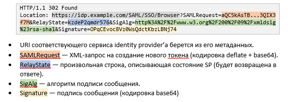

У разі такого запиту, identity provider аутентифікує користувача (кроки №3-4), після чого генерує токен. Нижче наведено приклад відповіді IP з використанням HTTP POST binding (крок № 5):

  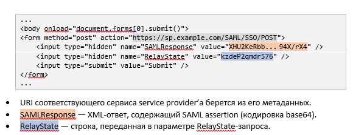

Після того як браузер автоматично відправить цю форму на сайт service provider'а (крок № 6), останній декодує токен і аутентифікує користувача. За результатами успішної авторизації запиту користувач отримує доступ до запитаного ресурсу (крок № 7).

### **Стандарты WS-Trust и WS-Federation**

WS-Trust і WS-Federation входять в групу стандартів WS- *, що описують SOAP/XML-веб сервіси. Ці стандарти розробляються групою компаній, куди входять Microsoft, IBM, VeriSign і інші. Поряд з SAML, ці стандарти досить складні, використовуються переважно в корпоративних сценаріях.

Стандарт **WS-Trust** описує інтерфейс сервісу авторизації, іменованого Secure Token Service (STS). Цей сервіс працює по протоколу SOAP і підтримує створення, оновлення та анулювання токенів. При цьому стандарт допускає використання токенів різного формату, проте на практиці в основному використовуються SAML-токени.

Стандарт **WS-Federation** стосується механізмів взаємодії сервісів між компаніями, зокрема, протоколів обміну токенів. При цьому WS-Federation розширює функції та інтерфейс сервісу STS, описаного в стандарті WS-Trust. Серед іншого, стандарт WS-Federation означує:

- Формат і способи обміну метаданими про сервіси.

- Функцію єдиного виходу з усіх систем (single sign-out).

- Сервіс атрибутів, що надає додаткову інформацію про користувача.

- Сервіс псевдонімів, що дозволяє створювати альтернативні імена користувачів.

- Підтримку пасивних клієнтів (браузерів) за допомогою перенаправлення.

  Можна сказати, що WS-Federation дозволяє вирішити ті ж завдання, що і SAML, проте їх підходи і реалізація в деякій мірі відрізняються.

### Стандарты OAuth и OpenID Connect

На відміну від SAML і WS-Federation, стандарт OAuth (Open Authorization) не описує протокол аутентифікації користувача. Замість цього він означує механізм отримання доступу однієї програми до іншої від імені користувача. Однак існують схеми, що дозволяють здійснити аутентифікацію користувача на базі цього стандарту (про це - нижче).

Перша версія стандарту розроблялася в 2007 - 2010 рр., А поточна версія 2.0 опублікована в 2012 р Версія 2.0 значно розширює і в той же час спрощує стандарт, але назад несумісний з версією 1.0. Зараз OAuth 2.0 дуже популярний і використовується повсюдно для надання делегованого доступу і третє-сторонньої аутентифікації користувачів.

Щоб краще зрозуміти сам стандарт, розглянемо приклад веб-застосунку, який допомагає користувачам планувати подорожі. Як частина функціональності він вміє аналізувати пошту користувачів на наявність листів з підтвердженнями бронювань і автоматично включати їх в планований маршрут. Виникає питання, як цей веб-застосунок може безпечно отримати доступ до пошти користувачів, наприклад, до Gmail?

> * Попросити користувача вказати дані свого облікового запису?  - поганий варіант.

> * Попросити користувача створити ключ доступу?  - можливо, але дуже складно.

Якраз цю проблему і дозволяє вирішити стандарт OAuth: він описує, як застосунок подорожей (client) може отримати доступ до пошти користувача (resource server) з дозволу користувача (resource owner). У загальному вигляді весь процес складається з декількох кроків:

1. Користувач (resource owner) дає дозвіл додатком (client) на доступ до певного ресурсу у вигляді гранту. Що таке грант, розглянемо трохи нижче.
2. Застосунок звертається до сервера авторизації та отримує токен доступу до ресурсу в обмін на свій грант. У нашому прикладі сервер авторизації - Google. При виклику застосунок додатково аутентифікується за допомогою ключа доступу, виданим йому за попередньою реєстрацією.
3. Програма використовує цей токен для отримання необхідних даних від сервера ресурсів (в нашому випадку - сервіс Gmail).

  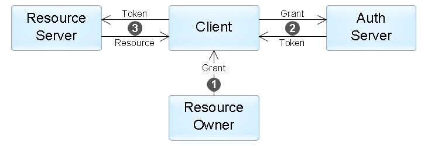
рис.  *Взаємодія компонентів у стандарті OAuth.*

Стандарт описує чотири види грантів, які означують можливі сценарії застосування:

1. **Authorization Code** - цей грант користувач може отримати від сервера авторизації після успішної аутентифікації і підтвердження згоди на надання доступу. Такий спосіб найбільш часто використовується в веб-застосунках. Процес отримання гранту дуже схожий на механізм аутентифікації пасивних клієнтів в SAML і WS-Federation.
2. **Implicit** - застосовується, коли у застосунку немає можливості безпечно отримати токен від сервера авторизації (наприклад, JavaScript-застосунок в браузері). В цьому випадку грант є токеном, отриманим від сервера авторизації, а крок № 2 виключається зі сценарію вище.
3. **Resource Owner Password Credentials** - грант є парою username/password користувача. Може застосовуватися, якщо застосунок є «інтерфейсом» для сервера ресурсів (наприклад, застосунок - мобільний клієнт для Gmail).
4. **Client Credentials** - у цьому випадку немає ніякого користувача, а застосунок отримує доступ до своїх ресурсів за допомогою власних джерел доступу (виключається крок № 1). 

Стандарт не означує формат токена, який отримує застосунок: в сценаріях, адресованих стандартом, з застосунком немає необхідності аналізувати токен, так як він лише використовується для отримання доступу до ресурсів. Тому ні токен, ні грант самі по собі не можуть бути використані для аутентифікації користувача. Однак якщо з застосунком необхідно отримати достовірну інформацію про користувача, існують кілька способів це зробити:

1. Як правило API сервера  ресурсів включають операцію, яка надає іфнормацію про самого користувача (наприклад, /me у Facebook API). Застосунок може вконувати цю операцію кожного разу після отримання токена для ідентифікації кілєнта. Такий метод інколи називають *псевдо-автентифікацією*. 
2. Використовувати стандарт **OpenID Connect**, розроблений як шар облікових даних поверх OAuth (опублікований в 2014 р). Відповідно до цього стандарту, сервер авторизації надає додатковий identity token на кроці № 2. Цей токен в форматі JWT буде містити набір певних полів (claims) з інформацією про користувача.

Варто зауважити, що OpenID Connect, який замінив попередні версії стандарту OpenID 1.0 і 2.0, також містить набір необов'язкових доповнень для пошуку серверів авторизації, динамічної реєстрації клієнтів і управління сесією користувача.


https://habr.com/ru/post/491116/

https://uk.wikipedia.org/wiki/OAuth

**OAuth** (скорочення від [англ.](https://uk.wikipedia.org/wiki/Англійська_мова) *Open Authorization*) — це [відкритий стандарт](https://uk.wikipedia.org/wiki/Відкритий_стандарт) [авторизації](https://uk.wikipedia.org/wiki/Авторизація), який дозволяє користувачам відкривати доступ до своїх приватних даних (фотографії, відео, списки контактів), що зберігаються на одному сайті, іншому сайту, без необхідності вводу імені користувача та паролю. 

OAuth дозволяє користувачам роздавати сайтам маркери доступу, до даних що розміщуються на сайтах-сервісах. Кожен маркер доступу надає доступ конкретному сайту (наприклад, сайту редагування відео) до конкретних ресурсів (наприклад, тільки відео від конкретного альбому) та на визначений термін (наприклад, на наступні 2 години). Це дозволяє користувачам надавати доступ третім сайтам до їх інформації, що зберігається на інших сайтах — постачальниках послуг, не передаючи повною мірою самих даних та без застосування імені/паролю. 

OAuth доповнює, проте, за своїм призначенням, відрізняється від [OpenID](https://uk.wikipedia.org/wiki/OpenID). 

OAuth з'явився в листопаді 2006 року, під час розробки Блейном Куком ([англ.](https://uk.wikipedia.org/wiki/Англійська_мова) *Blaine Cook*) протоколу OpenID для сервісу мікроблогів [Twitter](https://uk.wikipedia.org/wiki/Twitter). Спільно з Крісом Мессіною ([англ.](https://uk.wikipedia.org/wiki/Англійська_мова) *Chris Messina*) він шукав спосіб використання [OpenID](https://uk.wikipedia.org/wiki/OpenID) для доступу до Twitter API без надання сервісу пароля. У співпраці з одним з творців OpenID Девідом Рекордоном ([англ.](https://uk.wikipedia.org/wiki/Англійська_мова) *David Recordon*) вони провели аналіз функціональності OpenID, а також власницьких протоколів авторизації, таких як Flickr Auth, Google AuthSub і Yahoo! BBAuth, після чого прийшли до висновку, що існує необхідність у новому відкритому протоколі. 

У квітні 2007 року утворилася група інженерів, що працювали над його створенням. В її роботі взяли участь співробітники компаній [Google](https://uk.wikipedia.org/wiki/Google) і [AOL](https://uk.wikipedia.org/wiki/AOL) (яка в цей же час представила свій власний протокол OpenAuth). Фінальна версія ядра протоколу OAuth 1.0 була представлена 4 грудня 2007 року. У 2008 році проводилась робота зі стандартизації протоколу в Інженерній раді Інтернету. 

15 квітня 2009 року Twitter запропонував своїм користувачам рішення, що дозволяє делегувати стороннім сайтам і сервісам доступ до своїх акаунтів. Воно було названо «Увійти через Твіттер» і було засноване на OAuth. Ця подія стала приводом для першого широкого дослідження протоколу на вразливість, і через кілька днів була виявлена потенційна вразливість, яка зачіпає всі існуючі реалізації OAuth. Після цього, 23 квітня спільнотою розробників було випущено перший додаток безпеки до протоколу, який увійшов у оновлену специфікацію OAuth Core 1.0 Revision A, яка опублікована 24 червня. У квітні 2010 року був випущений інформаційний документ [RFC 5849](https://tools.ietf.org/html/rfc5849), присвячений стандарту OAuth, 

OAuth 2.0 — наступне покоління протоколу OAuth, зворотно не сумісне з OAuth 1.0. OAuth 2.0 фокусується на простоті розробки клієнтської частини, забезпечуючи спеціальні потоки дозволу для [веб-застосунків](https://uk.wikipedia.org/wiki/Веб-застосунок), настільних [застосунків](https://uk.wikipedia.org/wiki/Застосунок), [мобільних телефонів](https://uk.wikipedia.org/wiki/Мобільний_телефон). Специфікація розробляється в рамках робочої групи [IETF](https://uk.wikipedia.org/wiki/IETF) OAuth[[1\]](https://uk.wikipedia.org/wiki/OAuth#cite_note-1).

Нове Graph API від [Facebook](https://uk.wikipedia.org/wiki/Facebook) підтримує тільки OAuth 2.0 і є найбільшою реалізацією нового стандарту[[2\]](https://uk.wikipedia.org/wiki/OAuth#cite_note-2). З 2011 року Google додав експериментальну підтримку OAuth 2.0 в своє API[[3\]](https://uk.wikipedia.org/wiki/OAuth#cite_note-3). 

 

https://www.digitalocean.com/community/tutorials/oauth-2-ru

https://docs.oracle.com/cd/E74890_01/books/RestAPI/RestAPI_Overview13.html

 

OAuth 

API keys

OpenID

 