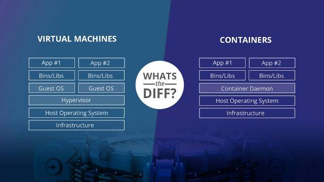
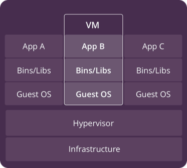
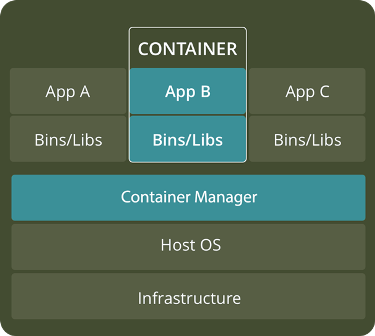

# **Відмінності між віртуальними машинами та контейнерами**

Автор **Roderick Bauer**

[Посилання на оригінальну статтю](https://www.backblaze.com/blog/vm-vs-containers/) 

Як віртуальні машини, так і контейнери можуть допомогти отримати максимальну віддачу від наявних ресурсів комп'ютерного обладнання та програмного забезпечення. Контейнери є новачками в цьому блоці, але віртуальні машини були і залишаються надзвичайно популярними в центрах обробки даних усіх розмірів.

Якщо ви шукаєте найкраще рішення для запуску власних служб у хмарі, потрібно розуміти ці технології віртуалізації у порівнянні один з одним, і які найкращі способи використання для кожної з них. Ось наш короткий вступ.

## **Основні означення – віртуальні машини та контейнери**

### Що таке віртуальні машини?

Віртуальна машина (VM, ВМ) - це емуляція комп'ютерної системи. Простіше кажучи, це дає змогу запускати, як здається, багато окремих комп'ютерів на апаратних засобах, які є фактично одним комп'ютером.

Операційні системи (ОС) та їхні застосунки спільно використовують апаратні ресурси одного хост-сервера або з пулу хост-серверів. Кожна ВМ вимагає власної базової ОС, а її апаратне забезпечення є віртуалізованим. Гіпервізор або монітор віртуальної машини - це програмне забезпечення, прошивка або апаратне забезпечення, яке створює і запускає віртуальні машини. Він розташований між апаратним забезпеченням і віртуальною машиною, і є необхідним для віртуалізації серверу.

З часу появи доступних технологій віртуалізації та послуг хмарних обчислень, ІТ-відділи великих і малих підприємств використовують віртуальні машини для зниження витрат і підвищення ефективності.

Однак віртуальні машини можуть зайняти багато системних ресурсів. Кожна віртуальна машина працює не тільки з повною копією операційної системи, але і з віртуальною копією всього обладнання, яке операційна система потребує для запуску. Це значно збільшує об’єм необхідної оперативної пам'яті і необхідний процесорний час. Це все ще економічно вигідно, порівняно з запуском окремих реальних комп'ютерів, але для деяких застосувань це може бути надмірним, що призвело до розробки контейнерів.

#### Переваги віртуальних машин

•     для застосунків (applications) доступні усі ресурси ОС

•     існують перевірені часом інструменти керування

•     існують перевірені часом засоби безпеки

•     краще відомі засоби керування безпекою

#### Популярні постачальники віртуальних машин

- [VMware vSphere](https://www.vmware.com/products/vsphere.html)
- [VirtualBox](https://www.virtualbox.org/)
- [Xen](https://www.xenproject.org/)
- [Hyper-V](https://docs.microsoft.com/en-us/virtualization/hyper-v-on-windows/about/)
- [KVM](https://www.linux-kvm.org/page/Main_Page)

### Що таке контейнери?

За допомогою контейнерів, замість віртуалізації базового комп'ютера, як віртуальної машини (VM), віртуалізована тільки сама ОС.

Контейнери працюють поверх фізичного сервера, в якого його хостова ОС типово є Linux або Windows. Контейнери розділяють між собою єдине ядро хостової ОС і, як правило, також бінарні файли і бібліотеки. Ці спільні компоненти доступні лише для читання. Спільне використання ресурсів ОС, таких як бібліотеки, значно зменшує необхідність відтворення коду операційної системи і означає, що сервер може запускати кілька робочих навантажень за допомогою однієї установленої операційної системи. Таким чином, контейнери є надзвичайно легкими - вони мають розмір порядку кількох десятків мегабайт і запускаються протягом кількох секунд. У порівнянні з контейнерами, запуск віртуальних машин проходить протягом кількох хвилин, і вони займають на порядок більше пам’яті, аніж еквівалентний до них за функціями контейнер.

На відміну від віртуальних машин, все, чого вимагає контейнер - це наявна операційна система, підтримуючі застосунки і бібліотеки, а також системні ресурси для запуску певної програми. На практиці це значить, що на одному сервері з контейнерами ви можете помістити в два-три рази більше застосунків, ніж з використанням ВМ. Крім того, за допомогою контейнерів ви можете створити портативне, послідовне робоче середовище для розробки, тестування та розгортання.

#### Типи контейнерів

**Linux Containers (LXC)**. Оригінальна технологія контейнера Linux, відома як LXC. LXC - це метод віртуалізації на рівні операційної системи Linux для запуску декількох ізольованих систем Linux на одному хості.

**Docker** . Docker був запущений як проект з побудови контейнерів LXC з одним застосунком, вводячи кілька змін до LXC, які роблять контейнери більш портативними та гнучкими у використанні. Пізніше він перетворився на своє власне середовище виконання. На вищому рівні Docker - це утиліта Linux, яка може ефективно створювати, відправляти і запускати контейнери.

#### Переваги контейнерів 

•     Зниження ресурсів керування ІТ

•     Зменшений розмір знімків

•     Швидший запуск застосунків

•     Зменшені та спрощені оновлення безпеки

•     Менше коду для передачі, міграції, завантаження робочих навантажень

#### Популярні постачальники контейнерів

- [Linux Containers](https://linuxcontainers.org/) 

- - [LXC](https://linuxcontainers.org/lxc/)
  - [LXD](https://linuxcontainers.org/lxd/introduction/)
  - [CGManager](https://linuxcontainers.org/cgmanager/introduction/)

- [Docker](https://www.docker.com/)

- [Windows Server Containers](https://docs.microsoft.com/en-us/virtualization/windowscontainers/about/)

## Області використання віртуальних машин та контейнерів 

І контейнери, і віртуальні машини мають переваги та недоліки, і остаточне рішення буде залежати від ваших конкретних потреб, але є деякі загальні правила.

•     Віртуальні машини є кращим вибором для запуску застосунків, які потребують усіх ресурсів та функціональності операційної системи, коли потрібно запускати декілька застосунків на серверах або мати широкий спектр операційних систем для керування.

•     Контейнери є кращим вибором, коли найбільшим пріоритетом є максимізація кількості застосунків, що працюють на мінімальній кількості серверів.

 **Різниця між ВМ та контейнерами**  

| ВМ                                           | Контейнери                                                 |
| -------------------------------------------- | ---------------------------------------------------------- |
| Важковагий                                   | Легковагий                                                 |
| Обмежена продуктивність                      | Вихідна продуктивність                                     |
| Кожна віртуальна машина працює у  власній ОС | Усі контейнери поділяють хостову  ОС                       |
| Віртуалізація на рівні обладнання            | Віртуалізація на рівні ОС                                  |
| Запускається порядку кількох  хвилин         | Запускається порядку кількох  секунд або сотень мілісекунд |
| Виділяє необхідну пам'ять                    | Потребує менше пам’яті                                     |
| Повністю ізольована і, отже, більш  безпечна | Ізоляція на рівні процесу,  можливо, менш безпечна         |

У більшості випадків, ідеальна установка, ймовірно, буде включати обидва варіанти. З поточним станом технологій віртуалізації гнучкість віртуальних машин і мінімальні вимоги до ресурсів контейнерів працюють разом, щоб забезпечити середовища з максимальною функціональністю.

Якщо у вашій організації працює велика кількість екземплярів тієї самої операційної системи, то слід перевірити, чи добре підходять контейнери. Вони просто можуть заощадити вам значний час і гроші ніж віртуальні машини.

