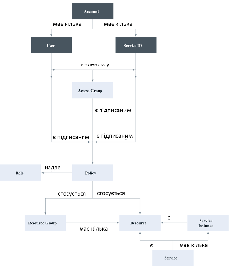
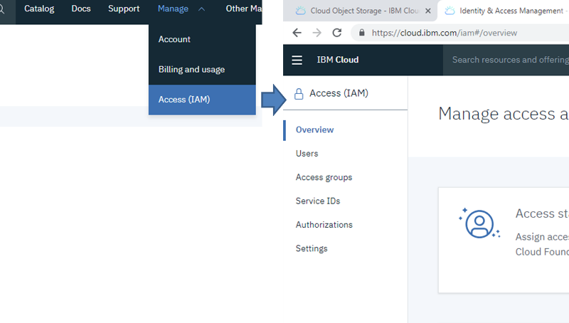
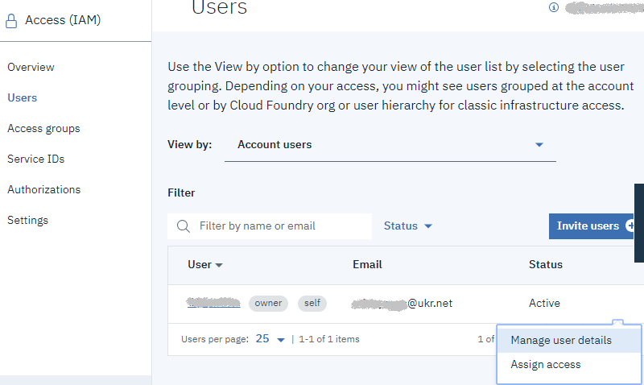
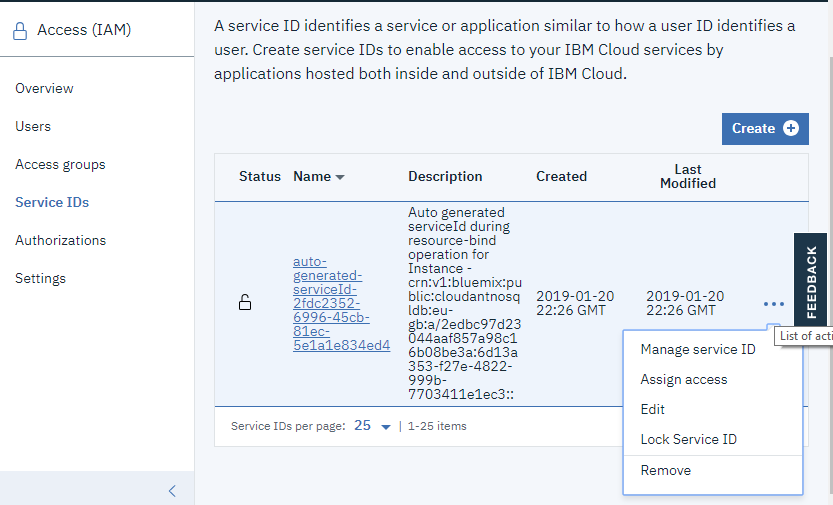
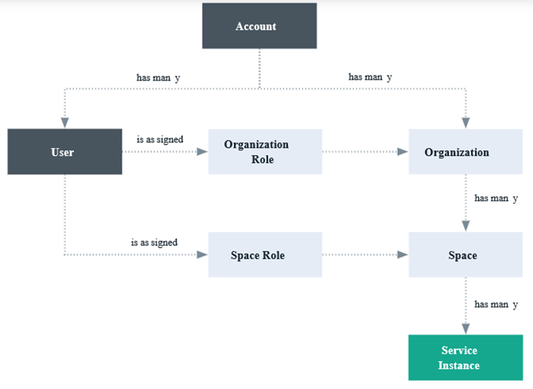
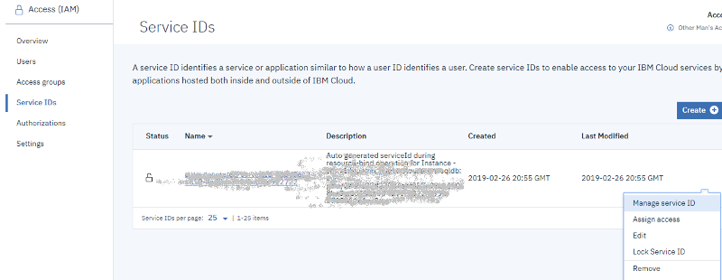
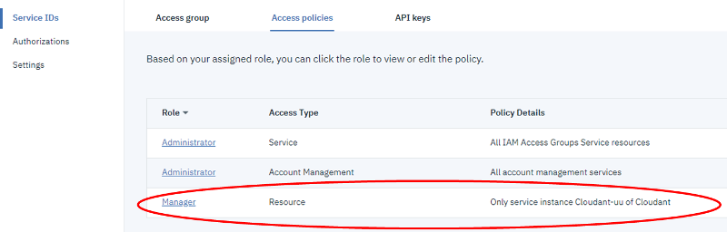

# Налаштування доступу до різних сервісів IBM Cloud

Застосунки і сервіси IBM Cloud підтримують кілька моделей надання доступу:

-  IAM (IBM Cloud Identity and Access Management)
- доступ до Cloud Foundry
- доступ до класичної інфраструктури

## Робота з IBM через IAM (Cloud Identity and Access Management) 

### Огляд

[IBM Cloud Identity and Access Management](https://cloud.ibm.com/docs/iam/index.html#iamoverview) (**IAM**) – дозволяє надійно аутентифікувати користувачів для доступу до ресурсів IBM Cloud. З точки зору доступу, ресурси можна групувати ([resource groups](https://cloud.ibm.com/docs/account/resourcegroups.html)), що дозволяє надавати користувачам швидкий і легкий доступ до більш ніж одного ресурсу одночасно. Політика доступу до хмари IAM використовується для назначення доступу до ресурсів облікового запису:

-  як користувачам (users) 
- так і сервісам (через Service ID). 

Можна групувати користувачів і Service ID в групи доступу ([access group](https://cloud.ibm.com/docs/iam/groups.html)), щоб легко надати всім особам у групі однаковий рівень доступу.

                               

рис.1.

Уніфіковане керування користувачами дозволяє додавати або видаляти користувачів облікового запису як для сервісів платформи (керування, адміністрування), так і для класичних сервісів інфраструктури. 

### Політики доступу та ролі

Доступ для користувачів, service IDs і груп доступу означується **політикою** (**policy**). В межах політики, область доступу для користувача, service ID або група доступу може бути назначена:

- набору ресурсів у групі ресурсів, 
- єдиному ресурсу або 
- сервісам керування обліковим записом. 

Після встановлення області дії, вибравши ролі доступу можна визначити, які дії дозволяється суб'єктом вказаної політики. **Ролі** надають можливість адаптувати рівень доступу, наданий суб'єкту політики (subject of the policy) для виконання дій на цілі політики.

### API keys

Для користувача можуть бути створені декілька ключів API (API keys). Той же ключ можна використовувати для доступу до декількох сервісів. Ключі IBM Cloud API дозволяють користувачам, які використовують двофакторну аутентифікацію або федеративний ідентифікатор (federated ID), автоматизувати аутентифікацію консолі з командного рядка. Користувач може також мати один класичний інфраструктурний ключ API, який можна використовувати для доступу до класичних інфраструктурних API; однак, це не є обов'язковим, оскільки можна використовувати ключі IBM Cloud API для доступу до тих самих API.

### Service ID та User ID

Ідентифікатор сервісу (**Service ID**) ідентифікує сервіс або застосунок, якому необхідно надати доступ до ресурсу. Ідентифікатор користувача (**user ID**) ідентифікує користувача, тобто людину, якій необхідно надати доступ до ресурсу. Це ідентифікатори, які можуть використовуватися застосунками для автентифікації за допомогою сервісу IBM Cloud. Кожному Service ID можна призначити правила, щоб керувати рівнем доступу, дозволеним застосунком, який використовує цей ідентифікатор сервісу. Крім того можна створити API key, щоб активувати автентифікацію.

### Налаштування IAM

Для адміністрування Cloud IAM використовуючи консоль можна перейти за посиланням **Manage** > **Access (IAM)**.

###### Налаштування IAM для користувачів

Для налаштування вікон налаштування  IAM для користувачів, необхідно:

- перейти до вікон налаштування IAM **Manage** > **Access (IAM)**. (рис.2) . 

 

рис.2.

- перейти на вкладку Users, відкрити налаштування користувача через пункт Manage user details (рис.3).

 

рис.3.

###### Налаштування IAM для Service ID  

Перейдіть до вкладки ServiceIDs (рис.4) . Для вашого аккаунту повинен бути автоматично створений як мінімум один Service ID, який можна налаштувати. Також це вікно дає можливість створювати нові Service ID та редагувати існуючі. Для того щоб передивитися деталі для даного ServiceID перейдіть на його налаштування, клікнувши за посиланням в полі Name, або клікнувши по Manage service ID в контекстному меню. З опису (Description) видно, що даний ServiceIDs був створений для доступу до Cloudant.  

 

рис.4.

## Доступ до сервісів Cloud Foundry

[джерело](https://cloud.ibm.com/docs/iam/cfaccess.html#cfaccess)

### Огляд

З точки зору Cloud Foundry доступ до сервісів  відбувається за іншою схемою, яка показана на рис.8. 

 

 

рис.8

### Ролі CF

Ролі Cloud Foundry надають доступ у межах облікового запису до: 

- організацій (organizations) і 
- просторів (spaces) у межах облікового запису. 

Ролі Cloud Foundry не дозволяють користувачам виконувати дії в контексті сервісу в обліковому записі, як це робиться в IAM через ServiceID. На рівні **організації** можна призначити такі ролі:

Таблиця 2. Ролі на рівні org.

| Organization  role | Permissions  (Дозволи)                                       |
| ------------------ | ------------------------------------------------------------ |
| Manager            | Керівники організацій можуть створювати, переглядати,  редагувати або видаляти spaces  в організації, переглядати використання організації та квоти,  запрошувати користувачів до організації, керувати тим, хто має доступ до  організації та їхні ролі в організації, а також керувати власними доменами  для організації . |
| Billing  manager   | Billing  managers можуть переглядати інформацію про час виконання та  використання служби для організації на сторінці "Інформаційна панель  використання". |
| Auditor            | Аудитори організації можуть переглядати вміст програми та  послуги в організації. Аудитори можуть також переглядати користувачів в  організації та їх призначені ролі, а також квоти для організації. |

На рівні **space** можна призначити такі ролі:

Таблиця 3. Ролі на рівні space.

| Space   role | Permissions   (Дозволи)                                      |
| ------------ | ------------------------------------------------------------ |
| Manager      | Space  managers можуть додавати існуючих користувачів і керувати ролями в  просторі. Менеджер простору може також переглядати кількість примірників,  прив'язки служб і використання ресурсів для кожного додатка в просторі. |
| Developer    | Розробники простору можуть створювати, видаляти та  керувати програмами та послугами в межах простору. Деякі з керуючих завдань  включають розгортання додатків, запуск або припинення додатків, перейменування  програми, видалення програми, перейменування простору, прив'язки або  роз'єднання служби до програми, перегляд кількості чи екземплярів, прив'язки  служб і використання ресурсів для кожного додатка в просторі. Крім того,  розробник простору може асоціювати внутрішню або зовнішню URL-адресу з  додатком у просторі. |
| Auditor      | Space аудитори  мають доступ тільки для читання до всієї інформації про простір, наприклад,  інформацію про кількість примірників, прив'язки служб і використання ресурсів  для кожного додатка в просторі. |

Користувачам, яким призначено роль менеджера або developer space, можна отримати доступ до змінної середовища VCAP_SERVICES. Однак користувачеві, якому призначено роль аудитора, не вдасться отримати доступ до VCAP_SERVICES.

###### Приклад.

Перейдіть на налаштування аккаунту [https://cloud.ibm.com/account](https://cloud.ibm.com/account). У переліку CF orgs буде один запис, який відповідає за ID вашої організації (по суті ваш поштовий ящик). Подивіться яка роль надана вашому обліковому запису і за таблицею 2 подивіться які в неї дозволи.  Зробіть клік по імені і зайдіть в налаштування org. Зайдіть на вкладку spaces і за таблицею 3 визначте ваші права на рівні space. Перегляньте зміст вкладок Users, Domains та Quotas.  

## Доступ до сервісів IAM із застосунків Cloud Foundry

###### CF <-> CF. 

Доступ застосунків CF до сервісів CF, проводиться за ідентифікацією користувача. Існуючий сервіс підключається до існуючого або нового застосунку IBM® Cloud на вкладці **Connections** інформаційної панелі сервісу. Підключення сервісу CF до застосунку Cloud Foundry створює прив'язку (**bind**) між ними. 

###### IAM to CF. 

Однак при підключенні екземпляра сервісу, керованого IBM IAM до застосунку CF, у відповідному просторі Cloud Foundry автоматично створюється псевдонім (alias) сервісу, керованого IAM, з обов'язковою інформацією про доступ. Цей псевдонім представлений у вигляді екземпляра сервісу Cloud Foundry для відповідного сервісу, керованого IAM. 

Псевдонім (**alias**) - це з'єднання між сервісом, керованим IAM, в межах групи ресурсів і застосунком Cloud Foundry в межах org або простору(space). У консолі IBM Cloud з'єднання (псевдонім) представлено у вигляді екземпляра сервісу Cloud Foundry. Можна керувати своїм псевдонімом, змінюючи екземпляр сервісу, що представляє з'єднання. 

###### Приклад. 

У консолі IBM Cloud перейдіть в список ресурсів Cloud Foundry Services знайдіть псевдонім ресурсу, що відповідає за з’єднання вашого CF застосунку Node-RED з сервісом Cloudant. Подивіться на значення “API key Name”, воно повинно співпадати з тим, що означено в змінній середовища VCAP_SERVICES.   

Перейдіть в налаштування доступу IAM: Manage->Access (IAM) [https://cloud.ibm.com/iam#/overview](https://cloud.ibm.com/iam#/overview). Перейдіть до вкладки Service ID, потім до пункту контекстного меню Manage Service ID (рис.9).  

 

рис.9

На вкладці Access policies знайдіть роль Manager, що базується на типі Resource (рис.10). Подвійним кліком зайдіть в редагування ролі. У даній ролі повинно бути налаштування доступу до сервісу Cloudant з правами Manager.   

 

 

рис.10

Таким чином, застосунок Node-RED, підключаючись до псевдоніму сервісу через означений Service ID, що записаний в змінній VCAP_SERVICES зможе підключитися до його екземпляру через IAM доступ.  

## Classic infrastructure permissions

[джерело](https://github.com/ibm-cloud-docs/iam/blob/master/infrastructureaccess.md)

Запрошуючи користувача до свого облікового запису, ви можете вибрати три класичні набори дозволів інфраструктури, які призначають масовий доступ: View only, Basic user, Super user. 

Коли ви запрошуєте когось до облікового запису, лише ви, власник облікового запису або користувач, що має класичний дозвіл на управління інфраструктурою користувача, можете налаштувати дозволи для користувача. Ви можете призначити лише рівень дозволів або підмножину дозволу, який ви вже призначили, якщо ви не власник облікового запису. Власник облікового запису може оновлювати будь-які дозволи в обліковому записі, щоб мати доступ до будь-якого рівня.

Додаткові дозволи можна встановити після того, як користувач прийме запрошення. Наприклад, початковий набір дозволів, призначений у запрошенні, не дає доступу до пристроїв. Отже, ви повинні надати доступ пристрою після того, як користувач прийме запрошення. Для отримання додаткової інформації див. [Керування класичним доступом до інфраструктури](https://cloud.ibm.com/docs/iam?topic=iam-mngclassicinfra#mngclassicinfra).

Доступ до управління обліковим записом центру підтримки рекомендується користувачам, які працюють з класичними ресурсами інфраструктури. Для виконання багатьох завдань під час роботи з класичними ресурсами інфраструктури, такими як створення або видалення екземпляра віртуального сервера, користувачі повинні мати доступ до роботи зі справами підтримки. Для отримання додаткової інформації про призначення цього типу доступу див. [Надання доступу до служб управління обліковими записами](https://cloud.ibm.com/docs/iam?topic=iam-account-services).

Наступний рисунок показує, як класичні дозволи на інфраструктуру присвоюються користувачеві. Ви можете надати кожному користувачеві доступ до класичної інфраструктурної послуги або пристрою, вибравши з деталізованих параметрів дозволу для налаштування доступу кожного користувача.

​                        Figure 1. Assigning classic infrastructure  access by selecting a user, device, or service, then any combination of  granular permissions          

Набір класичних дозволів інфраструктури для перегляду та керування платіжною інформацією та роботи зі справами підтримки тепер мігрується до груп доступу. Користувачі у вашому обліковому записі, яким раніше було призначено ці дозволи, тепер присвоюються відповідній групі доступу перенесеного дозволу. Як результат, класичними дозволами на інфраструктуру можна безпосередньо керувати за допомогою політики доступу IAM. Для отримання додаткової інформації про перенесені дозволи та групи доступу, які використовуються для кожного, див. [Управління дозволами міграційного облікового запису SoftLayer](https://cloud.ibm.com/docs/iam?topic=iam-migrated_permissions).