**Технології індустрії 4.0. Лекції.** Автор і лектор: Олександр Пупена 

| [<- до лекцій](README.md) | [на основну сторінку курсу](../README.md) |
| ------------------------- | ----------------------------------------- |
|                           |                                           |

# 1. Огляд технологій Індустрії 4.0 та основи Інтернету Речей

## Вступ 

Нині словосполучення "Індустрія 4.0" асоціюється з усім передовим, його часто вживають щоб показати все новітнє і про своє відношення до нього. Наприклад, замінюють словосполучення «новітні технології» на "технології Індустрії 4.0" .

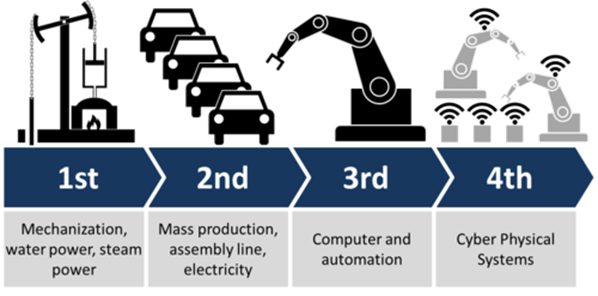                               

рис.1. Чотири промислові революції.

Але, не всі знають, що 4-та промислова революція була об’явлена до того, як вона відбудеться. Можна казати про епоху 4-ї промислової, але про факт її настання очевидно що ще рано. По суті, саме словосполучення “Industrie 4.0” – є назвою Німецької програми розвитку цифрового виробництва. У інших передових країнах подібні програми розвитку називаються інакше. Наприклад в США це зветься промисловий Інтернет Речей (Industrial Internet of Things). У цьому курсі розглядаються моделі представлення даних цих країн. 

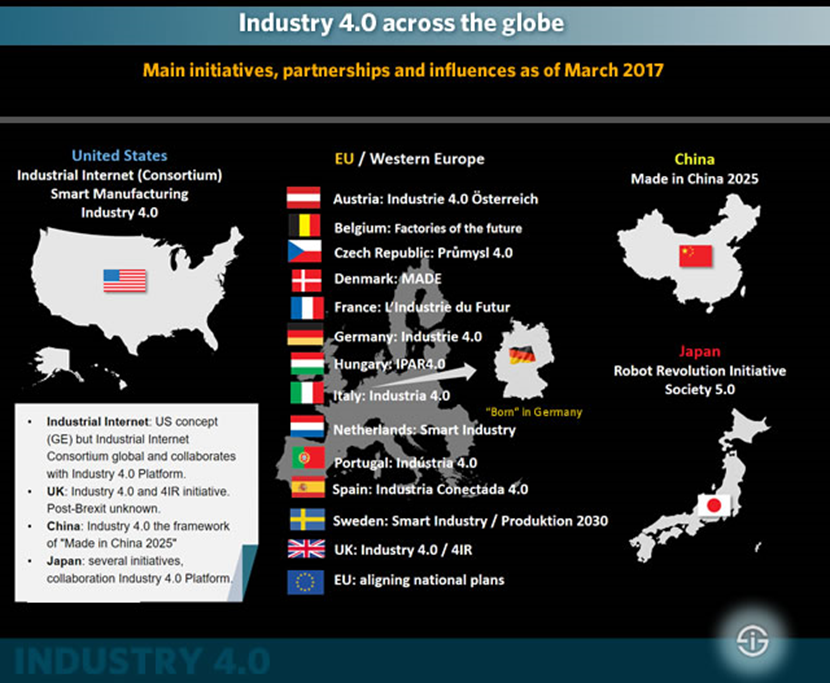 

рис.2. Державні програми цифрової трансформації у різних країнах. 

В Україні національної програми наразі немає. Натомість є національний рух "Індустрія 4.0 в Україні" (<https://industry4-0-ukraine.com.ua> ), який об'єднує велику кількість національних компаній для інтенсифікації розвитку та впровадження високих технологій на виробництві.  

Так що ж таке «**Індустрія 4.0**»? Індустрія 4.0 (Industry 4.0) - провідний тренд «Четвертої промислової революції», яка відбувається на наших очах. Зараз розвинуті країни живуть в епоху завершення третьої, цифрової революції, що почалася в другій половині минулого століття. Її характерні риси - розвиток інформаційно-комунікаційних технологій, автоматизація та роботизація виробничих процесів. Характерні риси Індустрії 4.0 - це повністю автоматизовані виробництва, на яких керівництво всіма процесами здійснюється в режимі реального часу і з урахуванням мінливих зовнішніх умов. Визначення `Industrie4.0` можна знайти в стратегії впровадження, представленій німецькою платформою Plattform Industrie 4.0 в квітні 2015 року, керівництво якої перейшло до німецької федеральної адміністрації:

> Термін Industrie 4.0 означає четверту промислову революцію, новий рівень організації та керування усім ланцюжком створення вартості протягом життєвого циклу продукції. Цей цикл орієнтований на все більш індивідуалізовані запити споживачів і тягнеться від концепції, до замовлення, далі до розробки та виготовлення, потім до доставки товару кінцевому споживачеві і аж до процесу переробки, включаючи супутні послуги

Це дає зрозуміти, що ми маємо справу з фундаментальною трансформацією методів промислового виробництва, а не просто зі зміною будь-якої окремої частини цих методів. Що служить основою для цього? Друге речення офіційного означення відповідає на запитання у відповідному розділі стратегії впровадження:

> Основою є доступність усієї відповідної інформації в реальному часі через мережу всіх екземплярів, які беруть участь у ланцюжку створення вартості, а також можливість використовувати дані в будь-який час для отримання оптимального потоку створення вартості. Завдяки підключенню людей, об’єктів та систем створюються динамічні мережі, оптимізовані в режимі реального часу, самоорганізовані та міжкорпоративні створення вартості, які можна оптимізувати відповідно до різних критеріїв, таких як витрати, доступність та споживання ресурсів [1].

Таким чином, усі компоненти ланцюжка доданої вартості у тому числі сам продукт є активними учасниками виробництва і зв'язуються між собою через їх представлення у цифровому світі. Такі **Кібер-фізичні системи** (**CPS**) створюють віртуальні копії об'єктів фізичного світу, контролюють фізичні процеси і приймають децентралізовані рішення. Вони здатні об'єднуватися в одну мережу, взаємодіяти в режимі реального часу, самоналагоджуватися і самонавчатися. Важливу роль відіграють інтернет-технології, що забезпечують комунікації між персоналом та машинами. Підприємства виробляють продукцію відповідно до вимог індивідуального замовника, оптимізуючи собівартість виробництва.

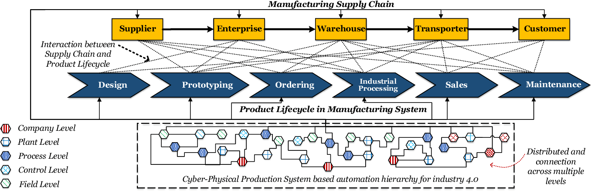

рис.3. Кіберфізичні системи у ланцюжку доданої вартості

Впровадження Індустрії 4.0 передбачає використання ряду технологій, які з'явилися порівняно недавно. Ці технології великою мірою стосуються IT, і вже використовуються в багатьох як виробничих, так і не виробничих секторах. Ці технології і є предметом даної дисципліни.  

Експерти виділяють кілька базових технологій, в результаті впровадження яких очікуються революційні зміни. Перелік технологій, які стосуються саме Індустрії 4.0 важко відділити від вже використовуваних на виробництві сьогодні. Тому в цій дисципліні розглядаються усі технології, які стосуються Індустрії 4.0 та не вивчалися в інших курсах.  

## 1.1. Огляд технологій Індустрії 4.0

Для початку розглянемо усі супутні технології, які спонукали замислу щодо інших підходів до автоматизації виробництва. 

Перші технології які інтенсифікували ці процеси – це мобільні телефони та смартфони. Мобільні гаджети увійшли в наше життя на стільки глибоко, що ми не усвідомили на скільки вони стали невід’ємною частиною нас самих. Це один із самих великих драйверів переходу в епоху Індустрії 4.0. Тепер з телефону Ви робите покупки, шукаєте як пройти в потрібне місце, отримуєте нагадування про зустріч, просите Телеграм-бота сповістити про ті квитки, які Вам потрібно, Телефон + WiFi (або мобільний Інтернет) – це наш інтерфейс в цифровий світ; це той портал через який ми стаємо частиною взаємопов’язаної системи людей і речей. Саме на цих стиках кожної секунди зустрічаються два світи – реальний і віртуальний! У віртуальному світі кожна річ і людина мають своїх ***цифрових двійників*** (***digital twins***). Тобто люди і речі існують не тільки реально, а і віртуально (деякі навіть в кількох екземплярах). 

Звичайно, сам по собі смартфон, навіть самий потужний немає такої ефективності без Інтернету. Зараз Інтернет є цифровим представленням знань, та великої кількості послуг. Окрім смартфонів і ноутбуків до Інтернету підключено багато різних речей. Вже нікого не дивує, що холодильник може замовляти продукти. Об’єднання речей в мережу Інтернет так і стали називати «**Інтернет речей**» (**IoT** **Internet** **of** **Things**).    

Зрештою, перехід від фізичних «нерозумних» речей до «розумних», які ще й спілкуються між собою, відбувається в кілька кроків. Спочатку робиться цифровий двійник цієї речі в Інтернеті. Наприклад десь на хмарній платформі (від Google, Amazon, Microsoft, IBM) з’являється віртуальна копія якоїсь, скажімо мікрохвильової печі або двигуна. Потім відбувається зв’язок цього двійника через фізичну взаємодію з річчю. 

Якщо простими словами, цифровий двійник – це така собі база даних та програми, які відображають дійсний стан фізичного пристрою у світі. Наприклад, якщо у Вас увімкнений двигун, то в цій базі даних буде відображатися час, коли його включили, яка частота обертів, струм, споживання і т.п. Крім сьогодення, двійник відображає минуле (скільки раз двигун включався та при яких параметрах працював) та майбутнє (наприклад, прогнозування виходу з ладу). А ще там можуть зберігатися багато документів про те, яка його конструкція і як його збирали та моделі, які можна використовувати для прогнозування. У професійному представленні промислового Інтернету речей цифровий двійник це набагато більше ніж просто певне представлення речі у світі, це буде обговорюватися в іншій лекції.

Будь яку річ можна з’єднати з віртуальним світом, користуючись наприклад, недорогим однопалатним комп’ютером типу Raspbery Pi (рис.1.1). Це зараз найпоширеніший інтелект для домашньої автоматизації, потужніший за Ардуіно. Такий маленький комп’ютер має на своєму борту багато інтерфейсів: WiFi, LAN (мережа Ethernet), Bluetooth, різноманітні входи/виходи для підключення датчиків та виконавчих механізмів. Це дає можливість інтегрувати існуючі системи автоматизації з хмарними платформами. 

 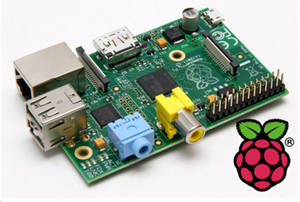                              

рис.1.1. Однопалатний комп'ютер Raspberry PI. 

Для промислових рішень використовують промислові комп'ютери Industrial PC (iPC), наприклад як показано на рис.1.2. 

 

рис.1.2. Промисловий комп'ютер класу Edge . 

Для мобільних речей, які необхідно ідентифікувати для визначення зв'язку з їх віртуальною сутністю можна використати технологію радіочастотної ідентифікації (RFID) або ідентифікацію за допомогою QR-коду.   

Тому не тільки люди через свої гаджети, а і речі через якісь цифрові інтерфейси можуть спілкуватися, і організовуючи таким чином Інтернет речей. 

Технології Індустрії 4.0 дають можливість максимально кастомізувати продукт під потреби кінцевого замовника. Припустимо, захотілося замовнику купити рюкзак з зображенням улюбленої рок-групи і зі своїм продуманим дизайном. Він може зайти через телефон в Інтернет-магазин і сам спроектувати свій рюкзак. Після натискання кнопки «розрахувати» йому видається терміни і вартість. Далі це замовлення **автоматично** проходить по всьому ланцюжку постачань (обробка, виробництво, постачання) і доставляється замовнику додому. 

Для Індустрії 4.0 речі які виготовляються тобто є продуктом зрештою можуть стати частиною іншого розумного виробництва. Тому виробничий ланцюжок завершується не як споживчий товар, а як частина іншого ланцюжка. Це є частиною розумного виробництва Індустрії 4.0.

Окрім класичних технологій керування все більше потребується програмування. Тому сучасні автоматники сьогодні потребують компетенцій IIoT.  

IoT на виробництві називається промисловим Інтернетом речей (IIoT). Технологія IIoT, що базується на Internet, цифрових двійниках, різноманітних шлюзах і мережних пристроях, та включає автоматизовані системи керування а також інші сучасні технології і є основою Індустрії 4.0. 

До технологій 4.0 відносять з десяток технологій, які тільки зараз знайшли своє відображення в розумному виробництві. Вони описані нижче.       

Отже, існують два взаємопов’язані світи – цифровий (віртуальний) і реальний. Хоч цифровий світ також реальний, речі в ньому віртуальні. Людина перебуваючи у цифровому світі, сприймає його як нереальний. І тут на допомогу приходять технології **Віртуальної реальності** (VR). Одягнувши шлем і спеціальні рукавиці можна походити по віртуальному підприємству, навіть якщо у фізичному світі його ще не існує. Так, цифрові двійники часто з’являються ще до появи фізичних речей. У промисловості віртуальна реальність використовується для навчання, тренування та перевірки моделей. 

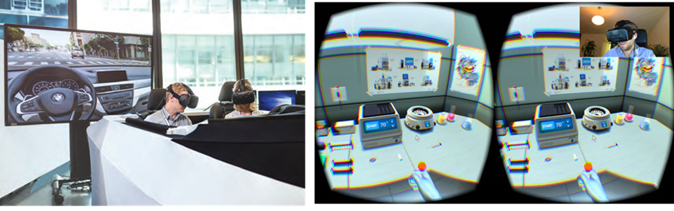 

рис.1.3. Віртуальна реальність. 

Те що є у віртуальному світі, там і залишається. А ось візуальний зв'язок світів можна реалізувати **доповненою реальністю** (**Augmented reality** – AR). Мабуть більшості молоді найбільш відома доповнена реальність іграшкою “Pokemon Go”. На виробництві, доповнена реальність може допомогти при ремонті обладнання, показуючи на реальному обладнанні через наприклад планшет, що необхідно зробити в якому місці. Доповнена реальність також стрімко входить у бортові системи автомобілів, підказуючи, наприклад, як паркуватися або куди повертати показуючи це безпосередньо на лобовому склі. 

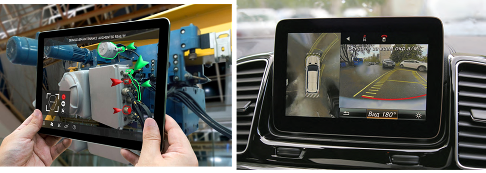 

рис.1.4. Доповнена реальність. 

Окуляри з можливістю відображення та знімання відео, наприклад google glass, є гарним додатком до доданої реальності і поступово впроваджуються в сферу обслуговування обладнання на виробництві.

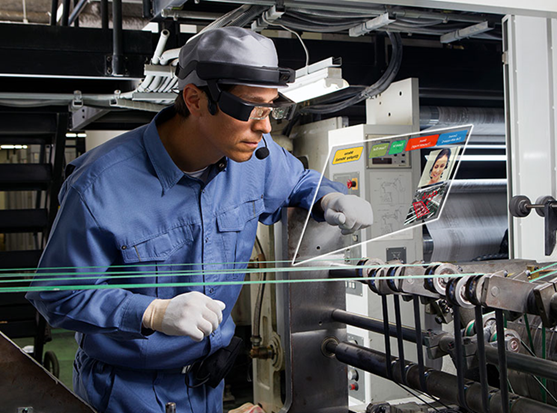 

рис.1.5. Використання окулярів в доповненій реальності. 

Очевидно, що як би там все не автоматизувалося, поки що певну роботу на виробництві виконують люди. Усю рутинну роботу виконують машини, а інколи роботи. Роботи які працюють разом з людиною називають ***коботами***. Коботи працюють таким чином, щоб максимально взаємодіяти з людьми і іншими коботами. При русі кобота через перешкоду, він зупиняється, щоб не зашкодити людині або іншому обладнанню. Таким чином коботи безпечні, а для промислових роботів безпечність треба реалізовувати з використанням спеціального обладнання, наприклад бар'єрів безпеки. Коботи можуть наприклад збирати щити під наглядом людини, або робити певні складальні операції. 

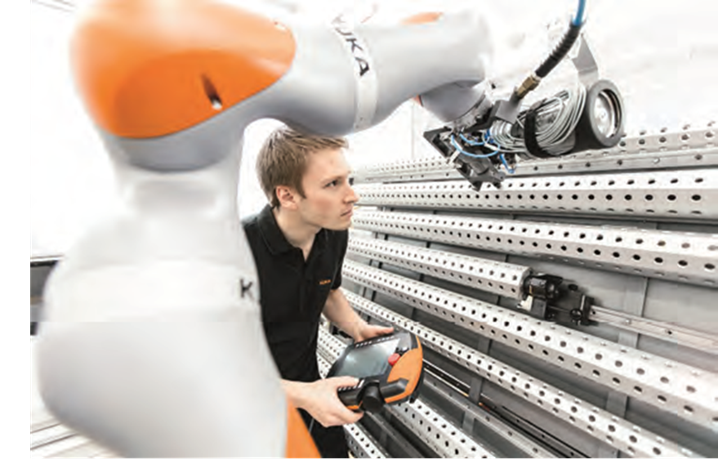 

рис.1.6. Кобот. 

У результаті довгої роботи речей в цифрових двійниках накопичується велика кількість історичних даних. Це велика кількість інформації, на основі якої можна зробити певні висновки і навіть робити прогнозування. Це робиться не простим аналізом таблиць людиною або вибірками зі статистикою, а спеціальними алгоритмами для обробки ***Великих даних*** (**Big Data**). Оскільки великі дані не можуть накопичуватися безпосередньо в речах, вони зберігаються у їх цифрових двійниках в хмарах. Спеціально розроблені а інколи навчені алгоритми, пропускають через себе ці дані і видають рекомендації. 

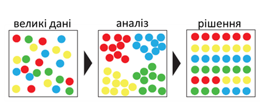 

рис.1.7. Аналіз даних. 

Для обробки великих даних і прийняття рішень на основі них, може знадобитися ***штучний інтелект*** *(***Artificial Intelligence**). Це можуть інтелектуальні системи на базі нейромереж або експертні системи на базі знань. Штучний інтелект дозволяє вирішувати великий спектр задач – від розпізнавання образів до генерування відповідей на складні запитання.   

Зараз виробництво часто використовує ***Адитивні технології*** *(**3D друк***). Він використовується для створення одиничних або малосерійних деталей чи виробів, для виготовлення яких раніше потребувалося б налагоджувати окремі лінії. 

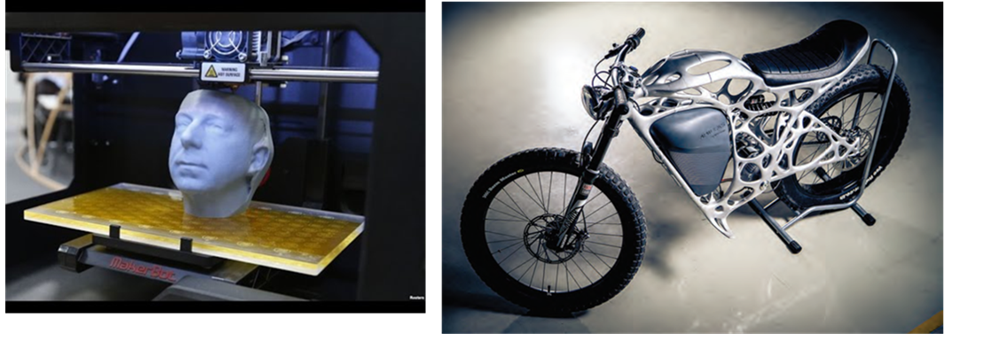 

рис.1.8. 3D-друк.

Окрім коботів в реальному житті масово почали використовуватися ***Роботи-дрони***. Вони використовуються для різних цілей – наприклад доставки або спостереження. 

Наведені вище технології і складають основу Індустрії 4.0, про яку сьогодні усі говорять. Вона включає цілий комплекс взаємопов’язаних технологій і діяльностей. Тому в Індустрії майбутнього задіяно багато виробничих спеціальностей, які сьогодні прийнято відносити до сектору ***ОТ*** (операційних технологій) та спеціалістів інформаційних технологій (ІТ). Містком, який об’єднує ці два світи ІТ та ОТ (або іншими словами кібернетичний і фізичний, віртуальний і реальний), слугують різноманітні інтеграційні технології. 

У рамки цього курсу включені тільки кілька з наведених технологій, а саме Промисловий Інтернет речей, цифрові двійники та доповнена реальність.

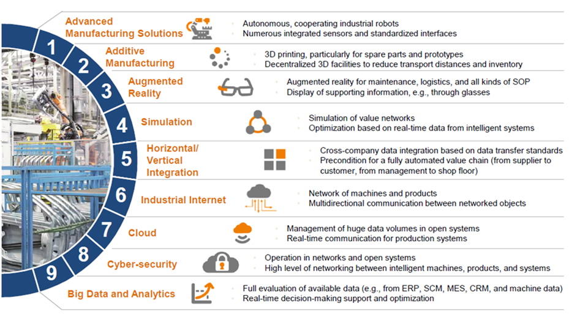 

рис.1.9. Технології Індустрії 4.0.

## 1.2. Інтернет речей

### Про Інтернет речей.

[Інтерне́т рече́й](https://uk.wikipedia.org/wiki/Інтернет_речей) (англ**. Internet of Things**, **IoT**) — концепція мережі, що складається із взаємозв'язаних фізичних пристроїв, які мають вбудовані давачі, а також програмне забезпечення, що дозволяє здійснювати передачу і обмін даними між фізичним світом і комп'ютерними системами, за допомогою використання стандартних протоколів зв'язку. Окрім датчиків, мережа може мати виконавчі пристрої, вбудовані у фізичні об'єкти і пов'язані між собою через дротові чи бездротові мережі. Ці взаємопов'язані пристрої мають можливість зчитування та приведення в дію, функцію програмування та ідентифікації, а також дозволяють виключити необхідність участі людини, за рахунок використання інтелектуальних інтерфейсів.

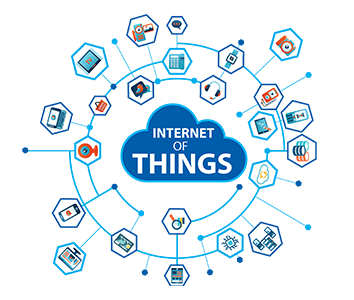

Набуває поширення також термін англ. Internet of Everything, IoE — всеохопний, або всеосяжний інтернет. Це явище спричинило занепокоєння в конфіденційності інформації й сприяло появі нового терміну безпека інтернету речей.

Термін «інтернет речей», зобов'язаний своєю появою Кевіну Ештону, який в 1997 р, працюючи на компанію Proctor and Gamble, застосував технологію **радіочастотної ідентифікації** (**RFID**) для керування системою поставок. Завдяки цій роботі в 1999 році його запросили в Масачусетський технологічний інститут, де він з групою однодумців організував дослідний консорціум Auto-ID Center (більш детальну інформацію можна знайти на [сайті]([www.smithsonianmag.com/innovation/kevin- ashton- describes-the-internet-of-things-180953749](http://www.smithsonianmag.com/innovation/kevin- ashton- describes-the-internet-of-things-180953749))). З тих пір Інтернет речей звершив перехід від простих радіочастотних міток до екосистеми і індустрії. Аж до 2012 р ідея підключення речей до Інтернету переважно відносилася до смартфонів, планшетів, ПК і ноутбуків. По суті, до тих пристроїв, які в усіх відношеннях виступають в якості комп'ютера. До цього, з моменту появи перших боязких зачатків Інтернету (таких як створена в 1969 р мережу ARPANET), більшості технологій, на яких будується Інтернет речей, просто не існувало. 

До 2000 року більшість пристроїв, які можна було підключити до Інтернету, представляло собою комп'ютери різних розмірів. Зараз Інтернет речей захоплює практично кожен сегмент в сфері промисловості, бізнесу, охорони здоров'я і споживчих товарів. 

 

**Промисловий Інтернет речей** (**Industrial IoT**, **IIoT**) - це один з найбільш великих сегментів Інтернету речей з точки зору кількості підключених пристроїв і ступеня корисності цих сервісів для виробництва і автоматизації підприємств. Цей сегмент традиційно служить операційно-технологічною базою. Сюди входять апаратні і програмні засоби моніторингу фізичних пристроїв. Традиційні завдання інформаційних технологій вирішуються інакше, ніж операційно-технологічні завдання. **Операційні технології** (**ОТ**) зосереджені на оцінці продуктивності, часу безвідмовної роботи, зборі даних і відповідної реакції в режимі реального часу, а також безпеки систем. Інформаційні технології спрямовані на безпеку, групування, сервіси та надання даних. Оскільки Інтернет речей починає займати важливе місце в сфері виробництва і промисловості, світи ІТ і ОТ об'єднаються, особливо в області діагностичного обслуговування тисяч виробничих машин і верстатів, і зможуть забезпечувати безпрецедентним обсягом даних приватні та публічні хмарні інфраструктури.

 До характеристик цього сегмента відноситься необхідність надавати операційно-технологічної системи готові рішення в режимі реального часу або майже в режимі реального часу. Це означає, що у всьому, що стосується виробничого цеху, головним параметром для Інтернету речей буде час відгуку. Крім того, важливу роль будуть грати тривалість простою і безпеку. Це має на увазі потребу в запасі потужності і, ймовірно, в наявності приватних хмарних мереж і сховищ даних. Промисловий Інтернет речей - це один з сегментів на цьому ринку що найбільш швидко розвивається. Важливою особливістю цього напрямку є те, що він спирається на старі технології, тобто на апаратні і програмні засоби, які не можна назвати актуальними. Часто 30-річні виробничі станки працюють на послідовних інтерфейсах RS485, а не на сучасній бездротовій комірчастій архітектурі.

Приклади застосування Промислового Інтернету Речей.

- профілактичне обслуговування промислового обладнання;
- зростання продуктивності завдяки попиту в реальному часі;
- енергозбереження;
- системи безпеки, такі як вимірювання температури, вимірювання тиску і контроль над витоком газу;
- експертна система для виробничого цеху.

### Екосистема Інтернету речей

До екосистеми Інтернету речей відносяться усі засоби, сервіси і технології, які використовуються в Інтернеті речей. 

До них можна віднести:

–    **sensors (розумні датчики/виконавчі механізми**): вбудовані системи, операційні системи реального часу, джерела безперебійного живлення, мікро-електромеханічні системи (МЕМС);

–    **системи зв'язку з датчиками**: зона охоплення бездротових персональних мереж становить від 0 см до 100 м. Для обміну даними між датчиками застосовуються низькошвидкісні малопотужні інформаційні канали, які часто побудовані не на протоколі IP;

–    **локальні обчислювальні мережі (**LAN): зазвичай це системи обміну даними на основі протоколу IP, наприклад, 802.11 Wi-Fi-мережу для швидкого радіозв'язку;

–    **агрегатори, маршрутизатори** **(routers), шлюзи** **(gateways), пограничні пристрої (**Edge Device) : сюди входять різноманітні засоби які слугують зв'язковими між областю речей, Інтернетом та хмарними сервісами;

–    **глобальна обчислювальна мережа**: оператори стільникового зв'язку, оператори супутникового зв'язку, оператори малопотужних глобальних мереж (Low- Power Wide-Area Network, LPWAN). Зазвичай застосовуються транспортні протоколи Інтернету для IoT і мережевих пристроїв (MQTT, CoAP і навіть HTTP);

–    **хмари**: різноманітні хмарні постачальники та їх сервіси;

–    **сервіси аналізу даних**: спеціалізовані застосунки що дозволяють обробляти величезні масиви інформації, які передаються в хмару;

–    **засоби безпеки (**security): при зведенні всіх елементів архітектури воєдино постають питання кібербезпеки. Безпека стосується кожного компонента: від датчиків фізичних величин до ЦПУ і цифрового апаратного забезпечення, систем радіозв'язку і самих протоколів передачі даних. На кожному рівні необхідно забезпечити безпеку, достовірність і цілісність. У цьому ланцюзі не повинно бути слабких ланок, оскільки Інтернет речей стане головною мішенню для атак хакерів в світі.

### Архітектура Інтернету Речей

Архітектура Інтернету речей відрізняється в залежності від реалізації. Тим не менше вона дещо схожа на архітектуру класичних систем АСУТП. Один із прикладів архітектури показаний на рис.2.1. 

рис.2.1. Приклад архітектури Інтернету Речей.

Взаємодія з «речами» відбувається через датчики (sensors) та виконавчі механізми (Actuators), аналогічно як це робиться в АСУТП для будь якого об’єкту керування. Ці датчики разом з усією інфраструктурою для інтеграції з рівнем обробки подій через мережу Internet формують так звану граничну область (**Edge**). 

Події (дані) що поступають з граничної області зберігаються і обробляються відповідно до задачі (рівень обробки подій і аналітики, **event processing**, **Platform**). На цьому рівні події(дані) зберігаються (storage), обробляються (Event Processing), перенаправляються потрібним додаткам (Real-Time Message Brokering, Stream Processing). Додатково на цьому рівні відбувається адміністрування та керування пристроями з граничної області (Device Registry, Edge Device Management). Події (дані) обробляються з використанням аналітичних сервісів (Analytics) на основі них проводиться машинне навчання (Machine Learning), що дозволяє зробити певні висновки про об’єкт. Цей рівень як правило реалізований з використанням хмарних (Cloud) або туманних (Fog) обчислень. Якщо провести аналогію с АСУТП, то це рівень контролерів та SCADA (за виключенням функцій HMI).     

Отримання результатів, контроль, віддалене керування та адміністрування системи проводиться через кінцеві застосунки з використанням Internet. Цей рівень можна умовно порівняти з HMI в АСУТП.  

На рис.2.2 показана подібна наведеній вище архітектура, однак у вигляді сервісів. На ньому область Edge представлений у вигляді датчиків (Sensors), Device Hub/Gateway (збір та маршрутизація даних) та Device Management (керування пристроями). Останні частково виконуються як хмарні обчислення так і на граничних пристроях. Усі функції збереження та первинної обробки подій (даних) зведені до Data Management. Усі інші функції обробки, в тому числі аналітичні показані як додатки PaaS, що взаємодіють з сервісами керування даних через API (Application Program Interface).     

рис.2.2.Приклад сервісів в архітектурі Інтернету речей.

Ще один приклад архітектури Інтернету Речей показаний на рис.3. Як видно, усі наведені архітектури мають спільні риси: наявність трьох рівнів, подібні функції, наявність хмарних обчислень, використання Інтернету як інтеграційного рівня.  

Далі коротко розглянемо основні компоненти архітектури. 

#### Датчики та живлення

Інтернет починається або закінчується однією подією: простий рух, зміна температури або, може бути, важіль замикає замок. На відміну від багатьох існуючих ІТ-пристроїв, Інтернет речей здебільшого пов'язаний з фізичною дією або подією. Він формує реакцію на якийсь фактор реального світу. Іноді при цьому один-єдиний датчик може згенерувати величезний обсяг даних, наприклад, акустичний датчик для профілактичного огляду обладнання. В інших випадках всього одного біта даних достатньо, щоб передати життєво важливі відомості про стан здоров'я пацієнта. Якою б не була ситуація, системи датчиків еволюціонували і, відповідно до закону Мура, зменшилися до субнанометрових розмірів і стали істотно дешевше. Саме до цього апелюють ті, хто прогнозує, що до Інтернету речей будуть підключені мільярди пристроїв, і саме тому ці прогнози виправдаються.

Тому, розглядаючи Інтернет Речей, необхідно розглядати мікроелектромеханічні системи, датчики і інші типи недорогих граничних пристроїв і їх електрофізичних властивостей. Також це стосується силових і енергетичних систем, необхідних для живлення цих граничних пристроїв. Не можна вважати, що граничні пристрої забезпечуються енергією за замовчуванням. Мільярди маленьких датчиків все одно потребують великої кількості енергії. З питанням живлення також пов’язані питання організації хмарних сервісів IoT.

#### Передача даних

Велика увага при розробці IoT приділяється встановленню з'єднання і роботі мереж.  Інтернету речей не існувало б без надійних технологій передачі даних з найвіддаленіших і несприятливих областей в найбільші центри збору даних компаній Google, Amazon, Microsoft і IBM. Словосполучення «Інтернет речей» містить слово «Інтернет», тому необхідно вивчати питання, що стосуються мережних технологій, обміну даними та навіть теорії сигналів. Базова опора Інтернету речей - це не датчики і не програми, а можливість встановити з'єднання. 

Передача даних і встановлення мережевого з'єднання базуються на базі систем зв'язку ближньої дії - персональних мереж (PAN), зазвичай побудованих без дотримання правил IP-протоколу. Це може бути як дротові так і бездротові мережі. До бездротових IoT-мереж/протоколів як правило відносяться протоколи Bluetooth, mesh-мережі, Zigbee, Z-Wave. Для IIoT це також Wireless Hart та ISA100. Це яскравий приклад різноманіття бездротових систем зв'язку IoT.  Перелік дротових мереж ще більший, так як сюди входять усі можливі промислові мережі та протоколи. 

Крім PAN використовуються бездротові локальні мережі та системи зв'язку на основі IP-протоколу, включаючи широкий діапазон Wi-Fi-мереж на основі стандартів IEEE 802.11, 6LoWPAN і технології Thread. Нерідко використовуються телекомунікації на основі стільникових стандартів (3G, 4G LTE) і нові стандарти, що забезпечують роботу Інтернету речей і міжмашинної взаємодії, такими як Cat-1 і Cat-NB, а також пропрієтарні протоколи LoRaWAN і Sigfox, що використовуються саме для IoT.

#### Маршрутизація

Для передачі даних від датчиків в Інтернет-простір необхідні дві технології: маршрутизатор-шлюз і опорні інтернет-протоколи, що забезпечують ефективність обміну даними. Маршрутизатор особливо важливий в таких аспектах, як безпека, управління і напрям даних. Граничні маршрутизатори (Edge routers) керують і стежать за станом відповідних mesh-мереж, а також вирівнюють і підтримують якість даних. Також велике значення належить конфіденційності та безпеки даних. Маршрутизатор відіграє важливу роль в створенні віртуальних приватних мереж, віртуальних локальних мереж і програмно-визначених глобальних мереж. Вони в буквальному сенсі можуть містити тисячі вузлів, що обслуговуються єдиним граничним маршрутизатором, і в якійсь мірі маршрутизатор служить розширенням для хмари (edge device).

На цьому рівні використовується ряд протоколів, необхідних для обміну даними між вузлами, маршрутизаторами і хмарними сервісами в межах IoT-системи. Інтернет речей відкрив дорогу новим IoT-протоколам, які виходять на один рівень з традиційними протоколами HTTP і SNMP, які застосовуються вже кілька десятків років. Для передачі IoT-даних потрібні ефективні, енергозберігаючі протоколи з малою затримкою, здатні легко і безпечно відправляти дані в хмару і з нього. Зокрема тут використовуються такі протоколи, як всюдисущий MQTT, AMPQ і CoAP.

###  Туманні і граничні обчислення, аналітика і машинне навчання

На цьому етапі необхідно вирішити, що робити з потоком даних, що надходять в хмарний сервіс з граничного вузла (Edge Device). Щоб навчитися правильно оцінювати, як система буде розвиватися і рости, необхідно розібратися у всіх тонкощах і складнощах архітектури хмарних систем, який вплив на IoT-систему робить запізнювання. Крім того, не все треба відправляти в хмару. Пересилання всіх IoT-даних обходиться значно дорожче, ніж їх обробка на кордоні мережі (граничні обчислення, Edge Computing) або включення граничного маршрутизатора в зону, яку обслуговує хмарний сервіс (туманні обчислення, Fog computing). Туманні обчислення також стандартизуються, зокрема є стандарт туманних обчислень, наприклад архітектура OpenFog.

Дані, які були отримані шляхом перетворення аналогового фізичного впливу в цифровий сигнал, можуть мати велику вагу. Саме тут в гру вступають засоби аналітики і процесори правил IoT-системи. Ступінь складності введення в дію IoT-системи залежить від того, яке рішення проектується. У деяких ситуаціях все досить просто: наприклад, коли на граничний маршрутизатор, який контролює кілька датчиків, потрібно встановити простий процесор правил, що відслідковує аномальні скачки температури. Інша ситуація - величезна кількість структурованих і неструктурованих даних в режимі реального часу передається в хмарне озеро даних, що вимагає високої швидкості обробки (для прогнозної аналітики) і довгострокового прогнозування на базі високотехнологічних моделей машинного навчання, таких як рекурентна нейронна мережа в пакеті аналізу сигналів з кореляцією по часу. Тут є певні проблеми і складнощі аналітики, які вирішуються різними підходами та методами, наприклад складними обробниками подій, байесовськими мережами і формування нейронних мереж.

#### Загроза і безпека в Інтернеті речей

Багато IoT-систем не будуть обмежені безпечним простором будинку або офісу. Вони будуть розташовуватися в громадських місцях, в дуже віддалених областях, в рухомих транспортних засобах або навіть всередині людини. Інтернет речей - це величезна єдина мішень для будь-яких видів хакерських атак. Вже було виявлено нескінченна кількість направлених на IoT-пристрої навчальних атак, добре організованих зломів і навіть уразливостей в системі безпеки національного масштабу. Розробник ІоТ рішень повинен знати особливості таких вразливостей і способи їх усунення, стандартні заходи, спрямовані на захист Інтернету речей або будь-якого компонента мережі.

**Запитання для самоперевірки**

1. Що таке четверта промислова революція? Коли вона відбулася?
2. Які державні програми Індустрії 4.0 Вам відомі?
3. Поясніть як Ви розумієте поняття "цифровий двійник".
4. Поясніть що таке "Інтернет речей".
5. Яким чином речі з Інтернету речей з'єднуються з зовнішнім світом?
6. Як можуть допомогти технології Індустрії 4.0 в завдоленні власних потреб споживача?
7. Що таке промисловий Інтернет речей?
8. Розкажіть про технологію віртуальної реальності. Як вона може знадобитися на сучасному виробництві?
9. Розкажіть про технологію доповненої реальності. Як вона може знадобитися на сучасному виробництві?
10. Розкажіть про використання на виробництві коботів. Чим вони відрізняються від промислових роботів?
11. Для чого можуть використовуватися "Великі дані"?
12. Для чого в промисловості може використовуватися Штучний інтелект?
13. Для чого в промисловості можуть використовуватися адитивні технології?
14. Наведіть приклад використання роботів-дронів.
15. Що таке Інтернет речей?
16. Що вважається початком Інтернету речей? Як Ви думаєте чому?
17. Що таке промисловий Інтернет речей? У чому його особливість?
18. Що входить до екосистеми IoT?
19. Що входить до екосистеми Інтернету речей?
20. Розкажіть про основні елементи архітектури Інтернету речей.
21. Розкажіть про особливості використання датчиків та виконавчих механізмів в IoT.
22. Розкажіть про особливості передачі даних в IoT.
23. Розкажіть про особливості маршрутизації в IoT.
24. Що таке туманні та граничні обчислення?
25. У чому проблема аналізу даних за місцем збору?
26. Чому в системах IoT та IIoT ставляться особливі вимоги щодо кібербезпеки?

| [<- до лекцій](README.md) | [на основну сторінку курсу](../README.md) |
| ------------------------- | ----------------------------------------- |
|                           |                                           |

