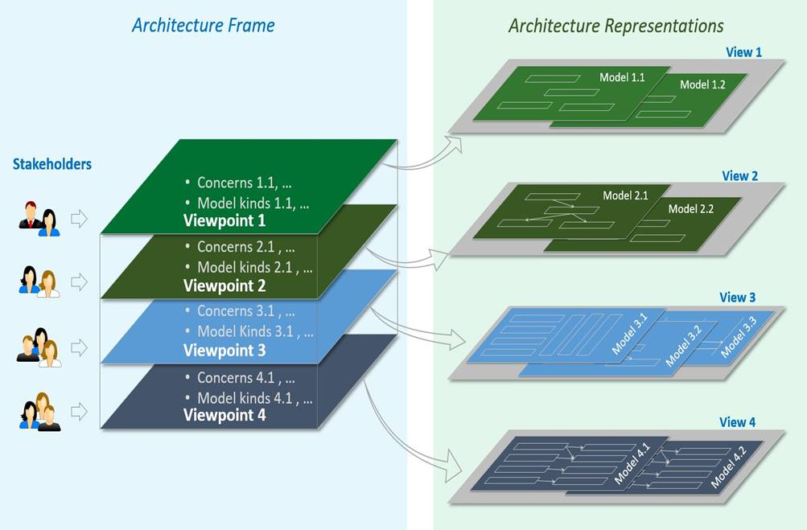
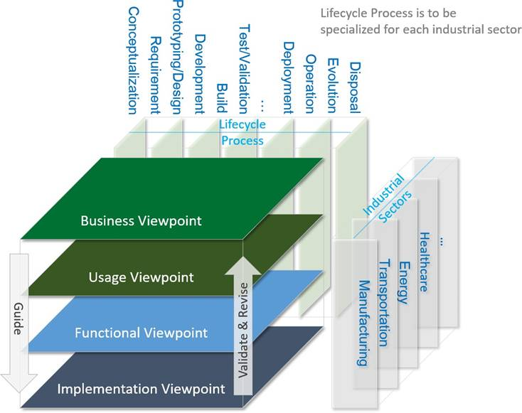
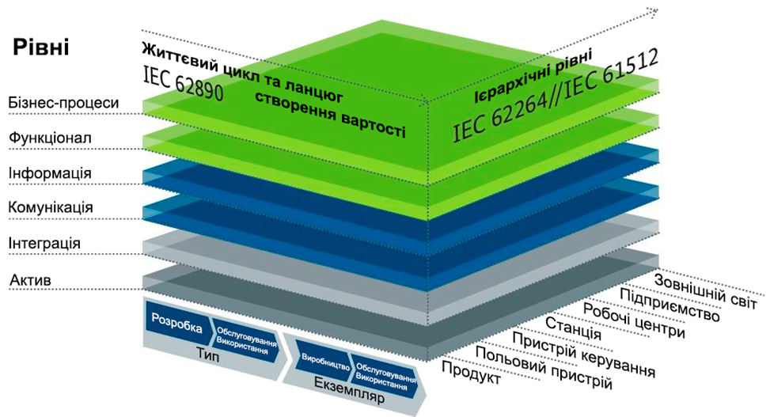
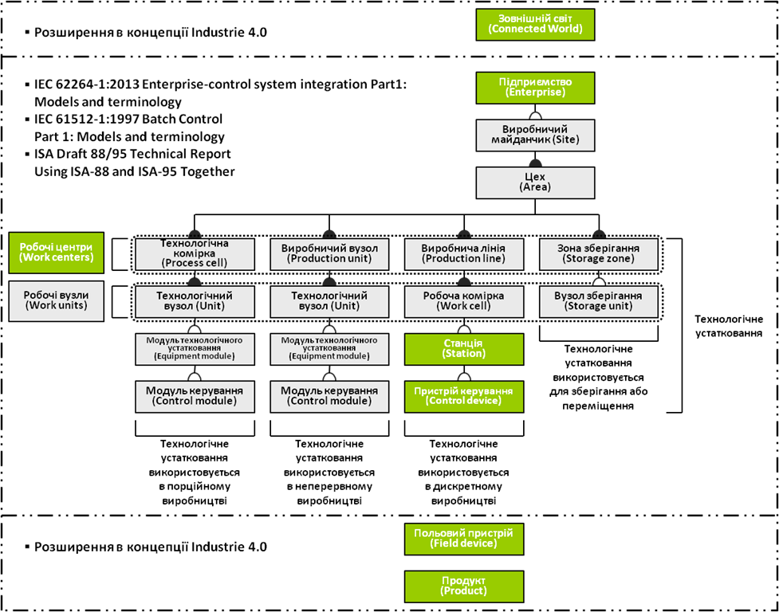
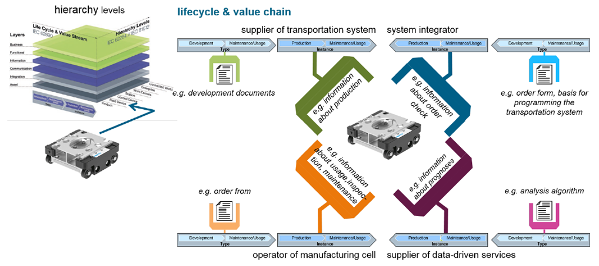

# Реферативні моделі IIC та RAMI4

## Реферативна модель IIoT згідно Industrial Internet Consortium

Сьогодні промисловий Інтернет речей це не просто вдале використання IoT в промисловості. Можливості, які надає IoT спонукають розробників систем універсалізувати рішення та рухати їх в напрямку стандартизації. У США IIoT стало державної програмою цифровізації суспільства, тому роботи по його стандартизації є одними із найбільш пріоритетними. Одна з організацій, яка інтенсивно займається цими завданнями є IIC.   

***Industrial Internet Consortium*** (***IIC***) – це організація, яка займається розвитком ідеології промислового Інтернету речей, для чого розробляє рекомендації та різного роду популяризаційний матеріал (білі книги, презентації, вебінари і т.п.). Однією з фундаментальних робіт в стандартизації IIoT є еталонна (рефертивна) модель, на яку можуть покладатися більш конкретні моделі. Ця еталонна модель архітектури має назву ***IIRA*** (INDUSTRIAL INTERNET REFERENCE ARCHITECTURE). У ній описані рекомендації щодо розробки систем, рішень і застосунків з використанням Інтернету речей в промисловості та інфраструктурних рішеннях (транспорт, медицина, енергетика тощо). Ця архітектура є абстрактною, і надає загальні та послідовні означення для різних зацікавлених осіб (стейкхолдерів), порядок декомпозиції системи, схеми проектування, а також загальний словник, з яким можна обговорити специфікації реалізацій та порівняти варіанти.

Структура архітектури містить інформацію, що ідентифікує фундаментальні конструкції архітектури і визначає проблеми, зацікавлені сторони, точки зору, типи моделей, правила відповідності та умови застосування. Системні архітектори можуть використовувати рамки архітектури, щоб виявити, описати та організувати теми, що представляють інтерес (проблеми) щодо існуючої системи; вони можуть далі використовувати архітектурне представлення для пояснення, аналізу та вирішення цих проблем.

Модель IIRA базується на стандартах системної інженерії, які в свою чергу розглядають будь яку системну виходячи з різних точок зору (з точок зору різних стейкхолдерів). У системній інженерії під стейкхолдерами (зацікавленими особами) розуміються різні ролі осіб або організацій по відношенню до системи. Так, наприклад, АСКТП для її розробників, операторів та обслуговуючого персоналу (КВПіА) повинна виконувати (і виконує) різні функції: одні розробляють, інші експлуатують а треті забезпечують її функціонування 

Для різних стейкхолдерів система виглядає по різному. Тому в архітектурі пропонують для кожної з точок зору розробляти окремі види конструкцій. Набір взаємопов'язаних конструкцій для точок зору різних стейкхолдерів можна розглядати як архітектуру каркасу. Кожна конструкція описується своїми архітектурними моделями. Аналогічно до прикладу с АСКТП, систему керування можна представити з точки зору оператора – як набір людино-машинних інтерфейсів та функцій системи для взаємодії з ним, документації по обслуговуванню і т.п. З іншого боку для обслуговуючого персоналу потрібні інші ЛМІ та додаткові функції, інша супровідна документація. Розробники АСКТП повинні врахувати вимоги різних стейкхолдерів і представляють систему для них по різному. З точки зору замовника – АСКТП це частина активу, який повинен приносити прибуток.  

                                

рис.3.1.Архітектурний каркас.

У моделі IIRA для IIoT означено принаймні чотири точки зору:

\-     бізнес

\-     використання

\-     функціонування

\-     впровадження

Точка зору бізнесу зосереджується на питаннях ідентифікації (виявлення) зацікавлених сторін та їхнього бізнес-бачення (вимог), цінностей та цілей у створенні системи IIoT у її бізнесовому та регуляторному контексті. Вона також визначає, яким чином система IIoT досягає поставлених цілей шляхом зіставлення основних можливостей системи. Ці інтереси є бізнес-орієнтованими і до стейкхолдерів відносяться керівники підприємств, продуктових менеджерів і системних інженерів.

Точка зору використання стосується інтересів очікуваного використання системи. Вона зазвичай представляється у вигляді послідовностей дій, в яких беруть участь люди або логічні користувачі (наприклад, системні або системні компоненти), які забезпечують його передбачувану функціональність в кінцевому підсумку для досягнення своїх основних можливостей системи. Тобто з цієї точки зору система представляється так, як вона повинна використовуватися. До таких стейкхолдерів зазвичай входять системні інженери, менеджери продуктів та інші зацікавлені сторони, включаючи осіб, які беруть участь у розробці системи IIoT, і які представляють користувачів у своєму кінцевому використанні.

Функціональна точка зору зосереджується на функціональних компонентах системи IIoT, їхній структурі та взаємозв'язку, інтерфейсах та взаємодіях між ними, а також на співвідношенні та взаємодії системи з зовнішніми елементами середовища, для підтримки використання та діяльності загальної системи. Ця точка зору стосується тільки тих стейкхолдерів які приймають участь у створенні та модернізації системи. Ці функції викликають особливий інтерес у системних та компонентних архітекторів, розробників та інтеграторів.

Точка зору реалізації стосується технологій, необхідних для реалізації функціональних компонентів (функціональної точки зору), їх схем зв'язку та процедур їх життєвого циклу. Ці елементи координуються діяльністю (точка зору використання) і підтримують можливості системи (бізнес-точки зору). Ці функції представляють особливий інтерес для системних та компонентних архітекторів, розробників та інтеграторів та системних операторів. Тобто усіх тих, хто має відношення до функціональних компонентів системи. 

Точки зору бізнесу, використання, функціональності та реалізації, сприяють систематичному визначенню завдань системи IIoT та їхніх зацікавлених сторін, щоб об'єднати подібні або пов'язані з ними завдання, щоб вони могли бути проаналізовані та ефективно вирішені. Розгляд завдань часто виконується в межах кожної точки зору, до якої вони належать. Однак, це не означає, що системні завдання завжди мають вирішуватися в межах кожної точки зору, окремо від тих, що розглядаються в інших точках зору. Тобто завдання в різних точках зору взаємопов'язані. 

Порядок розташування точок зору бізнесу, використання, функціонування та реалізації, йде зверху вниз, як зображено на рис. 3.2. Це показує загальну схему взаємодії між ними. Загалом, рішення з точки зору вищого рівня керуються і накладаються на вимоги на точки зору що нижче. Наприклад, рішення, що випливають з точки зору бізнесу, мають безпосередній вплив на обговорення в перспективі використання, тощо. З іншого боку, обговорення завдань у нижчій точки зору, включаючи вимоги до реалізації з точки зору вище, підтверджують і в деяких випадках викликають зміни до аналізу і, можливо, рішення в точці зору вище. Наприклад, обговорення з точки зору використання може перевірити, чи можуть бути реалізовані деякі основні можливості системи, запропоновані в точку зору бізнесу.

 

рис.3.2. Взаємозв'язок між точками зору, Application Scope та прцесами життєвого циклу

## Реферативна модель RAMI4.0

Сьогодні класична пірамідальна методологія побудови систем керування все більше витісняється сучасними підходами прямої взаємодії між компонентами M2M, як це представлено наприклад в [RAMI4.0](https://www.plattform-i40.de/PI40/Redaktion/EN/Downloads/Publikation/rami40-an-introduction.html) або в [IIC](https://www.iiconsortium.org/) (IIoT). 

Усі моделі Індустрії 4.0 передбачають інтеграцію з хмарними застосунками, так як це дає можливість використовувати велику кількість обчислювальних ресурсів та даних, які доступні в Інтернет. Ієрархічність в класичному представлені перестає існувати, так як усі пристрої можуть обмінюватися між собою безпосередньо. Тим не менше, в основу базових стандартів керування підприємством (ISA-95, ISA-88) закладені ієрархічні моделі керування. Нові концепції в дійсності будуються на вже існуючих технологіях, які затверджені в стандартах. Так, наприклад, ідеї, закладені в ISA-95/IEC-62264 у свою чергу базуються на концепціях ISA-88/IEC-61512. Усі моделі, викладені в цих стандартах є нічим іншим, як цифровими моделями виробництва з описом обов’язкових полів та зав’язків між об’єктами. Ці моделі вдосконалюються з кожною версією стандарту, вони можуть доповнюватися і видозмінюватися в залежності від потреб, але вони не залежать від способів організації систем керування. Ці стандарти разом з іншими стали основою моделі RAMI4.0, на якій базується німецька Industrie 4.0. Таким чином, RAMI4.0 по суті є каркасом, що об'єднує існуючі промислові стандарти.

Німецька ініціатива Industrie 4.0 передбачає застосування комплексного підходу до імплементації бізнес цілей. Однією з основних особливостей такої парадигми є злиття двох світів, світу інформаційно-комунікаційних технологій (ICT) та світу операційних технологій (ОТ), тобто технологій автоматизації промислових процесів та виробництв. Останні означуються стандартами, що застосовуються в машинобудуванні, електроніці, електротехніці, автоматизації в цілому. Крім Німеччини інші країни також долучилися до здійснення четвертої промислової революції у себе. Проте, саме концепція Industrie 4.0, яка представлена моделлю ***Reference Architecture Model Industrie 4.0 (RAMI 4.0)***, сформована на основі майстерного об’єднання кращих світових практик. З метою формування швидкої відповіді на потреби ринку модель RAMI 4.0 описана німецьким інститутом стандартизації DIN та затверджена шляхом спеціальної нової процедури стандартизації, як DIN SPEC 91345:2016-04. Ця модель сформована з міцних цеглин світового досвіду – найбільш важливих стандартів для виробництва.

Автоматизоване виробництво в концепції Industrie 4.0 бачиться, як взаємодія кіберфізичних компонентів I4.0, який включає в себе актив (Asset) та його віртуальну сутність (цифровий двійник). Поняття фізичного активу присутнє як в стандарті IEC-62264 так і в RAMI 4.0, що робить можливим супроводжувати усі сутності, задіяні у виробництві по їх життєвому циклу. У RAMI4.0 поняття активу значно розширене (включає персонал, стандарти, софт, поширюється і на продукт), тим не менше в загальному розумінні вони з IEC-62264 мають одну основу.     

Згідно моделі RAMI 4.0 компонент I4.0 представляється тривимірною моделлю (рис.10.1), яка відображає основні аспекти його діяльності протягом усього життєвого циклу. Перевагою використання такого підходу є чітке та наочне розуміння функції кожного рівня. Визначальною особливістю німецької концепції є організація виробничої діяльності за рахунок об’єднання всіх активів підприємства в єдину I4.0-сумісну мережу, яка не має конкретних меж та може мати урегульований доступ для встановлення з’єднання та здійснення автоматичного обміну інформацією з іншими активами, навіть за межами підприємства. 

                               

Рис 3.3. Еталонна модель архітектури Industrie 4.0

Кожен актив – це певна цінність для організації, тому до активів належать не тільки матеріальні об’єкти, але й нематеріальні, такі як програмне забезпечення та навіть ідеї. Концепція Industrie 4.0 означує процес створення правил цифрового опису активів, який доповнюється та змінюється протягом усього його життєвого циклу. Мета цієї моделі – представити актив та всі аспекти, що мають відношення до нього, від його розробки, виробництва та використання аж до його утилізації та забезпечити його взаємодію з іншими активами. 

Шість архітектурних рівнів, які лежать на вертикальній вісі еталонної моделі архітектури Industrie 4.0 означують структуру представлення компонента Industrie 4.0 (елемента єдиної мережі), тобто яким чином і якими засобами активи підприємства взаємодіють між собою в мережі та як вони в ній представленні. Модель RAMI 4.0 передбачає застосування сервісно-орієнтованої архітектури (SOA), де компоненти I4.0 надають послуги іншим компонентам через протоколи зв'язку по мережі. 

Підхід Industrie 4.0 передбачає можливість розробки та вдосконалення продуктів, машин, заводів/фабрик і т.д. протягом всього їх життєвого циклу. Тому ліва горизонтальна вісь моделі використовується для представлення життєвого циклу систем або продуктів («Life cycle & value stream») у вигляді пов’язаних стадій «типу» («Type») та «екземпляру» («Instance»). За рахунок постійного збору даних це дає можливість простежувати стан продукту в будь-який момент часу його існування: від ідеї до експлуатації та утилізації. Розгляд активів з точки зору їх життєвого циклу спирається на стандарт IEC-62890 «Life Cycle Management».

Права вісь моделі RAMI 4.0 – «Ієрархічні рівні» («Hierarchy levels») – забезпечує відображення активу на конкретну роль у виробництві. Ієрархічні рівні RAMI 4.0 в рамках одного підприємства базуються на ієрархії технологічного устатковання на основі ролей, означених стандартом IEC-62264 та відповідно фізичній моделі технологічного устатковання, означеної в IEC-61512 (див. рис. 3.4). Але ця модель в деякій мірі є розширеною, що, до речі, дозволяється цими стандартами.

  

Рис 3.4. Ієрархічні рівні еталонної моделі архітектури Industrie 4.0

Виділені зеленим кольором елементи на рисунку 3.4 присутні серед ієрархічних рівнів RAMI 4.0. Поняття «Підприємства» та «Робочих центрів» відображені в тому ж функціональному сенсі, що й в IEC-62264. З метою застосування концепції Industrie 4.0 на більшій кількості виробничих секторів «модулі технологічного устатковання» та «модулі керування» були замінені поняттями «Станція» та «Пристрій керування», які використовуються в ISA-TR88.00.02-2015 «Machine and Unit States - An implementation example ISA88». Можливо використання саме такої ієрархії зумовлено розвитком на території Німеччини дискретного виробництва, а саме машинобудування. 

У концепції Industrie 4.0 також виділяється ще кілька нових функціональних ієрархічних рівнів, які не представлені в класичній рольовій ієрархії устатковання IEC-62264/IEC-61512. До таких рівнів належать «Польовий пристрій» («Field device») та «Продукт» («Product») в нижній частині ієрархії, а також «Зовнішній світ» у верхній частині. Польовий пристрій може представляти собою інтелектуальний датчик або виконавчий механізм та самостійно приймати рішення в реальному часі. Нам наразі невідомі принципи розділення польових пристроїв від пристроїв керування.  

Нижче польового пристрою додано рівень «Продукту» («Product»), на який варто звернути особливу увагу. Наявність рівня продукту передбачає його функціонування як повноцінного компонента I4.0, тобто він відіграє таку ж важливу роль під час свого виробництва, як і устатковання, що бере участь у його виготовленні. По-перше, продукт в машинобудуванні це також актив (Asset), який після його виготовлення на іншому виробництві може стати на місце виробничого устатковання. По-друге, етапи виготовлення продукту є частиною його життєвого циклу, яким передують процеси його проектування, поставки на виробництво та інші кроки виготовлення. Це дає змогу взаємодіяти між виробничим устаткованням та компонентом продукту безпосередньо, оскільки вся необхідна інформація знаходиться в цифровому двійнику активу та накопичується на ньому ж. Таким чином, роль продукту забезпечує самодостатність усіх компонентів для прямої взаємодії між «речами» на виробництві, що і є однією з фундаментальних основ Індустрії 4.0.    Розглянемо це більш детально через призму різних етапів життєвого циклу продукту. 

Відповідно до лівої горизонтальної вісі моделі, виділяються поняття типа та екземпляра. Існування продукту за концепцією Industrie 4.0 розпочинається із виникнення ідеї виготовлення продукту. З цього ж моменту виникає тип «продукту». З часом накопичується інформація, яка стосується розроблення продукту. Як тільки продукт переходить на стадію виробництва, то він стає конкретним екземпляром, тому що тип набуває конкретного фізичного відображення у реальному світі. Виділення продукту як окремого функціонального рівня полягає в тому, що «продукт» має здатність до взаємодії з іншими пристроями. Така функція може бути реалізована, наприклад, за допомогою використання QR-коду для ідентифікації продукту на будь-якій стадії його виробництва. Ідентифікувавши продукт, інші пристрої можуть отримати інформацію, яка стосується продукту або напівпродукту. Ця інформація може стосуватися або стадії виробництва, або ж надавати конкретні вказівки щодо того, що ж робити з напівпродуктом, наприклад, яким кольором повинен бути зафарбований напівпродукт. Тобто, під час виробництва продукт може надавати дані іншим пристроям, а інші пристрої відповідно записувати дані у цифровий двійник продукту. Реалізація рівнів вертикальної осі може бути різноманітною. Наприклад, інтеграційний рівень для конкретного продукту може бути реалізований тільки засобами ідентифікації, а комунікаційний рівень – здатністю інших пристроїв, які взаємодіють з продуктом, до комунікації. Якщо продукт зрештою стає частиною устатковання у якійсь виробничій установці конкретного підприємства, він стає на інше місце у ієрархії рольової моделі, і його функції можуть відповідати, наприклад, рівню «Станції». 

Той самий актив з точки зору різних зацікавлених сторін (стейхолдерів) займає різну позицію. Припустимо на виробництві використовується транспортер, який в рольовій ієрархії устатковання знаходиться на рівні «польового пристрою». Інформацією про життєвий цикл кожного екземпляра оперує постачальник транспортерів (наприклад, інформація про виробництво транспортера), оператор виробничої комірки (наприклад, споживання енергії та рух транспортера) та постачальник сервісів обробки та аналізу даних (наприклад, прогнозований ступінь забруднення).

Але кожен із зацікавлених сторін у ланцюжку вартості використовує різні типи моделей транспортера (рис. 3.5): 

\- постачальник перевізника оперує документами про розробку;

\- системний інтегратор програмує транспортну систему;

\- оператор повинен мати можливість змінювати порядок запуску транспортерів;

\- постачальник сервісів обробки та аналізу даних аналізує рівень забруднення.

  

Рис 3.5. Розгляд транспортера з точки зору життєвого циклу та ієрархічного рівня 

Таким чином польовий пристрій представлений на різних підприємствах і має різне наповнення своїх цифрових двійників. Обмін інформацією між різними підприємствами може реалізовуватися за рахунок використання ще одного нового для класичної піраміди рівня – «Зовнішній світ» («Сonnected world»). Cтандарт IEC-62264 означує ієрархію технологічного устатковання лише в межах підприємства, тому на вищому рівні ієрархії RAMI 4.0 був доданий «Зовнішній світ» («Сonnected world»), який розширює межі окремого заводу/фабрики та передбачає обмін інформацією за межами конкретного підприємства. 

Взагалі ця вісь RAMI 4.0 не передбачає побудову ієрархічних систем, в яких функціональні компоненти підпорядковуються компонентам, які знаходяться безпосередньо над ними. Вона означує конкретний функціонал для кожного компоненту системи, які можуть взаємодіяти безпосередньо, навіть якщо знаходяться на не суміжних рольових рівнях, якщо цього вимагає логіка керування. Здатність всіх компонентів до зв’язку передбачає можливість простого налаштування, за рахунок використання І4.0-сумісного зв’язку, який повинен бути стандартним та передбаченим у всіх компонентах системи. 

## Запитання для самоперевірки

1. Розкажіть про необхідність стандартизації в області промислового Інтернету речей?
2. Для чого організація IIC розробила еталонну модель IIRA?

3. Що в загальному входить в модель IIRA?

4. На базі яких фундаментальних стандартів розроблена IIRA? 

5. Що таке стейкхолдери? Наведіть приклади.

6. Що таке архітектура каркасу IIRA? Що таке архітектурна модель?

7. Які точки зору виділені в IIRA?

8. Як система IIoT бачиться з точки зору бізнеса?

9. Як система IIoT бачиться з точки зору використання?

10. Як система IIoT бачиться з функціональної точки зору?

11. Як система IIoT бачиться з точки зору реалізації?

12. Як взаємопов'язані різні точки зору?
13. Що таке модель RAMI4.0?
14. Які стандарти лягли в основу моделі RAMI4.0?
15. Що таке актив у розумінні RAMI4.0?
16. Що таке кіберфізичний компонент RAMI4.0?
17. Розкажіть про розгляд активів з точки зору їх життєвого циклу в RAMI4.0.
18. Розкажіть про ієрархічні рівні в RAMI4.0. Як вона розширена порівняно з стандартами, на які модель спирається?
19. Розкажіть про рівень "Продукту" в ієрархії  RAMI4.0.
20. Прокоментуйте вісь життєвого циклу RAMI4.0.
21. На прикладі транспортера прокоментуйте використання різних типів моделей та даних компонента RAMI4.0 протягом його життєвого циклу.

  

 