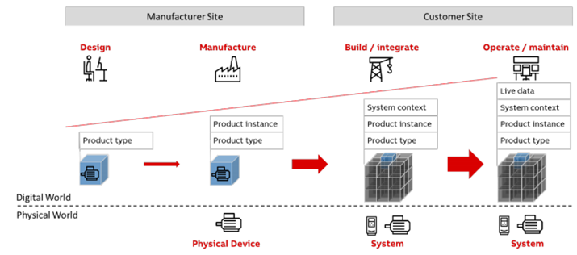
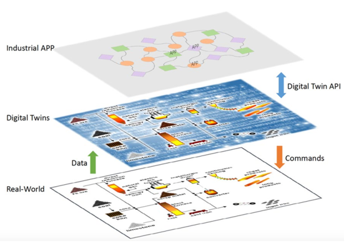

**Технології індустрії 4.0. Лекції** Автор і лектор: Олександр Пупена 

| [<- до лекцій](README.md) | [на основну сторінку курсу](../README.md) |
| ------------------------- | ----------------------------------------- |
|                           |                                           |

# 7. Обробка даних в Edge, цифрові двійники

## 7.1. Визначення цифрового двійника по версії IIC

***Цифровий двійник*** – це формальне цифрове представлення (representation) деякого активу, процесу чи систем, що фіксує ознаки та поведінку цього об’єкта, які підходять для зв’язку, зберігання, інтерпретації чи обробки у певному контексті.

Інформація цифрового двійника включає, але не обмежується, комбінацію таких категорій:

–    фізична модель та дані,

–    аналітична модель та дані,

–    часові архіви параметрів,

–    транзакційні дані,

–    основні дані (метадані),

–    візуальні моделі та

–    розрахунки.

Зображення на рис.8.1 показує багатогранність цифрового двійника. Далі по тексту воно використовується для відображення цифрового двійника.

                               

Рис.8.1. Зображення цифрового двійника

## 7.2. Зв’язки між цифровими двійниками в системах

Рівень абстракції цифрового двійника залежить від умов використання, для яких він розробляється.

Окремий (дискретний) цифровий двійник – це єдине ціле, що створює цінність без потреби подальшого дроблення. Наприклад, коробка передач чи двигун шарового млина в шахті на рівні моніторингу може розглядатися як єдиний об’єкт. Збірка дискретних цифрових двійників для утворення складеного цифрового двійника (рис.8.2) показана у вигляді вертикального розширення, що описує збільшення складу від одиниці до множини об’єктів.

Складений (композитний) цифровий двійник – це комбінація окремих цифрових двійників, що представляє собою об’єкт який складається з кількох окремих компонентів чи частин. Композиція може проходити на різних рівнях. Для прикладу, виробнича комірка – це складений об’єкт, чий цифровий двійник складається з цифрових двійників пристроїв у цій комірці.

 

Рис. 8. 2. Утворення складеного цифрового двійника

У складеному цифровому двійнику зв’язки між елементами (рис.8.3) можуть бути: 

–    ієрархічними: так само, як і їх реальні аналоги, набір цифрових двійників-компонентів об’єднується в цифрового двійника устаткування, кілька цифрових двійників устаткування становлять цифрового двійника виробничої лінії, а набір цифрових двійників виробничих ліній може бути зібраний в цифрового двійника заводу і так далі.

–    асоціативними: між цифровими двійниками, як і між їх реальними прототипами, є асоціації. Цифровий двійник газопроводу пов’язаний цифровими двійниками процесів видобування та споживання газу. 

–    одноранговими (peer-to-peer): зв’язки між рівноправними вузлами можна спостерігати в групі обладнання однакового чи схожого типів, що виконує такі ж чи подібні функції. Загальний ефект всього обладнання – це просто сума ефектів, що продукуються кожним елементом групи. Наприклад, вітрова електростанція, де група двигунів вітрової турбіни формує складений цифровий двійник вітрової турбіни.

  

Рис. 8.3. Відношення між цифровими двійниками у збірці (композиції, composition)

## 7.3.Цифровий двійник в життєвому циклі об’єкту

Зазвичай інформація про об’єкт розкидана по багатьом інформаційним ресурсам (рис. 8.4), які створені та підтримуються різними організаціями. Наприклад, оперативна інформація про об'єкт (наприклад з технологічних датчиків) може знаходитися в ПЛК або/та SCADA/HMI. Інша частина оперативної інформації може бути в системі MES. Інформація про обслуговування може знаходитися в системі EAM/ТОіР і т.д.

 

Рис. 8.4. Експлуатація без цифрових двійників

  Це призводить до руйнування інформаційного потоку впродовж життєвого циклу об’єкту через те, що інформаційні ресурси можуть некоректно обмінюватися даними. Деяка інформація може дублюватися або містити протиріччя, а деяка – взагалі бути відсутньою. У результаті на пошук потрібної інформації, приведення її у потрібний вигляд та створення в ній семантичних зв’язків витрачається багато часу. Більш того, це може призвести до конфліктів в оперативній інформації та посприяти прийняттю неефективних рішень. На додаток, окремі інформаційні банки перешкоджають впровадженню передових методів, таких як розширена аналітика та штучний інтелект, які потребують доступу до великих об’ємів інформації.

Цифрові двійники допомагають впоратися з проблемою окремих інформаційних сховищ (рис. 8.5). Цифровий двійник виступає як проміжний елемент, що централізовано збирає дані про кожний об’єкт, а потім через інтеграційні інтерфейси (API) робить доступною цю інформацію різним сферам бізнесу в залежності від їх специфічних застосувань. Це покращує процес прийняття рішень завдяки загальному розумінню робочого стану та знижує загальну вартість життєвого циклу експлуатації та обслуговування заводу.

Рис. 8.5.Експлуатація із цифровими двійниками

Ось приклад (рис.8.6), як цифровий двійник розвивається впродовж життєвого циклу об’єкту, навіть за межами організації. У виробничих системах виробник може додати новий тип продуктів до каталогу типів. Споживач обирає типи продуктів, які він хотів би замовити, з каталогу, та розміщує замовлення. Продукт виготовляється та доставляється до споживача. Тим часом споживач може застосувати різні інструменти для інженерного та віртуального введення в експлуатацію, щоб налаштувати продукт, визначити його параметри та подивитись на взаємодію з іншими продуктами на своєму заводі. Коли реальний продукт доставляється до споживача, він монтується, налаштовується і запускається в експлуатацію. Під час експлуатації продукт може потребувати різного обслуговування. Інформація, отримана під час обслуговування, може надалі використовуватися споживачем для уточнення його наступних замовлень. Виробник може бути поінформований про виявлені у продукті проблеми та використати це для подальшого покращення якості своєї продукції. 

 

Рис. 8.6. Цифровий двійник зменшує розмір інформаційних сховищ

Цей простий приклад показує інформаційний потік через границю між виробником та споживачем. На сьогодні цей потік у значній мірі порушений. Наприклад, у компанії можуть бути різні інструменти для вибору, налаштування та віртуального введення в експлуатацію, що не дуже добре взаємодіють між собою та не можуть обмінюватися інформацією. Оперативна інформація по продукту може оброблятися в його програмному забезпеченні; дані про обслуговування зберігаються у відповідних базах даних та відділені від процесу вибору продукту. Навіть якщо існує домовленість про надання часткової оперативної інформації та даних про обслуговування виробникові, вона все одно розкидана по базах даних та спеціалізованому програмному забезпеченні. Її складно вчасно, дешево та без втрат зібрати до купи. 

Цифровий двійник об’єкта – це засіб доступу до інформації про життєвий цикл та єдиний інтерфейс до неї. Цифрові двійники можуть бути створені для будь-якого об’єкту, який цікавить підприємство. У наведеному прикладі виробник може означити собі цифрові двійники для типів продукції, включивши до них всю відповідну інформацію, таку як аналіз ринків, креслення автоматизованого проектування, документацію та відомості про продуктивність, отримані від користувачів. Виробник може також створити цифрового двійника для своєї продукції та зберігати виробничу та сервісну інформацію, отриману від користувачів, прямо в ньому. Це дає виробникові єдиний інтерфейс для доступу до всієї інформації про тип продукту та сам продукт, що може мати цінність для кількох компаній водночас. Для одного об’єкту можуть бути кілька цифрових двійників, так як контекст може відрізнятися й інформація використовується по-різному.

Між цифровими двійниками різних об’єктів, як і в реальному світі, існують семантичні зв’язки. Нехтування ними перетворить позбавлений зв’язків двійник на банк даних самого себе. Так як інформація надходить з різних джерел, в різний час та в різних форматах, встановлення таких зв’язків автоматично стає одним з найбільших викликів при розробці цифрових двійників. 

Завдяки забезпеченню єдиної точки входу до інформації життєвого циклу об’єктів, та забезпеченню зв’язків інформації в середині одного цифрового двійника та між різними, можна досягти багатьох переваг. Наприклад:

Цифрові двійники можуть слугувати *основою* для застосувань розширеної аналітики та штучного інтелекту, які використовуватимуть та збагачуватимуть контент цифрового двійника. У якості альтернативи, розширена аналітика та застосування штучного інтелекту можуть бути частиною цифрового двійника, перетворюючи його на інтелектуальний самодостатній об’єкт.

 Не завжди можна виміряти кожний важливий фізичний параметр. Цифрові двійники за допомогою вбудованих фізичних моделей можна використати для створення високоточних *програмних датчиків або віртуальних сенсорів*, та використовувати їх як заміну фізичним вимірюванням. Використовуючи цифрові двійники, до підконтрольного процесу можна застосувати розширену аналітику та провести симуляцію, щоб передбачити його поведінку у майбутньому.

Поточні вимірювання технологічних параметрів активу, отримані від датчиків, *не завжди точні* через можливі поломки або дрейф характеристик. Коли аномалія в показниках виникає через відмову датчика, а не через операційну несправність фізичного активу, реакція на аварійну ситуацію не має призвести до непотрібного вимкнення. Фізичні моделі та цифровий двійник можна використати для узгодження даних, щоб підвищити якість вимірювань та впевнитися в їх істинності. Наприклад, в цифровому двійникові електростанції простий тепло-масовий баланс в контурі допоможе узгодити дані та розпізнати можливу відмову датчика. 

Цифрові двійники *полегшують спільну розробку* на всіх етапах життєвого циклу. Це скорочує час, витрачений на пошук та експорт-імпорт інформації в інструменти, задіяні в різних задачах.

Цифрові двійники можуть вирішувати експлуатаційні проблеми та проблеми обслуговування, що інакше могли б призвести до вартісних простоїв.

Цифрові двійники *покращують якість*, так як багато помилок у виробництві виникають через недостовірну чи запізнілу інформацію.

Цифрових двійників можна зробити доступними для будь-кого, будь-де і в будь-який час. Обмін досвідом по всьому світі забезпечує цілодобове обслуговування та швидке реагування при максимальному залученні експертів. У випадку, коли для впровадження потрібні операції за місцем, можна залучати місцевих інженерів із віддаленою підтримкою експертів.

Отже, цифрові двійники надають систематичну методологію, технологію та інструменти для представлення складних фізичних та логічних середовищ та забезпечують ефективні моніторинг, діагностику, прогнозування та призначення дій фізичних та логічних об’єктів.

## 7.4.Проектування та розробка цифрового двійника

Для того, щоб представляти об’єкти реального світу в динаміці, екземпляри цифрового двійника повинні бути з’єднані з їхніми фізичними копіями, інколи в режимі реального часу, для збирання та упорядкування даних відповідних об’єктів реального світу. Для аналізу цих даних у цифровому двійнику мають бути розрахункові та аналітичні моделі, щоб описувати, діагностувати, прогнозувати та імітувати стани та поведінку реальних об’єктів і систем. Висновки, отримані в результаті такого аналізу, можуть бути поєднані із бізнес-логікою та цілями для оптимізації виробничих процесів. Щоб цього досягти, розробка цифрового двійника повинна включати сервісні інтерфейси для інтелектуальних промислових застосувань для доступу до даних та аналітичних висновків.

Цифровий двійник складається (рис. 8.7) із даних і розрахункових моделей (тут і далі – просто «моделей») та сервісних інтерфейсів. Так само, як об’єктно-орієнтована мова програмування має дані, методів та інтерфейси.

 

Рис. 8.7. Складові цифрового близнюка

*Дані*: цифровий двійник повинен містити дані про свою фізичну копію, так як вони потрібні моделям, щоб відобразити та оцінити стани і поведінку об’єкта. У багатьох випадках дані можуть складатися з інформації про весь життєвий цикл реального об’єкта. У випадку устатковання – це дані етапу проектування (специфікації, моделі проектування, виробничі процеси та технічні характеристики), етапу виробництва (дані про працівників, виробниче обладнання, матеріали та деталі, методи виробництва та дані про контроль якості), етапу експлуатації (дані про встановлення та конфігурацію, поточні та архівні стани і параметри, відмітки про обслуговування) та навіть дані про процедуру утилізації. Також можуть міститися дані комерційного характеру, такі як транзакції тощо.

*Моделі*: для відображення, розуміння та прогнозування робочих станів і поведінки двійників цифрова копія повинна включати в себе розрахункові або аналітичні моделі, а також моделі, які використовуються для призначення дій, заснованих на бізнес-логіці та цілях відповідного об’єкта фізичного світу. Такі моделі можуть включати моделі на основі фізики чи хімії, інженерні чи імітаційні моделі, моделі даних на основі статистики, машинного навчання та штучного інтелекту. Для допомоги людині у розумінні поточних робочих станів та поведінки об’єкту також можуть бути просторові моделі і моделі з елементами доповненої реальності. 

*Сервіси (інтерфейси)*: для доступу до своїх даних та використання своїх можливостей цифровий двійник має містити набір сервісних інтерфейсів для промислових застосунків чи інших двійників.

Таким чином до стадії експлуатації дані в цифровому двійнику накопичуються у процесі створення реального об'єкта, а в процесі експлуатації  збираються з нього (рис. 8.8). Використовуючи модель та ці дані, в процесі експлуатації з використанням цифрових двійників можуть генеруватися команди по керуванню реальним об'єктом. Для взаємодії з зовнішнім світом, тобто різними промисловими застосунками, використовується інтерфейс API двійника.  

 

Рис. 8.8. Цифрові двійники поєднують Розробку та Використання.

Хоча форма і зміст об’єктів реального світу дуже відрізняються, повинні існувати високорівневі інваріантні конструкції з деякими спільними для кожного цифрового двійника атрибутами даних та моделей, щоб до них можна було одноманітно звертатися та викликати їх. Тобто повинні існувати типи, в яких описані спільні для всіх об'єктів властивості. Таким чином можна будувати цифрових двійників відповідно до типів їх реальних аналогів. Екземпляри створюються на основі шаблонів їх типів у відповідності до конфігурації середовища. Так само можна встановити логічні зв’язки між екземплярами залежно від їх типів.

**Запитання для самоперевірки**

1. Що таке цифровий двійник?

2. Яку інформацію може включати цифровий двійник?

3. Розкажіть що таке дискретний та композитний цифровий двійник.

4. Як можуть бути утворені зв'язки між дискретними компонентами цифрового двійника?

5. У чому проблема розміщення інформації про об'єкт в різних джерелах? Як з консолідацією даних можуть допомогти цифрові двійники? 

6. Розкажіть приклад, як цифровий двійник може накопичувати дані протягом життєвого циклу. Які це має переваги з традиційним сьогоднішнім способом ведення історії продукту? 

7. Розкажіть про важливість зв'язків між цифровими двійниками.

8. Розкажіть які можливості можуть надати цифрові двійники окрім централізованого доступу до даних об'єкта.

9. З чого складається цифровий двійник?

10. Які дані повинен містити цифровий двійник?

11. Навіщо в цифровому двійнику використовуються моделі?

12. Навіщо цифровому двійнику сервіси?

13. Що дає типізація цифрових двійників?

| [<- до лекцій](README.md) | [на основну сторінку курсу](../README.md) |
| ------------------------- | ----------------------------------------- |
|                           |                                           |