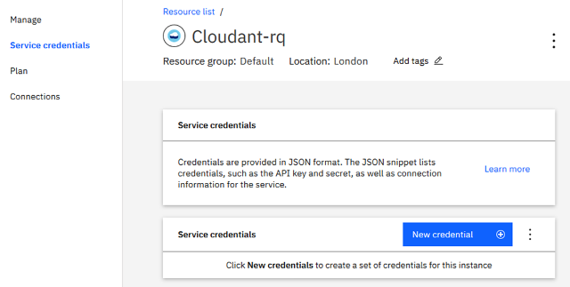
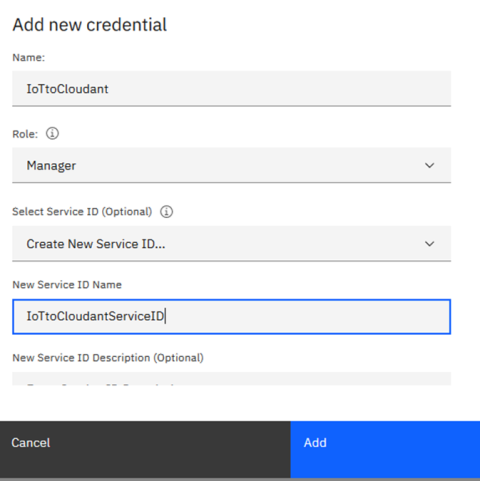
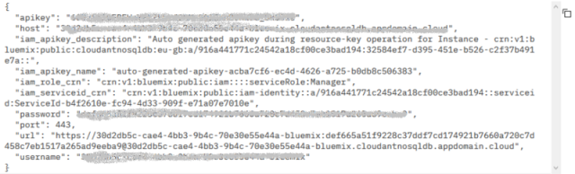
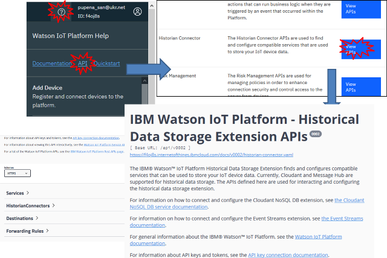
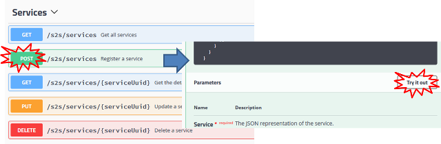
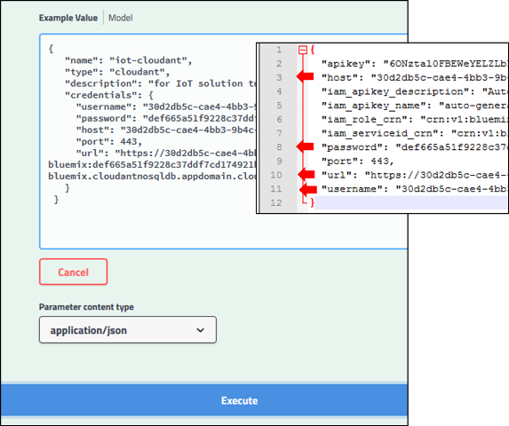
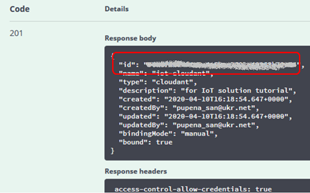
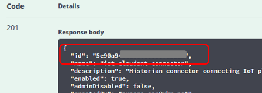
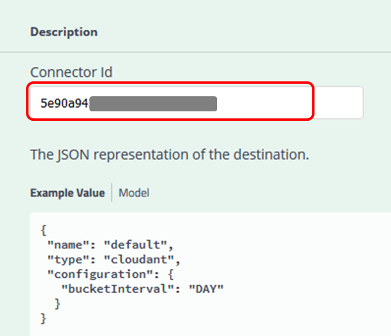

[Посилання на оригінальну статтю](https://cloud.ibm.com/docs/tutorials?topic=solution-tutorials-gather-visualize-analyze-iot-data#historical_data_cloudant) Адаптовано Олександром Пупеною. 

# Налаштування зберігання історичних даних  Watson IoT в IBM Cloudant

У цьому розділі показано як прив'язати сервіс IBM Cloudant до платформи Watson IoT для зберігання історичних даних. Для кращого розуміння виконуваних тут налаштувань, рекомендую ознайомитися  з лекцією по [налаштуванню доступу до різних сервісів IBM Cloud](../Лекц/ibmaccess.md) 

## Створення в IBM Cloudant  облікового запису для сервісу (Service credentials) 

1.Перейдіть до ресурсу Cloudant, який Ви хочете підключити до IoT сервісу.  



2.Натисніть `New credential` , заповніть поля імені облікового запису і імені ServiceID а потім натисніть `Add`.  



3.Натисніть `View credentials` для новоствореного запису, скопіюйте його в блокнот.  



## Підключення data connector IoT для збереження історичних даних 

Налаштування нового з’єднання - це чотиритактний процес:

1. створення прив’язки до сервісу (service binding), яка надає платформі Watson IoT необхідну інформацію для підключення до сервісу Cloudant.
2. створення екземпляру підключення для прив'язки до сервісу.
3. конфігурування одного або кілька пунктів призначення для підключень
4. встановлення одного або кількох правил переадресації для кожного пункту призначення.

Щоб налаштувати нове з'єднання, зробіть наступну послідовність. 

1.Передйть на Watson IoT Platform, натисніть іконку **Watson IoT Platform Help** (правому верхньому кутку), далі натисніть **API** після чого натисніть **View APIs** у розділі **Historian Connector**  для перегляду та документації а також проби API.



2.Внизу сторінки `IBM Watson IoT Platform - Historical Data Storage Extension APIs` є кілька розділів, які показують які саме дії можна використати з HTTP API. 

Перейдіть (розгорніть кліком) розділ  **Services**, виберіть **POST /s2s/services** і натисніть  **Try it out**. 



У вікні вводу **Example Value** замініть текст на наступний .

```json
 {
   "name": "iot-cloudant",
   "type": "cloudant",
   "description": "for IoT solution tutorial",
   "credentials": {
     "username": "CLOUDANT_USERNAME",
     "password": "CLOUDANT_PASSWORD",
     "host": "CLOUDANT_HOST",
     "port": 443,
     "url": "CLOUDANT_URL"
   }
 }
```

Замініть поля `username`, `password`, `host` та `url` на однойменні з облікового запису для Cloudant, який був тільки що створений.    



3.Натисніть **Execute** , повинна прийти відповідь `HTTP 201` . Скопіюйте`id` (serviceID) в блокнот для наступного пункту. 



4.Перейдіть (розгорніть кліком) розділ **HistorianConnectors**, виберіть  **POST /historianconnectors** та натисніть **Try it out**. Замініть текст в полі **Example Value** наступним текстом. 

```
 {
   "name": "iot-cloudant-connector",
   "description": "Historian connector connecting IoT platform to cloudant",
   "serviceId": "SERVICE_ID",
   "type": "cloudant",
   "enabled": true
 }
```

Замініть поле `SERVICE_ID` з `id` з попередньої відповіді.

5.Натисніть **Execute** для отримання відповіді  `HTTP 201` . Скопіюйте отриманий `id`(connectorID) з відповіді в блокнот для наступного використання.




6.Перейдіть (розгорніть кліком) розділ **Destinations**, виберіть  **POST /historianconnectors/{connectorId}/destinations** та натисніть **Try it out**. Впишіть скопійоване значення в `id`(connectorID) та замініть **Example Value**   наступним текстом.

```json
{
 "name": "default",
 "type": "cloudant",
 "configuration": {
   "bucketInterval": "DAY"
  }
}
```



7.Натисніть **Execute** для отримання відповіді    `HTTP 201` .

8.Перейдіть (розгорніть кліком) розділ **Forwarding Rules**, виберіть  **POST /historianconnectors/{connectorId}/forwardingrules** та натисніть **Try it out**. 

Впишіть скопійоване  значення `id`(connectorID) та замініть **Example Value**  наступним текстом.

```json
 {
 "name": "iot-cloudant-rule",
 "destinationName": "default",
 "type": "event",
 "selector": {
   "deviceType": "*",
   "eventId": "*"
  }
 }
```

9.Натисніть **Execute** для отримання відповіді `HTTP 201` .

Це саме можна зробити Python SDK, який описаний [за цим посиланням](https://www.ibm.com/support/knowledgecenter/SSQP8H/iot/platform/reference/dsc/cloudant.html).

Your device data will now be saved in IBM Cloudant.  Reconnect the browser app to generate new data. After a few minutes,  launch the IBM Cloudant dashboard to see your data.
